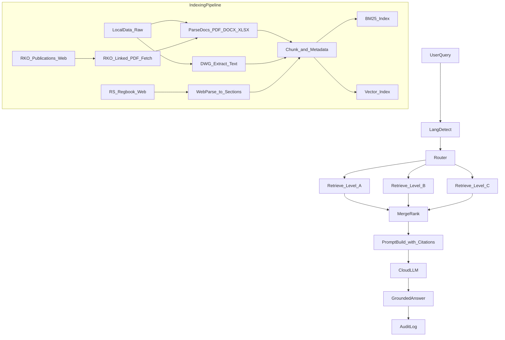

## Multi-level RU/EN shipbuilding RAG architecture plan

This document captures the proposed architecture for a multi-level RAG assistant
for a shipbuilding design bureau (морское/речное судостроение), grounded in
internal documentation and register rules (РМРС/РС and РРР/РКО).

### Scope & assumptions
- **Domain**: shipbuilding engineering bureau; answers must be grounded in
  internal docs and register rules (**РМРС/РС** and **РРР/РКО**).
- **Datasets**: two public Google Drive folders (one contains
  `01-04-2026_10-38-54.zip`; the other contains PDFs, DOC/DOCX/XLSX, and many
  **DWG**).
- **LLM**: **cloud API** for MVP.
- **Languages**: **RU-first** retrieval; **EN** supported primarily as *answer
  language* (translation/synthesis) with the option to extend to bilingual
  retrieval later.
- **Repo constraint**: **do not commit data files** (PDF/DWG/ZIP/etc.). Commit
  only **docs, .md, .py** and other non-sensitive config samples (avoid `.env`;
  use `.env.example`).

### Target capabilities
- **Multi-level retrieval**: search in multiple corpora with explicit priority
  and traceability.
  - Level_A: project/bureau internal docs (highest priority)
  - Level_B: internal standards/templates/classifiers (e.g., SFI)
  - Level_C: external rules (РС/РМРС regbook; РКО/РРР publications)
- **Answer grounding**: every answer includes citations to chunk IDs / source
  doc + page/section.
- **SME escalation**: route uncertain/low-evidence cases to SME workflow
  (tracked as “needs review”).

### Technology stack (MVP)

#### Runtime
- **Python**: `3.11+` (FastAPI-compatible, broad library support).
- **API**: FastAPI + Uvicorn.
- **Async/background**: built-in background tasks for MVP; optional Celery/RQ
  later.

#### LLM & multilingual support
- **LLM provider**: cloud API (vendor to be selected: OpenAI/Azure OpenAI/etc.).
- **RU/EN**:
  - RU-first retrieval
  - EN queries: translate to RU for retrieval → answer in EN (citations preserved)
  - optional EN summary for RU answers
- **Translation**: provider model or dedicated translation model/API
  (configurable).

#### Retrieval
- **Vector store**: start with in-process FAISS (local) for MVP; optional upgrade
  to Postgres+pgvector or a managed vector DB when needed.
- **Lexical search**: BM25 (e.g., `rank-bm25`) or OpenSearch/Elasticsearch if
  operationally available.
- **Embeddings**: RU-capable embeddings model (upgrade path to multilingual).

#### Parsing & normalization
- **PDF**: `pymupdf`/`pdfminer.six` + page mapping.
- **Office docs**: `python-docx`, `openpyxl`.
- **DWG extraction (text/attributes)**:
  - pipeline wrapper producing normalized JSON (`text_runs` + metadata)
  - exact tool choice depends on licensing/availability (to be pinned during
    implementation).

#### Storage & observability
- **Metadata store**: SQLite for MVP; upgrade to Postgres for multi-user.
- **Object storage (optional)**: local filesystem for extracted artifacts (no raw
  binaries in repo), later S3/MinIO.
- **Logging**: structured logs + request IDs; optional OpenTelemetry later.

### Data sources & ingestion approach
- **Google Drive folders**
  - Download/export out-of-repo into a configured local path (e.g., `data_raw/`
    ignored by git).
  - Maintain a **manifest** (hash, filename, MIME, source URL, last seen)
    committed as JSON/CSV.
- **РМРС/РС online rules** (`lk.rs-class.org/regbook/rules?ln=ru`)
  - Crawl/parse to a structured navigation tree: year → rulebook → chapter →
    section.
  - Store each section as a “web document” with stable IDs and canonical URLs.
- **РКО/РРР publications** (`rfclass.ru/izdaniya-rko/`)
  - The page is an index; ingestion requires discovering and fetching linked
    PDFs.
  - Produce a separate “external rules corpus” with explicit versioning.

### Document parsing (including DWG)
- **PDF/DOCX/XLSX/TXT**: text extraction + page/section segmentation.
- **DWG (MVP requirement: extract text/attributes)**
  - Use a converter pipeline that can extract:
    - text entities (MTEXT/TEXT)
    - block attributes
    - layer names
    - title blocks (where possible)
  - Output to an intermediate **normalized JSON** with geometry metadata
    (optional) and “text runs” suitable for chunking.
  - Keep original DWG out of repo; store extracted JSON + source pointers.

### Indexing & retrieval design
- **Two indexes** (recommended for multi-level control):
  1. **Lexical** (BM25) for exact references (ГОСТ numbers, drawing IDs, part
     codes)
  2. **Vector** for semantic search (RU embeddings; later multilingual)
- **Metadata model** (attached to every chunk):
  - `corpus_level` (A/B/C)
  - `doc_type` (rulebook, standard, drawing, spec, report)
  - `source` (gdrive_file, web_rs, web_rko)
  - `discipline` (hull, stability, electrical, welding, etc.)
  - `version_date`, `year`, `project_code`, `doc_id`, `page`, `section_path`
- **Router**: classify query intent:
  - compliance/question about rules → prefer Level_C then check Level_A overrides
  - project-specific → Level_A
  - terminology/classification → Level_B
- **Multi-pass retrieval** (multi-level):
  - Pass_1: retrieve per level (top-k) with level weights
  - Pass_2: deduplicate, expand context windows, ensure at least N distinct
    sources
  - Pass_3: optional “rules cross-check” when Level_A answer conflicts with
    Level_C

### RU/EN support strategy (RU-first MVP)
- **Query language detection**.
- If query is EN:
  - translate to RU for retrieval
  - answer in EN (with citations preserved)
- If query is RU:
  - retrieve RU
  - answer in RU; optionally provide EN summary toggle.
- Later upgrade path:
  - add multilingual embeddings + store EN translations per chunk when needed.

### Safety, governance, and traceability
- **No data exfiltration**: explicit allowlist of what can be sent to cloud LLM
  (chunks only; redact sensitive fields if needed).
- **Audit trail**: store query, retrieved chunk IDs, model prompt template
  version, answer, SME overrides.
- **Document lifecycle**: versioning for register rules by year; keep
  provenance.

### Repo deliverables (to be created under `Eugene_Rizov/`)
- `Eugene_Rizov/architecture.md` — the architecture + data flows + security
  model.
- `Eugene_Rizov/data_sources.md` — dataset manifest format, ingestion steps, and
  what is ignored by git.
- `Eugene_Rizov/rag_levels.md` — definition of levels A/B/C and routing rules.
- `Eugene_Rizov/dwg_extraction_notes.md` — DWG extraction options, chosen
  approach, limitations.
- `Eugene_Rizov/scripts/` (Python, no data):
  - `download_manifest.py` (build manifest from local folder)
  - `parse_rs_regbook.py` (parse RS online structure)
  - `extract_dwg_text.py` (DWG→JSON extraction wrapper)
  - `index_build.py` (build lexical+vector indexes from extracted text)
- `.gitignore` updates to exclude `data_raw/`, `data_processed/`, `*.dwg`,
  `*.pdf`, `*.zip`, etc.
- `.env.example` (no secrets) for API keys/paths.

### Suggested data flow (high level)

### Open risks / decisions to validate (documented, not blockers)
- DWG conversion toolchain licensing/availability and extraction quality.
- Whether any documents are restricted (PII/ITAR-like) requiring redaction before
  cloud LLM.
- Rule precedence policy when internal docs conflict with register rules.

