## Интеллектуальная обработка нормативно-справочной документации в судостроении

Проект: **«Интеллектуальная обработка нормативно-справочной документации в
судостроении (ООО „ПКБ“)»**.

Цель MVP: дать инженеру/конструктору быстрый ответ на вопрос по проекту и
нормативке, **подкреплённый цитатами из первоисточников**, с приоритетом
внутренней документации и учётом требований регистров (**РС/РМРС** и **РРР/РКО**).

### Общий pipeline (от загрузки документа до ответа)

Ниже — базовый end-to-end pipeline в двух частях: офлайн (индексация) и онлайн
(вопрос-ответ). Архитектурно это соответствует типовым RAG-системам с
предобработкой корпуса, хранением чанков и онлайн-ретривалом
[RAG-технология… (Хабр)](https://habr.com/ru/articles/904418).

#### 1) Офлайн контур (индексация и подготовка корпуса)

1. **Загрузка / подключение источника**
   - Внутренние документы ПКБ (PDF/DOCX/XLSX/TXT).
   - CAD-артефакты (DWG) — извлечение текстовых сущностей/атрибутов.
   - Внешняя нормативка и правила регистров (например, онлайн-издания РС через
     их оглавление) [Издания РС (онлайн)](https://lk.rs-class.org/regbook/rules?ln=ru).

2. **Классификация документа**
   - тип: правило/стандарт/КД/расчёт/спецификация/переписка
   - дисциплина: корпус/прочность/остойчивость/электро/сварка/…
   - версия/год/проект/объект

3. **Извлечение контента (парсинг)**
   - PDF с текстовым слоем → извлечение текста с привязкой к страницам.
   - PDF-сканы → OCR + восстановление структуры (заголовки/абзацы/таблицы по
     возможности). На практике качество OCR и шум — ключевой риск
     [Как гуманитарий… (Хабр)](https://habr.com/ru/articles/996144/).
   - DWG → извлечение текста (TEXT/MTEXT), атрибутов блоков, имен слоёв и пр.
     (результат нормализуется в текстовые «прогоны» для последующей индексации).

4. **Нормализация**
   - привести всё к унифицированной модели: `doc_id`, `page`, `section_path`,
     `text`, `tables(optional)`, `figures(optional)`, `source_uri`, `version`.

5. **Сегментация (chunking)**
   - разбиение на смысловые фрагменты с перекрытием (chunk overlap) по заголовкам
     и структуре документа (подход из практик RAG по документам)
     [Документный хаос? (Хабр)](https://habr.com/ru/articles/955768/).

6. **Обогащение метаданными**
   - `corpus_level`: A (внутреннее), B (внутренние стандарты/классификаторы),
     C (внешняя нормативка/регистры).
   - `discipline`, `doc_type`, `year/version`, `project_code`, `register` и т. д.

7. **Индексация**
   - **лексический индекс** (BM25) для точных совпадений (номера ГОСТ, шифры
     чертежей, обозначения).
   - **векторный индекс** (эмбеддинги) для семантического поиска (как минимум RU,
     с расширением до мультиязычности).

8. **Контроль качества корпуса**
   - автоматические проверки: пустые страницы, дубль-чанки, «мусор» OCR,
     отсутствие привязок page/section.
   - выборочная ручная валидация (особенно для DWG и сканов).

#### 2) Онлайн контур (вопрос → поиск → ответ)

1. **Ввод вопроса пользователем** (RU/EN)
2. **Определение языка и нормализация запроса**
   - MVP: RU-first retrieval; EN запрос → перевод в RU для ретривала, ответ на EN.
3. **Маршрутизация (router) по типу вопроса**
   - проектно-специфичный → Level_A
   - нормативный/регистровый → Level_C (с проверкой локальных допущений Level_A)
   - терминология/классификаторы → Level_B
4. **Ретривал**
   - гибридный: BM25 + vector (перекрывающие результаты, дедупликация).
5. **Реранкинг / отбор контекста**
   - ограничение по токенам; баланс источников (несколько документов, не один).
6. **Формирование промпта**
   - вопрос + извлечённые фрагменты + требования к цитированию.
7. **Генерация ответа LLM**
8. **Постобработка**
   - проверка наличия цитат, предупреждения о неопределенности/конфликте источников
   - предложение «эскалировать к SME» при низкой уверенности/недостатке контекста
9. **Аудит**
   - лог: запрос, ID чанков, версии индексов/шаблонов, итоговый ответ.

### Схема (Mermaid)

```mermaid
flowchart TD
  subgraph Offline[Offline_Indexing]
    Ingest[Upload_or_Connect_Source] --> Parse[Parse_OCR_DWG_Normalize]
    Parse --> Chunk[Chunk_and_Metadata]
    Chunk --> Lex[BM25_Index]
    Chunk --> Vec[Vector_Index]
  end

  subgraph Online[Online_QA]
    User[UserQuery_RU_or_EN] --> Detect[LangDetect_Normalize]
    Detect --> Route[Router_Level_Select]
    Route --> Ret[HybridRetrieval_BM25_and_Vector]
    Ret --> Rank[Rerank_Dedup_BalanceSources]
    Rank --> Prompt[PromptBuild_with_Citations]
    Prompt --> LLM[LLM_Answer]
    LLM --> Out[Answer_with_Citations]
    Out --> Audit[AuditLog]
  end
```

### Что фиксируем как «архитектуру» (минимальный набор артефактов)

- **Модель данных** (что такое документ/фрагмент/цитата; какие метаданные
  обязательны).
- **Определение уровней корпуса** (Level_A/B/C) и политики приоритета.
- **Правила формирования ответа** (обязательные цитаты; поведение при конфликте).
- **Политика RU/EN** (MVP: RU-first retrieval; EN как язык ответа).
- **Контуры качества**: контроль OCR/парсинга, регрессия по RAG, ручной SME‑контроль.

