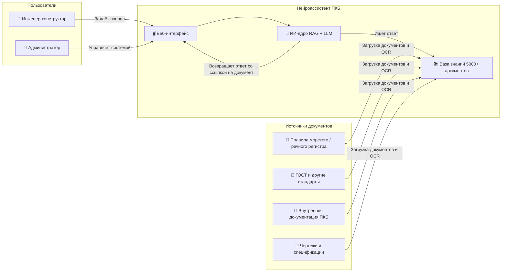

# Нейроассистент ПКБ «Петробалт» — обзор системы

```mermaid
graph LR
    subgraph Пользователи
        U1[👤 Инженер-конструктор]
        U2[👤 Администратор]
    end

    subgraph Система["Нейроассистент ПКБ"]
        WEB[🖥️ Веб-интерфейс]
        AI[🤖 ИИ-ядро RAG + LLM]
        DOCS[📚 База знаний 5000+ документов]
    end

    subgraph Источники["Источники документов"]
        S1[📄 Правила морского / речного регистра]
        S2[📄 ГОСТ и другие стандарты]
        S3[📄 Внутренняя документация ПКБ]
        S4[📐 Чертежи и спецификации]
    end

    U1 -- Задаёт вопрос --> WEB
    U2 -- Управляет системой --> WEB
    WEB --> AI
    AI -- Ищет ответ --> DOCS
    AI -- Возвращает ответ со ссылкой на документ --> WEB
    S1 & S2 & S3 & S4 -- Загрузка документов и OCR --> DOCS
```
