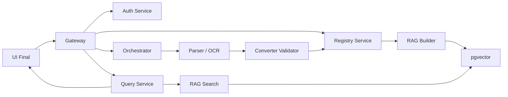

# PKB NeuroAssistant

Полурабочий прототип нейроассистента для проектно-конструкторского бюро: интерфейс инженера, база знаний, поиск по нормативным документам и backend-контур микросервисов для обработки документов, индексации и ответов с источниками.

Проект находится в стадии интеграции. Репозиторий собран как чистая портфельная версия: здесь оставлены рабочие сервисы, актуальный `UI Final`, документация по API и пайплайнам. Черновики, личные папки участников, записи встреч и временные файлы не включены.

## Что внутри

| Папка | Содержание |
| --- | --- |
| `frontend/` | Актуальный `UI Final` на React + Vite + MUI. Поддерживает demo-режим и подключение к Gateway. |
| `backend/gateway_service/` | Gateway/mock-контур для локальной проверки UI и API-сценариев. |
| `backend/query_service/` | Чат, сессии, история, feedback, проекты и вход в поисковый сценарий. |
| `backend/registry_service/` | Реестр документов, классификаторы, терминология и справочные данные. |
| `backend/rag_builder_service/` | Подготовка чанков и индексация документов. |
| `backend/rag_search_service/` | RAG-поиск по фрагментам документов. |
| `backend/orchestrator_service/` | Координация пайплайнов обработки документов. |
| `backend/parser_service/` | Парсинг структуры документов. |
| `backend/converter_validator_service/` | Конвертация, валидация и нормализация JSON-результатов. |
| `backend/auth_service/` | Авторизация, роли и пользователи. |
| `backend/service_checker/` | Проверка покрытия API и интеграционных точек. |
| `docs/` | Архитектура, API-контракты, схемы, пайплайны, планы спринтов и UI-документация. |

## Архитектура



## Текущий статус

- UI Final собран как основная рабочая версия интерфейса.
- UI подключён к Gateway-режиму с fallback на demo-данные.
- Проверены основные сценарии: вход, чат, поиск, база знаний, документы, история, QA и часть администрирования.
- Вкладка проверки проектных параметров удалена из основного UI, потому что под неё нет API-контракта Gateway.
- Backend-контур ещё не production-ready: часть сервисов работает как mock/dev-контур, часть требует финальной стыковки.

## Быстрый запуск UI

```powershell
cd frontend
npm ci
npm run dev -- --host 127.0.0.1 --port 3310 --strictPort
```

Открыть:

```text
http://127.0.0.1:3310
```

Проверка сборки:

```powershell
cd frontend
npm run build
npm run lint
```

## Запуск UI вместе с Gateway

В первом терминале:

```powershell
py -m venv .venv
.\.venv\Scripts\Activate.ps1
pip install -r backend\gateway_service\requirements.txt
pip install -r backend\gateway_service\mocks\requirements.txt
python backend\gateway_service\mocks\gateway.py
```

Gateway должен открываться здесь:

```text
http://127.0.0.1:8081/docs
```

Во втором терминале:

```powershell
cd frontend
npm ci
npm run dev -- --host 127.0.0.1 --port 3310 --strictPort
```

В UI переключить режим с demo на online и проверить запросы к Gateway.

## Документация

- `docs/README.md` — навигация по проектной документации.
- `docs/pipelines/overview.md` — общая схема пайплайнов обработки и поиска.
- `docs/api/gateway_service_api.md` — роль Gateway и маршрутизация запросов.
- `docs/api/query_service_api.md` — чат, история, longpoll и поиск.
- `docs/ui-final/` — документация по UI Final и интеграции с Gateway.
- `docs/portfolio-current-state-2026-06-06.md` — краткая фиксация состава этой портфельной сборки.

## Ограничения

- Это не финальный production-релиз, а демонстрационная рабочая сборка для портфолио и дальнейшей интеграции.
- Реальное качество RAG-ответов зависит от наполнения базы знаний, индексации и LLM-контура.
- Проекты, часть справочников и расширенное администрирование требуют финального backend-контракта.
- Для серверного деплоя потребуется отдельная настройка Docker/Nginx/env-переменных.
