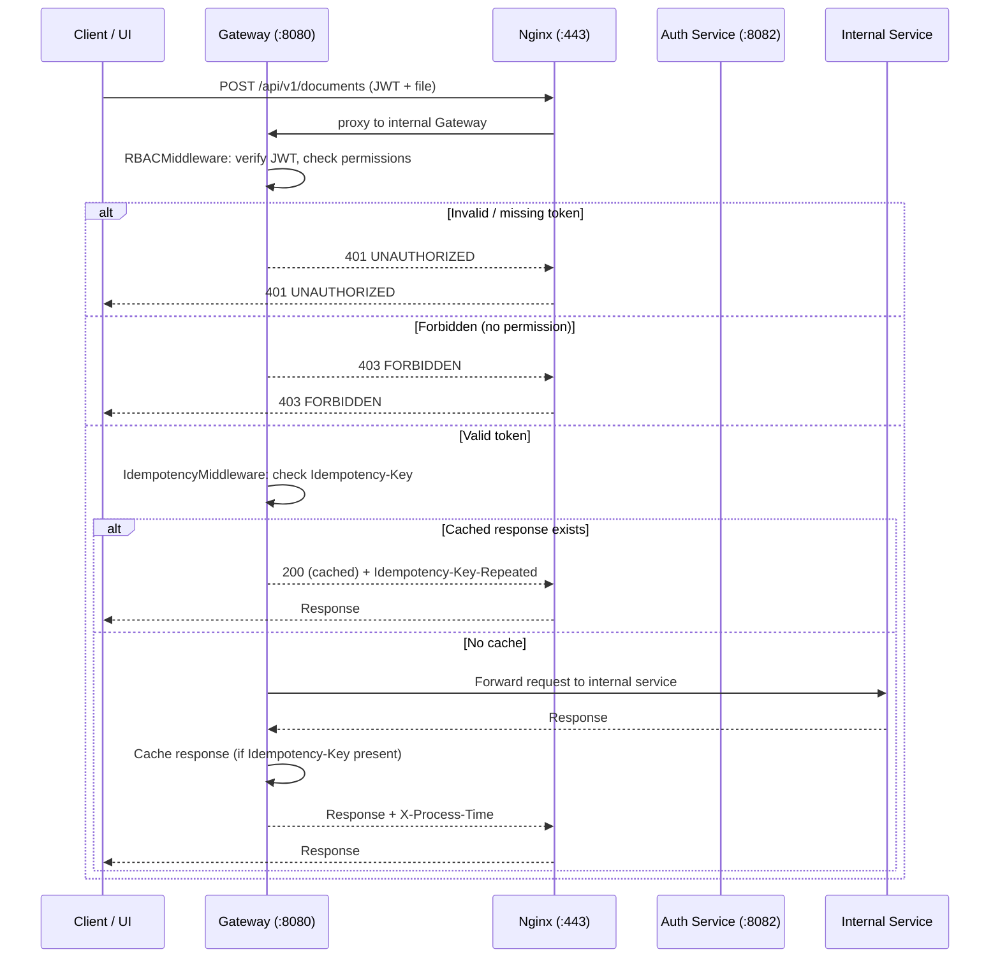

## API Gateway Service (gateway:8080)

Внутренний API Gateway, который принимает запросы от **Nginx** (внешний веб-сервер), выполняет **аутентификацию (JWT)**, **проверку прав доступа (RBAC)**, обеспечивает **иденпотентность** для критичных операций и **маршрутизирует** вызовы к внутренним сервисам.

**Архитектура подключения:**
```
Внешняя сеть → Nginx (:443) → Gateway (:8080, внутренний) → Внутренние сервисы
```

Gateway — **внутренний сервис**, не имеет внешнего порта. Все внешние запросы приходят через Nginx (:443), который проксирует их на Gateway (:8080).

**Базовый URL (публичный, через Nginx)**: `https://{host}/api/v1`  
**Базовый URL (внутренний)**: `http://127.0.0.1:8080/api/v1`

---

### Функциональность Gateway

| Функция | Описание |
|---------|----------|
| **Аутентификация** | Проверка JWT Bearer-токена. Невалидный/отсутствующий токен → `401` для защищённых эндпоинтов; анонимный доступ только к `/auth/*` и `/system/health` |
| **RBAC** | Проверка прав доступа на основе роли и permissions пользователя. Матрица доступа — см. [common_api.md](common_api.md#матрица-доступа-rbac) |
| **Маршрутизация** | Проксирование запросов к внутренним сервисам: Auth, Orchestrator, Query, Registry, Integration и др. |
| **Иденпотентность** | Кеширование ответов `POST` для `/documents*` и `/chat*` по заголовку `Idempotency-Key` (TTL: 1 час) |
| **Единый формат ошибок** | Перехват и нормализация HTTP-исключений и ошибок валидации в единый формат (см. [common_api.md](common_api.md#формат-ошибок)) |
| **CORS** | Разрешение всех origins (`*`) для разработки |
| **Мониторинг** | Health-check endpoint `/system/health` с агрегированным статусом всех сервисов |
| **X-Process-Time** | Добавление заголовка `X-Process-Time` с временем обработки запроса |

---

### Маршрутизация запросов

Gateway объединяет API всех внутренних сервисов под единым базовым URL. Маршрутизация выполняется по префиксу пути.

В production-среде:
- **Nginx** (порт `:443`, HTTPS) принимает внешние запросы и проксирует их на внутренний Gateway (`:8080`)
- **Gateway** (`:8080`) проверяет JWT и RBAC, затем перенаправляет запрос к соответствующему внутреннему сервису

| Префикс пути | Внутренний сервис | Порт | Документация API |
|-------------|-------------------|------|-----------------|
| `/api/v1/auth/*` | Auth Service | `8082` | [auth_service_api.md](auth_service_api.md) |
| `/api/v1/admin/*` | Auth Service | `8082` | [auth_service_api.md](auth_service_api.md) |
| `/api/v1/documents/*` | Orchestrator Service | `8081` | [orchestrator_service_api.md](orchestrator_service_api.md) |
| `/api/v1/tasks/*` | Orchestrator Service | `8081` | [orchestrator_service_api.md](orchestrator_service_api.md) |
| `/api/v1/pages/*` | Orchestrator Service | `8081` | [orchestrator_service_api.md](orchestrator_service_api.md) |
| `/api/v1/monitor/*` | Orchestrator Service | `8081` | [orchestrator_service_api.md](orchestrator_service_api.md) |
| `/api/v1/chat/*` | Query Service | `8083` | [query_service_api.md](query_service_api.md) |
| `/api/v1/text/*` | Query Service | `8083` | [query_service_api.md](query_service_api.md) |
| `/api/v1/classifiers/*` | Registry Service | `8084` | [registry_service_api.md](registry_service_api.md) |
| `/api/v1/terminology/*` | Registry Service | `8084` | [registry_service_api.md](registry_service_api.md) |
| `/api/v1/common/*` | Registry Service | `8084` | [registry_service_api.md](registry_service_api.md) |
| `/api/v1/registry/documents/*` | Registry Service | `8084` | [registry_service_api.md](registry_service_api.md) |
| `/api/v1/system/health` | Gateway (собственный) | `8080` | — |

В мок-режиме (см. [gateway.py](../mocks/gateway.py)) Gateway, Orchestrator и остальные сервисы объединены в единое FastAPI-приложение на порту `8081` (эмуляция nginx + gateway для разработки и тестов).

---

### Middleware (порядок применения)

```
Request → CORS → RBAC → Idempotency → ProcessTime → Router → Response
```

1. **CORSMiddleware** — установка CORS-заголовков для всех origins
2. **RBACMiddleware** — извлечение и валидация JWT, проверка прав доступа
3. **IdempotencyMiddleware** — проверка `Idempotency-Key` для `POST /documents` и `POST /chat`
4. **ProcessTimeMiddleware** — замер времени обработки (`X-Process-Time`)
5. **Exception Handlers** — перехват `HTTPException`, `RequestValidationError`, `ValidationError` в единый формат

---

### Формат ответа

Формат ответа и ошибок — см. [common_api.md](common_api.md#формат-ответа).

**Специфичные коды ошибок Gateway:**

| HTTP | `error.code` | Описание |
|------|-------------|----------|
| 400 | `BAD_REQUEST` | Некорректный запрос |
| 401 | `UNAUTHORIZED` | Требуется аутентификация (отсутствует или невалидный токен) |
| 403 | `FORBIDDEN` | Недостаточно прав для выполнения операции |
| 404 | `NOT_FOUND` | Ресурс не найден |
| 405 | `METHOD_NOT_ALLOWED` | Метод не поддерживается для данного пути |
| 409 | `CONFLICT` | Конфликт (дубликат, неконсистентное состояние) |
| 422 | `VALIDATION_ERROR` | Ошибка валидации входных данных |
| 429 | `TOO_MANY_REQUESTS` | Превышен лимит запросов (Rate limiting) |
| 500 | `INTERNAL_ERROR` | Внутренняя ошибка сервера |

---

### Эндпоинты Gateway

Собственные эндпоинты Gateway (не проксируемые):

| Метод | Путь | Описание |
|-------|------|----------|
| GET | `/api/v1/system/health` | Health-check: агрегированный статус всех сервисов, версия, количество эндпоинтов |

#### GET /api/v1/system/health

Проверка состояния Gateway и всех подключённых сервисов.

**Ответ `200`:**

```json
{
  "status": "ok",
  "version": "1.0.0",
  "services": {
    "auth": "ok",
    "orchestrator": "ok",
    "query": "ok",
    "registry": "ok",
    "gateway": "ok"
  },
  "timestamp": "2026-06-02T12:00:00Z",
  "endpoints_total": 84
}
```

| Поле | Тип | Описание |
|------|-----|----------|
| `status` | string | Общий статус: `ok` или `degraded` |
| `version` | string | Версия Gateway |
| `services` | object | Статус каждого внутреннего сервиса (`ok`, `degraded`, `unavailable`) |
| `timestamp` | string | Время проверки (ISO 8601) |
| `endpoints_total` | int | Общее количество зарегистрированных эндпоинтов |

---

### Поток обработки запроса



---

### Примечания по реализации

- **Иденпотентность** реализована через in-memory кеш на Gateway. В production рекомендуется использовать Redis.
- **RBAC** проверяется на уровне Gateway, что позволяет отсечь неавторизованные запросы до попадания во внутренние сервисы. Внутренние сервисы могут дополнительно проверять права для специфичных операций.
- **Rate limiting** (ограничение запросов) запланирован, пока не реализован в мок-версии. В production реализуется на уровне Nginx (модуль ngx_http_limit_req_module) или Kong/Envoy.
- **Логирование** — Gateway добавляет `X-Process-Time` заголовок для замера времени обработки. В production рекомендуется структурированное логирование всех запросов (метод, путь, статус, время, user_id).

---

### Зависимости

| Компонент | Назначение |
|-----------|-----------|
| Auth Service (:8082) | Валидация JWT-токенов, получение профиля пользователя и прав |
| Orchestrator (:8081) | Маршрутизация запросов документов и мониторинга |
| Query Service (:8083) | Маршрутизация чатов и текстового поиска |
| Registry (:8084) | Маршрутизация справочников, терминологии и реестра |
| PostgreSQL | Хранение данных пользователей (в production) |
| Redis | Кеш иденпотентности, rate limiting (в production) |
