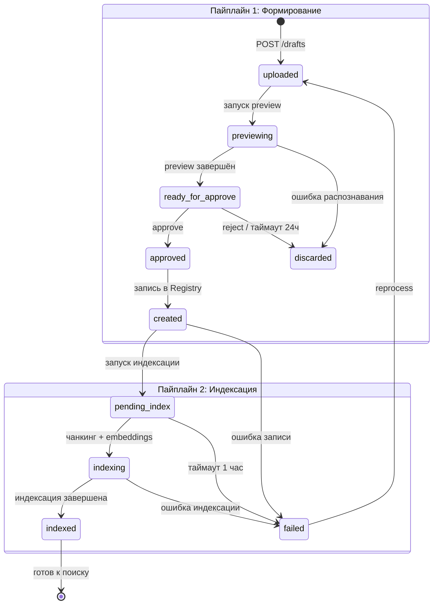
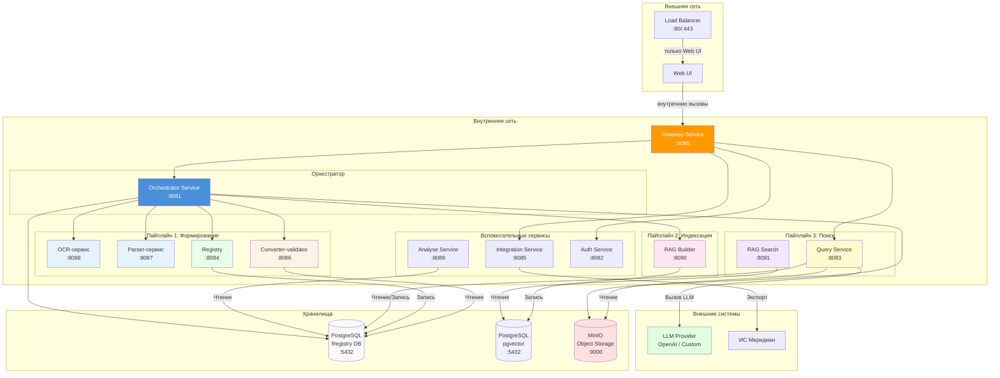

## Пайплайны обработки документов (v3.0)

Оркестратор координирует сквозную обработку документов через **два пайплайна** (Формирование и Индексация). Пайплайн 3 (Поиск) работает **независимо** — пользователь обращается напрямую к Query Service.

```mermaid
graph LR
    subgraph "Оркестратор (Пайплайны 1 и 2)"
        direction TB
        P1[Пайплайн 1: Формирование документа] --> P2[Пайплайн 2: Индексация документа]
    end

    subgraph "Пайплайн 1: Формирование"
        A[MinIO] -->|file_ref| B[OCR Service]
        B -->|JSON| C[Parser Service]
        C -->|JSON| D[Converter-validator]
        D -->|JSON| E[Registry]
        E -->|JSON со ссылками| F[(PostgreSQL)]

        A -.->|preview ref| PB[OCR/Parser process (mode=preview)]
        PB -.->|preview JSON| PC[Converter-validator preview]
        PC -.->|preview result| UI{UI Decision}
        UI -.->|approve| D
    end

    subgraph "Пайплайн 2: Индексация"
        E -->|обогащённый JSON| G[RAG Builder]
        G --> H[(pgvector)]
    end

    subgraph "Пайплайн 3: Поиск (независимый)"
        I[UI] -->|вопрос| J[Query Service]
        J -->|query| K[RAG Search]
        K -->|чанки| J
        J -->|answer| I
    end

    style B fill:#e6f3ff
    style C fill:#e6f3ff
    style D fill:#fff3e6
    style E fill:#e6ffe6
    style G fill:#ffe6f3
    style J fill:#fffacd
    style K fill:#f3e6ff
    style PB fill:#e6f3ff,stroke-dasharray: 5 5
    style PC fill:#fff3e6,stroke-dasharray: 5 5
    style UI fill:#fff,stroke:#333
```

**Роль Оркестратора:** управляет последовательностью вызовов **Пайплайнов 1 и 2**, передаёт JSON-контейнеры между этапами как **непрозрачные артефакты** (структура JSON известна только сервисам). Помимо координации, Оркестратор:

- Выполняет пре-стейдж загрузки: сохраняет файл в MinIO, вычисляет SHA-256, создаёт запись в БД
- Ведёт историю обработки документа (`GET /documents/{doc_id}/history`)
- Управляет статусной моделью FSM для каждого пайплайна независимо

Пайплайн 3 (Поиск) работает **независимо** — пользователь обращается напрямую к Query Service, минуя Оркестратор.

Детальное описание пайплайнов:

- [Пайплайн 1: Формирование документа](pipeline1-formation.md)
- [Пайплайн 1: Детальное описание preview-фазы](pipeline1-formation_detail.md)
- [Пайплайн 2: Индексация документа](pipeline2-indexation.md)
- [Пайплайн 3: Поиск документа](pipeline3-search.md)

---

### 3. Сводная таблица доступа к БД

| Пайплайн     | Этап                      | Доступ к БД                   | Направление данных                                                 |
| ------------ | ------------------------- | ----------------------------- | ------------------------------------------------------------------ |
| Формирование | 1. OCR / Parser (альтернативно) | **Нет** (изоляция)        | Вход: ссылка MinIO → Выход: JSON                                   |
| Формирование | 2. Converter-validator    | **Читает**                    | Вход: JSON → Выход: JSON с решением                                |
| Формирование | 3. Registry               | **Пишет**                     | Вход: JSON → Выход: JSON со ссылками                               |
| Формирование | Preview OCR/Parser (mode=preview) | **Нет** (изоляция)       | Вход: file_key + mode=preview → Выход: JSON (preview или full + preview_not_supported) |
| Формирование | Preview Converter-validator | **Читает** (Registry)       | Вход: preview JSON → Выход: preview результат                      |
| Индексация   | 1. RAG Builder            | **Пишет**                     | Вход: обогащённый JSON → Выход: статус                             |
| Поиск        | 1. Приём сообщения        | **Пишет** (история чата)      | Вход: content → Выход: 202 + message_id                            |
| Поиск        | 2. Обогащение терминами   | **Читает** (словарь терминов) | Вход: текст → Выход: обогащённый запрос                            |
| Поиск        | 3. RAG Search             | **Читает**                    | Вход: query + filters → Выход: массив чанков                       |
| Поиск        | 3b. Генерация ответа LLM  | **Нет**                       | Вход: чанки → Выход: текст ответа                                  |
| Поиск        | 4. Обогащение цитирований | **Нет**                       | Вход: текст LLM + чанки → Выход: answer с аннотированными сносками |

---

### 4. Статусная модель (FSM)

Детальные FSM-диаграммы и описание состояний — в соответствующих документах:

- **Пайплайн 1 (Формирование):** `uploaded → previewing → ready_for_approve → approved → created` — [FSM и таблица состояний](pipeline1-formation.md#статусная-модель-fsm)
- **Пайплайн 2 (Индексация):** `pending_index → indexing → indexed / failed` — [FSM и таблица состояний](pipeline2-indexation.md#статусная-модель-fsm)
- **Пайплайн 3 (Поиск):** `idle → pending → enriching → searching → generating → enriching_citations → answered` — [FSM и таблица состояний](pipeline3-search.md#статусная-модель-fsm)

---

### 5. Матрица ответственности сервисов

| Операция                                       | Пайплайн | Этап              | Сервис                    | Доступ к БД  |
| ---------------------------------------------- | -------- | ----------------- | ------------------------- | ------------ |
| Загрузка файла, SHA-256, MinIO                 | 1        | Пре-стейдж        | **Orchestrator**          | Пишет (pipeline.tasks, pipeline.task_steps) |
| Создание записи черновика                      | 1        | Пре-стейдж        | **Orchestrator** → **Registry** (POST /registry/drafts) | Registry: Пишет (registry.drafts) |
| Preview-фаза, хранение preview-данных          | 1        | Preview           | **Orchestrator**          | Вызов Registry (PATCH /registry/drafts/{id}/status) |
| Распознавание (OCR)                            | 1        | 1. OCR            | **OCR Service**           | Нет          |
| Парсинг структуры                              | 1        | 2. Parser         | **Parser Service**        | Нет          |
| Валидация JSON, классификация                  | 1        | 3. Converter-validator | **Converter-validator Service** | Читает |
| Проверка кодов по справочнику                  | 1        | 3. Converter-validator | **Registry Service**      | Читает       |
| Запись карточки документа в БД                 | 1        | 4. Registry       | **Registry Service**      | Пишет        |
| Ведение этапов задачи (task_steps)             | 1        | Все               | **Orchestrator**          | Пишет (pipeline.task_steps) |
| Чанкинг + Embeddings + Индекс                  | 2        | 1. RAG Builder    | **RAG Builder Service**   | Пишет
| Приём сообщения                                | 3        | 1. Query Service  | **Query Service**         | Пишет        |
| Обогащение терминами                           | 3        | 2. Query Service  | **Query Service**         | Читает       |
| RAG поиск чанков                               | 3        | 3. RAG Search     | **RAG Search Service**    | Читает       |
| Генерация ответа LLM                           | 3        | 3b. Query Service | **Query Service**         | Нет          |
| Обогащение цитирований                         | 3        | 4. Query Service  | **Query Service**         | Нет          |
| Управление файлами, экспорт во внешние системы | —        | Вспомогательный   | **Integration Service**   | Читает/Пишет |
| Сопоставление норм и проектов, расчёты         | —        | Вспомогательный   | **Analyse Service**       | Читает       |

---

### 6. Эндпоинты внутренних сервисов

Детальное описание API каждого сервиса — в соответствующих документах:

| Сервис                  | Документация                                                          | Базовый URL (внутренний) |
| ----------------------- | --------------------------------------------------------------------- | ------------------------ |
| Orchestrator            | [orchestrator_service_api.md](../api/orchestrator_service_api.md)     | `http://127.0.0.1:8081`  |
| Auth                    | [auth_service_api.md](../api/auth_service_api.md)                     | `http://127.0.0.1:8082`  |
| Query Service           | [query_service_api.md](../api/query_service_api.md)                   | `http://127.0.0.1:8083`  |
| Registry                | [registry_service_api.md](../api/registry_service_api.md)             | `http://127.0.0.1:8084`  |
| Integration             | [integration_service_api.md](../api/integration_service_api.md)       | `http://127.0.0.1:8085`  |
| Converter-validator     | [converter_validator_service_api.md](../api/converter_validator_service_api.md) | `http://127.0.0.1:8086`  |
| Parser                  | [parser_service_api.md](../api/parser_service_api.md)                 | `http://127.0.0.1:8087`  |
| OCR                     | [ocr_service_api.md](../api/ocr_service_api.md)                       | `http://127.0.0.1:8088`  |
| Analyse                 | [analyse_service_api.md](../api/analyse_service_api.md)               | `http://127.0.0.1:8089`  |
| RAG Builder             | [rag_builder_service_api.md](../api/rag_builder_service_api.md)       | `http://127.0.0.1:8090`  |
| RAG Search              | [rag_search_service_api.md](../api/rag_search_service_api.md)         | `http://127.0.0.1:8091`  |

---

### 7. Поток данных (Data Flow)

```mermaid
flowchart LR
    subgraph "Пайплайн 1: Формирование документа"
        MinIO[(MinIO)] -->|"file_ref"| Type{Тип файла}
        Type -->|"скан/изображение"| OCR[OCR Service]
        Type -->|"цифровой PDF/DOC"| Pars[Parser Service]
        OCR -->|"JSON"| CV[Converter-validator]
        Pars -->|"JSON"| CV
        CV -->|"JSON (opaque)"| Reg[Registry]
        Reg -->|"JSON со ссылками"| DB[(PostgreSQL Registry)]

        MinIO -.->|"preview ref"| Preview{Preview}
        Preview -.->|"скан"| P_OCR[OCR process (mode=preview)]
        Preview -.->|"цифровой"| P_Pars[Parser process (mode=preview)]
        P_OCR -.->|"preview JSON"| P_CV[Converter-validator preview]
        P_Pars -.->|"preview JSON"| P_CV
        P_CV -.->|"preview result"| UID{UI Decision}
        UID -.->|"approve"| CV
    end

    subgraph "Пайплайн 2: Индексация документа"
        Reg -->|"Обогащённый JSON"| RAGi[RAG Builder]
        RAGi -->|"status"| DB
        RAGi --> Vec[(Векторный индекс pgvector)]
    end

    subgraph "Пайплайн 3: Поиск документа"
        UI[User Interface] -->|"question"| QS[Query Service]
        QS -->|"query + filters"| RAGs[RAG Search]
        Vec --> RAGs
        RAGs -->|"чанки"| QS
        QS -->|"answer + сноски"| UI
    end

    style OCR fill:#e6f3ff,stroke:#333
    style Pars fill:#e6f3ff,stroke:#333
    style CV fill:#fff3e6,stroke:#333
    style Reg fill:#e6ffe6,stroke:#333
    style RAGi fill:#ffe6f3,stroke:#333
    style RAGs fill:#f3e6ff,stroke:#333
    style QS fill:#fffacd,stroke:#333
    style P_OCR fill:#e6f3ff,stroke:#333,stroke-dasharray: 5 5
    style P_Pars fill:#e6f3ff,stroke:#333,stroke-dasharray: 5 5
    style P_CV fill:#fff3e6,stroke:#333,stroke-dasharray: 5 5
    style UID fill:#fff,stroke:#333
    style Preview fill:#fff,stroke:#333

```

**Форматы передачи между этапами:**

| Между                                | Формат                                         | Протокол      | Примечание                                      |
| ------------------------------------ | ---------------------------------------------- | ------------- | ----------------------------------------------- |
| Orchestrator → OCR Service           | `file_ref` (ссылка MinIO)                      | JSON via HTTP | Выбор сервиса по типу файла (см. прим.)         |
| OCR Service → Orchestrator           | **JSON-контейнер** (распознанный текст)        | JSON via HTTP | Непрозрачен для Orchestrator                    |
| Orchestrator → Parser Service        | `file_ref` (ссылка MinIO)                      | JSON via HTTP | Выбор сервиса по типу файла (см. прим.)         |
| Parser Service → Orchestrator        | **JSON-контейнер** (структура документа)       | JSON via HTTP | Непрозрачен для Orchestrator                    |
| Orchestrator → Converter-validator   | **JSON-контейнер** (от OCR _или_ Parser)       | JSON via HTTP | Непрозрачен для Orchestrator                    |
| Converter-validator → Orchestrator   | **JSON с решением** (auto / review)            | JSON via HTTP | Непрозрачен для Orchestrator                    |
| Orchestrator → Registry              | **JSON с решением** (от Converter-validator)   | JSON via HTTP | Непрозрачен для Orchestrator                    |
| Registry → Orchestrator              | **Обогащённый JSON (структура + ссылки в БД)** | JSON via HTTP | —                                               |
| Orchestrator → RAG Builder          | **Обогащённый JSON от Registry**               | JSON via HTTP | —                                               |
| RAG Builder → Orchestrator          | Статус завершения                              | JSON via HTTP | —                                               |
| Orchestrator → OCR/Parser process (mode=preview) | `file_key` + `mode=preview`            | JSON via HTTP | Preview-фаза; если движок не умеет постранично — `preview_not_supported: true` |
| OCR/Parser process (mode=preview) → Orchestrator | **JSON** (preview или full)            | JSON via HTTP | Непрозрачен для Orchestrator                    |
| Orchestrator → Converter-validator preview | **preview JSON**                         | JSON via HTTP | Preview-фаза                                    |
| Converter-validator preview → Orchestrator | **preview результат**                    | JSON via HTTP | Содержит решение для UI                         |
| UI → Orchestrator (decision)         | **approve / reject**                           | JSON via HTTP | User decision point                             |
| UI → Query Service                   | Вопрос / поисковый запрос                      | JSON via HTTP | —                                               |
| Query Service → RAG Search           | **query + filters**                            | JSON via HTTP | Поиск чанков (без генерации)                    |
| RAG Search → Query Service           | **Массив чанков с полным содержимым**          | JSON via HTTP | Query Service формирует контекст и вызывает LLM |
| Query Service → UI                   | **answer + аннотированные сноски**             | JSON via HTTP | Обогащение цитирований идентификаторами         |

> **Важно:** OCR Service и Parser Service — **альтернативные**, не последовательные.
> Orchestrator выбирает сервис на основе MIME-типа / `source_type` файла:
> - `image/*`, `application/pdf` (сканированный) → **OCR Service**
> - `application/pdf` (цифровой), `application/msword`, `application/vnd.openxmlformats-officedocument.*` → **Parser Service**
> - Неподдерживаемый тип → ответ `422` с кодом `UNSUPPORTED_FILE_TYPE`
>
> JSON-контейнеры обоих сервисов имеют единый формат (`raw_ocr_v4`),
> поэтому Converter-validator не зависит от того, какой сервис выполнил первичную обработку.

#### Асинхронное ожидание (Longpoll)

Все внутренние вызовы между сервисами, помеченные как асинхронные (`202`), используют **longpoll-механизм** для ожидания результата:

1. Orchestrator отправляет запрос на запуск операции → получает `202 {task_id}`
2. Orchestrator вызывает `GET .../{task_id}/status?longpoll=15`
3. Сервис держит соединение до 15 секунд:
   - **Операция завершилась** → немедленный ответ с результатом
   - **Статус изменился** → ответ с текущим прогрессом
   - **Таймаут 15c** → ответ с текущим прогрессом
4. При нефинальном статусе — повторный longpoll

Это справедливо для всех этапов: OCR, Parser, Converter-validator, Registry (проверка уникальности), RAG Builder, Analyse.

Подробнее — [Модель выполнения](../api/common_api.md#модель-выполнения-sync--async).

---

### 8. Ключевые архитектурные решения

| Решение                                        | Обоснование                                                                                                                                                                                                                                                                                                                                               |
| ---------------------------------------------- | --------------------------------------------------------------------------------------------------------------------------------------------------------------------------------------------------------------------------------------------------------------------------------------------------------------------------------------------------------- |
| **Два независимых пайплайна + поиск**          | Оркестратор координирует формирование документа (бизнес-логика) и индексацию для поиска (RAG). Пайплайн 3 (Поиск/генерация ответа) работает независимо — пользователь обращается напрямую к Query Service. Каждый пайплайн имеет изоляцию по доступу к БД и свою FSM. Позволяет индексировать повторно без повторного распознавания                       |
| **Чанкинг в RAG Builder, а не в Parsing**     | Parsing отвечает только за распознавание и структурирование. Чанкинг — задача RAG для оптимизации поиска. Разные стратегии чанкинга не влияют на карточку документа                                                                                                                                                                                       |
| **Изоляция доступа к БД по этапам**            | Parsing не зависит от БД — может масштабироваться горизонтально. Validation читает, Registry пишет — исключены гонки и каскадные锁. RAG Builder пишет, RAG Search читает — консистентность данных                                                                                                                                                         |
| **Оркестратор оперирует JSON как контейнером** | Структура JSON известна только сервисам. Orchestrator не имеет доступа к БД (кроме пре-стейджа загрузки). Снижает связанность, упрощает тестирование и замену сервисов                                                                                                                                                                                    |
| **CAS-пути для файлов**                        | `{doc_id}/v{n}/{hash}.{ext}` — гарантирует целостность и исключает дубликаты                                                                                                                                                                                                                                                                              |
| **Бизнес-ключ `title_hash_sha256`**            | Вычисляется как SHA-256 от `doc_code + title + era` — исключает коллизии (ГОСТ СССР vs ГОСТ РФ с одинаковым номером)                                                                                                                                                                                                                                       |
| **Единый `document_id`**                       | `document_id` назначается в **Registry** при создании карточки документа. Converter-validator передаёт документ без ID; Registry создаёт карточку и присваивает `document_id`. Для дубликатов извлекается существующий `document_id`. Этот же `document_id` используется как первичный ключ во всех последующих сервисах — RAG Builder и RAG Search. Это исключает маппинг идентификаторов на стыке пайплайнов и упрощает трассировку документа от загрузки до поиска. |
| **Двухфазный пайплайн с user decision point** | Пайплайн 1 разделён на две фазы: preview (быстрый проход OCR/Parser → Converter-validator) и commit (основной проход). После preview пользователь принимает решение — утвердить или отклонить результат. Это позволяет отсеивать ошибочные документы до записи в Registry и индексации. |
| **Preview-данные в журнале Оркестратора**     | Результаты preview-фазы сохраняются в журнале Оркестратора (`/documents/{doc_id}/history`). При утверждении preview-данные используются как основа для основного прохода, что исключает повторное распознавание. |
| **OCR и Parser — независимые сервисы с единым контрактом** | Разделение OCR (распознавание изображения/PDF в текст) и Parser (структурирование текста в JSON) позволяет заменять OCR-движок без влияния на парсинг. Единый JSON-контракт между сервисами обеспечивает слабую связанность. |
| **Таймауты для «зависших» состояний (Scheduler)** | Для состояния `ready_for_approve` установлен таймаут (24ч), по истечении которого документ переводится в `discarded`. Для `pending_index` — таймаут 1 час, документ переводится в `failed`. Scheduler проверяет зависшие документы каждые 5 минут. |
| **Проверка уникальности через `POST /registry/documents/check-uniqueness`** | Выделенный эндпоинт Registry для быстрой проверки уникальности по метаданным, вызываемый **Оркестратором** на preview- и full-этапах перед записью документа. Позволяет отделить логику поиска дубликатов от логики создания документа и обеспечивает единый механизм duplicate-детекции. |
| **Rate Limiting для всех эндпоинтов через Gateway** | Единая политика ограничения запросов с разными лимитами для разных групп эндпоинтов. Redis для распределённого rate limiting. Код ошибки `429 TOO_MANY_REQUESTS`. |

---

### 9. End-to-end (сквозной поток)

#### Схема обработки документа (обзорная)

```
┌───────────────────────────────────────────────────────────────┐
│ 1. POST /drafts                                               │
│    Создание черновика (обязательная точка входа)               │
│    → task_id (сначала — сквозной ID задачи, internal)          │
│    → draft_id (внешний ID черновика)                           │
│    → file сохранён в MinIO                                    │
└─────────────────────────────┬─────────────────────────────────┘
                              │
                              ▼
┌───────────────────────────────────────────────────────────────┐
│ 2. POST /drafts/{draft_id}/preview                           │
│    Запуск preview-фазы                                        │
│    → OCR/Parser preview → Converter-validator preview         │
│    → Registry check-uniqueness → preview_metadata + дубликаты │
└─────────────────────────────┬─────────────────────────────────┘
                              │
                              ▼
┌───────────────────────────────────────────────────────────────┐
│ 3. GET /drafts/{draft_id}/preview/status (longpoll)          │
│    Ожидание завершения preview                                │
│    → ready_for_approve / ошибка                               │
└─────────────────────────────┬─────────────────────────────────┘
                              │
                              ▼
┌───────────────────────────────────────────────────────────────┐
│ 4. PATCH /drafts/{draft_id}/decide?action=approve|reject     │
│    → action=approve — завершить черновик, запустить full-фазу│
│    → action=reject — отклонить черновик (→ discarded)         │
│    (пустой документ → approve недоступен)                    │
└─────────────────────────────┬─────────────────────────────────┘
                              │ approve
                              ▼
┌───────────────────────────────────────────────────────────────┐
│ 5. Full-фаза (выполнение)                                     │
│    ┌──────────────────────────────┐                           │
│    │ OCR/Parser full (все стр.)   │ → raw_ocr_v4              │
│    └──────────────┬───────────────┘                           │
│                   ▼                                           │
│    ┌──────────────────────────────┐                           │
│    │ Converter-validator full     │ → validated_document       │
│    └──────────────────────────────┘                           │
└───────────────────────────────────────────────────────────────┘
                              │
                              ▼
┌───────────────────────────────────────────────────────────────┐
│ 6. Registry + запуск Пайплайна 2                              │
│    ┌──────────────────────────────┐                           │
│    │ Registry: создание карточки  │ → document_id             │
│    │ документа                    │   → статус `created`      │
│    └──────────────┬───────────────┘                           │
│                   ▼                                           │
│    ┌──────────────────────────────┐                           │
│    │ Пайплайн 2: Индексация      │ → чанкинг → эмбеддинги     │
│    │ (RAG Builder)               │ → поисковый индекс         │
│    │                              │ → статус `indexed`/`failed`│
│    └──────────────────────────────┘                           │
└───────────────────────────────────────────────────────────────┘
```

**Порядок создания ID в Оркестраторе:**
1. `task_id` — создаётся первым как сквозной ID задачи (internal), сквозное отслеживание через все этапы
2. `draft_id` — создаётся вместе с task_id как внешний идентификатор черновика
3. `document_id` — создаётся в Registry при записи карточки документа (финальный ID)

**Ключевые принципы:**
- Черновик — **обязательная точка входа.** Без черновика загрузить документ невозможно.
- `draft_id` — внешний ID для загрузки, preview и решения.
- `task_id` — internal, для сквозного отслеживания и администрирования.
- `document_id` — внешний ID после завершения черновика и записи в Registry.
- Пустой документ (0 страниц) не может быть завершён — только reject или удаление.

Детальные sequence-диаграммы для каждого пайплайна — в соответствующих документах:

- **Пайплайн 1 (Формирование):** загрузка → preview → решение → full → Registry — [sequence-диаграмма](pipeline1-formation.md)
- **Пайплайн 2 (Индексация):** чанкинг → embeddings → векторный индекс — [sequence-диаграмма](pipeline2-indexation.md)
- **Пайплайн 3 (Поиск):** сообщение → обогащение → RAG Search → LLM → цитирование — [sequence-диаграмма](pipeline3-search.md)

**Ключевые наблюдения:**

- Оркестратор координирует Пайплайны 1 и 2
- Пайплайн 1 включает двухфазный процесс: preview (через черновик) и full-фазу (завершение черновика → Registry)
- Пайплайн 3 работает независимо, напрямую между UI, Query Service и RAG Search
- Все асинхронные вызовы используют longpoll-механизм (таймаут 15с)
- `task_id` (internal) обеспечивает сквозное отслеживание через все пайплайны
- JSON-контейнер передаётся между этапами как непрозрачный артефакт

---

### 10. Сводная статусная модель жизненного цикла документа

Объединённая FSM, показывающая полный жизненный цикл документа от загрузки до готовности к поиску.



**Карта соответствия состояний:**

| Состояние | Пайплайн | Описание |
|---|---|---|
| `uploaded` | Черновик | Файл загружен в MinIO, ожидание preview |
| `previewing` | Черновик | Выполняется preview OCR/Parser и Converter-validator |
| `ready_for_approve` | Черновик | Preview завершён, ожидание решения пользователя |
| `approved` | Черновик | Оператор подтвердил, документ создаётся в Registry |
| `discarded` | Черновик | Черновик отклонён (человеком или автоматом) |
| `created` | 1 → 2 | Документ записан в реестр (registry.documents) |
| `pending_index` | 2 | Ожидание начала индексации |
| `indexing` | 2 | Выполняется чанкинг и построение векторного индекса |
| `indexed` | 2 | Документ проиндексирован, готов к поиску |
| `failed` | 1/2 | Ошибка на одном из этапов |

---

### 11. Обработка ошибок и компенсационные потоки (Saga)

Каждый пайплайн реализует паттерн Saga для обеспечения консистентности данных при сбоях. Детальные таблицы компенсаций и диаграммы — в соответствующих документах:

- **Пайплайн 1 (Формирование):** компенсации для этапов загрузки, Parsing, Validation, Registry — [подробнее](pipeline1-formation.md#обработка-ошибок-и-компенсационные-потоки)
- **Пайплайн 2 (Индексация):** компенсации для этапов JSON Parsing, Chunking, Embeddings, Vector Index — [подробнее](pipeline2-indexation.md#обработка-ошибок-и-компенсационные-потоки)
- **Пайплайн 3 (Поиск):** компенсации для этапов приёма сообщения, обогащения, RAG Search, LLM, цитирования — [подробнее](pipeline3-search.md#обработка-ошибок-и-компенсационные-потоки)

---

### 12. Топология развёртывания (Deployment Topology)



**Сводная таблица сервисов и портов:**

| Сервис              | Порт | Пайплайн | Доступ к БД        | Зависимости                        |
| ------------------- | ---- | -------- | ------------------ | ---------------------------------- |
| Orchestrator        | 8081 | 1, 2     | Пишет (пре-стейдж) | OCR, Parser, Converter-validator, Registry, RAG Builder |
| Auth                | 8082 | —        | Читает             | PostgreSQL                         |
| Query Service       | 8083 | 3        | Читает/Пишет       | RAG Search, LLM, PostgreSQL        |
| Registry            | 8084 | 1        | Пишет              | PostgreSQL                         |
| Integration         | 8085 | —        | Читает/Пишет       | MinIO, Меридиан                    |
| Converter-validator | 8086 | 1        | Читает             | Registry (справочники)             |
| Parser              | 8087 | 1        | Нет                | MinIO                              |
| OCR                 | 8088 | 1        | Нет                | MinIO                              |
| Analyse             | 8089 | —        | Читает             | PostgreSQL                         |
| RAG Builder         | 8090 | 2        | Пишет              | PostgreSQL (pgvector)              |
| RAG Search          | 8091 | 3        | Читает             | PostgreSQL (pgvector)              |

**Требования к окружению:**

| Компонент           | Технология          | Версия | Примечание                          |
| ------------------- | ------------------- | ------ | ----------------------------------- |
| База данных         | PostgreSQL          | 15+    | С расширением pgvector              |
| Векторный индекс    | pgvector            | 0.7+   | Для хранения эмбеддингов            |
| Объектное хранилище | MinIO               | LATEST | Для файлов документов               |
| Кэш и очереди       | Redis               | 7+     | Для кэширования и асинхронных задач |
| LLM                 | OpenAI API / Custom | —      | Для генерации ответов               |

---

### 13. Политики повторных попыток и таймаутов (Retry / Timeout)

Детальные таблицы таймаутов и retry для каждого этапа — в соответствующих документах:

- **Пайплайн 1 (Формирование):** [политики retry](pipeline1-formation.md#политики-повторных-попыток-и-таймаутов)
- **Пайплайн 2 (Индексация):** [политики retry](pipeline2-indexation.md#политики-повторных-попыток-и-таймаутов)
- **Пайплайн 3 (Поиск):** [политики retry](pipeline3-search.md#политики-повторных-попыток-и-таймаутов)

#### Глобальные настройки longpoll

| Параметр                    | Значение                  | Описание                                                  |
| --------------------------- | ------------------------- | --------------------------------------------------------- |
| `longpoll_timeout`          | 15 секунд                 | Максимальное время ожидания на один longpoll-запрос       |
| `poll_interval`             | 1 секунда (серверная)     | Минимальный интервал между проверками статуса             |
| `max_retries_per_stage`     | 3                         | Максимальное количество retry на этап (по умолчанию)      |
| `jitter`                    | ±10%                      | Случайное отклонение для предотвращения "Thundering Herd" |
| `circuit_breaker_threshold` | 5 последовательных ошибок | Порог для Circuit Breaker (отключение этапа на 30с)       |

**Принципы:**

1. **Exponential backoff с jitter** — каждый повтор увеличивает задержку с добавлением случайности
2. **Immediate retry** — только для быстрых операций (< 100мс) с гарантированным идемпотентным эффектом
3. **Circuit Breaker** — при 5 последовательных ошибках этап отключается на 30 секунд
4. **Truncation on LLM error** — при ошибке генерации контекст усекается на 20% перед повтором
5. **No retry for idempotent writes** — запись в Registry и RAG Builder не повторяется при успешном HTTP-статусе, только при таймауте или сетевой ошибке
6. **Все retry логируются** — каждое повторение фиксируется в истории ошибок документа (`GET /documents/{doc_id}/errors`)
