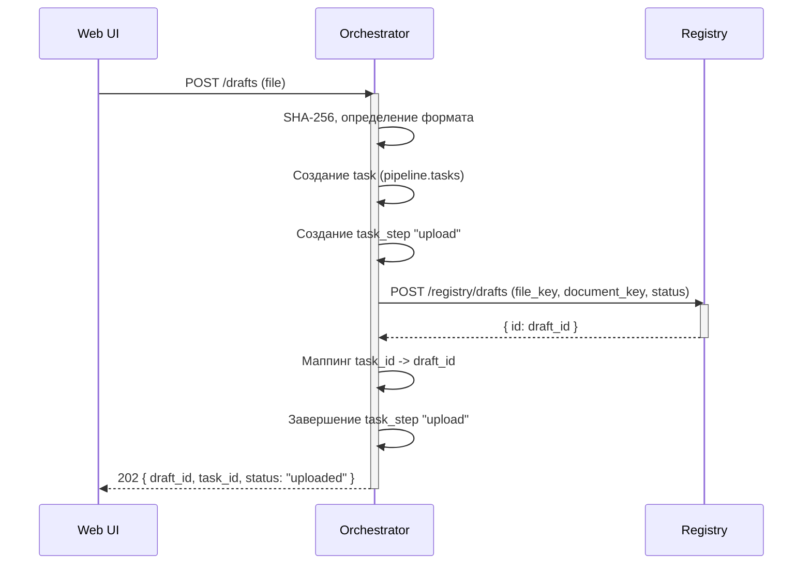
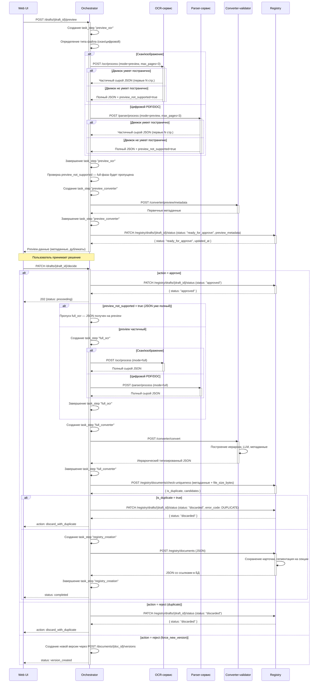
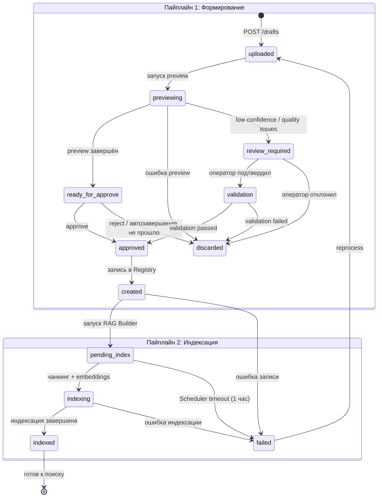
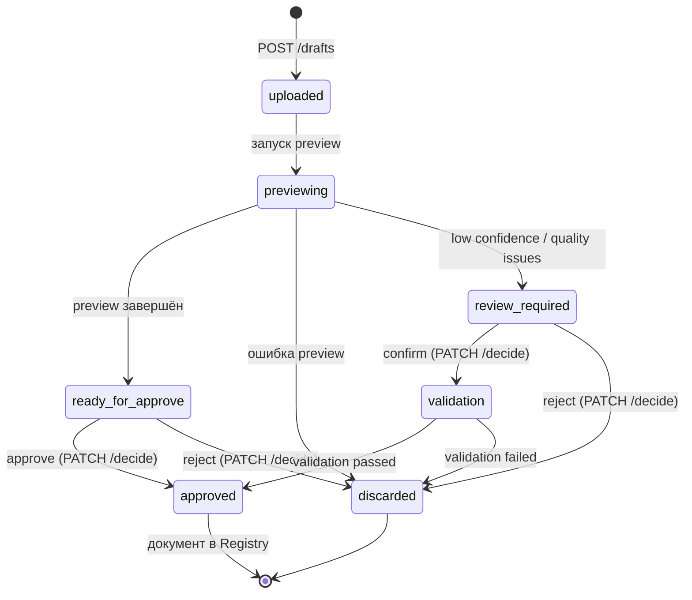
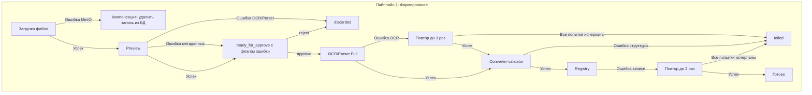

## 1. Пайплайн 1: Формирование документа (двухфазный: preview → решение → full)

Назначение: преобразовать исходный файл в структурированную карточку документа в БД.  
Пайплайн состоит из двух фаз: **Preview** (быстрая проверка, метаданные, решение пользователя) и **Full** (полная обработка).

**Черновик (draft) — обязательная точка входа:** `POST /drafts` всегда создаёт задачу (`pipeline.tasks`) и запись черновика в Registry (`POST /registry/drafts`). Без черновика загрузить документ невозможно. Из черновика данные передаются на конвертацию (Converter-validator) и после — в Registry (чистовик).  
Данные черновиков хранятся в `registry.drafts` (БД Registry). Управление жизненным циклом — через Orchestrator. Этапы задачи с входными/выходными данными сервисов — в `pipeline.task_steps` (БД Orchestrator).

**Создание черновика (POST /drafts):**



**Preview-фаза и решение (основной поток):**



---

### Фаза Preview

**Цель:** быстро получить первичные метаданные и проверить уникальность документа до полной обработки.

| Шаг | Действие | Сервис | Результат |
|-----|----------|--------|-----------|
| P.1 | Определение типа файла (скан/цифровой) | Оркестратор | Выбор OCR или Parser |
| P.2 | Preview-распознавание (первые N страниц) | OCR-сервис или Parser-сервис | Частичный сырой JSON (или полный, если движок не умеет постранично) |
| P.3 | Извлечение первичных метаданных | Converter-validator (preview API) | Обозначение, наименование, тип, даты |
| P.4 | Проверка уникальности (по метаданным + размеру) | Оркестратор → `POST /registry/documents/check-uniqueness` | Список кандидатов-дубликатов |
| P.5 | Отображение preview пользователю | UI | Метаданные + дубликаты |
| P.6 | Решение пользователя | UI → Оркестратор (`PATCH /drafts/{draft_id}/decide`) | approve / reject |
| P.6a | Пропуск full-фазы (если `preview_not_supported=true`) | Оркестратор | OCR/Parser не запускается повторно — JSON уже полный |

**Параметры preview:**

| Параметр | Значение по умолчанию | Описание |
|----------|----------------------|----------|
| `max_pages` | 3 | Количество страниц для preview-обработки |
| `preview_timeout` | 60с (OCR) / 30с (Parser) | Таймаут на preview-этап |
| `preview_not_supported_fallback` | — | Если `preview_not_supported: true` → full-фаза OCR/Parser пропускается, решение принимает пользователь |
| `preview_llm_timeout` | 15с | Таймаут на LLM-вызов при извлечении метаданных |

---

### Фаза Full (полная обработка)

Запускается после решения пользователя `approve` (через `PATCH /drafts/{draft_id}/decide`). Черновик завершается, документ записывается в Registry через конвертацию. Состоит из трёх этапов.

> **Оптимизация:** если на preview-фазе был получен полный JSON (`preview_not_supported: true`), **этап 1 (OCR/Parser) пропускается** — готовый JSON из preview сразу подаётся в Converter-validator. Этапы 2 и 3 выполняются как обычно.

### Форматы входных/выходных данных Full-фазы

| № | Сервис | Входной формат | Выходной формат | Примечание |
|---|--------|---------------|----------------|------------|
| 1.1 | OCR-сервис (`:8088`) / Parser-сервис (`:8087`) | `file_key` → бинарный файл из MinIO | `raw_ocr_v4` (JSON) — плоский массив блоков | Пропускается, если на preview получен полный JSON (`preview_not_supported: true`) |
| 1.2 | Converter-validator (`:8086`) | `raw_ocr_v4` (JSON) | `validated_v3` (JSON) — иерархический типизированный | |
| 1.3 | Registry (`:8084`) — `POST /check-uniqueness` | `file_hash_sha256`, `title_hash_sha256` | `{is_unique: bool, duplicate_of: bigint/null}` | |
| 1.4 | Registry (`:8084`) — `POST /documents` | `validated_v3` + метаданные | `document_id` (bigint) | |
| 1.5 | Orchestrator → Scheduler (RAG Builder) | `document_id` | Статус `pending_index` → Pipeline 2 | |
| 1.6 | Orchestrator (очистка preview-артефактов) | `draft_id` | Удаление preview-данных (preview_metadata, preview_blobs) | |

#### Этап 1: OCR-сервис и Parser-сервис (распознавание и извлечение сырых данных)

**Сервисы:** OCR-сервис (скан/изображения), Parser-сервис (цифровые PDF/DOC)

Два независимых сервиса с **единым контрактом выходных данных**.

**Вход:** ссылка на файл в MinIO.

**Процесс (единый для обоих сервисов):**

| Шаг | Действие | Вход | Выход | Результат |
|-----|----------|------|-------|-----------|
| 1.1 | Скачать файл из MinIO | `file_key` (из запроса Оркестратора) | Бинарный файл (PDF/TIFF/JPEG/PNG) | — |
| 1.2 | Очистка, нормализация изображения | Бинарный файл (изображение/PDF) | Нормализованное изображение (deskewed, cropped) | Улучшение качества, ориентация |
| 1.3 | Распознавание документа (OCR/docling) | Нормализованное изображение | Распознанные блоки (текст, таблицы, фигуры) | Текст, таблицы, изображения |
| 1.4 | Извлечение сырых блоков | Распознанные блоки | Плоский JSON-массив блоков | Плоский массив блоков (текст, таблица, фигура, формула) |
| 1.5 | Сохранение бинарных объектов в MinIO | Бинарные объекты (изображения из документа) | `fileKey` в MinIO | fileKey для изображений |
| 1.6 | Оценка качества распознавания | Плоский JSON-массив блоков | `confidence` (0..1), статусы (ok/warning/error) | confidence, статусы |

**Особенность:** полная изоляция от базы данных — сервис не имеет доступа к БД.  
**LLM не используется.**  
**Выход:** плоский сырой JSON (без иерархии, без заголовков).

> **Примечание:** JSON-формат известен только сервисам и downstream-сервисам. Оркестратор оперирует им как непрозрачным контейнером.

#### Этап 2: Converter-validator (конвертация и валидация)

**Сервис:** Converter-validator

**Вход:** полный сырой JSON от OCR или Parser.

**Процесс:**

| Шаг | Действие | Результат |
|-----|----------|-----------|
| 2.1 | Построение иерархии | Плоские блоки → разделы, подразделы, заголовки |
| 2.2 | Объединение таблиц, разорванных на страницах | Целостные таблицы |
| 2.3 | Извлечение метаданных (LLM, эвристики) | Обозначение, наименование, тип, даты, редакция |
| 2.4 | Распознавание перекрёстных ссылок | Нормализованные ссылки на ГОСТ/ТУ |
| 2.5 | Валидация структуры и полноты | Проверка соответствия схеме |
| 2.6 | — | Вычисление хэшей SHA-256 (content_hash, title_hash) и `title_key` (исходная строка конкатенации). Проверка уникальности выполняется Оркестратором после получения JSON (через `POST /registry/documents/check-uniqueness`) |

**Особенность:** использует LLM для иерархии, классификации и метаданных.  
**Выход:** иерархический типизированный JSON, близкий к итоговому документу.

#### Этап 3: Registry (сервис реестра документов)

**Сервис:** Registry Service

**Вход:** иерархический JSON от Converter-validator.

**Процесс:**

| Шаг | Действие | Результат |
|-----|----------|-----------|
| 3.0 | **Копирование preview-слепка** — Registry копирует `preview_metadata` из `registry.drafts` в `preview_snapshot` карточки документа | Исходный JSON ответа Converter-validator preview сохранён для истории |
| 3.1 | Сохранение карточки документа в `registry.documents` | `document_id`, ссылки на ресурсы |
| 3.2 | **Сегментирование:** разбиение на секции (`registry.document_sections`) | Каждая секция получает DB-идентификатор |
| 3.3 | Сохранение перекрёстных ссылок в `registry.document_references` | Связи между элементами документа |
| 3.4 | Запись в `registry.document_history` | Фиксация факта публикации документа |

**Выход:** плоский JSON со списком **секций** (не чанков) с метаданными и ссылками в БД.
**Далее:** статус `pending_index` → **передано в Пайплайн 2 (Индексация)**.

---

#### Примеры трансформации данных

##### Preview-фаза: сырой JSON → preview-метаданные + кандидаты в дубликаты

**Вход Converter-validator (preview):** частичный сырой JSON (первые N страниц).

**Выход preview/metadata:**
```json
{
  "doc_code": "311-05-1950ц",
  "title": "ЦИРКУЛЯРНОЕ ПИСЬМО № 311-05-1950ц от 09.06.2023",
  "mks_oks_code": null,
  "okstu_code": null,
  "udk_code": null,
  "pkb_codes": [],
  "document_type": "normative",
  "year": 2023,
  "era": "CURRENT",
  "validity_status": "active",
  "issuing_body": "РОССИЙСКИЙ МОРСКОЙ РЕГИСТР СУДОХОДСТВА",
  "jurisdiction": "RU",
  "source_type": "RMRS",
  "language": "ru",
  "title_hash_sha256": "a1b2c3d4e5f6a7b8c9d0e1f2a3b4c5d6e7f8a9b0c1d2e3f4a5b6c7d8e9f0a1b2"
}
```

##### Проверка уникальности (Оркестратор → Registry)

**Ответ `POST /registry/documents/check-uniqueness`:**
```json
{
  "is_duplicate": false,
  "is_duplicate_file": false,
  "candidates": [],
  "file_hash_sha256": "a1b2c3d4...",
  "title_hash_sha256": "e5f6a7b8...",
  "checked_at": "2026-05-15T12:00:00Z"
}
```

**title_hash_sha256** = SHA-256(`era` | `source_type` | `mks_oks_code` | `okstu_code` | `doc_code` | `normalized_title`)
**title_key** = `era` | `source_type` | `mks_oks_code` | `okstu_code` | `doc_code` | `normalized_title`

где `normalized_title` — `title` в нижнем регистре с удалёнными лишними пробелами. Коды классификации включены в формулу для разграничения документов с одинаковым номером, но разной тематикой. Детальный алгоритм нормализации — в `specifications/normalizer_specification.md`.

> **⚠️ Race condition**: Проверка уникальности через `check-uniqueness` неатомарна с последующей записью. Между check и write может быть вставлен другой документ. 
> **Решение**: использовать уникальный индекс `UNIQUE (file_hash_sha256)` в БД + `INSERT ... ON CONFLICT DO NOTHING` для атомарной проверки при записи.

##### Компенсация race condition между `check-uniqueness` и `approve`-записью

Полная атомарность операции «проверить уникальность + записать документ» на уровне единой БД-транзакции невозможна по двум причинам:
1. Между `POST /registry/documents/check-uniqueness` (вызывается Оркестратором на preview-фазе) и финальной записью в `registry.documents` (на фазе `approve` → `created`) проходит **время принятия решения пользователем** (минуты–часы). В течение этого окна другой пользователь может загрузить идентичный документ.
2. Конвертация занимает секунды–минуты; удерживать распределённую блокировку на этом интервале недопустимо (потеря доступности сервиса при сбое).

**Компенсирующий механизм (стадия `approved → created`):**

1. Оркестратор при `PATCH /drafts/{draft_id}/decide action=approve` повторно вызывает `POST /registry/documents/check-uniqueness` (актуальный снимок) и фиксирует `file_hash_sha256` + `title_hash_sha256` в локальном контексте задачи.
2. Registry при `POST /registry/documents` (создание карточки) выполняет вставку через `INSERT ... ON CONFLICT (file_hash_sha256) DO NOTHING RETURNING id`. 
   - **Конфликта нет** → строка создана, возвращён `document_id`.
   - **Конфликт по `file_hash_sha256`** → запись не вставлена, Registry возвращает HTTP `409 DUPLICATE_FILE` с телом:
     ```json
     {
       "error": {
         "code": "DUPLICATE_FILE",
         "message": "Документ с таким file_hash_sha256 уже зарегистрирован",
         "details": { "conflict_document_id": 42 }
       }
     }
     ```
3. Оркестратор при получении `409 DUPLICATE_FILE`:
   - переводит черновик в статус `discarded` с `error_code = "DUPLICATE_FILE_AFTER_APPROVE"`,
   - записывает событие в `pipeline.task_steps.error_code` / `error_message` (уровень `CRITICAL` — потеря консистентности между preview-решением и фактической записью),
   - отдаёт пользователю HTTP `409 DUPLICATE_FILE` через Gateway, указывая `conflict_document_id` для перехода к существующему документу.
4. **Связанный черновик** (`pipeline.tasks.draft_id`) помечается флагом `superseded_by_document_id = 42` в задаче пайплайна (только для аудита).
5. **Уведомление пользователя**: UI получает `409` с `conflict_document_id` и предлагает перейти к существующему документу или отклонить дубликат (`reject`).

**Аудит и логирование:**
- Событие `DUPLICATE_FILE_AFTER_APPROVE` фиксируется в `registry.document_history` с `event_type="failed_duplicate"` и в `audit.events` (см. P11-4) с уровнем `CRITICAL`.
- В лог пишется warning: `"Дубликат обнаружен после approve — черновик discarded"`, `draft_id`, `task_id`, `conflict_document_id`.

**Идемпотентность решения:** повторный `PATCH /drafts/{draft_id}/decide` для уже `discarded` черновика возвращает `409 INVALID_STATE_TRANSITION` (см. `common_api.md`).

**Альтернативы (отвергнуты):**
- **pg_advisory_xact_lock** на `title_hash_sha256` — снижает конкурентность и не покрывает окно между preview и approve.
- **Saga с распределённой транзакцией** — не используется (дополнительная инфраструктура, eventual consistency).

##### Этап 1 → 2: OCR/Parser → Converter-validator (обогащение)

**Вход:** плоский сырой JSON (блоки страниц).  
**Выход:** иерархический JSON с разделами, метаданными, ссылками.

##### Этап 2 → 3: Converter-validator → Registry (простановка DB-ссылок)

**Вход:** иерархический JSON.  
**Выход:** JSON с проставленными `section_id`, `file_key`, блоком `registry`.

---

#### Статусная модель (FSM)



**Описание состояний:**

| Состояние | Пайплайн | Описание |
|---|---|---|
| `uploaded` | Черновик | Файл загружен в MinIO, ожидание запуска preview |
| `previewing` | Черновик | Выполняется preview-фаза |
| `ready_for_approve` | Черновик | Preview завершён, ожидание решения |
| `review_required` | Черновик | **P1-20**: Preview показал низкое качество (пороги из P12-2 в `app_settings.parser.quality_thresholds`). Требуется ручная проверка оператором. UI отображает замечания из `notifications[]` (P12-3) |
| `validation` | Черновик | Оператор подтвердил черновик, выполняется повторная валидация (полный OCR/Parser → Converter-validator) с `metadata_overrides` (см. D13) |
| `approved` | Черновик | Оператор подтвердил, документ создаётся в Registry |
| `discarded` | Черновик | Черновик отклонён |
| `created` | Registry | Документ записан в реестр |
| `pending_index` | Пайплайн 2 | Ожидание запуска RAG Builder |
| `indexing` | Пайплайн 2 | Выполняется чанкинг, эмбеддинги |
| `indexed` | Пайплайн 2 | Документ проиндексирован |
| `failed` | 1/2 | Ошибка на одном из этапов |

**Триггер перехода `review_required → validation` (P1-20):**

1. На стадии `previewing` Parser/OCR возвращает raw-метрики качества (`avg_confidence`, `pages_failed`, `per_page[].status`). Оркестратор применяет пороги из `app_settings.parser.quality_thresholds`:
   - `avg_confidence < reprocess_avg_confidence_below` → orchestrator запускает повторную обработку
   - `avg_confidence < operator_avg_confidence_below` ИЛИ `pages_failed > 0` ИЛИ `lama_fallback_used == true` → черновик переходит в `review_required` (а не `ready_for_approve`).
3. На стадии `review_required` Orchestrator фиксирует замечания в `pipeline.draft_notifications` (P12-3 / P3-5) и отдаёт UI список с `code, severity, category, message, location, suggested_action`.
4. Оператор может отредактировать метаданные черновика через `PATCH /drafts/{draft_id}/metadata` (S5) — это опциональный шаг, выполняется до или после просмотра замечаний.
5. Оператор через `PATCH /drafts/{draft_id}/decide` с `action: "confirm"` подтверждает черновик → статус `validation`. Если метаданные редактировались через шаг 4, `metadata_overrides` в `decide` не обязательны — они уже сохранены в черновике.
6. На стадии `validation` Orchestrator запускает полный цикл (OCR/Parser full + Converter-validator), используя `metadata_overrides` оператора (сохранённые ранее или переданные в `decide`).
7. Если `validation` проходит — `approved` → `created`. Если нет — `discarded` с `error_code`.

**Процесс создания новой версии:**
Версии создаются через `POST /documents/{doc_id}/versions` напрямую. При создании новой версии:
1. Все поля документа (название, коды, метаданные) копируются из предыдущей версии
2. `document_id` остаётся неизменным (логический документ тот же)
3. Новая версия индексируется заново (Pipeline 2)
4. Предыдущая версия доступна для просмотра через `GET /documents/{doc_id}/versions`

**Архивация документов:** Документ может быть помечен как архивный (неактивный) автоматически через N дней после создания новой версии (настраиваемый параметр, по умолчанию 365 дней). Также архивация может быть инициирована вручную `system_admin`. Архивированный документ доступен только для чтения. Архивация — административная операция, не связанная с FSM пайплайна.

> **Черновики (drafts):** Черновик — основной элемент управления загрузкой документа. Данные черновиков хранятся в `registry.drafts` (БД Registry). `file_key` — у черновика (`registry.drafts.file_key`). `raw_data` — в `registry.drafts.raw_data` (JSONB, результат Parser или OCR). MinIO — только для бинарных файлов (PDF, изображения). OCR/Parser выполняется **полностью** уже в черновике; Converter-validator — только извлечение метаданных. Полная конвертация (validated_v3) запускается при approve, после чего документ записывается в Registry. Решение пользователя принимается через `PATCH /drafts/{draft_id}/decide` с опциональным `metadata_overrides` (ручные правки метаданных). `task_id` — внутренний сквозной ID задачи (`pipeline.tasks`, БД Orchestrator). Этапы задачи с входными/выходными данными сервисов — в `pipeline.task_steps`.

**Draft FSM (объединённая):**



**Статусы черновика:**

| Статус черновика | Описание |
|---|---|
| `uploaded` | Черновик создан при загрузке файла, ожидание preview |
| `previewing` | Выполняется preview-фаза |
| `ready_for_approve` | Preview завершён. Если уникально и чисто — автозавершение; иначе — ожидание решения человека |
| `review_required` | Preview показал низкое качество. Требуется ручная проверка оператором |
| `validation` | Оператор подтвердил черновик, выполняется повторная валидация с metadata_overrides |
| `approved` | Черновик утверждён. Документ записывается в Registry |
| `discarded` | Черновик отклонён (человеком или автоматом) |

---

#### Обработка ошибок и компенсационные потоки

| Этап | Действие | При ошибке | Компенсация |
|---|---|---|---|
| Пре-стейдж (загрузка) | Сохранение в MinIO, создание записи в БД | Ошибка MinIO | Удалить запись из БД, вернуть ошибку UI |
| Preview OCR/Parser | Распознавание первых N страниц | Ошибка распознавания | Статус `discarded` |
| Preview Converter-validator | Извлечение метаданных | Ошибка извлечения метаданных | `ready_for_approve` с флагом ошибки |
| Preview проверка уникальности (Оркестратор → Registry) | Проверка по метаданным через `check-uniqueness` | Ошибка Registry | `ready_for_approve` (повтор при доступности) |
| Full OCR/Parser | Распознавание и парсинг (пропускается, если preview вернул полный JSON) | Ошибка OCR/таймаут | Повтор (до 3 раз), при превышении — статус `failed` |
| Full Converter-validator | Конвертация, валидация | Ошибка структуры JSON | Вернуть `validation.errors`, статус `failed` |
| Registry | Запись карточки в БД | Ошибка записи | Откат транзакции, повтор (до 2 раз) |



---

#### Политики повторных попыток и таймаутов

| Этап | Таймаут (max) | Retry | Стратегия | Backoff |
|---|---|---|---|---|
| Загрузка файла в MinIO | 60с | 0 | — | — |
| OCR preview | 60с | 1 | Immediate | — |
| Parser preview | 30с | 1 | Immediate | — |
| Converter preview (metadata) | 15с | 0 | — | — |
| Registry check-uniqueness (preview) | 15с | 1 | Immediate | — |
| Registry check-uniqueness (full) | 15с | 1 | Immediate | — |
| OCR Full | 300с (5 мин) | 3 | Exponential | 1с → 2с → 4с |
| Parser Full | 300с (5 мин) | 3 | Exponential | 1с → 2с → 4с |
| Converter-validator (full) | 120с (2 мин) | 2 | Exponential | 1с → 2с |
| Registry (запись) | 30с | 2 | Exponential | 500мс → 1с |

#### Защита от «зависших» состояний (тупиковые таймауты)

Для состояний, требующих действия человека или внешнего триггера, установлены **таймауты ожидания**,
по истечении которых черновик автоматически переводится в `discarded` (или документ в `failed`) с соответствующим кодом ошибки:

| Состояние | Таймаут ожидания | Действие по истечении | Код ошибки |
|---|---|---|---|
| `previewing` | 30 минут | Перевод в `discarded` | `PREVIEW_TIMEOUT` |
| `ready_for_approve` | 24 часа | Перевод в `discarded` | `DECISION_TIMEOUT` |
| `pending_index` | 1 час | Перевод в `failed` | `INDEX_TRIGGER_TIMEOUT` |
| `uploaded` | 1 час | Перевод в `discarded` | `PREVIEW_TRIGGER_TIMEOUT` |

Таймауты отсчитываются с момента входа в состояние и проверяются **Scheduler-сервисом** (или CRON-задачей),
запускаемым каждые 5 минут. При переводе в `failed`:
- В `registry.document_history` создаётся запись с указанием причины.
- Система отправляет уведомление ответственному пользователю (email/внутреннее).
- Документ доступен для повторной загрузки (не удаляется).

#### Кэширование результатов preview-фазы

Preview-фаза обрабатывает первые N страниц документа (OCR/Parser preview + Converter-validator preview).
Чтобы избежать двойного распознавания одних и тех же страниц при переходе к полной обработке:

1. Результаты preview (частичный сырой JSON от OCR/Parser, метаданные от Converter-validator) **сохраняются**
   в журнале Оркестратора (`GET /documents/{doc_id}/history`) как временный артефакт.
2. При запуске полной фазы (`approve`) Оркестратор **передаёт preview-результаты** в full-этапы:
   - OCR/Parser full начинает обработку со страницы `max_pages + 1`, избегая повторной обработки preview-страниц.
   - Converter-validator full использует preview-метаданные как основу, дообогащая их полными данными.
3. Если preview-результаты по какой-то причине недоступны (очищены по TTL), full-фаза запускается
   с самого начала (все страницы).

**TTL preview-артефактов:** 7 дней с момента создания. По истечении — автоматическая очистка.

> **Примечание:** Повторный вызов `PATCH /drafts/{draft_id}/decide` для черновиков в терминальных статусах
(`approved`, `discarded`) возвращает ошибку `409 CONFLICT` с кодом `DRAFT_ALREADY_DECIDED`.
Пользователь должен создать новый документ (новый черновик).
