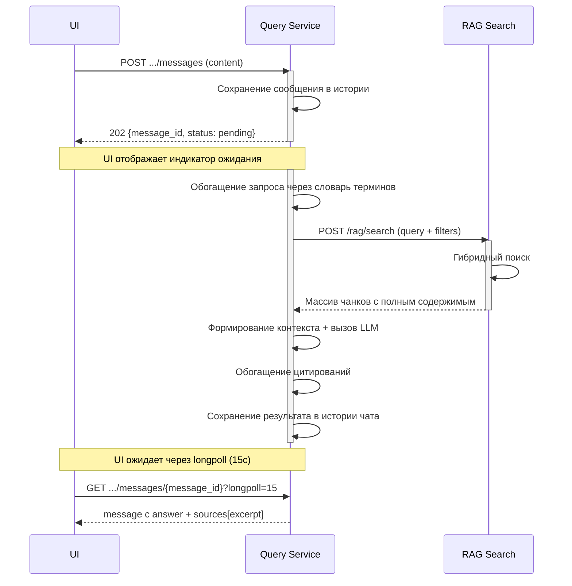
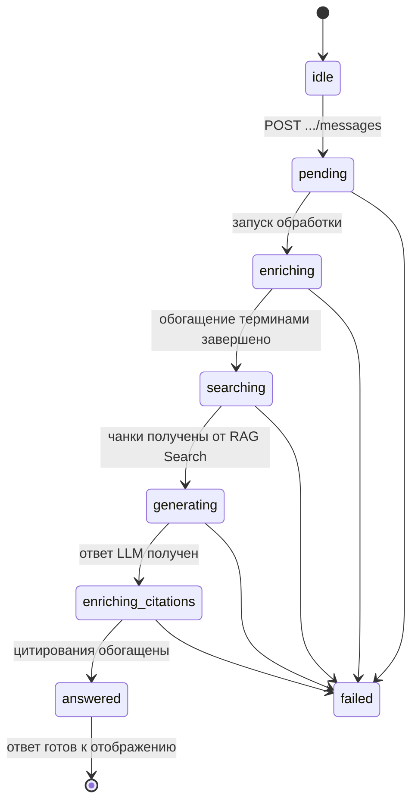
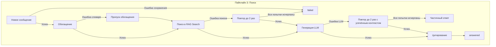

### 3. Пайплайн 3: Поиск документа

Назначение: обеспечить семантический поиск и генерацию ответа на естественном языке по проиндексированным документам.

**Вход (триггер):** сообщение пользователя в чате (UI → Query Service).

**Процесс асинхронный** — UI сначала получает подтверждение, затем ожидает результат через longpoll-запрос к конкретному сообщению. По умолчанию таймаут longpoll — 15 секунд.

#### Этап 1: Приём и сохранение сообщения (Query Service)

**Сервис:** Query Service

**Вход:** сообщение пользователя (content + опциональные attachments).

**Процесс:**

| Шаг | Действие | Результат |
|---|---|---|
| 1.1 | Сохранение сообщения пользователя в истории чата | Статус `pending` |
| 1.2 | Возврат `202` с message_id | UI отображает индикатор ожидания |

**Выход:** `202 Accepted` с `message_id` и статусом `pending`.

---

#### Этап 2: Обогащение запроса терминами (Query Service)

**Сервис:** Query Service

**Вход:** текст запроса пользователя.

**Процесс:**

| Шаг | Действие | Результат |
|---|---|---|
| 2.1 | Поиск raw_term → standard_term через словарь Registry | Нормализованный запрос |
| 2.2 | Приведение к normalized_value, добавление synonyms | Расширенный поисковый запрос |

> **⚠️ Частичный результат обогащения**: Если словарь вернул частичный результат (нашёл 2 из 5 терминов), используются успешно обогащённые термины, ошибки по отдельным терминам логируются.

**Пример:**

Исходный запрос: "Проверь толщину обшивки ледового пояса"

После обогащения: "Проверить толщина обшивки ледовый пояс" + синонимы: ["обшивка ледового пояса", "ледовый пояс корпуса"]

**Выход:** обогащённый запрос для RAG.

---

### Этап 3: Поиск чанков (RAG Search)

**Сервис:** RAG Search

**Вход:** обогащённый запрос с вопросом и фильтрами.

**Процесс:**

| Шаг | Действие | Результат |
|---|---|---|
| 3.1 | Гибридный поиск (Hybrid, Multi, Rerank) | Релевантные чанки с полным содержимым |

**Выход:** массив чанков с полным содержимым (`content`), метаданными (`document_id`, `section_id`, `page`, `clause`) и оценками релевантности (`score`).

---

#### Этап 3b: LLM генерация (состояние generating)

**Сервис:** Query Service

**Вход:** массив чанков от RAG Search.

**Процесс:**

| Шаг | Действие | Результат |
|---|---|---|
| 3b.1 | Отбор top_k релевантных чанков | Контекст для LLM |
| 3b.2 | Формирование промпта (вопрос + тексты чанков с метаданными) | Промпт для генеративного движка |
| 3b.3 | Вызов LLM для синтеза ответа | Сгенерированный текст |
| 3b.4 | **P4-8**: Валидация цитирований — проверка наличия `[source:N]` после каждого абзаца | Ответ, прошедший проверку |

**Промпт (шаг 3b.2):** В инструкцию LLM включается обязательное требование: после каждого абзаца указывать ссылку на источник в формате `[source:N]`, где N — номер чанка из переданного контекста. Пример: «Толщина обшивки должна быть не менее 12 мм [source:3].»

**Валидация (шаг 3b.4):**
- Из ответа LLM извлекаются все `[source:N]`
- Каждый N проверяется на вхождение в массив переданных чанков (по `chunk_id`)
- Если хотя бы один абзац не содержит `[source:N]` — ответ отклоняется, запускается регенерация (retry до 2 раз с усиленным указанием в промпте)
- Если после всех retry ответ не прошёл валидацию — ответ возвращается без machine-readable цитирований (как fallback), в лог пишется WARN

**Выход:** текст ответа LLM с `[source:N]`-маркерами.

**Fallback при пустом результате RAG Search:**
Если RAG Search не нашёл ни одного чанка (пустой result set):
1. LLM не вызывается (нечего генерировать)
2. Пользователю возвращается ответ с полем `sources: []` и полем `answer: null`
3. В ответе добавляется флаг `empty_result: true`
4. Код ответа — 200 (не ошибка), так как запрос корректен, но данных нет

---

#### Этап 4: Обогащение цитирований и сохранение (Query Service)

**Сервис:** Query Service

**Вход:** текст ответа LLM + массив чанков от RAG Search.

**Процесс:**

| Шаг | Действие | Результат |
|---|---|---|
| 4.1 | Формирование строк-сносок с идентификаторами для каждого источника | `(источник: «Правила РС» %[document_id:42]%, §4.2 %[section_id:420042]%, стр. 42)` |
| 4.2 | Замена/добавление сносок в текст ответа | Финальный ответ с аннотированными сносками |
| 4.3 | Сохранение ответа в истории чата (статус `answered`) | Результат доступен для UI |

**Алгоритм постобработки:**

1. Получить текстовый ответ от LLM (без `section_id` и `document_id` в machine-readable формате).
2. Пройти по массиву `sources` (извлечённому из поиска) и для каждого источника сформировать строку-сноску с идентификаторами, например: `(источник: «Правила РС» %[document_id:42]%, §4.2 %[section_id:420042]%, стр. 42)`.
3. Добавить эти сноски в конец ответа или в то место, где уже стоит базовая ссылка. Если модель уже выдала `(источник: «Правила РС», раздел 4.2, стр. 42)`, заменить её на вариант с `section_id` через регулярное выражение или просто дописать идентификатор после пункта.

**Пример:**

Исходный ответ модели:
> ... не менее **12 мм** (источник: «Правила РС», раздел 4.2, стр. 42).

После обработки Query Service:
> ... не менее **12 мм** (источник: «Правила РС» %[document_id:42]%, §4.2 %[section_id:420042]%, стр. 42).

**Выход:** JSON с ответом (`answer`), обогащёнными сносками и массивом источников с цитатами (`sources[].excerpt`). Ответ сохранён в истории чата.

**Валидация цитирования (в составе этапа 4):**
После обогащения сносок выполняется проверка:
1. Все ссылки вида `[ГОСТ ХХХХ-ХХ, п. X.X]` в ответе сверяются с массивом `sources`.
2. Ссылка, не соответствующая ни одному источнику из контекста, удаляется.
3. Ссылка, соответствующая источнику, помечается как валидная.

> **Примечание:** Этап 3b (LLM) покрывается состоянием FSM `generating`, этап 4 — состоянием `enriching_citations`.

Этапы 1–4 описаны выше. Дополнительные состояния FSM для валидации не вводятся — проверка выполняется синхронно в рамках `enriching_citations`.

---

### Сводная таблица доступа к БД

| Пайплайн | Этап | Доступ к БД | Направление данных |
|---|---|---|---|
| Поиск | 1. Приём сообщения | **Пишет** (история чата) | Вход: content → Выход: 202 + message_id |
| Поиск | 2. Обогащение терминами | **Читает** (словарь терминов) | Вход: текст → Выход: обогащённый запрос |
| Поиск | 3. RAG Search | **Читает** | Вход: query + filters → Выход: массив чанков |
| Поиск | 3b. Генерация ответа LLM | **Нет** | Вход: чанки → Выход: текст ответа |
| Поиск | 4. Обогащение цитирований | **Нет** | Вход: текст LLM + чанки → Выход: answer с аннотированными сносками |

---

### Статусная модель (FSM)

Пайплайн 3 (Поиск) управляет состояниями сообщения в чате, а не документа. У каждого сообщения есть свой статус обработки.

**Описание состояний:**

| Состояние | Описание | Действие |
|---|---|---|
| `idle` | Ожидание нового сообщения (виртуальное, не хранится в БД) | — |
| `pending` | Сообщение получено, сохранено в истории чата | UI отображает индикатор ожидания |
| `enriching` | Обогащение запроса терминами через словарь Registry | Поиск `raw_term → standard_term` |
| `searching` | Поиск релевантных чанков в RAG Search | Гибридный поиск (dense + sparse + pg_trgm) |
| `generating` | Генерация ответа LLM на основе найденных чанков | Формирование промпта, вызов LLM |
| `enriching_citations` | Обогащение цитирований machine-readable идентификаторами | Замена/добавление сносок с `document_id`, `section_id` |
| `answered` | Финальный ответ готов, сохранён в истории чата | UI получает ответ через longpoll на конкретное сообщение |
| `failed` | Ошибка на одном из этапов | UI отображает ошибку, возможен повтор |

**Примечание:** FSM Пайплайна 3 является локальной для каждого сообщения в сессии чата. Разные сообщения могут находиться в разных состояниях одновременно.

> Состояние `idle` является виртуальным (не хранится в БД) — оно обозначает отсутствие сообщения до его создания. При создании сообщения через `POST .../messages` ему сразу присваивается статус `pending`.

#### Защита от «зависших» сообщений

Для каждого состояния установлен свой таймаут. По истечении таймаута сообщение переводится в `failed`.

| Состояние | Таймаут | Действие при таймауте |
|---|---|---|
| `pending` | 30 с | `failed` с `MESSAGE_PENDING_TIMEOUT` (P1-15) |
| `enriching` | 30 с | Пропустить обогащение, перейти к поиску без терминов. В ответ добавляется флаг `enrichment_skipped: true` |
| `searching` | 60 с | `failed` (RAG Search недоступен) |
| `generating` | 180 с (3 мин) | Retry до 2 раз: (1) при ошибке LLM — с усечением контекста; (2) при **failed валидации `[source:N]`** (P4-8) — с усиленным указанием в промпте. При неудаче всех retry — `failed` с `LLM_GENERATION_FAILED` |
| `enriching_citations` | 30 с | Ответ без machine-readable сносок |

Дополнительно установлен абсолютный таймаут **48 часов** с момента создания сообщения. При его истечении сообщение переводится в `failed` с кодом `MESSAGE_TIMEOUT`. Таймаут проверяется Scheduler-сервисом.

> **P1-15 (уточнение 17.06)**: Per-state таймауты (30/60/180/30 с) **и** абсолютный 48-часовой таймаут работают совместно. Per-state таймауты предотвращают «зависание» на конкретной стадии, абсолютный — защищает от забытых сообщений в случае системного сбоя. Если `pending` превышает 30 с (а раньше мог висеть бесконечно до Scheduler-проверки 48ч) — сообщение сразу переводится в `failed` с `MESSAGE_PENDING_TIMEOUT`, и UI получает уведомление.

> **Уведомление пользователя**: При пропуске обогащения из-за таймаута `enriching` (30 с) в ответ добавляется флаг `enrichment_skipped: true`. Пользователь информируется, что поиск выполнен без обогащения терминов, и качество ответа может быть снижено.

---

#### Обработка ошибок и компенсационные потоки

| Этап | Действие | При ошибке | Компенсация |
|---|---|---|---|
| 1. Приём сообщения | Сохранение в истории чата | Ошибка БД | Вернуть 500, UI повторяет запрос |
| 2. Обогащение терминами | Поиск терминов в словаре | Ошибка словаря | Пропустить обогащение, искать как есть |
| 3. RAG Search | Гибридный поиск чанков | Ошибка векторного поиска | Повтор (до 2 раз), fallback на полнотекстовый поиск |
| 3b. Генерация LLM | Синтез ответа | Ошибка LLM (таймаут/500) | Повтор (до 2 раз) с усечённым контекстом. При исчерпании retry — `failed` с кодом `LLM_GENERATION_FAILED`; в ответе возвращаются найденные `sources` (чанки) для отображения пользователю |
| 4. Обогащение цитирований | Простановка идентификаторов | Ошибка постобработки | Вернуть ответ без machine-readable сносок |

---

#### Политики повторных попыток и таймаутов

| Этап | Таймаут (max) | Retry | Стратегия | Backoff |
|---|---|---|---|---|
| Сохранение сообщения | 10с | 1 | Immediate | — |
| Обогащение терминами | 15с | 0 | — | — |
| RAG Search | 30с | 2 | Exponential | 500мс → 1с |
| LLM генерация | 120с (2 мин) | 2 | Exponential + truncation | 2с → 4с |
| Обогащение цитирований | 10с | 1 | Immediate | — |
