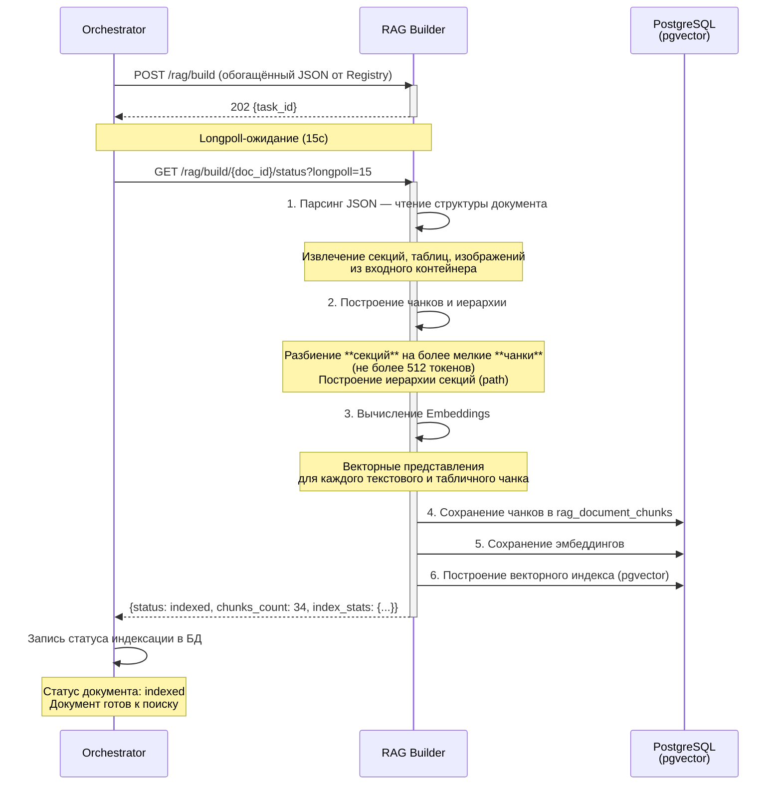
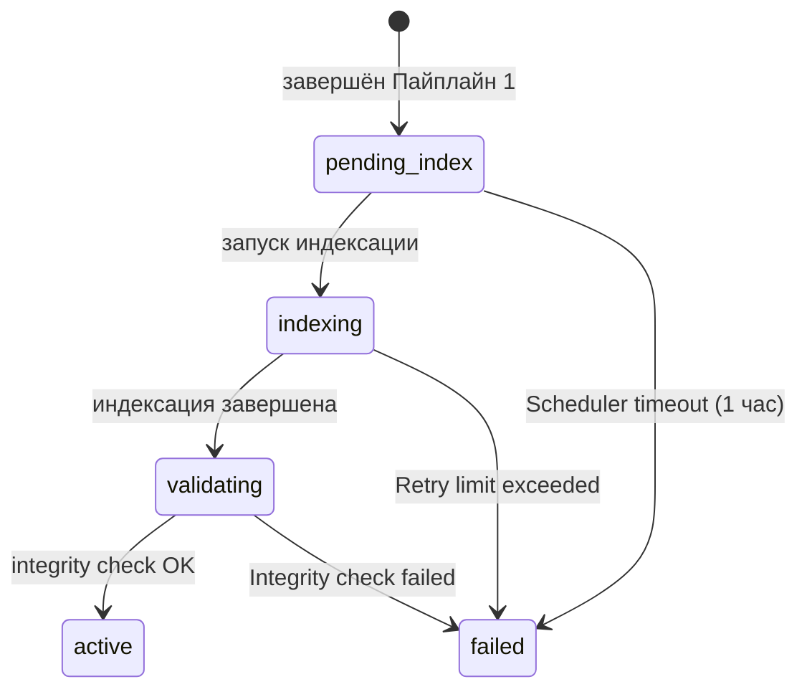
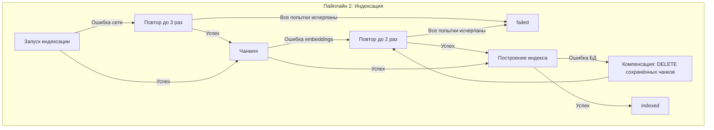

### 2. Пайплайн 2: Индексация документа

Назначение: построить векторный индекс для семантического поиска и обеспечить RAG-функциональность.

**Вход (триггер):** завершение Пайплайна 1 — документ сохранён в Registry со статусом `created`. Запуск индексации происходит **фоново** через Scheduler-сервис (или CRON-задачу), который каждые 15 минут сканирует документы в статусе `created` (или `pending_index`, если индексация не была запущена ранее).

**Защита от двойного запуска:** Scheduler использует advisory lock PostgreSQL (`pg_try_advisory_xact_lock`) для предотвращения повторного запуска индексации документа, если предыдущая ещё не завершилась. Статус `pending_index` проверяется дополнительно перед стартом.

> **Таймаут `pending_index` (1 час):** если Scheduler по какой-то причине не обработал документ в течение часа после перехода в `created`, документ переводится в `failed` с кодом `INDEX_TRIGGER_TIMEOUT`. Это предохранитель от «зависших» документов.

#### Этап 1: RAG Builder (пишет БД)

**Сервис:** RAG Builder

**Вход:** плоский JSON от Registry (секции `registry.document_sections`, не чанки)

**Процесс:**

| Шаг | Действие | Результат |
|---|---|---|
| 1.1 | Парсинг JSON — чтение структуры документа из входного контейнера | Документ, секции, таблицы, изображения |
| 1.2 | Построение чанков и иерархии | Разбиение **секций** на более мелкие **чанки** (не более 512 токенов) |
| 1.3 | Вычисление Embeddings | Векторные представления для каждого текстового и табличного чанка |
| 1.4 | Построение векторного индекса | Сохранение чанков в `rag_document_chunks`, эмбеддингов и индексов |

**Обработка пустого документа (0 секций):**
Если документ не содержит ни одной секции (пустой OCR-результат, ошибка парсинга):
1. Черновик переводится в статус `discarded` с кодом ошибки `EMPTY_DOCUMENT`.
2. Пустой документ **не может быть завершён** — документ не будет создан в Registry и не доходит до индексации.
3. RAG Builder не вызывается.
4. Пользователь может отклонить черновик (`reject`) или удалить его.
5. Для повторной попытки необходимо загрузить файл заново (создаётся новый черновик).

**Формат данных от Registry**: RAG Builder получает плоский JSON со списком секций (формат `registry_for_rag_v2`). Каждая секция содержит поля: `id`, `path`, `type`, `content`. Обязательные поля: `id`, `type`, `content`. При отсутствии `path` он формируется автоматически.

> **Транзакционность:** Обе операции (сохранение чанков и эмбеддингов) выполняются в рамках одной транзакции БД. Если между сохранением чанков и записью эмбеддингов происходит сбой, транзакция откатывается целиком — чанки без векторов не остаются.

**Особенность:** единственный этап, который **пишет** в базу данных — сохраняет чанки, эмбеддинги и индексы.

**Выход:** статус индексации (`indexed`/`failed`), количество созданных чанков и статистика по типам (`sections`, `chunks`, `embeddings`).

---

#### Longpoll-механизм для Pipeline 2

Вызов RAG Builder является асинхронным. Оркестратор использует longpoll-механизм для ожидания результата (аналогично Pipeline 1):

1. **Запуск**: Оркестратор отправляет `POST /rag/build` с обогащённым JSON от Registry
   → Получает `202 Accepted { "task_id": "..." }`
2. **Ожидание**: Оркестратор вызывает `GET /rag/build/{document_id}/status?longpoll=15`
3. **Сервис RAG** держит соединение до 15 секунд:
   - **Индексация завершена** → немедленный ответ с результатом и статусом `indexed`
   - **Индексация в процессе** → ответ с текущим прогрессом (`chunks_generated`, `embeddings_count`)
   - **Таймаут 15с** → ответ с текущим прогрессом (нефинальный статус)
4. **Повтор**: при нефинальном статусе — повторный longpoll-запрос
5. **Завершение**: при получении `status: indexed` Оркестратор фиксирует завершение индексации и обновляет статус документа на `indexed`

**Параметры longpoll:**

| Параметр | Значение по умолчанию | Описание |
|---|---|---|
| `longpoll` | `15` секунд | Время ожидания завершения индексации |
| `poll_interval` | `1` секунда (серверная) | Минимальный интервал между проверками статуса |

**Форматы ответов на статус:**

| Статус | Описание | Действие Оркестратора |
|---|---|---|
| `pending_index` | Индексация ещё не началась | Повторный longpoll через 1с |
| `indexing` | Идёт построение чанков и эмбеддингов | Повторный longpoll |
| `indexed` | Индексация завершена успешно | Завершить, подготовить Pipeline 3 |
| `failed` | Ошибка индексации | Зафиксировать ошибку, перейти в `failed` |

---

#### Статусная модель (FSM)

**Описание состояний:**

| Состояние | Описание |
|---|---|
| `pending_index` | Ожидание запуска индексации после завершения Пайплайна 1 |
| `indexing` | Выполняется чанкинг, вычисление эмбеддингов, построение индекса |
| `validating` | Индексация завершена (task=completed). Документ переведён в `validating`, Оркестратор запрашивает `GET /rag/build/{doc_id}/check` у RAG Builder для финального подтверждения |
| `active` | Integrity check пройден (`integrity_ok=true`). Документ активирован, доступен для семантического поиска |
| `indexed` | Legacy — заменён на `validating` + `active`. Может встречаться в существующих данных |
| `partially_indexed` | Часть чанков проиндексирована, часть пропущена из-за ошибок embeddings/БД. Документ **исключён** из RAG Search (RAG фильтрует `WHERE processing_status = 'active'`). **Уточнение (P1-16)**: `partially_indexed` не выделен отдельной FSM-стрелкой на диаграмме, но фиксируется в `processing_status` при `chunk_count_actual < chunk_count_expected` после завершения индексации. `chunk_count_actual` (`chunks_count`) — из `GET /rag/build/{doc_id}/status`, `chunk_count_expected` (`expected_count`) — из `GET /rag/build/{doc_id}/check`. См. `rag_builder_service_api.md`. Планируется выделить в отдельный статус в Sprint 4 (задача SPEC-19) |
| `failed` | Ошибка индексации (таймаут, превышение retry, нарушение целостности). Требуется переиндексация (`POST /api/v1/documents/{doc_id}/reprocess`) |

---

#### Обработка ошибок и компенсационные потоки

| Этап | Действие | При ошибке | Компенсация |
|---|---|---|---|
| 1. JSON Parsing | Чтение структуры документа из входного JSON | Некорректный JSON | Вернуть ошибку, статус `failed` |
| 2. Chunking | Разбиение на семантические фрагменты | Ошибка разбиения | Пропустить секцию, продолжить |
| 3. Embeddings | Вычисление векторных представлений | Ошибка модели embeddings | Повтор (до 2 раз), при превышении — пропустить чанк |
| 4. Vector Index | Сохранение чанков и индекса в БД | Ошибка записи в pgvector | Откат транзакции, повтор (до 2 раз) |

**Неполная индексация**: Если часть чанков сохранена в pgvector, а часть пропущена, документ индексируется частично. Для переиндексации используется Orchestrator (`POST /api/v1/documents/{doc_id}/reprocess`).

**Переиндексация**: Перед повторной индексацией Orchestrator вызывает `DELETE /rag/build/{doc_id}` для очистки существующих чанков документа из векторного индекса. Только после успешного удаления запускается новый `POST /rag/build`. Если `DELETE` вернул ошибку, переиндексация отменяется с кодом `CLEANUP_FAILED`.

**Механизм перехода `indexed → failed` (P1-17, уточнение):**

Переход `indexed → failed : Integrity check failed` (см. диаграмму FSM выше) активируется **после** успешной записи в pgvector. Целостность проверяется **в две стадии**:

1. **Пост-индексационный self-check** (RAG Builder, выполняется в конце `indexing`):
   - `SELECT count(*) FROM rag.document_chunks WHERE document_id = $1` сравнивается с `expected_chunk_count` (рассчитан на этапе чанкинга).
   - Проверка `chunk_count == expected_chunk_count` и `total_tokens > 0`.
   - Проверка уникальности `chunk_index` (не должно быть дублей).
2. **Фоновая проверка по расписанию** (Scheduler, каждые 6 часов):
   - Для всех документов в статусе `indexed` старше 1 часа выполняется выборка `chunk_count` + `count(*)` + проверка `embedding IS NOT NULL`.
   - Если для какого-то документа `chunk_count_actual < chunk_count_expected` или `embedding IS NULL` — перевод в `failed` с `error_code = "INTEGRITY_CHECK_FAILED"`, лог `ERROR` уровня.

При переходе в `failed`:
- `processing_status = 'failed'`
- `error_code = 'INTEGRITY_CHECK_FAILED'`
- `chunk_count` сохраняется для последующего анализа.
- RAG Search **автоматически исключает** документ из выдачи (`WHERE processing_status = 'indexed'` уже включён в прод-фильтр).
- Документ становится кандидатом на переиндексацию (`POST /api/v1/documents/{doc_id}/reprocess`, UI показывает предупреждение).

**Компенсация ошибок (P1-18, устранение противоречия):**

Ранее в §1 (строка 143) и в mermaid-диаграмме использовались две разные формулировки («откат транзакции» vs «удалить сохранённые чанки»). **Канонический механизм (P1-18)**:

- На стадии `indexing` **вся запись выполняется в одной транзакции** (`BEGIN ... INSERT ... COMMIT`). При ошибке — `ROLLBACK` отменяет все чанки пакета. Это и есть «откат транзакции».
- Если `ROLLBACK` невозможен (например, ошибка произошла **после** `COMMIT`, но до `UPDATE registry.documents SET processing_status='indexed'`) — выполняется **компенсирующий `DELETE FROM rag.document_chunks WHERE document_id = $1 AND created_in_txn = $txn_id`**, где `$txn_id` — уникальный идентификатор индексирующей транзакции (см. `db_diagrams.md`, новая колонка `rag.document_chunks.indexing_txn_id` — будет добавлена в P2-9).
- После успешной компенсации — повторная попытка (`Retry4` на диаграмме). При исчерпании retry — `failed`.

Таким образом, **обе формулировки корректны** и применяются на разных стадиях: транзакция — основной путь, DELETE — fallback.

---

#### Политики повторных попыток и таймаутов

| Этап | Таймаут (max) | Retry | Стратегия | Backoff |
|---|---|---|---|---|
| JSON Parsing | 10с | 0 | — | — |
| Chunking | 120с (2 мин) | 1 | Immediate | — |
| Embeddings (весь документ) | 300с (5 мин) | 2 | Exponential | 2с → 4с |
| Vector Index (запись) | 60с | 2 | Exponential | 1с → 2с |

