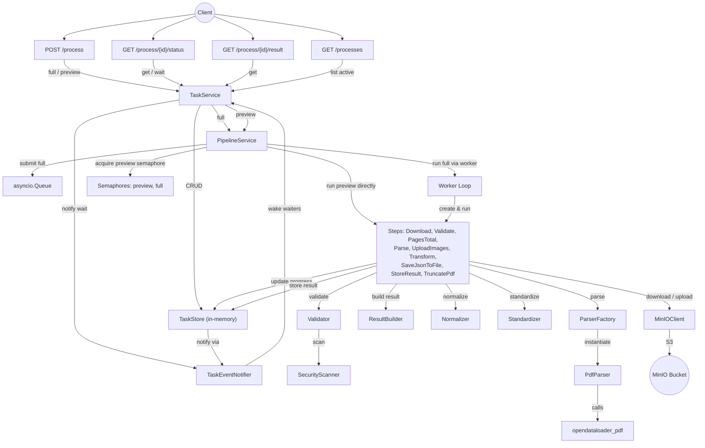

## **Сервис парсинга v1: архитектура, документация**

Parser Service – внутренний асинхронный микросервис на FastAPI для извлечения текста, таблиц и изображений PDF-документов из MinIO. На вход принимает запрос с ссылкой на файл в MinIO (`file_key`).
Поддерживает два режима: полная обработка (фоновая, с сохранением результата) и синхронный предпросмотр (ограничен по страницам). Результат возвращается в стандартизированном JSON-формате с метаданными, качеством распознавания и извлечёнными изображениями. Особенность сервиса в отсутстивии доступа к БД, состояние задач хранится в памяти (TTL 7 дней), longpoll на 15 секунд.

Стек:
Python 3.12.3
FastAPI – веб-фреймворк
MinIO (S3) – хранение файлов и изображений
aiobotocore – асинхронный S3-клиент
pypdf – чтение PDF и обрезка страниц
opendataloader_pdf – конвертация PDF → JSON/HTML/изображения
python-magic – MIME-тип по сигнатуре
OpenTelemetry + OTLP – трейсинг, метрики, JSON-логи
Pydantic Settings – конфигурация через env
YARA (опционально) – сигнатурный анализ вредоносных PDF


### **1\. Файловая архитектура и функции**

Ниже приведена структура проекта с описанием назначения каждого файла и основных функций.
```text
app/
├── main.py                # Точка входа, lifespan, инициализация DI, роутеры
├── config.py              # Настройки (Pydantic Settings, переменные окружения)
├── dependencies.py        # Фабрики сервисов (TaskService, PipelineService)
├── api/v1/                # HTTP-слой
│   ├── router.py          # Объединение эндпоинтов под /parser
│   ├── schemas.py         # Pydantic-схемы (запросы/ответы)
│   └── endpoints/         
│       ├── process.py     # POST /process (full/preview)
│       ├── status.py      # GET /process/{id}/status (long polling)
│       ├── result.py      # GET /process/{id}/result
│       └── processes.py   # GET /processes (активные задачи)
├── core/                  # Инфраструктура и общие утилиты
│   ├── task_models.py     # TaskInfo, TaskStatus
│   ├── task_store.py      # In-memory хранилище задач (TTL, блокировки, очистка)
│   ├── task_event_notifier.py # asyncio.Condition для уведомлений (long polling)
│   ├── minio_client.py    # Асинхронный клиент MinIO (скачивание/загрузка)
│   ├── validator.py       # Валидация файлов (размер, MIME, безопасность)
│   ├── security_scanner.py # Сканер PDF на опасные элементы (синхронный)
│   ├── retry.py           # Декоратор повторных попыток
│   ├── exception_handlers.py # Глобальные обработчики исключений (400, 422, 500)
│   ├── exceptions.py      # Кастомные исключения (с HTTP-кодами)
│   └── telemetry.py       # Настройка OpenTelemetry (трейсы, метрики, логи)
└── services/              # Бизнес-логика и доменные сервисы
    ├── pipeline_service.py    # Оркестратор: очередь full-задач, семафоры, запуск пайплайна
    ├── task_service.py        # Управление задачами (создание, получение, обновление)
    ├── result_builder.py      # Формирование финального JSON (build_result)
    ├── normalizer.py          # Обёртка сырого JSON парсера в контейнер
    ├── standardizer.py        # Преобразование во внутреннюю эталонную структуру
    ├── standardizer_factory.py # Фабрика стандартизаторов
    ├── parser_factory.py      # Фабрика парсеров (сейчас только PDF)
    ├── parsers/               # Реализации парсеров
    │   ├── base.py            # Абстрактный BaseParser, ParseResult
    │   └── pdf_parser.py      # Парсер PDF (opendataloader_pdf)
    └── pipeline/              # Пайплайн обработки
        ├── context.py         # ProcessingContext — данные между шагами
        ├── pipeline.py        # Класс Pipeline — последовательный запуск шагов
        └── steps.py           # Шаги: Download, Validate, PagesTotal, Parse,
                                # UploadImages, Transform (Normalize+Standardize),
                                # SaveJsonToFile, StoreResult, TruncatePdf
```
*Ключевые потоки:*
 - *Full*: запрос → создание задачи в task_store → постановка в очередь PipelineService._queue → воркер (с семафором на max_concurrent_full_pipelines) → создание Pipeline → выполнение шагов → результат в task_store.
 - *Preview*: запрос → синхронный вызов PipelineService.run_preview с семафором на max_concurrent_preview_tasks → Pipeline без загрузки картинок и сохранения в файл → возврат ResultResponse.
 - *Статус*: long polling через TaskEventNotifier (asyncio.Condition) с версионированием.
 - *Результат*: извлекается из task_info.result, нормализуется через _extract_result_data и возвращается в схеме ResultResponse.

*Архитектурные решения:*
1. Асинхронность: везде async/await, aiobotocore для MinIO, asyncio для очереди и семафоров.
2. DI: фабрики в dependencies.py, инициализация в lifespan.
3. Хранилище задач: in-memory с TTL, блокировками и эвикцией.
4. Параллельность: семафоры для full и preview, очередь для full.
5. Обработка ошибок: кастомные исключения с HTTP-кодами, глобальные хендлеры.
6. Логирование: единообразно, уровни DEBUG/INFO/WARNING/ERROR, без секретов.
7. Структура вывода: строго по спецификации (metadata, document, quality, errors, status).

### **2\. Схема взаимодействия (Mermaid)**


### **3\. Логика работы файлов и взаимодействия**
1. Архитектурные слои
Проект трёхуровневый с чётким разделением ответственности:

 - API слой (app/api/v1/):
Принимает HTTP-запросы, валидирует через Pydantic-схемы, передаёт управление сервисному слою.
Отвечает за сериализацию/десериализацию, коды статусов, обработку исключений (глобальные хендлеры).

 - Сервисный слой (app/services/):
Содержит бизнес-логику: TaskService — управление задачами (CRUD, ожидание изменений), PipelineService — оркестрация пайплайнов, очередь, семафоры.
Не содержит HTTP-специфичного кода.

 - Инфраструктурный слой (app/core/):
Внешние зависимости и утилиты: MinIO-клиент, валидация файлов, сканер безопасности, хранилище задач, телеметрия, ретраи.
Не зависит от бизнес-логики.

 - Модели данных (app/core/task_models.py, app/services/pipeline/context.py):
POCO-объекты для передачи состояния между слоями.

 - Пайплайн (app/services/pipeline/):
Конвейерная обработка документа: шаги (классы) выполняются последовательно, обмениваясь через ProcessingContext.

2. Жизненный цикл запроса (общий поток)
 - Входящий запрос → эндпоинт (FastAPI dependency injection получает TaskService и PipelineService).
 - Валидация схемы (Pydantic) — если ошибка, возвращается 422.
 - Разветвление по режиму (mode в запросе):
 - preview → синхронный вызов PipelineService.run_preview().
 - full → асинхронная постановка в очередь.

3. Full-режим (асинхронный)
Этапы:
 - TaskService.start_processing():
Проверяет, есть ли уже активная задача с таким task_id (через get_existing_task_response). Если есть — возвращает существующий ProcessResponse (идемпотентность).
Создаёт TaskInfo и сохраняет в TaskStore со статусом ACCEPTED.

 - PipelineService.submit_full_task():
Помещает задачу в asyncio.Queue (_queue), ограниченную max_full_queue_size.
Если очередь заполнена — выбрасывает asyncio.QueueFull, и эндпоинт возвращает 429.

 - Фоновый воркер (_worker_loop):
Постоянно извлекает задачи из очереди.
Захватывает семафор _full_semaphore (лимит параллельных full-пайплайнов).
Вызывает _run_full_pipeline_async, который создаёт ProcessingContext, строит пайплайн через Pipeline.create(mode="full") и выполняет _execute_pipeline().

 - Пайплайн full (шаги, последовательно):
 --- DownloadStep — скачивает файл из MinIO.
 --- ValidateStep — проверяет размер, MIME, безопасность (через Validator и SecurityScanner).
 --- PagesTotalStep — определяет количество страниц (через PyPDF), сохраняет в контекст и обновляет прогресс в TaskStore.
 --- ParseStep — вызывает фабрику парсеров, получает PdfParser, запускает opendataloader_pdf.convert (с таймаутом), получает сырой JSON и список временных путей изображений.
 --- UploadImagesStep — для full-режима: загружает каждое изображение в MinIO (хеш-именование), заменяет пути в JSON на image_key, удаляет временные файлы. Логирует только итог.
 --- TransformStep — нормализация (обёртка в контейнер) + стандартизация (преобразование в эталонную структуру согласно table.txt). Выполняется последовательно.
 --- SaveJsonToFileStep — если включена опция, сохраняет финальный JSON в ./output/task_{id}.json (структура идентична результату в хранилище).
 --- StoreResultStep — формирует финальный payload через build_result, проверяет размер, сохраняет в TaskStore со статусом COMPLETED, инициирует уведомление через TaskEventNotifier.
Уведомление — после любого обновления задачи (включая промежуточные шаги) вызывается notify_task_changed, пробуждая ожидающие long-polling запросы.
Ошибки — любой сбой в шагах перехватывается в _execute_pipeline, статус задачи устанавливается в FAILED, ошибка логируется, временные файлы очищаются.

4. Preview-режим (синхронный)
 - Вызов PipelineService.run_preview() захватывает _preview_semaphore (ограничение параллельных preview-запросов).
 - Создаётся ProcessingContext с track_progress=False (без обновлений в TaskStore).
 - Пайплайн создаётся с mode="preview" — шаги:
 - DownloadStep, ValidateStep, PagesTotalStep (только определение кол-ва страниц, без сохранения).
 - TruncatePdfStep — если max_pages меньше общего числа, обрезает PDF до max_pages страниц.
 - ParseStep — парсинг усечённого PDF.
 - TransformStep — нормализация + стандартизация (без загрузки изображений, так как UploadImagesStep пропускается при track_progress=False).
 - StoreResultStep — формирует результат через build_result, но не сохраняет в TaskStore (так как track_progress=False), а возвращает ResultResponse напрямую.
Ошибки пробрасываются как HTTP-исключения, таймаут контролируется preview_timeout.

5. Статус и long-polling
 - Эндпоинт GET /process/{id}/status вызывает TaskService.get_task().
 - Если задача в терминальном состоянии (COMPLETED/FAILED), возвращает статус немедленно.
 - Иначе получает current_version задачи (инкрементируется при каждом обновлении через TaskInfo.update()).
 - Вызывает TaskService.wait_for_change(), который через TaskEventNotifier.wait_for_task_change() ожидает изменения версии (asyncio.Condition с таймаутом).
 - При уведомлении или таймауте повторно получает задачу и возвращает статус.
Это реализует эффективный long-polling без лишних циклов.

6. Результат
 - Эндпоинт GET /process/{id}/result получает задачу из TaskStore.
 - Проверяет статус: FAILED → 500 с ошибкой, не COMPLETED → 409, result is None → 500.
 - Извлекает result (словарь), пропускает через _extract_result_data() для унификации (поддержка v1/v2 форматов).
 - Строит ResultMetadata и возвращает ResultResponse (с полями внутри metadata).
 - Логирует успех или ошибку.

7. Хранилище задач (TaskStore)
 - In-memory dict[int, TaskInfo].
 - Блокировки на уровне задачи (asyncio.Lock) для потокобезопасности.
 - TTL для завершённых задач (удаляются через фоновую очистку раз в час).
 - Эвикция старых завершённых задач при превышении лимита (удаляются самые старые по started_at).
 - TaskEventNotifier — отдельный класс, хранит asyncio.Condition и версии для каждой задачи.
 - Все операции (add, get, update, remove) асинхронны, возвращают coroutine.

8. Взаимодействие с внешними системами
 - MinIO — через MinIOClient (aiobotocore): скачивание/загрузка файлов, presigned URL, проверка/создание бакетов.
Валидация встроена (download_and_validate вызывает Validator.validate).
 -  Парсинг PDF — opendataloader_pdf (синхронная библиотека, запускается в ThreadPoolExecutor через run_in_executor). Таймаут контролируется parser_timeout.
 -  OpenTelemetry — настройка экспорта трейсов, метрик, логов в OTLP-эндпоинт. Добавляет trace_id и span_id в логи через фильтр.

9. Обработка ошибок
 - Кастомные исключения (наследники ParserServiceError) содержат HTTP-код, код ошибки, сообщение, детали.
 - Глобальные хендлеры в exception_handlers.py перехватывают:
 - ParserServiceError → возвращают JSON с ErrorResponse.
 - RequestValidationError → 422 с деталями.
 - Любое Exception → 500 с общим сообщением (скрывает детали).
В сервисном слое все ошибки логируются с exc_info=True, временные файлы очищаются, статус задачи переводится в FAILED.

10. Логирование и безопасность
Логирование единообразно: DEBUG — детали, INFO — успешные операции, WARNING — нештатные ситуации, ERROR/EXCEPTION — ошибки.
Секреты (токены, пароли) не логируются, используются переменные окружения.
Валидация безопасности: проверка Unicode-маскировки, JBIG2, опасных PDF-ключей, YARA-правил (опционально). Блокировка настраивается через переменные окружения.

11. Ключевые паттерны
 - Фабрики (ParserFactory, StandardizerFactory) — регистрация и создание экземпляров.
 - Стратегия — разные стандартизаторы в зависимости от parsing_schema.
 - Команда — каждый шаг пайплайна — отдельный класс с методом execute.
 - Наблюдатель — TaskEventNotifier для уведомлений об изменениях.
 - Очередь производитель-потребитель — для full-задач.
 - Семафоры — ограничение параллелизма.

12. Итоговая логическая цепочка
text
HTTP-запрос → API-эндпоинт → валидация схемы →
  (preview) → PipelineService.run_preview() → пайплайн preview → ResultResponse
  (full) → TaskService → TaskStore (сохранение) → PipelineService (очередь) →
    воркер → Pipeline full → шаги → загрузка изображений, трансформация →
    сохранение в TaskStore + уведомление → клиент получает статус/результат через long-polling или прямой запрос.
Всё завязано на асинхронность, инкапсуляцию и чёткие контракты между слоями. Код написан так, чтобы минимизировать связанность и упростить тестирование (DI через фабрики).


## **Эндпоинты**

| Метод | URL | Описание |
| :---- | :---- | :---- |
| POST | /api/v1/parser/process | Запуск обработки документа. Поддерживает два режима: \- mode=full — асинхронная полная обработка: задача ставится в очередь, возвращается 202 Accepted с task\_id и оценкой времени завершения. \- mode=preview — синхронный предпросмотр: обрабатываются только первые max\_pages страниц, возвращается ResultResponse (структура документа, без загрузки изображений в MinIO). Тело запроса (JSON): \- task\_id (int, обязательное) — идентификатор задачи. \- draft\_id (int, обязательное) — идентификатор черновика. \- file\_key (string, обязательное) — ключ файла в MinIO. \- mode (enum, по умолчанию "full") — "full" или "preview". \- max\_pages (int, обязательно для preview) — количество страниц для предпросмотра (1–100). \- options (object, опционально) — флаги extract\_tables, extract\_images (для preview оба должны быть false). |
| GET | /api/v1/parser/process/{task\_id}/status | Получение статуса задачи. Поддерживает long polling с таймаутом по умолчанию 15 секунд (параметр timeout в query). Возвращает StatusResponse с полями: \- task\_id \- status (принимает accepted, processing, completed, failed) \- progress\_percent (0–100) \- pages\_processed, pages\_total \- avg\_confidence (0.0–1.0) \- step, step\_detail (текущий этап пайплайна) \- started\_at, completed\_at (ISO 8601 с Z). |
| GET | /api/v1/parser/process/{task\_id}/result | Получение финального результата обработки. Доступен только для задач со статусом completed. Возвращает ResultResponse с полной структурой документа (обёрнутой в metadata согласно спецификации). Если задача ещё не завершена — возвращает 409 Conflict. Если завершена с ошибкой — возвращает 500 с error.code. |
| GET | /api/v1/parser/processes | Список активных процессов. Возвращает массив задач со статусами accepted или processing. Поля: task\_id, status, progress\_percent, pages\_processed, pages\_total, started\_at. |

## **Коды ошибок**

| Код | HTTP статус | Описание |
| :---- | :---- | :---- |
| `FILE_NOT_FOUND` | 404 | Файл с указанным `file_key` не найден в MinIO. |
| `FILE_TOO_LARGE` | 413 | Размер файла превышает лимит (500 МБ). |
| `UNSUPPORTED_FORMAT` | 415 | MIME-тип файла не поддерживается (разрешён только `application/pdf`). |
| `PARSER_FAILED` | 500 | Критическая ошибка при парсинге (внутреннее исключение, таймаут, отсутствие JSON-результата). |
| `STORAGE_ERROR` | 502 | Ошибка доступа к MinIO (сетевые проблемы, таймаут, неудачное создание бакета). |
| `TASK_NOT_FOUND` | 404 | Задача с указанным `task_id` не найдена в хранилище (или уже удалена). |
| `TASK_EXPIRED` | 410 | Результат задачи удалён по истечении TTL (по умолчанию 7 дней). |
| `VALIDATION_ERROR` | 422 | Ошибка валидации входных данных (например, отсутствие `max_pages` в preview, запрещённые `options`). |
| `INTERNAL_SERVER_ERROR` | 500 | Необработанное исключение (generic fallback). |
| `CANCELLED` | 500 | Задача отменена при graceful shutdown (возвращается в `update_task`). |
| `PIPELINE_TIMEOUT` | 500 | Превышен общий таймаут пайплайна (`pipeline_timeout`). |
| `EMPTY_RESULT` | 500 | Задача завершена, но поле `result` отсутствует. |
| `TASK_NOT_COMPLETED` | 409 | Попытка получить результат до завершения задачи (статус не `completed`). |

*Примечание:* Коды `CANCELLED`, `PIPELINE_TIMEOUT`, `EMPTY_RESULT` возвращаются через внутренние механизмы обновления задачи и не описаны в `exceptions.py`, но могут появляться в ответах при соответствующих сценариях.  