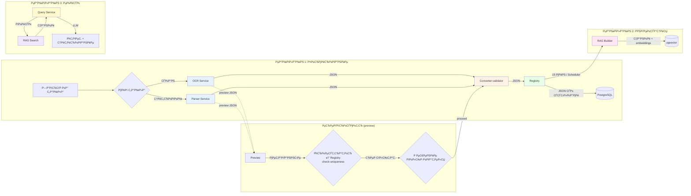
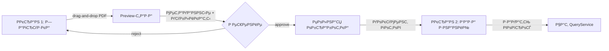

# PKB Neuroassistant — Документация

Система семантического поиска и анализа нормативно-технической документации (НТД) для проектно-конструкторского бюро.
Позволяет загружать документы (ГОСТы, ОСТы, чертежи, спецификации), распознавать их, структурировать, индексировать
и выполнять поиск на естественном языке с цитированием источников.

---

## 📁 Структура документации

```
docs/
├── README.md                         # ← Этот файл (навигация)
в”‚
├── api/                              # API-спецификации микросервисов
│   ├── common_api.md                 #   Общие положения (форматы, auth, rate limits, health check, edge cases)
│   ├── gateway_service_api.md        #   Gateway (JWT, RBAC, маршрутизация)
│   ├── orchestrator_service_api.md   #   Orchestrator (координатор пайплайнов)
в”‚   в”њв”Ђв”Ђ auth_service_api.md           #   Auth Service (JWT, users, roles)
│   ├── query_service_api.md          #   Query Service (чат, поиск, генерация ответов)
│   ├── registry_service_api.md       #   Registry (реестр документов, классификаторы, терминология)
│   ├── integration_service_api.md    #   Integration Service (файлы, экспорт в Меридиан)
│   ├── converter_validator_service_api.md  #   Converter-validator (конвертация, валидация)
│   ├── ocr_service_api.md            #   OCR Service (распознавание сканов)
│   ├── parser_service_api.md         #   Parser Service (парсинг цифровых PDF/DOC)
│   ├── analyse_service_api.md        #   Analyse Service (анализ проектных решений)
│   ├── rag_builder_service_api.md    #   RAG Builder (чанкинг, embeddings, индексация)
│   ├── rag_search_service_api.md     #   RAG Search (гибридный поиск)
│   └── validate_service_api.md       #   (deprecated — см. converter_validator_service_api.md)
в”‚
├── pipelines/                        # Логические пайплайны обработки документов
│   ├── overview.md                   #   Общая схема, FSM, матрица ответственности
│   ├── pipeline1-formation.md        #   Пайплайн 1: Формирование документа (preview + full)
│   ├── pipeline1-formation_detail.md #   Пайплайн 1: детальное описание (microservices, field mapping)
│   ├── pipeline2-indexation.md       #   Пайплайн 2: Индексация (RAG Builder)
│   └── pipeline3-search.md           #   Пайплайн 3: Поиск и генерация ответов
в”‚
├── database/                         # Модели базы данных
│   └── db_diagrams.md                #   ER-диаграмма базы данных
в”‚
├── schema/                           # JSON-схемы данных (контракты между сервисами)
│   ├── diagrams.md                   #   Диаграммы JSON-файлов (документная модель)
│   ├── schema_parser_result.json     #   Результат Parser (сырой)
│   ├── schema_converter_result.json  #   Результат Converter-validator
в”‚   в”њв”Ђв”Ђ schema_converter_preview.json  #   Preview РѕС‚ Converter-validator
│   ├── schema_registry_for_rag.json  #   JSON для Registry / RAG Builder
в”‚
├── audit/                            # Аудиты и анализ синхронизации
│   ├── audit_06_06_2026.md           #   Аудит документации от 06.06.2026
│   └── ui_gateway_sync_analysis.md   #   Анализ UI/Gateway-синхронизации
в”‚
├── rules/                            # Правила и чек-листы
│   └── check_rule.md                 #   Чек-лист аудита документации
в”‚
├── specifications/                   # Технические спецификации
│   ├── parsing_specifications.md       #   Спецификация парсинга
│   ├── normalizer_specification.md     #   Нормализатор: алгоритмы дедупликации и бизнес-ключ
в”‚   в”њв”Ђв”Ђ cas_storage_specification.md    #   CAS (Content-Addressable Storage)
│   ├── purgatory_scenario.md           #   Сценарии использования
│   ├── mks_oks_classifier.csv          #   Справочник кодов МКС/ОКС (CSV)
│   ├── classifier_roots.csv            #   Корневые узлы классификаторов (CSV)
│   └── справочник_предметных_областей_ПКБ.md  #   Справочник разделов ПКБ
в”‚
├── glossary.md                       # Глоссарий терминов и сокращений
в”њв”Ђв”Ђ specificity.md                    # ––урнал аномалий Рё трудных моментов
└── analyse_alternative_project.md   # Анализ альтернативного проекта KB (13.06)
```

> 📂 **Исторические обсуждения и протоколы встреч** хранятся в директории [`../docs_discussions/`](../docs_discussions/) на уровне корня проекта.

---

## 🏗 Архитектура (обзор)


```mermaid
graph LR
    subgraph "Пайплайн 1: Формирование"
        direction TB
        Upload[Загрузка файла] --> Type{Тип файла}
        Type -->|скан| OCR[OCR Service]
        Type -->|цифровой| Pars[Parser Service]
        OCR -->|JSON| CV[Converter-validator]
        Pars -->|JSON| CV
        CV -->|JSON| Reg[Registry]
        Reg -->|JSON со ссылками| DB[(PostgreSQL)]
    end

    subgraph "Предпросмотр (preview)"
        OCR -.->|preview JSON| Preview
        Pars -.->|preview JSON| Preview
        Preview -->|метаданные| Uniq{Оркестратор → Registry<br/>check-uniqueness}
        Uniq -->|результат| UI{Решение пользователя}
        UI -->|proceed| CV
    end

    subgraph "Пайплайн 2: Индексация"
        Reg -->|15 РјРёРЅ / Scheduler| RAGi[RAG Builder]
        RAGi -->|чанки + embeddings| Vec[(pgvector)]
    end

    subgraph "Пайплайн 3: Поиск"
        Q[Query Service] -->|РїРѕРёСЃРє| RAGs[RAG Search]
        RAGs -->|чанки| Q
        Q -->|LLM| Answer[Ответ + цитирование]
    end

    style OCR fill:#e6f3ff
    style Pars fill:#e6f3ff
    style CV fill:#fff3e6
    style Reg fill:#e6ffe6
    style RAGi fill:#ffe6f3
    style RAGs fill:#f3e6ff
    style Q fill:#fffacd
```

### Пайплайны

| № | Название | Описание |
|---|----------|----------|
| **1** | **Формирование документа** | Загрузка → распознавание (OCR/Parser) → конвертация/валидация → проверка уникальности → запись в Registry. Двухфазный: preview (быстрая проверка) + full (полная обработка). **Duplicate-детекция** выполняется Оркестратором через `POST /registry/documents/check-uniqueness` на обоих этапах. |
| **2** | **Индексация** | Фоновый Scheduler (каждые 15 мин) запускает RAG Builder для документов со статусом `created`. Чанкинг → embeddings → pgvector. |
| **3** | **Поиск** | Независимый: сообщение пользователя → обогащение терминами → RAG Search (гибридный dense+sparse) → LLM-генерация → цитирование. |

### Ключевые решения

- **Оркестратор** управляет пайплайнами 1 и 2, ведёт собственный журнал (preview-артефакты, история шагов). Статусы документов обновляет через Registry API.
- **JSON-контейнеры** передаются между сервисами как непрозрачные артефакты — структура известна только сервисам.
- **Изоляция БД** — OCR/Parser не имеют доступа к БД, Converter-validator только читает (справочники), Registry пишет, RAG Builder пишет, RAG Search читает.
- **Longpoll** (15с) для всех асинхронных операций.

### 🖥 Архитектура экранов UI (Спринт 1)

Web UI состоит из двух основных экранов, соответствующих циклу работы с документами:

| Экран | Назначение | Ключевые элементы |
|-------|-----------|-------------------|
| **1. Загрузка документа** | Загрузка файла, просмотр preview, принятие решения по черновику (approve/reject) | Drag-and-drop зона, статус-бар обработки, карточка preview-метаданных, список дубликатов, кнопки «Утвердить» / «Отклонить», история черновиков (`GET /drafts?draft_id=... & document_key=...`) |
| **2. База знаний** | Просмотр прошедших обработку документов, навигация по категориям, поиск | Дерево категорий (Спринт 2), сетка/список документов, фильтры (тип, дата, статус), карточка документа с метаданными, кнопка «Задать вопрос» (переход в чат) |

**Поток пользователя:**


```mermaid
flowchart LR
    Upload[Экран 1: Загрузка] -->|drag-and-drop PDF| Preview[Preview-фаза]
    Preview -->|метаданные + дубликаты| Decision{Решение}
    Decision -->|approve| Processing[Полная обработка]
    Decision -->|reject| Upload
    Processing -->|документ готов| KB[Экран 2: База знаний]
    KB -->|задать вопрос| Chat[Чат QueryService]
```

> **Примечание:** пользовательские категории документов (many-to-many) — спроектированы. API и модель данных документированы в [`registry_service_api.md`](api/registry_service_api.md#группа-categories) и [`db_diagrams.md`](database/db_diagrams.md#13-категории-документов-registrycategories-registrydocument_categories). Реализация — приоритет Спринта 3.

---

## 🔧 Стек технологий

| Компонент | Технология |
|-----------|-----------|
| Язык | Python 3.13 |
| API-фреймворк | FastAPI |
| Очереди задач | Celery + Redis |
| База данных | PostgreSQL 15+ |
| Векторный индекс | pgvector 0.7+ |
| Файловое хранилище | MinIO (CAS-пути) |
| Аутентификация | JWT (access + refresh tokens) |
| Контейнеризация | Docker, Docker Compose |

---

## 📡 Сервисы и порты

| Сервис | Порт | Пайплайн | Доступ к БД |
|--------|------|----------|-------------|
| Gateway | 8080 | 1, 2, 3 | Нет (только маршрутизация) |
| Orchestrator | 8081 | 1, 2 | Свой журнал PostgreSQL    |
| Auth | 8082 | — | Читает |
| Query Service | 8083 | 3 | Читает/Пишет |
| Registry | 8084 | 1 | Пишет |
| Integration | 8085 | — | Читает/Пишет |
| Converter-validator | 8086 | 1 | Читает |
| Parser | 8087 | 1 | Нет |
| OCR | 8088 | 1 | Нет |
| Analyse | 8089 | — | Читает |
| RAG Builder | 8090 | 2 | Пишет |
| RAG Search | 8091 | 3 | Читает |

---

## 🚀 Быстрый старт (для интегратора)

> **Примечание:** API — внутренний, доступен только через Gateway (:8080).
> Примеры ниже — для вызовов из Web UI (серверный код) по внутренней сети.

```bash
# Получение токена
curl -X POST http://127.0.0.1:8080/api/v1/auth/token \
  -H "Content-Type: application/json" \
  -d '{"username": "user", "password": "pass"}'
```

```bash
# Загрузка документа (асинхронно) — возвращает draft_id
curl -X POST http://127.0.0.1:8080/api/v1/drafts \
  -H "Authorization: Bearer <token>" \
  -F "file=@document.pdf"
# Ответ: { "draft_id": 420000, "task_id": 420000, "status": "uploaded", ... }

# Статус preview черновика (longpoll)
curl -X GET http://127.0.0.1:8080/api/v1/drafts/{draft_id}/preview/status

# Принять решение по черновику
curl -X PATCH http://127.0.0.1:8080/api/v1/drafts/{draft_id}/decide \
  -H "Authorization: Bearer <token>" \
  -H "Content-Type: application/json" \
  -d '{"action": "approve"}'

# Статус документа после завершения черновика
curl -X GET http://127.0.0.1:8080/api/v1/documents/{document_id}/status

# РџРѕРёСЃРє
curl -X POST http://127.0.0.1:8080/api/v1/text/search \
  -H "Authorization: Bearer <token>" \
  -H "Content-Type: application/json" \
  -d '{"text": "толщина обшивки ледового пояса"}'
```

---

## 📌 Последние изменения документации

| Дата | Изменение |
|------|-----------|
| 04.06.2026 | **Методика экспериментов RAG**: полный перечень параметров, матрица запусков (3 фазы), метрики, псевдокод утилиты. См. [`../docs_discussions/features/rag_experiments_methodology.md`](../docs_discussions/features/rag_experiments_methodology.md). |
| 04.06.2026 | **Переход на bigint**: все ID (`task_id`, `session_id`, `message_id`, `document_id`, `version_id`) — bigint (sequence). |
| 04.06.2026 | **bbox**: нормализован [0,1] на всех этапах. `common_api.md` исправлен. |
| 04.06.2026 | **UUID → bigint**: JSON-примеры во всех API-файлах синхронизированы с bigint-спецификациями. |
| 04.06.2026 | Добавлены `specificity.md` (журнал аномалий) и `plans/` в структуру документации. |
| 04–05.06.2026 | **Полная синхронизация документации Спринта 1**: все API, схемы, ER-диаграмма, глоссарий и пайплайны приведены к bigint; исправлены единицы bbox; `glossary.md` дополнен (`comparison_id`, `batch_id`, `Проект`); структура `docs/README.md` исправлена; UUID в `registry_service_api.md` заменены на bigint; `diagrams.md` и спринт-план актуализированы. См. `specificity.md` A1–A13 и `plans/sprint1_04_06_10_06.md`. |
| 05.06.2026 | **Новый функционал**: группа `drafts` в API Оркестратора (5 эндпоинтов), FSM черновиков в `pipeline1-formation.md`, архитектура двух экранов UI (Загрузка / База знаний), маршрут `/api/v1/drafts/*` в Gateway. |
| 05.06.2026 | **Комплексный аудит документации**: проверка API (13 файлов), пайплайнов (5 файлов), схемы данных (6 файлов), кросс-проверка, security review, тупиковые состояния. Найдено 112+ проблем (23 критических). Результаты: `docs/specificity.md` (аномалии A15–A34, S1–S12, C1–C16), `docs/database/db_audit_report.md` (43 замечания). |
| 12.06.2026 | **Анализ UI/Gateway-синхронизации**: разбор 10 вопросов к backend, 5 UI-задач, ожидающих подтверждения контрактов, и 4 веток-кандидатов на удаление. Результаты: `docs/audit/ui_gateway_sync_analysis.md`. Добавлены аномалии A25–A33 в `specificity.md`. |
| Текущая | **Схема БД**: все FK на bigint, добавлены `chat.projects`, `project_id`, `document_type`. |
| v3.0 | Разделение RAG-сервиса на Builder и Search. |
| v2.3 | Двухфазный пайплайн (preview + full). |

---

## 🧩 Сервисы (микросервисная архитектура)

---

### Gateway Service (API Gateway)
**РџРѕСЂС‚:** `8080`
**Документация:** [`docs/api/gateway_service_api.md`](api/gateway_service_api.md)

**Назначение:**
Внутренний API Gateway, к которому обращается **Web UI** для выполнения **аутентификации (JWT)**, **проверки прав доступа (RBAC)** и **маршрутизации** вызовов к внутренним сервисам. Gateway не имеет внешнего порта — наружу через Nginx доступен только Web UI.

**Схема подключения:**
```
Внешняя сеть → Nginx → Web UI → Gateway (:8080) → Внутренние сервисы (:8081–8091)
```

**Основные функции:**
- Проверка JWT Bearer-токена — невалидный/отсутствующий токен → `401`
- RBAC — проверка прав доступа на основе роли → недостаточно прав → `403`
- Маршрутизация запросов к внутренним сервисам (Auth, Orchestrator, Query, Registry и др.)
- Иденпотентность для критичных POST-операций (`Idempotency-Key`, TTL: 1 час)
- Единый формат ошибок для всех HTTP-исключений
- Health-check endpoint `/api/v1/system/health` с агрегированным статусом всех сервисов
- CORS и `X-Process-Time` заголовок

**Контроль доступа:** Gateway — внутренний сервис, к нему обращается только **Web UI** (который раздаётся через Nginx). Gateway проверяет JWT-токен и права доступа (RBAC) перед тем, как запрос попадёт к внутренним сервисам. Без валидного токена — `401`, без прав на операцию — `403`.

---

### Оркестратор (Orchestrator Service)
**РџРѕСЂС‚:** `8081`
**Документация:** [`docs/api/orchestrator_service_api.md`](api/orchestrator_service_api.md)
**Описание также в:** [`pipelines/overview.md`](pipelines/overview.md), [`pipelines/pipeline1-formation.md`](pipelines/pipeline1-formation.md), [`pipelines/pipeline1-formation_detail.md`](pipelines/pipeline1-formation_detail.md), [`pipelines/pipeline2-indexation.md`](pipelines/pipeline2-indexation.md)

**Назначение:**
Координатор пайплайнов 1 и 2. Оркестрация пайплайна, ведение этапов задачи с промежуточными данными сервисов, вызов Registry для черновиков. Управляет последовательностью вызовов сервисов, передаёт JSON-контейнеры между этапами, ведёт журнал обработки, реализует двухфазную схему preview → решение → full.

**Ключевой принцип:** загрузка документа всегда проходит через черновик (draft) — без черновика документ не может быть загружен или завершён с записью в Registry.

**Основные функции:**
- Приём и валидация загружаемых файлов с обязательным созданием task + записи черновика в Registry, вычисление SHA-256, сохранение в MinIO
- Управление черновиками (drafts): создание (точка входа), preview, решение, жизненный цикл — вызов Registry internal API для CRUD операций
- Запуск preview-фазы (OCR/Parser → Converter-validator → проверка уникальности)
- Оркестрация full-фазы: завершение черновика → распознавание → конвертация → проверка уникальности → запись в Registry
- Ведение этапов задачи (pipeline.task_steps): запись входных/выходных данных каждого сервиса (OCR/Parser, Converter-validator)
- Управление статусной моделью FSM документа
- Longpoll-механизм для асинхронных операций
- Health check и метрики (`/monitor/*`)
- Журналирование всех этапов обработки (собственный журнал, не БД Registry)

### Сервис аутентификации (Auth Service)
**РџРѕСЂС‚:** `8082`
**Документация:** [`docs/api/auth_service_api.md`](api/auth_service_api.md)
**Описание также в:** _(независимый сервис, не участвует в пайплайнах)_

**Назначение:**
Обеспечивает аутентификацию пользователей, управление учётными записями, ролями и правами доступа (RBAC).

**Основные функции:**
- Выдача JWT-токенов (access + refresh) через `POST /auth/token`
- Валидация токенов для внутренних сервисов (`POST /internal/auth/validate`)
- Профиль текущего пользователя (`GET /auth/me`)
- CRUD пользователей, ролей и прав (`/admin/users`, `/admin/roles`)
- Аудит действий пользователей (`GET /admin/audit`)
- Маскировка PII-полей (пароли, токены) в логах

---

### Сервис диалогов и поиска (Query Service)
**РџРѕСЂС‚:** `8083`
**Документация:** [`docs/api/query_service_api.md`](api/query_service_api.md)
**Описание также в:** [`pipelines/pipeline3-search.md`](pipelines/pipeline3-search.md)

**Назначение:**
Точка входа для пользовательских запросов: чат-сессии, текстовый поиск, вопросно-ответная система с генерацией ответа через LLM и обогащением цитирований.

**Основные функции:**
- Управление чат-сессиями (создание, редактирование, удаление, экспорт)
- Приём сообщений, обогащение запроса через словарь терминов Registry
- Вызов RAG Search для получения релевантных чанков
- Формирование контекста и генерация ответа через LLM
- Обогащение цитирований machine-readable идентификаторами (`document_id`, `section_id`)
- Сохранение истории чата и сбора обратной связи
- Longpoll-механизм для асинхронного ожидания ответа
- Текстовый поиск (`POST /text/search`) и вопрос-ответ (`POST /text/ask`)

---

### Сервис реестра документов (Registry Service)
**РџРѕСЂС‚:** `8084`
**Документация:** [`docs/api/registry_service_api.md`](api/registry_service_api.md)
**Описание также в:** [`pipelines/pipeline1-formation.md`](pipelines/pipeline1-formation.md), [`pipelines/pipeline1-formation_detail.md`](pipelines/pipeline1-formation_detail.md), [`database/db_diagrams.md`](database/db_diagrams.md)

**Назначение:**
Центральное хранилище нормативно-справочной информации (НСИ): карточки документов, классификаторы (МКС, ОКСТУ, УДК), терминология, данные черновиков (drafts). На этапе Формирования документа **пишет** данные в БД, на этапе Валидации **читает** справочники.

**Основные функции:**
- Управление данными черновиков (drafts): хранение, статусы, метаданные
- Ведение реестра документов: создание, обновление, история статусов, цепочки преемственности
- Сегментация документа на секции (`registry.document_sections`)
- Иерархический справочник классификаторов (CRUD, импорт, дерево, неизвестные коды)
- Реестр терминов с нормализацией, синонимами и поиском
- Быстрая проверка уникальности документа по метаданным (`POST /registry/documents/check-uniqueness`)
- Экспорт и массовый импорт документов
- Статистика по документам, классификаторам, терминологии

---

### Сервис конвертации и валидации (Converter-validator Service)
**РџРѕСЂС‚:** `8086`
**Документация:** [`docs/api/converter_validator_service_api.md`](api/converter_validator_service_api.md)
**Описание также в:** [`pipelines/pipeline1-formation.md`](pipelines/pipeline1-formation.md), [`pipelines/pipeline1-formation_detail.md`](pipelines/pipeline1-formation_detail.md), [`schema/schema_converter_result.json`](schema/schema_converter_result.json), [`schema/schema_converter_preview.json`](schema/schema_converter_preview.json)

**Назначение:**
Принять сырые извлечённые данные, полученные от OCR или Parser, и превратить их в полноценный структурированный документ, полностью готовый к сохранению в базе данных. Не сохраняет данные в БД — только готовит структурированное представление.

**Основные функции:**
- **Построение иерархии** — преобразование плоских блоков в структуру разделов, подразделов, заголовков, объединение таблиц, разорванных на страницах
- **Извлечение метаданных** — обозначение, наименование, тип, даты, редакция (LLM + эвристики)
- **Распознавание перекрёстных ссылок** — нормализация ссылок на ГОСТ, ТУ и другие документы
- **Валидация структуры и полноты** — проверка соответствия целевой схеме документа
- **Preview API** — легковесные эндпоинты для быстрого извлечения первичных метаданных из первых N страниц (без полного цикла валидации)
- **Классификация** — отнесение документа к определённой категории, типу или классу
- **Выстраивание связей** — установка связей с другими документами в базе (линковка, построение графа отношений)
- **Использование LLM** — для построения иерархии, классификации, нормализации структуры и сложных метаданных

---

### Сервис парсинга (Parser Service)
**РџРѕСЂС‚:** `8087`
**Документация:** [`docs/api/parser_service_api.md`](api/parser_service_api.md)
**Описание также в:** [`pipelines/pipeline1-formation.md`](pipelines/pipeline1-formation.md), [`pipelines/pipeline1-formation_detail.md`](pipelines/pipeline1-formation_detail.md), [`schema/schema_parser_result.json`](schema/schema_parser_result.json)

**Назначение:**
Извлечение текстовой структуры из цифровых PDF, DOC, DOCX и других офисных форматов с текстовым слоем (без OCR). Полная изоляция от БД.

**Основные функции:**
- Разбор цифровых документов с текстовым слоем
- Извлечение плоского массива блоков (текст, таблицы, изображения, формулы)
- Сохранение бинарных объектов в файловое хранилище (через `fileKey`)
- Preview-режим: обработка только первых N страниц без сохранения бинарных объектов (поле `mode="preview"` в `POST /parser/process`); при недоступности постраничного парсинга возвращается полный документ с флагом `preview_not_supported: true`
- Оценка качества распознавания (confidence)
- Единый JSON-контракт выходных данных с OCR-сервисом

---

### Сервис OCR-распознавания (OCR Service)
**РџРѕСЂС‚:** `8088`
**Документация:** [`docs/api/ocr_service_api.md`](api/ocr_service_api.md)
**Описание также в:** [`pipelines/pipeline1-formation.md`](pipelines/pipeline1-formation.md), [`pipelines/pipeline1-formation_detail.md`](pipelines/pipeline1-formation_detail.md)

**Назначение:**
Оптическое распознавание отсканированных изображений и фотографий документов (JPEG, PNG, TIFF), а также PDF без текстового слоя. Полная изоляция от БД.

**Основные функции:**
- Распознавание сканов, изображений и нефоточитаемых PDF
- Очистка и нормализация изображений (улучшение качества, ориентация)
- Извлечение плоского массива блоков (текст, таблицы, фигуры, формулы)
- Сохранение бинарных объектов в файловое хранилище (через `fileKey`)
- Preview-режим: быстрая обработка первых N страниц без сохранения бинарных объектов
- Оценка качества распознавания (confidence, per-page)
- Единый JSON-контракт выходных данных с Parser-сервисом

---

### Сервис анализа проектных решений (Analyse Service)
**РџРѕСЂС‚:** `8089`
**Документация:** [`docs/api/analyse_service_api.md`](api/analyse_service_api.md)
**Описание также в:** _(независимый сервис, не участвует в основных пайплайнах)_

> ⏸️ **Заморожен** — сервис спроектирован, но не разрабатывается в текущих спринтах. Решение о старте разработки будет принято после стабилизации Пайплайна 1.

**Назначение (проектное):**
Сопоставление проектных данных из спецификаций, чертежей и расчётов с нормативными требованиями (ГОСТы, Правила РС). Выполняет длительные операции анализа.

**Основные функции (проектные):**
- **Сопоставление норм и проекта** (`POST /analyse/compare`) — сравнение значений из проектного документа с нормативными требованиями
- **Пакетное сравнение** (`POST /analyse/compare/batch`) — массовое сопоставление пар фрагментов
- **Арифметический движок** (`POST /analyse/calculate`) — вычисления на основе формул с контекстом
- **Рекомендации по исправлению** (`POST /analyse/recommend`) — генерация предложений по устранению несоответствий
- Асинхронная обработка с longpoll-ожиданием результата

---

### Сервис построения индекса (RAG Builder Service)
**РџРѕСЂС‚:** `8090`
**Документация:** [`docs/api/rag_builder_service_api.md`](api/rag_builder_service_api.md)
**Описание также в:** [`pipelines/pipeline2-indexation.md`](pipelines/pipeline2-indexation.md), [`schema/schema_registry_for_rag.json`](schema/schema_registry_for_rag.json)

**Назначение:**
Построение векторного индекса для семантического поиска. Запускается фоновым Scheduler'ом (каждые 15 мин) для документов, успешно прошедших Пайплайн 1. **Пишет** данные в БД (pgvector).

**Основные функции:**
- Приём плоского JSON с секциями от Registry
- **Чанкование** — разбиение секций на семантические фрагменты (до 512 токенов) с учётом protected spans
- **Вычисление эмбеддингов** — векторные представления для каждого текстового и табличного чанка
- **Построение векторного индекса** — сохранение чанков, эмбеддингов и индексов в pgvector
- Удаление чанков документа из индекса (`DELETE /rag/build/{doc_id}`)
- Longpoll-механизм для отслеживания статуса индексации

---

### Сервис поиска по индексу (RAG Search Service)
**РџРѕСЂС‚:** `8091`
**Документация:** [`docs/api/rag_search_service_api.md`](api/rag_search_service_api.md)
**Описание также в:** [`pipelines/pipeline3-search.md`](pipelines/pipeline3-search.md)

**Назначение:**
Гибридный поиск релевантных чанков по проиндексированным документам. Отвечает только за поиск и выдачу чанков — без генерации ответа LLM. **Читает** данные из БД.

**Основные функции:**
- **Гибридный поиск** (dense + sparse + pg_trgm) с реранжированием через Reciprocal Rank Fusion (RRF)
- Поддержка трёх режимов: `hybrid`, `sparse`, `dense`
- Фильтрация по типу документа, диапазону дат
- Возврат сырых чанков с полным содержимым, метаданными (`document_id`, `section_id`, `page`, `clause`) и оценкой релевантности (`score`)
- Реранжирование результатов (опционально)

---

### Сервис интеграции (Integration Service)
**РџРѕСЂС‚:** `8085`
**Документация:** [`docs/api/integration_service_api.md`](api/integration_service_api.md)
**Описание также в:** _(вспомогательный сервис, не участвует в основных пайплайнах)_

**Назначение:**
Управление файлами и интеграция с внешними системами (в частности, экспорт в ИС «Меридиан»).

**Основные функции:**
- Загрузка, получение и удаление файлов (`/files/*`)
- Экспорт структурированных данных в ИС «Меридиан» (`POST /meridian/export`)
- Проверка доступности внешних систем (`GET /external/status`)

---

## 📚 Подробнее

| Раздел | Где искать |
|--------|-----------|
| **Общая документация** | |
| API-спецификации (все эндпоинты) | [`docs/api/`](api/) |
| Gateway Service (JWT, RBAC, маршрутизация) | [`docs/api/gateway_service_api.md`](api/gateway_service_api.md) |
| Формат ошибок, rate limits, health check, edge cases | [`docs/api/common_api.md`](api/common_api.md) |
| ER-диаграмма и типы данных | [`docs/database/db_diagrams.md`](database/db_diagrams.md) |
| **Пайплайны** | |
| FSM жизненного цикла документа, матрица ответственности | [`docs/pipelines/overview.md`](pipelines/overview.md) |
| Пайплайн 1: Формирование (preview + full) | [`docs/pipelines/pipeline1-formation.md`](pipelines/pipeline1-formation.md) |
| Пайплайн 1: Детальное описание микросервисов, field mapping | [`docs/pipelines/pipeline1-formation_detail.md`](pipelines/pipeline1-formation_detail.md) |
| Пайплайн 2: Индексация (RAG Builder) | [`docs/pipelines/pipeline2-indexation.md`](pipelines/pipeline2-indexation.md) |
| Пайплайн 3: Поиск и генерация ответов | [`docs/pipelines/pipeline3-search.md`](pipelines/pipeline3-search.md) |
| **Спецификации** | |
| Спецификация парсинга для разработчиков | [`docs/specifications/parsing_specifications.md`](specifications/parsing_specifications.md) |
| **Справочники** | |
| Глоссарий терминов и сокращений | [`docs/glossary.md`](glossary.md) |
| **JSON-схемы (контракты)** | |
| Структуры данных (диаграммы) | [`docs/schema/diagrams.md`](schema/diagrams.md) |
| Результат Parser (сырой) | [`docs/schema/schema_parser_result.json`](schema/schema_parser_result.json) |
| Результат Converter-validator | [`docs/schema/schema_converter_result.json`](schema/schema_converter_result.json) |
| Preview РѕС‚ Converter-validator | [`docs/schema/schema_converter_preview.json`](schema/schema_converter_preview.json) |
| JSON для Registry / RAG Builder | [`docs/schema/schema_registry_for_rag.json`](schema/schema_registry_for_rag.json) |

