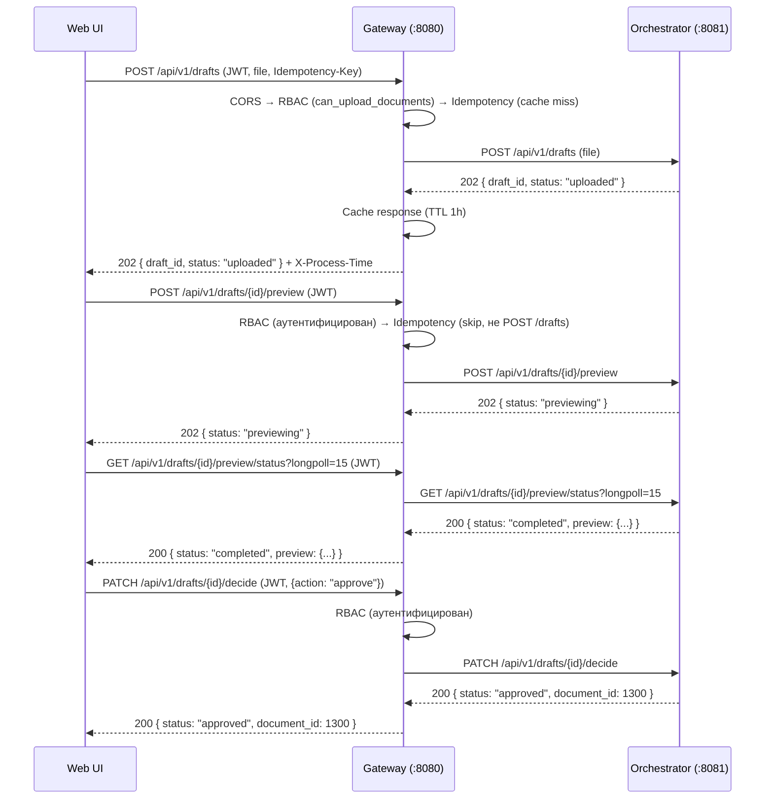
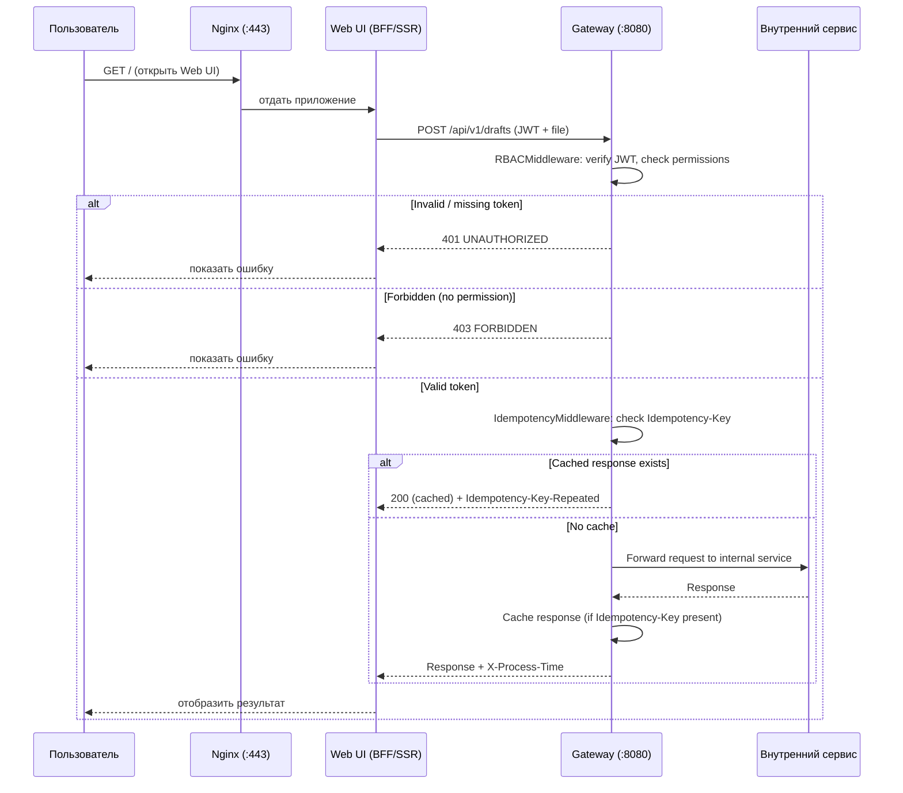

## API Gateway Service (gateway:8080)

Внутренний API Gateway, к которому обращается **Web UI** для выполнения **аутентификации (JWT)**, **проверки прав доступа (RBAC)**, обеспечения **иденпотентности** для критичных операций и **маршрутизации** вызовов к внутренним сервисам.

**Архитектура подключения:**
```
Внешняя сеть → Nginx → Web UI → Gateway (:8080) → Внутренние сервисы
```

Gateway — **внутренний сервис**, не имеет внешнего порта. Наружу через Nginx доступен только **Web UI**. Gateway вызывается исключительно из Web UI (серверный код UI или BFF).

**Базовый URL (внутренний)**: `http://127.0.0.1:8080/api/v1`

---

### Функциональность Gateway

| Функция | Описание |
|---------|----------|
| **Аутентификация** | Проверка JWT Bearer-токена. Невалидный/отсутствующий токен → `401` для защищённых эндпоинтов; анонимный доступ только к `/auth/*` и `/system/health` |
| **RBAC** | Проверка прав доступа на основе роли и permissions пользователя. Матрица доступа — см. [common_api.md](common_api.md#матрица-доступа-rbac) |
| **Маршрутизация** | Проксирование запросов к внутренним сервисам: Auth, Orchestrator, Query, Registry, Integration и др. |
| **Иденпотентность** | Кеширование ответов `POST` для `/drafts*` и `/chat*` по заголовку `Idempotency-Key` (TTL: 1 час) |
| **Единый формат ошибок** | Перехват и нормализация HTTP-исключений и ошибок валидации в единый формат (см. [common_api.md](common_api.md#формат-ошибок)) |
| **CORS** | **CORS**: По умолчанию `*` для разработки. В production среде CORS ограничен списком разрешённых доменов (`CORS_ALLOWED_ORIGINS`). Значение `*` допускается только при `ENV=development`. CI-проверка отклоняет деплой с `CORS_ALLOWED_ORIGINS=*` для production. |
| **Мониторинг** | Health-check endpoint `/system/health` с агрегированным статусом всех сервисов |
| **X-Process-Time** | Добавление заголовка `X-Process-Time` с временем обработки запроса |

---

### Маршрутизация запросов

Gateway объединяет API всех внутренних сервисов под единым базовым URL. Маршрутизация выполняется по префиксу пути.

В production-среде:
- **Nginx** (порт `:443`, HTTPS) раздаёт **Web UI** (статику/SSR) — единственная точка входа из внешней сети
- **Web UI** (серверный код) обращается к внутреннему Gateway (`:8080`) по внутренней сети
- **Gateway** (`:8080`) проверяет JWT и RBAC, затем перенаправляет запрос к соответствующему внутреннему сервису

| Префикс пути | Внутренний сервис | Порт | Документация API |
|-------------|-------------------|------|-----------------|
| `/api/v1/auth/*` | Auth Service | `8082` | [auth_service_api.md](auth_service_api.md) |
| `/api/v1/admin/*` | Auth Service | `8082` | [auth_service_api.md](auth_service_api.md) |
| `/api/v1/documents/*` | Orchestrator Service | `8081` | [orchestrator_service_api.md](orchestrator_service_api.md) |
| `/api/v1/tasks/*` | Orchestrator Service | `8081` | [orchestrator_service_api.md](orchestrator_service_api.md)² |
| `/api/v1/drafts/*` | Orchestrator Service | `8081` | [orchestrator_service_api.md](orchestrator_service_api.md) |
| `/api/v1/monitor/*` | Orchestrator Service | `8081` | [orchestrator_service_api.md](orchestrator_service_api.md) |
| `/api/v1/chat/*` | Query Service | `8083` | [query_service_api.md](query_service_api.md) |
| `/api/v1/text/*` | Query Service | `8083` | [query_service_api.md](query_service_api.md) |
| `/api/v1/registry/classifiers/*` | Registry Service | `8084` | [registry_service_api.md](registry_service_api.md) |
| `/api/v1/registry/terminology/*` | Registry Service | `8084` | [registry_service_api.md](registry_service_api.md) |
| `/api/v1/registry/common/*` | Registry Service | `8084` | [registry_service_api.md](registry_service_api.md) |
| `/api/v1/registry/documents/*` | Registry Service | `8084` | [registry_service_api.md](registry_service_api.md) |
| `/api/v1/registry/categories/*` | Registry Service | `8084` | [registry_service_api.md](registry_service_api.md) |
| `/api/v1/registry/pkb/*` | Registry Service | `8084` | [registry_service_api.md](registry_service_api.md) |
| `/api/v1/system/health` | Gateway (собственный) | `8080` | — |
| `/api/v1/analyse/*` | Analyse Service | `8089` | [analyse_service_api.md](analyse_service_api.md) |
| `/api/v1/meridian/*` | Integration Service | `8085` | [integration_service_api.md](integration_service_api.md) |

> **¹ Примечание**: Маршрут `/api/v1/pages/*` — устаревший алиас. Все эндпоинты работы со страницами вложены в `/documents/{doc_id}/pages/*` и маршрутизируются через `/api/v1/documents/*`. Отдельный префикс `/pages/*` будет удалён после рефакторинга Gateway.
>
> **² Примечание:** Маршрут `/api/v1/tasks/*` — read-only для admin-ролей (`system_admin`, `knowledge_admin`). Используется для мониторинга процессов и просмотра данных, передаваемых между сервисами на этапах пайплайна. Внешние клиенты для статуса загрузки используют `/api/v1/drafts/*`.

> **📐 Принцип категоризации путей:** Все пути Gateway организованы по категориям сервисов. Префикс пути включает имя сервиса (например, `/api/v1/registry/*` для Registry Service, `/api/v1/chat/*` для Query Service), за которым следует логическая группа эндпоинтов. Пути без категории сервиса (например, устаревший `/pages/*`) не должны добавляться.

В мок-режиме (см. [gateway.py](../mocks/gateway.py)) Gateway, Orchestrator и остальные сервисы объединены в единое FastAPI-приложение на порту `8081` (эмуляция nginx + gateway для разработки и тестов).

---

### Маршрутизация черновиков (drafts)

Черновик (draft) — **обязательная точка входа** при загрузке документа: загрузить документ без черновика невозможно. Все операции жизненного цикла черновика проходят через Gateway и маршрутизируются в Orchestrator Service по префиксу `/api/v1/drafts/*`.  
Registry drafts — только internal, доступ к ним через Gateway отсутствует.

**Таблица маршрутов drafts (через Gateway → Orchestrator):**

| Метод | Путь | Описание | RBAC | Иденпотентность |
|-------|------|----------|------|-----------------|
| `POST` | `/api/v1/drafts` | Загрузка файла, создание черновика | `engineer` + `can_upload_documents` | ✅ `Idempotency-Key` |
| `GET`  | `/api/v1/drafts` | Список черновиков (фильтр: `draft_id`, `document_key`, `status`). Без фильтров — все черновики (admin) | `engineer`, `knowledge_admin`, `system_admin` | — |
| `GET`  | `/api/v1/drafts/{draft_id}` | Полная информация о черновике (с `raw_data`) | `engineer`, `knowledge_admin`, `system_admin` | — |
| `GET`  | `/api/v1/drafts/{draft_id}/preview` | Preview-метаданные (без `raw_data`) | `engineer`, `knowledge_admin`, `system_admin` | — |
| `POST` | `/api/v1/drafts/{draft_id}/preview` | Запуск preview-фазы | `engineer`, `knowledge_admin`, `system_admin` | — |
| `GET`  | `/api/v1/drafts/{draft_id}/preview/status` | Статус preview (longpoll) | `engineer`, `knowledge_admin`, `system_admin` | — |
| `PATCH`| `/api/v1/drafts/{draft_id}/decide` | Решение: `approve` / `reject` | `engineer`, `knowledge_admin`, `system_admin` | — |
| `DELETE`| `/api/v1/drafts/{draft_id}` | Удаление черновика (soft) | `knowledge_admin`, `system_admin` | — |

> Полное описание форматов запросов/ответов и FSM — см. [orchestrator_service_api.md](orchestrator_service_api.md#группа-drafts).

**Поведение Gateway для draft-потока:**

1. **Аутентификация и RBAC.** Gateway проверяет JWT-токен и permissions пользователя на каждый запрос к `/api/v1/drafts/*`. Анонимный доступ запрещён (`401 UNAUTHORIZED`). Удаление черновика (`DELETE`) разрешено только `knowledge_admin` и `system_admin` (проверяется `can_manage_classifiers` ИЛИ `can_manage_terminology` — эти permissions выдаются только этим ролям). Загрузка (`POST /drafts`) требует permission `can_upload_documents`. Все остальные операции (`GET`, `POST /preview`, `PATCH /decide`) разрешены любой аутентифицированной роли.
2. **Иденпотентность `POST /drafts`.** Клиент **должен** передавать заголовок `Idempotency-Key: <uuid>` при загрузке файла. Gateway сохраняет ответ первого запроса в in-memory кеш на 1 час. Повторный запрос с тем же ключом возвращает кешированный ответ с дополнительным заголовком `Idempotency-Key-Repeated: true`. Это защищает от двойной загрузки при сетевых сбоях UI. Запросы без `Idempotency-Key` обрабатываются без кеширования.
3. **Маппинг идентификаторов.** Gateway прозрачно проксирует `draft_id`, `task_id` и `document_id` между UI и Orchestrator. Внешние клиенты оперируют `draft_id` (назначается Registry при создании черновика); `task_id` — внутренний идентификатор для межсервисного взаимодействия.
4. **Долгие операции.** `POST /drafts`, `POST /drafts/{id}/preview` и `PATCH /drafts/{id}/decide` могут возвращать `202 Accepted` (асинхронная обработка). Клиент отслеживает прогресс через `GET /drafts/{id}/preview/status?longpoll=15`.
5. **Связь с `/documents/*`.** После успешного `PATCH /decide` (`action: "approve"`) Orchestrator создаёт документ в Registry и возвращает `document_id` в ответе. Дальнейшие операции над документом выполняются через `/api/v1/documents/{document_id}/*`. Маршрут `/api/v1/tasks/*` — read-only для admin-ролей, используется для мониторинга процессов.

**Заголовки, ожидаемые Gateway на draft-эндпоинтах:**

| Заголовок | Обязательность | Описание |
|-----------|---------------|----------|
| `Authorization: Bearer <access_token>` | Да | JWT access-токен. Без токена — `401` |
| `Idempotency-Key: <uuid>` | Только для `POST /drafts` (рекомендуется) | UUIDv4. Защита от дублирования загрузок |
| `Content-Type` | Да | `multipart/form-data` для `POST /drafts` и `POST /drafts/{id}/preview` (если применимо); `application/json` для остальных |
| `X-Request-ID` | Нет | Correlation ID для трассировки end-to-end |

**Пример сквозного потока (UI → Gateway → Orchestrator):**



**Специфичные коды ошибок для draft-операций** (полный список — [orchestrator_service_api.md](orchestrator_service_api.md#коды-ошибок-1) и [common_api.md](common_api.md#коды-ответов-http-и-ошибок)):

| HTTP | `error.code` | Когда возникает | Контекст |
|------|-------------|-----------------|----------|
| 400 | `VALIDATION_ERROR` | Некорректные поля запроса | Любой draft-эндпоинт |
| 400 | `EMPTY_FILE` | Загружен пустой файл (0 байт) | `POST /drafts` |
| 400 | `EMPTY_DOCUMENT` | Нельзя `approve` черновик с 0 страниц | `PATCH /decide` |
| 401 | `UNAUTHORIZED` | Отсутствует или невалидный JWT | Любой draft-эндпоинт |
| 403 | `FORBIDDEN` | Нет `can_upload_documents` / не `knowledge_admin` | `POST /drafts` / `DELETE /drafts/{id}` |
| 404 | `DRAFT_NOT_FOUND` | `draft_id` не существует | `GET/PATCH/DELETE /drafts/{id}` |
| 409 | `DUPLICATE_FILE` | Файл с таким SHA-256 уже обрабатывается | `POST /drafts` |
| 409 | `DRAFT_ALREADY_DECIDED` | Решение уже принято (статус ≠ `ready_for_approve`) | `PATCH /decide` |
| 413 | `FILE_TOO_LARGE` | Файл превышает 100 МБ | `POST /drafts` |
| 422 | `UNSUPPORTED_FILE_TYPE` | Неподдерживаемый MIME-тип | `POST /drafts` |
| 502 | `BAD_GATEWAY` | Ошибка вызова Orchestrator | Все |
| 503 | `SERVICE_UNAVAILABLE` | MinIO или БД Orchestrator недоступны | `POST /drafts`, `GET /drafts/{id}` |

---

### Middleware (порядок применения)

```
Request → CORS → RBAC → Idempotency → ProcessTime → Router → Response
```

1. **CORSMiddleware** — установка CORS-заголовков для всех origins
2. **RBACMiddleware** — извлечение и валидация JWT, проверка прав доступа
3. **IdempotencyMiddleware** — проверка `Idempotency-Key` для `POST /drafts` и `POST /chat`
4. **ProcessTimeMiddleware** — замер времени обработки (`X-Process-Time`)
5. **Exception Handlers** — перехват `HTTPException`, `RequestValidationError`, `ValidationError` в единый формат

---

### Формат ответа

Формат ответа и ошибок — см. [common_api.md](common_api.md#формат-ответа).

**Специфичные коды ошибок Gateway:**

| HTTP | `error.code` | Описание |
|------|-------------|----------|
| 400 | `BAD_REQUEST` | Некорректный запрос |
| 401 | `UNAUTHORIZED` | Требуется аутентификация (отсутствует или невалидный токен) |
| 403 | `FORBIDDEN` | Недостаточно прав для выполнения операции |
| 404 | `NOT_FOUND` | Ресурс не найден |
| 405 | `METHOD_NOT_ALLOWED` | Метод не поддерживается для данного пути |
| 409 | `CONFLICT` | Конфликт (дубликат, неконсистентное состояние) |
| 400 | `VALIDATION_ERROR` | Ошибка валидации входных данных |
| 429 | `TOO_MANY_REQUESTS` | Превышен лимит запросов (Rate limiting) |
| 500 | `INTERNAL_ERROR` | Внутренняя ошибка сервера |

---

### Эндпоинты Gateway

Собственные эндпоинты Gateway (не проксируемые):

| Метод | Путь | Описание |
|-------|------|----------|
| GET | `/api/v1/system/health` | Health-check: агрегированный статус всех сервисов, версия, количество эндпоинтов |

#### GET /api/v1/system/health

> **Примечание**: `/api/v1/system/health` — основной health-check endpoint для внешних систем мониторинга. Orchestrator имеет дополнительный `/monitor/health` для внутреннего использования.

Проверка состояния Gateway и всех подключённых сервисов.

**Ответ `200`:**

```json
{
  "status": "ok",
  "version": "1.0.0",
  "services": {
    "auth": "ok",
    "orchestrator": "ok",
    "query": "ok",
    "registry": "ok",
    "gateway": "ok"
  },
  "timestamp": "2026-06-02T12:00:00Z",
  "endpoints_total": 84
}
```

| Поле | Тип | Описание |
|------|-----|----------|
| `status` | string | Общий статус: `ok` или `degraded` |
| `version` | string | Версия Gateway |
| `services` | object | Статус каждого внутреннего сервиса (`ok`, `degraded`, `unavailable`) |
| `timestamp` | string | Время проверки (ISO 8601) |
| `endpoints_total` | int | Общее количество зарегистрированных эндпоинтов |

---

### Поток обработки запроса



---

### Примечания по реализации

- **Иденпотентность** реализована через in-memory кеш на Gateway. В production рекомендуется использовать Redis.
- **RBAC** проверяется на уровне Gateway, что позволяет отсечь неавторизованные запросы до попадания во внутренние сервисы. Внутренние сервисы могут дополнительно проверять права для специфичных операций.
- **Rate limiting** (ограничение запросов) запланирован, пока не реализован в мок-версии. В production реализуется на уровне Nginx (модуль ngx_http_limit_req_module) или Kong/Envoy.
  - **⏳ Требует реализации в коде**: настройка Nginx `limit_req` + Redis distributed rate limiter. Не входит в объём документации.
- **Логирование** — Gateway добавляет `X-Process-Time` заголовок для замера времени обработки. В production рекомендуется структурированное логирование всех запросов (метод, путь, статус, время, user_id).

---

### Зависимости

| Компонент | Назначение |
|-----------|-----------|
| Auth Service (:8082) | Валидация JWT-токенов, получение профиля пользователя и прав |
| Orchestrator (:8081) | Маршрутизация запросов документов и мониторинга |
| Query Service (:8083) | Маршрутизация чатов и текстового поиска |
| Registry (:8084) | Маршрутизация справочников, терминологии и реестра |
| PostgreSQL | Хранение данных пользователей (в production) |
| Redis | Кеш иденпотентности, rate limiting (в production) |
