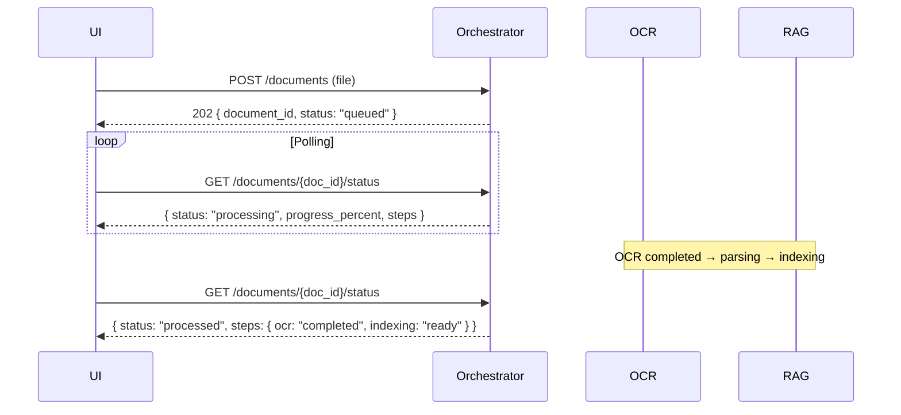

## API Orchestrator Service

Единая точка входа для публичного API Нейроассистента ПКБ.

**Базовый URL**: `https://{host}/api/v1`

### Формат ответа

Успех — данные возвращаются напрямую.

При ошибке:

```json
{
  "error": {
    "code": "DOCUMENT_NOT_FOUND",
    "message": "Документ не найден",
    "details": {}
  }
}
```

Для списковых ответов `meta` содержит пагинацию на верхнем уровне.

### Группы

| Группа | Описание |
|--------|----------|
| `system` | Служебные методы: health |
| `monitor` | Мониторинг и метрики |
| `documents` | Документы: CRUD, поиск, очередь, просмотр, параметры |
| `pages` | Просмотр страниц и текстового слоя |
| `search` | Поиск фрагментов и вопросно-ответная система |
| `chat` | Чат: единый endpoint для UI (`/chat`), упрощённый Q&A (`/chat/ask`) |
| `validate` | Валидация: сопоставление норм и проекта (`/validate/compare`, `/validate/checks`) |

---

## Группа documents

### POST /documents

Асинхронная загрузка документа в очередь обработки. После загрузки документ проходит OCR-распознавание, парсинг структуры и индексацию — это может длиться от секунд до минут в зависимости от объёма. UI отслеживает прогресс через `GET /documents/{doc_id}/status`.

`user_id` определяется из контекста аутентификации (`Authorization: Bearer`), не передаётся в теле запроса.

**Запрос**: `multipart/form-data`

| Поле | Тип | Обязательность | Описание |
|------|-----|----------------|----------|
| `file` | File | Да | Бинарный файл (PDF, PNG, JPG, TIFF) |
| `document_type` | string | Да | Тип документа: `normative`, `archival_scan`, `drawing`, `specification` |
| `metadata` | string | Нет | JSON-строка с метаданными |

**Ответ `202`** (принят в обработку):

```json
{
  "document_id": "doc-8a3f2b",
  "status": "queued",
  "user_id": "u-001",
  "task_id": "task-001",
  "created_at": "2026-04-27T10:00:00Z"
}
```

| Поле | Тип | Описание |
|------|-----|----------|
| `document_id` | string | ID документа — использовать для опроса статуса |
| `status` | string | Статус: `queued`, `processing`, `processed`, `error` |
| `user_id` | string | ID пользователя, загрузившего документ |
| `task_id` | string | ID задачи обработки (для опроса статуса) |
| `created_at` | string | Дата создания |

**Асинхронный флоу:**



**Ошибки**: `400` — неподдерживаемый формат/размер, `422` — повреждённый файл.

### GET /documents

Список документов с фильтрацией.

**Параметры query**:

| Параметр | Тип | Описание |
|----------|-----|----------|
| `user_id` | string | Фильтр по пользователю, загрузившему документ |
| `status` | string | Фильтр по статусу: `queued`, `processing`, `processed`, `error` |
| `document_type` | string | Фильтр по типу документа |
| `date_from` | string | Дата начала (ISO 8601) |
| `date_to` | string | Дата окончания |
| `search` | string | Поиск по имени файла |
| `page` | int | Номер страницы |
| `page_size` | int | Записей на странице |

**Ответ `200`**:

```json
{
  "summary": {
    "total": 128,
    "ocr_completed": 112,
    "indexed": 108,
    "need_attention": 4
  },
  "items": [
    {
      "document_id": "doc-8a3f2b",
      "title": "21900M2_spec.pdf",
      "document_type": "specification",
      "source": "РС",
      "version": "2026",
      "pages": 12,
      "ocr_status": "completed",
      "index_status": "ready",
      "user_id": "u-001",
      "uploaded_by": "Иванов И.И.",
      "created_at": "2026-04-27T10:00:00Z",
      "updated_at": "2026-04-27T10:02:00Z"
    }
  ],
  "meta": { "total": 18, "page": 1, "page_size": 20 }
}
```

| Поле | Тип | Описание |
|------|-----|----------|
| `summary.total` | int | Общее количество документов |
| `summary.ocr_completed` | int | Количество с завершённым OCR |
| `summary.indexed` | int | Количество проиндексированных |
| `summary.need_attention` | int | Количество требующих внимания |
| `items[].document_id` | string | ID документа |
| `items[].title` | string | Название документа (отображаемое имя) |
| `items[].document_type` | string | Тип документа |
| `items[].source` | string | Источник |
| `items[].version` | string | Версия |
| `items[].pages` | int | Количество страниц |
| `items[].ocr_status` | string | Статус OCR: `not_started`, `queued`, `processing`, `completed`, `error` |
| `items[].index_status` | string | Статус индексации: `not_started`, `ready`, `error` |
| `items[].user_id` | string | ID пользователя, загрузившего документ |
| `items[].uploaded_by` | string | ФИО пользователя, загрузившего документ |

### GET /documents/{doc_id}

Детальная информация о документе.

**Ответ `200`**:

```json
{
  "document_id": "doc-8a3f2b",
  "filename": "21900M2_spec.pdf",
  "document_type": "specification",
  "status": "processed",
  "file_size": 2048576,
  "pages_total": 12,
  "pages_processed": 12,
  "pages_failed": 0,
  "user_id": "u-001",
  "uploaded_by": "Иванов И.И.",
  "created_at": "2026-04-27T10:00:00Z",
  "updated_at": "2026-04-27T10:05:00Z",
  "metadata": {
    "project": "21900M2",
    "author": "Иванов"
  }
}
```

### GET /documents/{doc_id}/status

Прогресс обработки документа. UI вызывает этот endpoint для отслеживания асинхронного флоу после `POST /documents`.

**Ответ `200`** (в процессе):

```json
{
  "document_id": "doc-8a3f2b",
  "user_id": "u-001",
  "status": "processing",
  "progress_percent": 41.7,
  "steps": {
    "ocr": "in_progress",
    "layout_parsing": "pending",
    "indexing": "pending"
  },
  "started_at": "2026-04-27T10:00:30Z",
  "estimated_completion": "2026-04-27T10:06:00Z"
}
```

**Ответ `200`** (завершён):

```json
{
  "document_id": "doc-8a3f2b",
  "user_id": "u-001",
  "status": "processed",
  "progress_percent": 100,
  "steps": {
    "ocr": "completed",
    "layout_parsing": "completed",
    "indexing": "completed"
  },
  "ocr_result": {
    "pages_total": 12,
    "pages_processed": 12,
    "pages_failed": 0,
    "low_confidence_pages": 1,
    "avg_confidence": 0.94
  },
  "index_result": {
    "chunks_indexed": 128,
    "status": "ready"
  },
  "started_at": "2026-04-27T10:00:30Z",
  "completed_at": "2026-04-27T10:05:00Z"
}
```

**Ответ `200`** (ошибка):

```json
{
  "document_id": "doc-8a3f2b",
  "user_id": "u-001",
  "status": "error",
  "progress_percent": 50,
  "steps": {
    "ocr": "error",
    "layout_parsing": "pending",
    "indexing": "pending"
  },
  "error": {
    "code": "OCR_FAILED",
    "message": "Не удалось распознать документ: повреждённый PDF",
    "details": {}
  },
  "started_at": "2026-04-27T10:00:30Z",
  "failed_at": "2026-04-27T10:02:00Z"
}
```

| Поле | Тип | Описание |
|------|-----|----------|
| `status` | string | `queued`, `processing`, `processed`, `error` |
| `progress_percent` | float | Процент выполнения (0–100) |
| `steps` | object | Статус этапов: `pending`, `in_progress`, `completed`, `error` |
| `ocr_result` | object\|null | Результаты OCR (только при `processed`) |
| `ocr_result.pages_total` | int | Всего страниц |
| `ocr_result.pages_processed` | int | Успешно обработано |
| `ocr_result.pages_failed` | int | Ошибок |
| `ocr_result.low_confidence_pages` | int | Страниц с низким качеством |
| `ocr_result.avg_confidence` | float | Средняя уверенность распознавания (0–1) |
| `index_result` | object\|null | Результаты индексации (только при `processed`) |
| `index_result.chunks_indexed` | int | Количество проиндексированных чанков |
| `index_result.status` | string | `ready`, `error` |
| `error` | object\|null | Детали ошибки (только при `error`) |

### GET /documents/{doc_id}/file

Получение полного файла документа.

**Ответ `200`**: Backend возвращает бинарный поток файла с корректным `Content-Type` или JSON со ссылкой:

```json
{
  "document_id": "doc-8a3f2b",
  "document_title": "21900M2_spec.pdf",
  "content_type": "application/pdf",
  "file_url": "/files/doc-8a3f2b/full.pdf"
}
```

### GET /documents/{doc_id}/pages/{page_num}/preview

Агрегированный просмотр страницы: изображение + текст + подсветка фрагмента.

**Параметры query**:

| Параметр | Тип | Описание |
|----------|-----|----------|
| `highlight` | string | Текст для подсветки (опционально) |

**Ответ `200`**:

```json
{
  "document_id": "doc-8a3f2b",
  "document_title": "21900M2_spec.pdf",
  "page": 5,
  "content_type": "application/pdf",
  "preview_url": "/files/doc-8a3f2b/page-5.png",
  "text": "Спецификация...\nПоз. 1 Кница...",
  "highlight": "Кница"
}
```

| Поле | Тип | Описание |
|------|-----|----------|
| `document_id` | string | ID документа |
| `document_title` | string | Название документа |
| `page` | int | Номер страницы |
| `content_type` | string | MIME-тип |
| `preview_url` | string | URL изображения страницы |
| `text` | string | Распознанный текст страницы |
| `highlight` | string|null | Фрагмент для подсветки |

> Внутренняя реализация: агрегирует ответы от `/documents/{doc_id}/pages/{page_num}` (изображение) и `/documents/{doc_id}/pages/{page_num}/text` (текст).

### DELETE /documents/{doc_id}

Удаление документа и всех связанных данных.

**Ответ `200`**:

```json
{
  "document_id": "doc-8a3f2b",
  "deleted_at": "2026-04-27T10:30:00Z"
}
```

### POST /documents/{doc_id}/reprocess

Асинхронная повторная обработка документа (перезапуск OCR и индексации). Прогресс отслеживается через `GET /documents/{doc_id}/status`. `user_id` определяется из контекста аутентификации.

**Запрос**:

```json
{
  "mode": "enhanced_preprocess"
}
```

| Поле | Тип | Обязательность | Описание |
|------|-----|----------------|----------|
| `mode` | string | Нет | Режим обработки: `standard` (по умолчанию), `enhanced_preprocess` (улучшенная предобработка), `fallback_ocr` (альтернативный OCR-движок) |

**Ответ `202`**:

```json
{
  "document_id": "doc-8a3f2b",
  "user_id": "u-001",
  "task_id": "task-ocr-002",
  "status": "queued",
  "created_at": "2026-04-27T11:00:00Z"
}
```

### GET /documents/{doc_id}/errors

Журнал ошибок обработки.

**Параметры query**:

| Параметр | Тип | Описание |
|----------|-----|----------|
| `stage` | string | Этап: `upload`, `ocr`, `parsing`, `indexing`, `generation` |
| `severity` | string | Уровень: `warning`, `error` |
| `page` | int | Номер страницы |
| `page_size` | int | Записей на странице |

**Ответ `200`**:

```json
{
  "errors": [
    {
      "error_id": "err-001",
      "document_id": "doc-8a3f2b",
      "page_number": 5,
      "stage": "ocr",
      "error_code": "LOW_CONFIDENCE",
      "error_message": "Качество распознавания страницы ниже порога (confidence=0.62)",
      "severity": "warning",
      "retry_attempt": 0,
      "timestamp": "2026-04-27T10:01:00Z"
    }
  ],
  "meta": { "total": 1, "page": 1, "page_size": 20 }
}
```

### GET /documents/queue

Очередь обработки документов для текущего пользователя. Возвращает документы со статусами `queued`, `processing` — те, что ещё не завершили обработку.

`user_id` определяется из контекста аутентификации. Для администратора возвращаются все документы в обработке.

**Параметры query**:

| Параметр | Тип | Описание |
|----------|-----|----------|
| `user_id` | string | Фильтр по пользователю (админ может смотреть чужие очереди) |
| `page` | int | Номер страницы |
| `page_size` | int | Записей на странице |

**Ответ `200`**:

```json
{
  "queue": [
    {
      "document_id": "doc-8a3f2b",
      "title": "21900M2_spec.pdf",
      "document_type": "specification",
      "status": "processing",
      "progress_percent": 41.7,
      "steps": {
        "ocr": "in_progress",
        "layout_parsing": "pending",
        "indexing": "pending"
      },
      "user_id": "u-001",
      "uploaded_by": "Иванов И.И.",
      "created_at": "2026-04-27T10:00:00Z",
      "started_at": "2026-04-27T10:00:30Z",
      "estimated_completion": "2026-04-27T10:06:00Z"
    }
  ],
  "meta": { "total_in_queue": 3, "page": 1, "page_size": 20 }
}
```

| Поле | Тип | Описание |
|------|-----|----------|
| `queue[].document_id` | string | ID документа |
| `queue[].title` | string | Название документа |
| `queue[].document_type` | string | Тип документа |
| `queue[].status` | string | `queued`, `processing` |
| `queue[].progress_percent` | float | Прогресс обработки (0–100) |
| `queue[].steps` | object | Статусы этапов |
| `queue[].user_id` | string | ID пользователя |
| `queue[].uploaded_by` | string | ФИО пользователя |
| `total_in_queue` | int | Общее количество в очереди |

---

## Группа search

### POST /documents/search

Семантический поиск фрагментов по документам.

**Запрос**:

```json
{
  "query": "требования к ледовому классу Arc4",
  "document_ids": ["doc-norm-001", "doc-norm-002"],
  "top_k": 5,
  "filters": {
    "document_type": ["normative"],
    "date_from": "2020-01-01",
    "date_to": null
  }
}
```

| Поле | Тип | Обязательность | Описание |
|------|-----|----------------|----------|
| `query` | string | Да | Поисковый запрос |
| `document_ids` | string[] | Нет | Ограничить поиск документами |
| `top_k` | int | Нет | Число результатов (по умолчанию 5) |
| `filters` | object | Нет | Фильтры по типу, дате |

**Ответ `200`**:

```json
{
  "query": "требования к ледовому классу Arc4",
  "items": [
    {
      "result_id": "sr-001",
      "document_id": "doc-norm-001",
      "document_title": "Правила классификации и постройки морских судов. Часть I",
      "document_type": "НСИ",
      "section": "Корпус",
      "page": 42,
      "fragment": "Для ледового класса Arc4 толщина обшивки должна быть не менее 12 мм...",
      "relevance": 0.92,
      "page_preview_url": "/documents/doc-norm-001/pages/42/preview",
      "document_url": "/documents/doc-norm-001/file"
    }
  ],
  "total_found": 3,
  "processing_time_ms": 450
}
```

| Поле | Тип | Описание |
|------|-----|----------|
| `items[].result_id` | string | ID результата |
| `items[].document_id` | string | ID документа |
| `items[].document_title` | string | Название документа |
| `items[].document_type` | string | Тип документа |
| `items[].section` | string | Раздел |
| `items[].page` | int | Номер страницы |
| `items[].fragment` | string | Текст фрагмента |
| `items[].relevance` | float | Релевантность (0–1) |
| `items[].page_preview_url` | string | URL preview страницы |
| `items[].document_url` | string | URL полного документа |

**Ошибки**: `400` — пустой запрос.

### GET /documents/search

Быстрый GET-вариант семантического поиска. Предназначен для простых/тестовых запросов. Для полнофункционального поиска с фильтрацией используйте `POST /documents/search`.

**Параметры query**: `q`, `document_id`, `page`, `page_size`, `document_type`

**Ответ**: Аналогичен `POST /documents/search` (поле `query` в ответе соответствует `q`).

### POST /chat/ask

Упрощённый Q&A без управления сессиями — для разовых вопросов, когда не нужно сохранять историю диалога. Если требуется контекстная беседа с историей, используйте `POST /chat` (требует `session_id`).

**Запрос**:

```json
{
  "question": "Какая должна быть толщина обшивки для ледового класса Arc4?",
  "document_ids": null,
  "options": {
    "temperature": 0.2
  }
}
```

| Поле | Тип | Обязательность | Описание |
|------|-----|----------------|----------|
| `question` | string | Да | Вопрос |
| `document_ids` | string[] | Нет | Ограничение корпуса |
| `options` | object | Нет | Параметры генерации |
| `options.temperature` | float | Нет | Температура (0-1) |

**Ответ `200`**:

```json
{
  "question": "Какая должна быть толщина обшивки для ледового класса Arc4?",
  "answer": "Согласно Правилам классификации и постройки морских судов (Часть I, стр. 42), толщина обшивки для ледового класса Arc4 должна быть не менее 12 мм.",
  "sources": [
    {
      "document_id": "doc-norm-001",
      "document_title": "Правила классификации и постройки морских судов. Часть I",
      "page_number": 42,
      "fragment_id": "frg-123abc",
      "text": "Для ледового класса Arc4 толщина обшивки должна быть не менее 12 мм...",
      "score": 0.92,
      "page_preview_url": "/documents/doc-norm-001/pages/42/preview",
      "document_url": "/documents/doc-norm-001/file"
    }
  ],
  "processing_time_ms": 3200,
  "model_used": "llama-3-70b"
}
```

---

## Группа pages

### GET /documents/{doc_id}/pages

Список страниц документа с базовой информацией о каждой.

**Ответ `200`**:

```json
{
  "document_id": "doc-8a3f2b",
  "pages_total": 12,
  "pages": [
    {
      "page_number": 1,
      "width": 2480,
      "height": 3508,
      "ocr_status": "completed",
      "confidence": 0.95,
      "has_text_layer": true
    },
    {
      "page_number": 2,
      "width": 2480,
      "height": 3508,
      "ocr_status": "completed",
      "confidence": 0.92,
      "has_text_layer": true
    }
  ],
  "meta": { "total": 12, "page": 1, "page_size": 50 }
}
```

| Поле | Тип | Описание |
|------|-----|----------|
| `pages[].page_number` | int | Номер страницы |
| `pages[].width` | int | Ширина изображения в пикселях |
| `pages[].height` | int | Высота изображения в пикселях |
| `pages[].ocr_status` | string | Статус OCR: `not_started`, `processing`, `completed`, `error` |
| `pages[].confidence` | float|null | Уверенность распознавания (0–1) |
| `pages[].has_text_layer` | bool | Доступен ли текстовый слой |

### GET /documents/{doc_id}/pages/{page_num}

Изображение страницы с подсветкой блоков.

**Параметры query**:

| Параметр | Тип | Описание |
|----------|-----|----------|
| `highlight` | string | ID блока для подсветки |

**Ответ `200`**:

```json
{
  "image_url": "/files/page-img/doc-8a3f2b_5.png",
  "page_number": 5,
  "width": 2480,
  "height": 3508,
  "blocks": [
    {
      "block_id": "blk-001",
      "type": "title_block",
      "coordinates": {"x": 200, "y": 100, "width": 800, "height": 50},
      "text": "Спецификация 21900M2.362135.0903",
      "highlighted": false
    },
    {
      "block_id": "blk-002",
      "type": "table",
      "coordinates": {"x": 150, "y": 200, "width": 1800, "height": 600},
      "text": "...",
      "highlighted": true
    }
  ]
}
```

### GET /documents/{doc_id}/pages/{page_num}/text

Текстовый слой и структура страницы.

**Ответ `200`**:

```json
{
  "page_number": 5,
  "full_text": "Спецификация...\nПоз. 1 Кница...",
  "blocks": [
    {
      "block_id": "blk-001",
      "type": "title_block",
      "coordinates": {"x": 200, "y": 100, "width": 800, "height": 50},
      "text": "Спецификация 21900M2.362135.0903",
      "confidence": 0.98
    },
    {
      "block_id": "blk-002",
      "type": "table",
      "coordinates": {"x": 150, "y": 200, "width": 1800, "height": 600},
      "text": "Поз.|Наименование|Кол.|Масса|Материал",
      "confidence": 0.92,
      "table_data": [
        ["Поз.", "Наименование", "Кол.", "Масса", "Материал"],
        ["1", "Кница", "2", "0.5", "сталь 09Г2С"]
      ]
    }
  ]
}
```


### GET /documents/{doc_id}/parameters

Извлечённые структурированные параметры документа. Относится к группе `documents`.

Извлечённые структурированные параметры документа.

**Ответ `200`**:

```json
{
  "document_id": "doc-8a3f2b",
  "document_type": "specification",
  "parameters": {
    "designation": "21900M2.362135.0903",
    "title": "Секция 0903",
    "materials": ["сталь 09Г2С", "алюминий АМг5"],
    "dimensions": ["1200x800x6", "L=2500"],
    "references": ["21900M2.362135.0901СБ", "21900M2.362135.0902СБ"],
    "specification_items": [
      {
        "position": "1",
        "name": "Кница",
        "quantity": "2",
        "dimensions": "10x200x300",
        "weight": "0.5",
        "material": "сталь 09Г2С",
        "note": ""
      }
    ]
  },
  "extraction_confidence": 0.89,
  "unconfirmed_fields": ["dimensions позиции 3"],
  "updated_at": "2026-04-27T10:05:00Z"
}
```

### POST /validate/compare

Запуск сопоставления нормы и проектного документа (низкоуровневый, асинхронный).

> Для UI используется синхронный endpoint `POST /validate/checks` (см. группу `validate`), который внутри вызывает `POST /validate/compare` / `POST /compare/batch` и агрегирует результат.

**Запрос** (вариант 1 — по запросу):

```json
{
  "normative_query": "толщина обшивки ледового класса Arc4",
  "project_document_id": "doc-draw-001"
}
```

**Запрос** (вариант 2 — по фрагментам):

```json
{
  "normative_fragment_id": "frg-norm-42",
  "project_fragment_id": "frg-draw-5"
}
```

| Поле | Тип | Обязательность | Описание |
|------|-----|----------------|----------|
| `normative_query` | string | Нет | Поисковый запрос к нормативным документам |
| `project_document_id` | string | Нет | ID проектного документа |
| `normative_fragment_id` | string | Нет | ID фрагмента нормы |
| `project_fragment_id` | string | Нет | ID фрагмента проекта |

**Ответ `200`**:

```json
{
  "comparison_id": "cmp-007",
  "status": "processing",
  "created_at": "2026-04-27T12:00:00Z"
}
```

### GET /validate/compare/{comparison_id}

Результат сопоставления.

**Ответ `200`**:

```json
{
  "comparison_id": "cmp-007",
  "status": "completed",
  "normative_block": {
    "document_id": "doc-norm-001",
    "document_title": "Правила РС часть I",
    "page_number": 42,
    "requirement_text": "Толщина обшивки в районе ледового пояса для класса Arc4 ≥ 12 мм"
  },
  "project_block": {
    "document_id": "doc-draw-001",
    "document_title": "21900M2.362135.0903СБ",
    "page_number": 1,
    "parameter_text": "Обшивка ледового пояса t=14 мм"
  },
  "match_status": "match",
  "details": "Требование выполнено: проектная толщина 14 мм превышает минимальные 12 мм.",
  "sources": [
    {"document_id": "doc-norm-001", "page": 42},
    {"document_id": "doc-draw-001", "page": 1}
  ],
  "disclaimer": "Результат носит информационный характер и подлежит обязательной инженерной проверке.",
  "processing_time_ms": 8700
}
```

**Статусы `match_status`**:

| Статус | Описание |
|--------|----------|
| `match` | Совпадает |
| `possible_discrepancy` | Возможное расхождение |
| `not_found_in_project` | Не найдено в проекте |
| `not_found_in_norm` | Не найдено в норме |
| `insufficient_data` | Недостаточно данных |

---

## Группа system

### GET /system/health

Проверка состояния системы.

**Ответ `200`**:

```json
{
  "status": "ok",
  "version": "1.0.0",
  "uptime_seconds": 234567,
  "services": {
    "auth": "ok",
    "rag": "ok",
    "ocr": "degraded",
    "validation": "ok",
    "integration": "ok"
  },
  "database": "online",
  "search_index": "ready",
  "ocr_queue": "idle",
  "storage": "online"
}
```

| Поле | Тип | Описание |
|------|-----|----------|
| `database` | string | Статус БД: `online`, `offline`, `degraded` |
| `search_index` | string | Статус индекса: `ready`, `building`, `error` |
| `ocr_queue` | string | Статус очереди OCR: `idle`, `processing`, `paused` |
| `storage` | string | Статус хранилища: `online`, `offline` |

---

## Группа chat

### POST /chat

Диалоговый Q&A с управлением сессиями. Для разовых вопросов без сохранения истории используйте `POST /chat/ask` (без `session_id`).

**Запрос**:

```json
{
  "question": "Какая минимальная толщина листа корпуса?",
  "session_id": "chat-001",
  "context": {
    "project_id": "project-17",
    "document_ids": ["doc-001", "doc-002"],
    "nsi_version": "2026"
  }
}
```

`user_id` определяется из контекста аутентификации (`Authorization: Bearer`), не передаётся в теле запроса.

| Поле | Тип | Обязательность | Описание |
|------|-----|----------------|----------|
| `question` | string | Да | Текст вопроса |
| `session_id` | string | Да | ID сессии чата |
| `context` | object | Нет | Контекст запроса |

**Ответ `200`** (успешный ответ):

```json
{
  "answer_id": "ans-001",
  "status": "answered",
  "message": null,
  "answer_items": [
    {
      "number": 1,
      "text": "Минимальная толщина листа не должна определяться отдельно от проекта. Ее нужно проверять по району корпуса, материалу и расчетной нагрузке.",
      "citations": [
        {
          "citation_id": "cit-001",
          "document_id": "doc-001",
          "document_title": "Правила классификации и постройки морских судов",
          "section": "Корпус",
          "page": 45,
          "fragment": "Фрагмент текста, на котором основан ответ.",
          "page_preview_url": "/documents/doc-001/pages/45/preview",
          "document_url": "/documents/doc-001/file"
        }
      ]
    }
  ],
  "latency_ms": 1420
}
```

**Ответ `200`** (недостаточно данных):

```json
{
  "answer_id": "ans-002",
  "status": "needs_clarification",
  "message": "Уточните проект, район корпуса и тип судна.",
  "missing_fields": ["project_id", "hull_area", "vessel_type"],
  "answer_items": []
}
```

**Ответ `200`** (конфликт источников):

```json
{
  "answer_id": "ans-003",
  "status": "source_conflict",
  "message": "Найдены разные требования в двух редакциях документа.",
  "conflicts": [
    {
      "document_id": "doc-001",
      "document_title": "НСИ, редакция 2024",
      "page": 45,
      "value": "8 мм"
    },
    {
      "document_id": "doc-002",
      "document_title": "НСИ, редакция 2026",
      "page": 47,
      "value": "10 мм"
    }
  ],
  "answer_items": []
}
```

| Поле | Тип | Описание |
|------|-----|----------|
| `answer_id` | string | ID ответа |
| `status` | string | `answered`, `needs_clarification`, `source_conflict` |
| `message` | string|null | Сообщение пользователю |
| `answer_items` | array | Список пунктов ответа (с citations) |
| `missing_fields` | string[]|null | Поля для уточнения |
| `conflicts` | object[]|null | Конфликтующие источники |
| `latency_ms` | int | Время обработки |

> Внутренняя реализация: создаёт сессию через Query Service (`POST /chat/sessions`) при первом запросе, отправляет сообщение (`POST /chat/sessions/{session_id}/messages`) и маппит ответ в UI-формат. Статусы `needs_clarification` и `source_conflict` проксируются из Query Service.

---

## Группа validate

### POST /validate/checks

Запуск проверки проектного решения на соответствие требованиям НСИ (синхронный вариант для UI).

**Запрос**:

```json
{
  "project_document_ids": ["doc-project-001"],
  "nsi_document_ids": ["doc-nsi-001", "doc-nsi-002"],
  "parameters": ["толщина листа", "марка стали"]
}
```

`user_id` определяется из контекста аутентификации (`Authorization: Bearer`), не передаётся в теле запроса.

| Поле | Тип | Обязательность | Описание |
|------|-----|----------------|----------|
| `project_document_ids` | string[] | Да | ID проектных документов |
| `nsi_document_ids` | string[] | Да | ID нормативных документов |
| `parameters` | string[] | Нет | Параметры для проверки |

**Ответ `200`**:

```json
{
  "check_run_id": "check-001",
  "status": "completed",
  "summary": {
    "ok": 8,
    "warning": 2,
    "error": 1
  },
  "items": [
    {
      "check_item_id": "chk-item-001",
      "project": "Проект 17",
      "section": "Корпус",
      "parameter": "Толщина листа",
      "project_value": "8 мм",
      "nsi_requirement": "Не менее 10 мм",
      "nsi_document": "Правила классификации и постройки морских судов",
      "status": "ERROR",
      "comment": "Значение в проекте ниже требования НСИ.",
      "project_source": {
        "document_id": "doc-project-001",
        "page": 12,
        "page_preview_url": "/documents/doc-project-001/pages/12/preview",
        "document_url": "/documents/doc-project-001/file"
      },
      "nsi_source": {
        "document_id": "doc-nsi-001",
        "page": 45,
        "page_preview_url": "/documents/doc-nsi-001/pages/45/preview",
        "document_url": "/documents/doc-nsi-001/file"
      }
    }
  ]
}
```

| Поле | Тип | Описание |
|------|-----|----------|
| `check_run_id` | string | ID проверки |
| `status` | string | `completed`, `processing` |
| `summary.ok` | int | Количество совпадений |
| `summary.warning` | int | Количество предупреждений |
| `summary.error` | int | Количество ошибок |
| `items[].status` | string | `OK`, `WARNING`, `ERROR` |
| `items[].project_source` | object | Ссылка на источник проекта |
| `items[].nsi_source` | object | Ссылка на нормативный источник |

> Внутренняя реализация: разлагает запрос на пары нормативных и проектных фрагментов через Validation Service (`POST /compare/batch`), агрегирует результаты, маппит `match_status` → `OK`/`WARNING`/`ERROR`.

### GET /validate/checks/{check_run_id}/export

Выгрузка результатов проверки в XLSX.

**Ответ `200`**: Backend возвращает XLSX-файл или JSON со ссылкой:

```json
{
  "check_run_id": "check-001",
  "export_url": "/files/exports/check-001.xlsx",
  "format": "xlsx",
  "created_at": "2026-04-27T12:05:00Z"
}
```

---

## Группа monitor

### GET /monitor/metrics

Метрики контроля качества системы. Относится к группе `monitor`.

**Ответ `200`**:

```json
{
  "control_metrics": {
    "ocr_quality": 0.984,
    "retrieval_quality": 0.91,
    "answers_with_sources": 0.96,
    "avg_latency_ms": 1420
  },
  "answer_metrics": {
    "useful_rate": 0.84,
    "rated_answers": 43,
    "flagged_for_review": 5,
    "open_questions": 3
  },
  "logs": [
    {
      "time": "12:34:02",
      "type": "search",
      "text": "По запросу найдено 5 релевантных документов",
      "level": "info"
    }
  ]
}
```

| Поле | Тип | Описание |
|------|-----|----------|
| `control_metrics.ocr_quality` | float | Качество OCR (0–1) |
| `control_metrics.retrieval_quality` | float | Качество поиска (0–1) |
| `control_metrics.answers_with_sources` | float | Доля ответов с источниками (0–1) |
| `control_metrics.avg_latency_ms` | int | Среднее время ответа |
| `answer_metrics.useful_rate` | float | Доля полезных ответов (0–1) |
| `answer_metrics.rated_answers` | int | Количество оценённых ответов |
| `answer_metrics.flagged_for_review` | int | На проверке |
| `answer_metrics.open_questions` | int | Открытые вопросы |
| `logs[]` | array | Журнал событий |

> Внутренняя реализация: агрегирует данные из OCR Service (confidence), RAG Service (score), Query Service (feedback, latency), логов сервисов.
