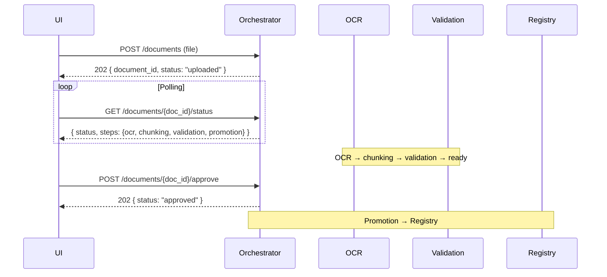

## API Orchestrator Service (orchestrator-service:8081)

Единая точка входа для публичного API Нейроассистента ПКБ.  
Оркестрирует конвейер обработки документов: загрузка → OCR → чанкинг → валидация → промотирование в Registry.

**Базовый URL (публичный)**: `https://{host}/api/v1`  
**Базовый URL (внутренний)**: `http://127.0.0.1:8081/api/v1`

### Формат ответа

Успех — данные возвращаются напрямую.

При ошибке:

```json
{
  "error": {
    "code": "DOCUMENT_NOT_FOUND",
    "message": "Документ не найден",
    "details": {}
  }
}
```

Для списковых ответов `meta` содержит пагинацию на верхнем уровне.

### Группы

| Группа | Описание |
|--------|----------|
| `system` | Служебные методы: health |
| `monitor` | Мониторинг и метрики |
| `documents` | Документы: загрузка, список, статус, версии, аппрув, промотирование |
| `pages` | Просмотр страниц и текстового слоя |
| `search` | Поиск фрагментов |
| `validate` | Валидация: сопоставление норм и проекта |

---

## Группа documents

### POST /documents

Асинхронная загрузка файла. Orchestrator вычисляет SHA-256 содержимого, определяет формат, создаёт/находит логический документ по бизнес-ключу, помещает в очередь Celery. Конвейер: OCR → чанкинг → валидация → промотирование.

`user_id` определяется из контекста аутентификации.

**Запрос**: `multipart/form-data`

| Поле | Тип | Обязательность | Описание |
|---|---|---|---|
| `file` | File | Да | Бинарный файл (PDF, PNG, JPG, TIFF) |
| `source_type` | string | Да | `GOST`, `GOST_R`, `OST`, `RD`, `TU`, `ISO`, `DNV`, `ASTM`, `OTHER` |
| `title` | string | Нет | Название документа |
| `doc_code` | string | Нет | Регистрационный номер (напр. `20868-81`) |
| `mks_oks_code` | string | Нет | Код МКС/ОКС |
| `okstu_code` | string | Нет | Код ОКСТУ |
| `era` | string | Нет | `USSR`, `CIS`, `RF`, `CURRENT` |
| `jurisdiction` | string | Нет | `RU`, `EU`, `US`, `NO`, `INTL` |
| `issuing_body` | string | Нет | Организация-издатель |
| `metadata` | string | Нет | JSON-строка с доп. данными |

**Ответ `202`**:

```json
{
  "document_id": "b3a8f1c2-4d5e-6f7a-8b9c-0d1e2f3a4b5c",
  "version_id": "c4b9f2d3-5e6f-7a8b-9c0d-1e2f3a4b5c6d",
  "status": "uploaded",
  "user_id": "u-001",
  "task_id": "task-8a3f2b",
  "content_hash_sha256": "e3b0c44298fc1c149afbf4c8996fb92427ae41e4649b934ca495991b7852b855",
  "is_duplicate_file": false,
  "is_duplicate_document": false,
  "title_hash_sha256": "a1b2c3d4e5f6a7b8c9d0e1f2a3b4c5d6e7f8a9b0c1d2e3f4a5b6c7d8e9f0a1b2",
  "created_at": "2026-05-15T10:00:00Z"
}
```

**Асинхронный флоу:**



**Ошибки**: `400` — неподдерживаемый формат/размер, `409` — `DUPLICATE_DOCUMENT` (если запрещено дублирование по бизнес-ключу), `422` — повреждённый файл.

---

### POST /documents/{doc_id}/versions

Загрузка дополнительной версии файла к существующему логическому документу (скан к цифре, чертёж к спецификации и т.д.).

**Запрос**: `multipart/form-data`

| Поле | Тип | Обязательность | Описание |
|-------|-----|----------------|----------|
| `file` | File | Да | Бинарный файл |

**Ответ `202`**:

```json
{
  "document_id": "b3a8f1c2-4d5e-6f7a-8b9c-0d1e2f3a4b5c",
  "version_id": "d5c0a3e4-6f7a-8b9c-0d1e-2f3a4b5c6d7e",
  "version_number": 2,
  "status": "uploaded",
  "task_id": "task-9b4g3c",
  "content_hash_sha256": "6ca13d52ca70c883e0f0bb101e425a89e8624de51db2d2392593af6a84118090",
  "is_duplicate_file": false,
  "created_at": "2026-05-15T11:00:00Z"
}
```

---

### GET /documents/{doc_id}/versions

Список всех версий файлов логического документа.

**Ответ `200`**:

```json
{
  "document_id": "b3a8f1c2-4d5e-6f7a-8b9c-0d1e2f3a4b5c",
  "versions": [
    {
      "version_id": "c4b9f2d3-5e6f-7a8b-9c0d-1e2f3a4b5c6d",
      "version_number": 1,
      "format_code": "pdf_digital",
      "format_label": "PDF (цифровой)",
      "file_path": "b3a8f1c2/v1/e3b0c442...855.pdf",
      "content_hash_sha256": "e3b0c44298fc1c149afbf4c8996fb92427ae41e4649b934ca495991b7852b855",
      "size_bytes": 2048576,
      "uploaded_at": "2026-05-15T10:00:00Z",
      "uploaded_by": "Иванов И.И."
    }
  ],
  "meta": { "total": 2 }
}
```

---

### GET /documents

Список документов с фильтрацией.

**Query-параметры** (дополнительно к существующим):

| Параметр | Тип | Описание |
|----------|-----|----------|
| `source_type` | string | Фильтр по типу источника |
| `era` | string | `USSR`, `CIS`, `RF`, `CURRENT` |
| `validity_status` | string | `active`, `superseded`, `cancelled`, `historical`, `draft` |
| `jurisdiction` | string | `RU`, `EU`, `US`, `NO`, `INTL` |
| `mks_oks_code` | string | Фильтр по коду МКС/ОКС |
| `okstu_code` | string | Фильтр по коду ОКСТУ |
| `doc_code` | string | Поиск по номеру документа |
| `status` | string | Фильтр по статусу FSM |
| `search` | string | Поиск по названию |
| `page`, `page_size` | int | Пагинация |

**Ответ `200`**:

```json
{
  "summary": {
    "total": 128,
    "uploaded": 10,
    "processing": 5,
    "review_required": 3,
    "ready_for_promotion": 12,
    "approved": 95,
    "failed": 3
  },
  "items": [
    {
      "document_id": "b3a8f1c2-4d5e-6f7a-8b9c-0d1e2f3a4b5c",
      "title": "Стойки установочные",
      "doc_code": "20868-81",
      "source_type": "GOST",
      "era": "USSR",
      "validity_status": "active",
      "jurisdiction": "RU",
      "issuing_body": "Госстандарт СССР",
      "mks_oks_code": "31.240",
      "okstu_code": null,
      "classification_status": {
        "mks_status": "CONFIRMED",
        "okstu_status": "NOT_USED"
      },
      "status": "approved",
      "latest_version": 1,
      "total_versions": 2,
      "chunk_count": 34,
      "chunk_validation": "valid",
      "user_id": "u-001",
      "uploaded_by": "Иванов И.И.",
      "created_at": "2026-04-27T10:00:00Z",
      "updated_at": "2026-04-27T14:00:00Z"
    }
  ],
  "meta": { "total": 128, "page": 1, "page_size": 20 }
}
```

---

### GET /documents/{doc_id}

Детальная информация о документе со всеми метаданными и версиями файлов.

**Ответ `200`**:

```json
{
  "document_id": "b3a8f1c2-4d5e-6f7a-8b9c-0d1e2f3a4b5c",
  "title": "Стойки установочные",
  "doc_code": "20868-81",
  "source_type": "GOST",
  "title_hash_sha256": "a1b2c3d4e5f6a7b8c9d0e1f2a3b4c5d6e7f8a9b0c1d2e3f4a5b6c7d8e9f0a1b2",
  "status": "approved",
  "era": "USSR",
  "validity_status": "active",
  "jurisdiction": "RU",
  "issuing_body": "Госстандарт СССР",
  "industry_code": null,
  "enterprise_id": null,
  "mks_oks_code": "31.240",
  "okstu_code": null,
  "classification_status": {
    "mks_status": "CONFIRMED",
    "okstu_status": "NOT_USED",
    "udk_code": null,
    "extracted_at": "2026-05-15T10:01:00Z",
    "extracted_by": "purgatory_parser_v2",
    "confidence": 0.95
  },
  "successor_doc_id": null,
  "predecessor_doc_id": null,
  "chunk_container_id": "e5d0c3b4-7a8b-9c0d-1e2f-3a4b5c6d7e8f",
  "metadata": {
    "year": "1981",
    "udc": "629.5.021",
    "tags": ["судостроение", "стойки"]
  },
  "latest_version": {
    "version_id": "c4b9f2d3-...",
    "version_number": 1,
    "format_code": "pdf_digital",
    "content_hash_sha256": "e3b0c442...",
    "size_bytes": 2048576
  },
  "total_versions": 2,
  "user_id": "u-001",
  "uploaded_by": "Иванов И.И.",
  "created_by": "system_registry_sync",
  "updated_by": "ivanov_ai",
  "created_at": "2026-04-27T10:00:00Z",
  "updated_at": "2026-04-27T14:00:00Z"
}
```

---

### GET /documents/{doc_id}/status

Прогресс обработки документа. UI вызывает для отслеживания асинхронного конвейера после загрузки.

**Ответ `200`** (в процессе):

```json
{
  "document_id": "b3a8f1c2-...",
  "status": "processing",
  "progress_percent": 60.0,
  "steps": {
    "ocr": { "status": "completed", "pages_processed": 12, "pages_failed": 0, "avg_confidence": 0.92 },
    "chunking": { "status": "completed", "chunks_generated": 34 },
    "validation": { "status": "in_progress", "errors_found": 0 },
    "promotion": { "status": "pending" }
  },
  "started_at": "2026-05-15T10:00:05Z",
  "estimated_completion": "2026-05-15T10:02:00Z"
}
```

**Ответ `200`** (ждёт аппрува):

```json
{
  "document_id": "b3a8f1c2-...",
  "status": "review_required",
  "progress_percent": 80.0,
  "steps": {
    "ocr": { "status": "completed" },
    "chunking": { "status": "completed" },
    "validation": { "status": "invalid", "errors_found": 2, "errors": [
      {"code": "MISSING_EMBEDDING", "chunk_id": "chk-012"}
    ]},
    "promotion": { "status": "blocked" }
  }
}
```

**Ответ `200`** (готов к промотированию):

```json
{
  "document_id": "b3a8f1c2-...",
  "status": "ready_for_promotion",
  "steps": {
    "ocr": { "status": "completed" },
    "chunking": { "status": "completed" },
    "validation": { "status": "valid" },
    "promotion": { "status": "pending" }
  },
  "chunk_summary": { "total_chunks": 34, "text_chunks": 28, "table_chunks": 3, "image_chunks": 3 },
  "started_at": "2026-05-15T10:00:05Z",
  "completed_at": "2026-05-15T10:01:30Z"
}
```

**Статусы конвейера**: `uploaded` → `validating` → `processing` → `review_required` / `ready_for_promotion` → `approved` / `failed` / `archived`.

**Этапы `steps`**: `ocr`, `chunking`, `validation`, `promotion`. Статус этапа: `pending`, `in_progress`, `completed`, `error`, `blocked`.

---

### GET /documents/{doc_id}/file

Получение полного файла документа (последняя версия).

**Ответ `200`**: бинарный поток или JSON со ссылкой:

```json
{
  "document_id": "b3a8f1c2-...",
  "version_id": "c4b9f2d3-...",
  "content_type": "application/pdf",
  "file_url": "/files/b3a8f1c2/full.pdf"
}
```

---

### POST /documents/{doc_id}/approve

Утверждение документа. Переводит `review_required` / `ready_for_promotion` → `approved` и запускает промотирование в Registry (nsi).

**Запрос**:

```json
{
  "force": false,
  "comment": "Все ошибки исправлены, контейнер валиден"
}
```

| Поле | Тип | Обязательность | Описание |
|-------|-----|----------------|----------|
| `force` | bool | Нет | Принудительный аппрув с warning'ами |
| `comment` | string | Нет | Комментарий |

**Ответ `202`**:

```json
{
  "document_id": "b3a8f1c2-...",
  "status": "approved",
  "promotion_task_id": "promo-task-001",
  "approved_by": "ivanov_ai",
  "approved_at": "2026-05-15T12:00:00Z"
}
```

**Ошибки**: `409` — неверный статус для аппрува, `422` — контейнер не валиден (без `force`).

---

### POST /documents/{doc_id}/promote

Явный запуск переноса данных в Registry. Обычно вызывается автоматически после аппрува.

**Запрос**:

```json
{
  "target_schema": "nsi",
  "options": { "reindex": true }
}
```

**Ответ `202`**:

```json
{
  "document_id": "b3a8f1c2-...",
  "promotion_id": "promo-9a3f2b",
  "status": "promoting",
  "created_at": "2026-05-15T12:00:05Z"
}
```

---

### GET /documents/{doc_id}/promotion-status

Статус промотирования документа из Purgatory в Registry.

**Ответ `200`** (в процессе):

```json
{
  "promotion_id": "promo-9a3f2b",
  "status": "promoting",
  "progress_percent": 66,
  "steps": {
    "chunks": { "status": "in_progress", "chunks_processed": 22, "chunks_total": 34 },
    "images": { "status": "pending" },
    "tables": { "status": "pending" },
    "relations": { "status": "pending" }
  }
}
```

**Ответ `200`** (завершено):

```json
{
  "promotion_id": "promo-9a3f2b",
  "status": "completed",
  "registry_doc_id": "42",
  "steps": {
    "documents": { "status": "completed", "registry_doc_id": "42" },
    "chunks": { "status": "completed", "chunks_indexed": 34 },
    "images": { "status": "completed", "images_indexed": 7 },
    "tables": { "status": "completed", "tables_indexed": 3 },
    "relations": { "status": "completed", "relations_created": 12 }
  },
  "completed_at": "2026-05-15T12:00:18Z"
}
```

---

### GET /documents/{doc_id}/history

История переходов статусов документа (аудит).

**Ответ `200`**:

```json
{
  "document_id": "b3a8f1c2-...",
  "history": [
    {
      "history_id": "h-001",
      "old_status": null,
      "new_status": "uploaded",
      "comment": { "reason": "initial_upload" },
      "changed_by": "ivanov_ai",
      "changed_at": "2026-05-15T10:00:00Z"
    },
    {
      "history_id": "h-002",
      "old_status": "ready_for_promotion",
      "new_status": "approved",
      "comment": { "reason": "manual_approve" },
      "changed_by": "ivanov_ai",
      "changed_at": "2026-05-15T12:00:00Z"
    }
  ],
  "meta": { "total": 5 }
}
```

---

### GET /documents/{doc_id}/chunks

Чанки документа для ручного ревью перед аппрувом.

**Query-параметры**: `page`, `page_size`, `section` (ltree-путь).

**Ответ `200`**:

```json
{
  "document_id": "b3a8f1c2-...",
  "container_id": "e5d0c3b4-...",
  "validation_status": "valid",
  "total_chunks": 34,
  "chunks": [
    {
      "chunk_id": "chk-001",
      "sequence": 1,
      "ltree_path": "root.section1.subsection1_1",
      "heading": "1. Общие положения",
      "text": "Настоящий стандарт распространяется на стойки установочные...",
      "page": 1,
      "chunk_type": "text",
      "token_count": 256,
      "has_embedding": true,
      "bbox": { "x": 120, "y": 350, "width": 400, "height": 60 },
      "references": ["ГОСТ 12345-77"],
      "validation_status": "valid"
    },
    {
      "chunk_id": "chk-012",
      "sequence": 12,
      "ltree_path": "root.section2.table1",
      "heading": "Таблица 1 — Основные размеры",
      "chunk_type": "table",
      "text": "| Параметр | Значение |",
      "table_data": { "headers": ["Обозначение", "D, мм"], "rows": [["СУ-1", "25"]] },
      "page": 5,
      "validation_status": "valid"
    }
  ],
  "meta": { "total": 34, "page": 1, "page_size": 20 }
}
```

---

### POST /documents/{doc_id}/reprocess

Асинхронная переобработка документа. `user_id` из контекста аутентификации.

**Запрос**:

```json
{
  "mode": "full",
  "options": { "engine": "paddleocr", "language": "ru", "pages": "1-5" }
}
```

| Поле | Тип | Описание |
|-------|-----|----------|
| `mode` | string | `full`, `ocr_only`, `chunking_only`, `validation_only`, `reindex` |

**Ответ `202`** — аналогичен `POST /documents`.

---

### DELETE /documents/{doc_id}

Удаление документа и всех связанных данных (версии, чанки, статусы).

**Ответ `200`**:

```json
{
  "document_id": "b3a8f1c2-...",
  "deleted_at": "2026-05-15T10:30:00Z"
}
```

---

### GET /documents/{doc_id}/errors

Журнал ошибок обработки.

**Query-параметры**: `stage` (`upload`, `ocr`, `parsing`, `indexing`), `severity` (`warning`, `error`), `page`, `page_size`.

**Ответ `200`**:

```json
{
  "errors": [
    {
      "error_id": "err-001",
      "stage": "ocr",
      "page": 5,
      "error_code": "LOW_CONFIDENCE",
      "error_message": "Качество распознавания ниже порога (confidence=0.62)",
      "severity": "warning",
      "retry_attempt": 0,
      "timestamp": "2026-05-15T10:01:00Z"
    }
  ],
  "meta": { "total": 1, "page": 1, "page_size": 20 }
}
```

---

### GET /documents/queue

Очередь обработки документов (статусы `uploaded`, `validating`, `processing`).

**Ответ `200`**:

```json
{
  "queue": [
    {
      "document_id": "b3a8f1c2-...",
      "title": "Стойки установочные",
      "doc_code": "20868-81",
      "source_type": "GOST",
      "status": "processing",
      "progress_percent": 60.0,
      "current_step": "validation",
      "steps": {
        "ocr": "completed",
        "chunking": "completed",
        "validation": "in_progress",
        "promotion": "pending"
      },
      "user_id": "u-001",
      "uploaded_by": "Иванов И.И.",
      "created_at": "2026-05-15T10:00:00Z",
      "started_at": "2026-05-15T10:00:05Z",
      "estimated_completion": "2026-05-15T10:02:00Z"
    }
  ],
  "meta": { "total_in_queue": 5, "page": 1, "page_size": 20 }
}
```

---

## Группа search

### POST /documents/search

Семантический поиск фрагментов по документам.

**Запрос**:

```json
{
  "query": "требования к ледовому классу Arc4",
  "document_ids": ["doc-norm-001"],
  "top_k": 5,
  "filters": {
    "document_type": ["normative"],
    "date_from": "2020-01-01",
    "date_to": null
  }
}
```

**Ответ `200`**:

```json
{
  "query": "...",
  "items": [
    {
      "fragment_id": "sr-001",
      "document_id": "doc-norm-001",
      "document_title": "Правила классификации...",
      "document_type": "normative",
      "section": "Корпус",
      "page": 42,
      "fragment": "Для ледового класса Arc4 толщина обшивки должна быть не менее 12 мм...",
      "score": 0.92,
      "page_preview_url": "/documents/doc-norm-001/pages/42/preview",
      "document_url": "/documents/doc-norm-001/file"
    }
  ],
  "total_found": 3,
  "processing_time_ms": 450
}
```

### GET /documents/search

Быстрый GET-вариант поиска. **Query**: `q`, `document_id`, `page`, `page_size`, `document_type`. Ответ аналогичен `POST`.

---

## Группа pages

### GET /documents/{doc_id}/pages

Список страниц документа.

**Ответ `200`**:

```json
{
  "document_id": "doc-8a3f2b",
  "pages_total": 12,
  "pages": [
    {
      "page": 1,
      "width": 2480,
      "height": 3508,
      "ocr_status": "completed",
      "confidence": 0.95,
      "has_text_layer": true
    }
  ],
  "meta": { "total": 12, "page": 1, "page_size": 50 }
}
```

### GET /documents/{doc_id}/pages/{page_num}

Изображение страницы с блоками. **Query**: `highlight` (ID блока).

### GET /documents/{doc_id}/pages/{page_num}/text

Текстовый слой и структура страницы с блоками, таблицами.

### GET /documents/{doc_id}/pages/{page_num}/preview

Агрегированный просмотр: изображение + текст + подсветка.

### GET /documents/{doc_id}/parameters

Извлечённые параметры документа (спецификация, материалы).

---

## Группа validate

### POST /validate/compare

Запуск сопоставления нормы и проекта (асинхронный, низкоуровневый).

**Запрос** (по запросу или по ID фрагментов):

```json
{
  "normative_query": "толщина обшивки ледового класса Arc4",
  "project_document_id": "doc-draw-001"
}
```

**Ответ `202`**: `{ "comparison_id": "cmp-007", "status": "processing", "created_at": "..." }`

### GET /validate/compare/{comparison_id}

Результат сопоставления. Статусы `match_status`: `match`, `possible_discrepancy`, `not_found_in_project`, `not_found_in_norm`, `insufficient_data`.

### POST /validate/checks

Запуск проверки проектного решения на соответствие НСИ (синхронный для UI). Агрегирует результаты `/validate/compare/batch`.

### GET /validate/checks/{check_run_id}

Статус и результаты проверки.

### GET /validate/checks/{check_run_id}/export

Выгрузка результатов в XLSX.

---

## Группа system

### GET /system/health

Проверка состояния системы.

```json
{
  "status": "ok",
  "version": "1.0.0",
  "uptime_seconds": 234567,
  "services": { "auth": "ok", "rag": "ok", "ocr": "degraded", "validation": "ok", "integration": "ok" },
  "database": "online",
  "search_index": "ready",
  "ocr_queue": "idle",
  "storage": "online"
}
```

---

## Группа monitor

### GET /monitor/metrics

Метрики качества системы.

```json
{
  "control_metrics": { "ocr_quality": 0.984, "retrieval_quality": 0.91, "answers_with_sources": 0.96, "avg_latency_ms": 1420 },
  "answer_metrics": { "useful_rate": 0.84, "rated_answers": 43, "flagged_for_review": 5, "open_questions": 3 },
  "logs": [ { "time": "12:34:02", "type": "search", "text": "...", "level": "info" } ]
}
```
