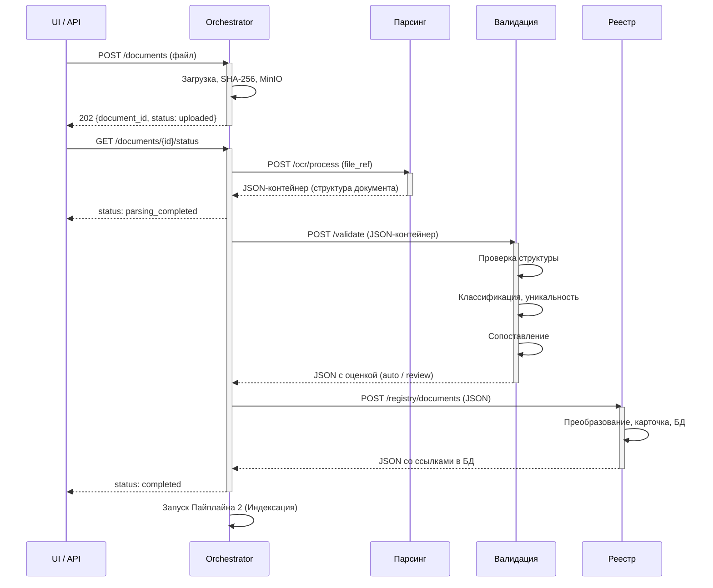
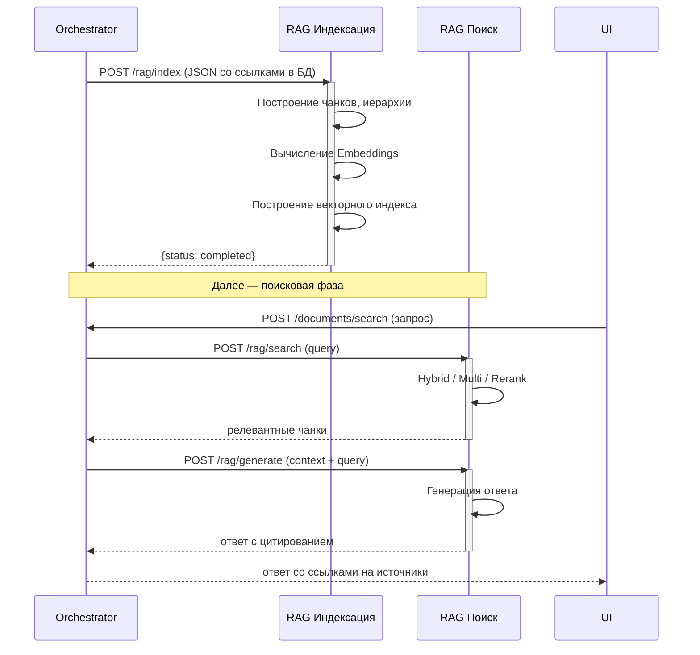
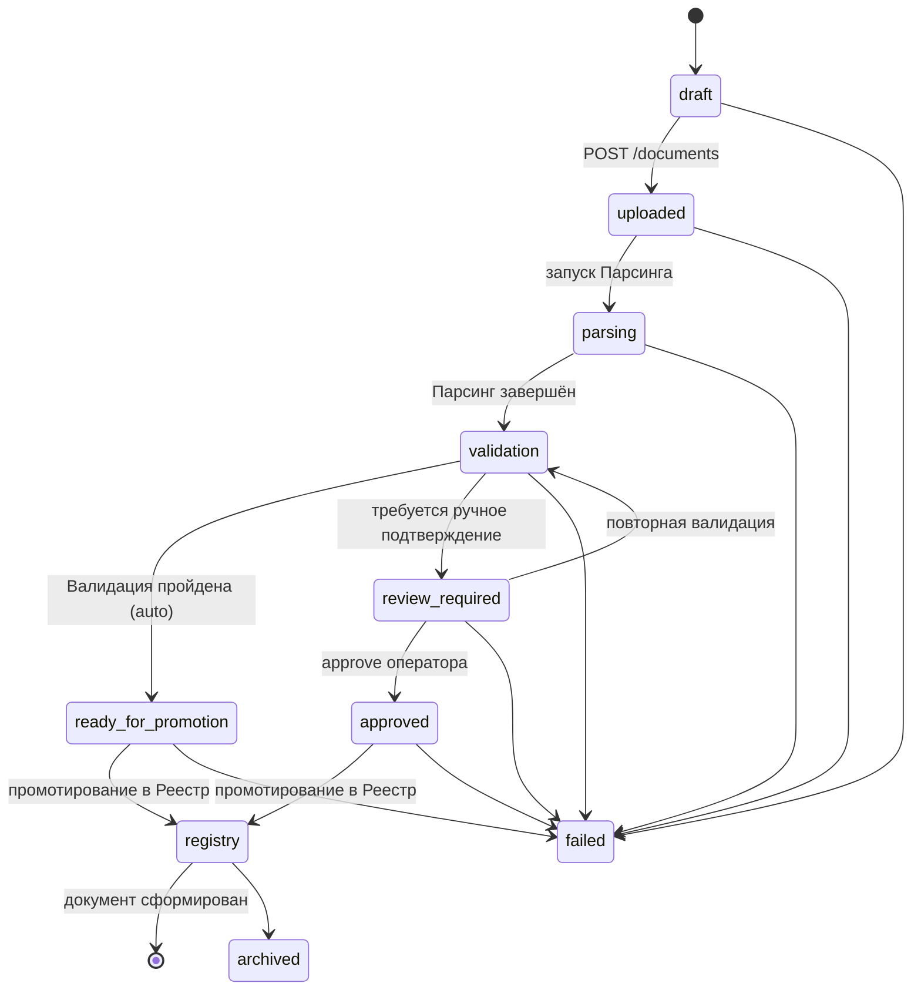
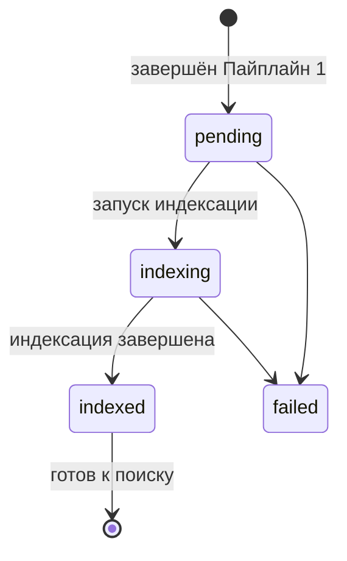

## Пайплайны обработки документов (v3.0)

Orchestrator координирует сквозную обработку документов через **два независимых пайплайна**, каждый из которых решает свою задачу и имеет строгую изоляцию по доступу к базе данных.

```
Пайплайн 1: Формирование документа
====================================
MinIO (ссылка) → [Парсинг] → JSON → [Валидация] → JSON → [Реестр] → JSON со ссылками в БД
                    (изоляция)      (читает БД)          (пишет БД)
                                                              ↓
Пайплайн 2: Индексация документа
====================================
                    JSON со ссылками в БД → [RAG индексация] → Статус
                                               (пишет БД)
                                                    ↓
                               JSON-запрос → [RAG поиск] → JSON-ответ
                                               (читает БД)
```

**Роль Оркестратора:** управляет последовательностью вызовов, передаёт JSON-контейнеры между этапами как **непрозрачные артефакты** (структура JSON известна только сервисам).

---

### 1. Пайплайн 1: Формирование документа

Назначение: преобразовать исходный файл в структурированную карточку документа в БД.



#### Этап 1: Парсинг (полная изоляция от БД)

**Сервис:** Парсинг / OCR Service

**Вход:** ссылка на файл в MinIO (изображение или PDF).

**Процесс:**

| Шаг | Действие | Результат |
|---|---|---|
| 1.1 | Скачать файл из MinIO | — |
| 1.2 | Очистка, нормализация изображения | Улучшение качества, ориентация |
| 1.3 | Распознавание документа (OCR / docling) | Текст, таблицы, изображения |
| 1.4 | Парсинг данных документа | Заголовки, разделы, метаданные |
| 1.5 | Построение структуры документа по оригиналу в виде JSON | Типизированная структура согласно типу документа |
| 1.6 | Оценка качества распознавания | confidence, статусы |

**Особенность:** полная изоляция от базы данных — сервис не имеет доступа к БД.

**Выход:**
```json
{
  "document_id": "b3a8f1c2-...",
  "version_id": "c4b9f2d3-...",
  "structure": {
    "type": "normative",
    "title": "ГОСТ Р ...",
    "sections": [
      {
        "heading": "1. Общие положения",
        "content": "Настоящий стандарт распространяется...",
        "page": 1,
        "subsections": []
      }
    ],
    "tables": [],
    "images": []
  },
  "classification": {
    "mks_oks_code": "47.020",
    "okstu_code": null,
    "udk_code": "629.5.021",
    "year": "1981"
  },
  "quality": {
    "confidence": 0.94,
    "pages_processed": 12,
    "pages_failed": 0
  },
  "status": "completed"
}
```

> **Примечание:** JSON-формат известен только сервису Парсинга и downstream-сервисам. Оркестратор оперирует им как непрозрачным контейнером.

---

#### Этап 2: Валидация (читает БД)

**Сервис:** Validation Service

**Вход:** структурированный JSON от этапа Парсинга.

**Процесс:**

| Шаг | Действие | Результат |
|---|---|---|
| 2.1 | Валидация структуры JSON | Проверка корректности и полноты |
| 2.2 | Классификация документа | Определение типа, эры, юрисдикции |
| 2.3 | Проверка уникальности в БД | Поиск дубликатов (SHA-256, title_hash) |
| 2.4 | Сопоставление с существующими документами | Связи преемственности (predecessor/successor) |
| 2.5 | Валидация классификационных кодов | По справочнику Registry (MKS, OKSTU, UDK) |

**Особенность:** единственный этап, который **читает** из базы данных.

**Выход:** JSON от Парсинга, обогащённый результатами валидации. Структура документа передаётся сквозным потоком.

```json
{
  "document_id": "b3a8f1c2-...",
  "version_id": "c4b9f2d3-...",
  "structure": {
    "type": "normative",
    "sections": [
      {
        "heading": "1. Общие положения",
        "content": "Настоящий стандарт...",
        "page": 1,
        "subsections": []
      }
    ],
    "tables": [
      {
        "page": 5,
        "caption": "Таблица 1 — Параметры",
        "headers": ["Параметр", "Значение"],
        "rows": [["Толщина", "12 мм"], ["Длина", "6000 мм"]]
      }
    ],
    "images": [
      {
        "image_id": "img-001",
        "page": 8,
        "file_path": "b3a8f1c2/v1/img/fig1.png",
        "caption": "Рисунок 1 — Стойка установочная",
        "width": 800,
        "height": 600
      }
    ]
  },
  "classification": {
    "mks_oks_code": "47.020",
    "okstu_code": null,
    "udk_code": "629.5.021",
    "year": "1981"
  },
  "quality": {
    "confidence": 0.94,
    "pages_processed": 12,
    "pages_failed": 0
  },
  "validation": {
    "id": "val-001",
    "structure_valid": true,
    "classifiers": {
      "mks_status": "CONFIRMED",
      "okstu_status": "NOT_USED",
      "overall_status": "CONFIRMED"
    },
    "uniqueness": {
      "is_duplicate_file": false,
      "is_duplicate_document": false,
      "content_hash_sha256": "abc123...",
      "title_hash_sha256": "def456..."
    },
    "matching": {
      "predecessor_doc_id": null,
      "successor_doc_id": null
    },
    "decision": "auto",
    "status": "completed"
  }
}
```

---

#### Этап 3: Реестр документов (пишет БД)

**Сервис:** Registry Service

**Вход:** JSON от этапа Валидации (содержит структуру документа + результаты валидации).

**Процесс:**

| Шаг | Действие | Результат |
|---|---|---|
| 3.1 | Сохранение карточки документа в `nsi.documents` | `registry_doc_id`, ссылки на ресурсы |
| 3.2 | Сохранение секций в `nsi.document_sections`, простановка `id` | Каждая секция получает DB-идентификатор |
| 3.3 | Сохранение таблиц в `nsi.extracted_tables`, простановка `id` | Каждая таблица получает DB-идентификатор |
| 3.4 | Сохранение связей изображений, простановка `file_url` | Изображения получают прямые ссылки |

**Особенность:** единственный этап, который **пишет** в базу данных. Структура документа не меняется — только проставляются DB-ссылки.

**Выход:** тот же JSON, что и на входе, но с проставленными идентификаторами и ссылками в БД — все данные, необходимые RAG для построения чанков и цитирования.

```json
{
  "document_id": "b3a8f1c2-...",
  "version_id": "c4b9f2d3-...",
  "registry": {
    "doc_id": 42,
    "title": "ГОСТ Р 12345-77",
    "doc_code": "20868-81",
    "source_type": "GOST",
    "era": "USSR",
    "validity_status": "active",
    "jurisdiction": "RU",
    "issuing_body": "Госстандарт СССР",
    "title_hash_sha256": "a1b2c3d4...",
    "links": {
      "document": "/api/v1/registry/documents/42",
      "versions": "/api/v1/registry/documents/42/versions"
    },
    "created_at": "2026-05-15T12:00:00Z"
  },
  "structure": {
    "type": "normative",
    "sections": [
      {
        "id": "sec-001",          // ← проставлен Registry
        "heading": "1. Общие положения",
        "content": "Настоящий стандарт...",
        "page": 1,
        "subsections": []
      }
    ],
    "tables": [
      {
        "id": "tbl-001",          // ← проставлен Registry
        "page": 5,
        "caption": "Таблица 1 — Параметры",
        "headers": ["Параметр", "Значение"],
        "rows": [["Толщина", "12 мм"], ["Длина", "6000 мм"]]
      }
    ],
    "images": [
      {
        "image_id": "img-001",
        "page": 8,
        "file_path": "b3a8f1c2/v1/img/fig1.png",
        "file_url": "/api/v1/files/img-001",  // ← проставлен Registry
        "caption": "Рисунок 1 — Стойка установочная",
        "width": 800,
        "height": 600
      }
    ]
  },
  "classification": {
    "mks_oks_code": "47.020",
    "okstu_code": null,
    "udk_code": "629.5.021",
    "year": "1981"
  },
  "quality": {
    "confidence": 0.94,
    "pages_processed": 12,
    "pages_failed": 0
  },
  "validation": {
    "id": "val-001",
    "structure_valid": true,
    "classifiers": { ... },
    "uniqueness": { ... },
    "matching": { ... },
    "decision": "auto",
    "status": "completed"
  },
  "files": {
    "original": "/api/v1/files/file-xyz",
    "preview": "/api/v1/documents/b3a8f1c2.../pages/1/preview"
  },
  "status": "archived"
}
```

---

### 2. Пайплайн 2: Индексация документа

Назначение: построить векторный индекс для семантического поиска и обеспечить RAG-функциональность.

**Вход (триггер):** успешное завершение Пайплайна 1 (получен JSON со ссылками в БД).



#### Этап 1: RAG индексация (пишет БД)

**Сервис:** RAG Service

**Вход:** полный JSON со структурой документа и ссылками в БД (результат Пайплайна 1).

JSON уже содержит все необходимые данные: метаданные документа, классификацию, секции с заголовками и содержимым, таблицы, ссылки на изображения. Дополнительного обращения к БД за содержимым не требуется.

**Процесс:**

| Шаг | Действие | Результат |
|---|---|---|
| 1.1 | Парсинг JSON — чтение структуры документа из входного контейнера | Документ, секции, таблицы, изображения |
| 1.2 | Построение чанков и иерархии | Разбиение на семантические фрагменты (по разделам/подразделам), построение ltree-иерархии |
| 1.3 | Вычисление Embeddings | Векторные представления для каждого текстового и табличного чанка |
| 1.4 | Построение векторного индекса | Сохранение чанков, эмбеддингов и индексов в БД |

**Особенность:** единственный этап, который **пишет** в базу данных — сохраняет чанки, эмбеддинги и индексы.

**Выход:**
```json
{
  "document_id": "b3a8f1c2-...",
  "status": "completed",
  "indexed_at": "2026-05-15T12:00:18Z",
  "chunks_count": 34,
  "index_stats": {
    "text_chunks": 28,
    "table_chunks": 3,
    "image_chunks": 3,
    "total_embeddings": 31
  }
}
```

---

#### Этап 2: RAG поиск (читает БД)

**Сервис:** RAG Service

**Вход:** JSON (поисковый запрос).

**Процесс:**

| Шаг | Действие | Результат |
|---|---|---|
| 2.1 | Поиск (Hybrid, Multi, Rerank) | Гибридный поиск по векторному индексу (семантический + ключевой + мультимодальный) с реранжированием |
| 2.2 | Генерация ответа | Отправка релевантных чанков во внутренний генеративный движок для синтеза ответа |
| 2.3 | Сопоставление с источником в БД | Привязка ответа к конкретным документам |

**Особенность:** единственный этап, который **читает** из базы данных — выполняет поиск по построенному индексу.

**Выход:**
```json
{
  "query": "ледовый класс Arc4",
  "results": [
    {
      "chunk_id": "chk-001",
      "document_id": "doc-norm-001",
      "document_title": "Правила РС",
      "page": 42,
      "text": "Для ледового класса Arc4 толщина обшивки...",
      "score": 0.92
    }
  ],
  "answer": {
    "content": "Согласно Правилам, толщина обшивки для Arc4 не менее 12 мм.",
    "sources": [
      {
        "document_id": "doc-norm-001",
        "document_title": "Правила РС",
        "page": 42,
        "fragment_id": "chk-001"
      }
    ]
  },
  "processing_time_ms": 120
}
```

---

### 3. Сводная таблица доступа к БД

| Пайплайн | Этап | Доступ к БД | Направление данных |
|----------|------|-------------|-------------------|
| Формирование | 1. Парсинг | **Нет** (изоляция) | Вход: ссылка MinIO → Выход: JSON |
| Формирование | 2. Валидация | **Читает** | Вход: JSON → Выход: JSON с решением |
| Формирование | 3. Реестр | **Пишет** | Вход: JSON → Выход: JSON со ссылками |
| Индексация | 1. RAG индексация | **Пишет** | Вход: JSON со ссылками → Выход: статус |
| Индексация | 2. RAG поиск | **Читает** | Вход: JSON-запрос → Выход: JSON-ответ |

---

### 4. Статусная модель (FSM)

#### Пайплайн 1: Формирование документа



#### Пайплайн 2: Индексация документа



---

### 5. Матрица ответственности сервисов

| Операция | Пайплайн | Этап | Сервис | Доступ к БД |
|---|---|---|---|---|
| Загрузка файла, SHA-256, MinIO | 1 | Пре-стейдж | **Orchestrator** | Пишет |
| Распознавание, парсинг структуры | 1 | 1. Парсинг | **Парсинг / OCR Service** | Нет |
| Валидация JSON, классификация | 1 | 2. Валидация | **Validation Service** | Читает |
| Проверка кодов по справочнику | 1 | 2. Валидация | **Registry Service** | Читает |
| Запись карточки документа в БД | 1 | 3. Реестр | **Registry Service** | Пишет |
| Чанкинг + Embeddings + Индекс | 2 | 1. RAG индексация | **RAG Service** | Пишет |
| Поиск + генерация ответа | 2 | 2. RAG поиск | **RAG Service** | Читает |

---

### 6. Эндпоинты внутренних сервисов

#### Парсинг / OCR Service

| Метод | Путь | Описание | Доступ к БД |
|---|---|---|---|
| `POST` | `/ocr/process` | Асинхронный запуск распознавания и парсинга | Нет |
| `GET` | `/ocr/process/{task_id}/status` | Статус обработки | Нет |
| `GET` | `/ocr/process/{task_id}/result` | Получение JSON-контейнера с результатом парсинга | Нет |

#### Validation Service

| Метод | Путь | Описание | Доступ к БД |
|---|---|---|---|
| `POST` | `/validate/document` | Комплексная валидация документа (структура, классификация, уникальность) | Читает |
| `POST` | `/validate/classifiers` | Валидация классификационных кодов | Читает |
| `POST` | `/validate/compare` | Сопоставление с существующими документами | Читает |
| `POST` | `/validate/check` | Проверка правил | Нет |
| `POST` | `/validate/calculate` | Арифметические вычисления | Нет |

#### Registry Service

| Метод | Путь | Описание | Доступ к БД |
|---|---|---|---|
| `POST` | `/registry/documents` | Создание карточки документа (Реестр) | Пишет |
| `GET` | `/registry/documents` | Список документов в реестре | Читает |
| `GET` | `/registry/documents/{id}` | Детали документа | Читает |
| `POST` | `/registry/classifiers/validate` | Валидация классификационных кодов по справочнику | Читает |
| `GET` | `/registry/classifiers` | Справочники классификаторов | Читает |

#### RAG Service

| Метод | Путь | Пайплайн | Описание | Доступ к БД |
|---|---|---|---|---|
| `POST` | `/rag/index` | 2 (Индексация) | Чанкинг + Embeddings + построение индекса | Пишет |
| `DELETE` | `/rag/index/{document_id}` | 2 (Индексация) | Удаление чанков документа из индекса | Пишет |
| `GET` | `/rag/index/{document_id}/status` | 2 (Индексация) | Статус индексации | Читает |
| `POST` | `/rag/search` | 2 (Поиск) | Гибридный поиск (dense + sparse + pg_trgm) | Читает |
| `POST` | `/rag/generate` | 2 (Поиск) | Генерация ответа с опорой на контекст | Читает |

---

### 7. Поток данных (Data Flow)

```mermaid
graph LR
    subgraph "Пайплайн 1: Формирование документа"
        MinIO[(MinIO)] -->|file_ref| P[Парсинг]
        P -->|JSON (opaque)| V[Валидация]
        V -->|JSON (opaque)| R[Реестр]
        R -->|JSON со ссылками| DB[(PostgreSQL<br/>Registry nsi)]
    end

    subgraph "Пайплайн 2: Индексация документа"
        DB -->|JSON со ссылками| RI[RAG Индексация]
        RI -->|status| DB
        RI --> VI[(Векторный индекс<br/>pgvector)]
        UI -->|поисковый запрос| RS[RAG Поиск]
        VI --> RS
        RS -->|JSON-ответ| UI
    end

    style P fill:#e6f3ff,stroke:#333
    style V fill:#fff3e6,stroke:#333
    style R fill:#e6ffe6,stroke:#333
    style RI fill:#ffe6f3,stroke:#333
    style RS fill:#f3e6ff,stroke:#333
```

**Форматы передачи между этапами:**

| Между | Формат | Протокол | Примечание |
|---|---|---|---|
| Orchestrator → Парсинг | `file_ref` (ссылка MinIO) | JSON via HTTP | — |
| Парсинг → Orchestrator | **JSON-контейнер** (структура документа) | JSON via HTTP | Непрозрачен для Orchestrator |
| Orchestrator → Валидация | **JSON-контейнер** (от Парсинга) | JSON via HTTP | Непрозрачен для Orchestrator |
| Валидация → Orchestrator | **JSON с решением** (auto / review) | JSON via HTTP | Непрозрачен для Orchestrator |
| Orchestrator → Реестр | **JSON с решением** (от Валидации) | JSON via HTTP | Непрозрачен для Orchestrator |
| Реестр → Orchestrator | **JSON со ссылками в БД** | JSON via HTTP | — |
| Orchestrator → RAG индексация | **JSON со ссылками в БД** | JSON via HTTP | — |
| RAG индексация → Orchestrator | Статус завершения | JSON via HTTP | — |
| UI → Orchestrator | Поисковый запрос | JSON via HTTP | — |
| Orchestrator → RAG поиск | Поисковый запрос | JSON via HTTP | — |
| RAG поиск → Orchestrator | **JSON-ответ с цитированием** | JSON via HTTP | — |

---

### 8. Ключевые архитектурные решения

| Решение | Обоснование |
|---|---|
| **Два пайплайна вместо одного** | Разделяет concerns: формирование документа (бизнес-логика) и индексация для поиска (RAG). Позволяет индексировать повторно без повторного распознавания |
| **Чанкинг в RAG индексации, а не в Парсинге** | Парсинг отвечает только за распознавание и структурирование. Чанкинг — задача RAG для оптимизации поиска. Разные стратегии чанкинга не влияют на карточку документа |
| **Изоляция доступа к БД по этапам** | Парсинг не зависит от БД — может масштабироваться горизонтально. Валидация читает, Реестр пишет — исключены гонки и каскадные锁. RAG индексация пишет, RAG поиск читает — консистентность данных |
| **Оркестратор оперирует JSON как контейнером** | Структура JSON известна только сервисам. Orchestrator не имеет доступа к БД (кроме пре-стейджа загрузки). Снижает связанность, упрощает тестирование и замену сервисов |
| **CAS-пути для файлов** | `{doc_id}/v{n}/{hash}.{ext}` — гарантирует целостность и исключает дубликаты |
| **Бизнес-ключ `title_hash_sha256`** | Учитывает `era`, `source_type`, коды классификации — исключает коллизии (ГОСТ СССР vs ГОСТ РФ с одинаковым номером) |
| **Разделение logical doc и physical versions** | Один ГОСТ может иметь скан, цифру, чертёж — но это один документ |
| **JSON со ссылками как интерфейс между пайплайнами** | Пайплайн 1 завершается выдачей JSON со ссылками в БД. Пайплайн 2 стартует с этого JSON. Независимость жизненных циклов |
