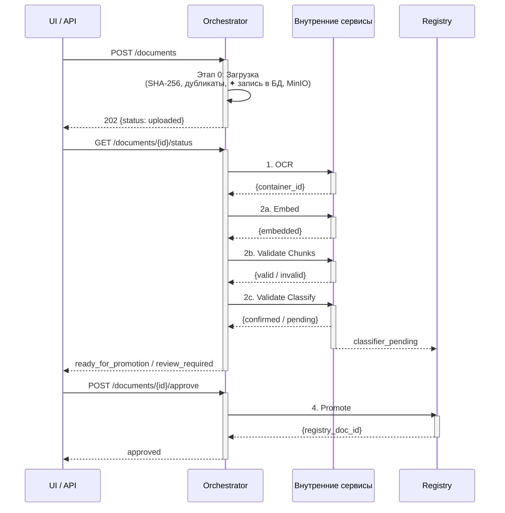
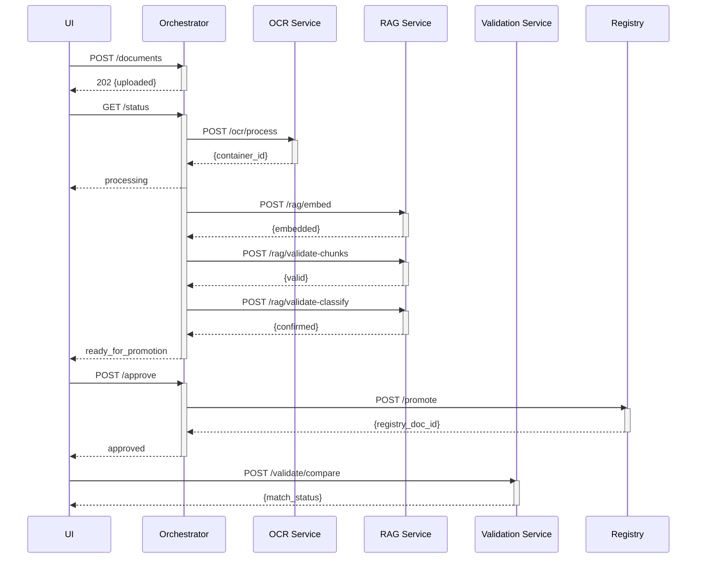
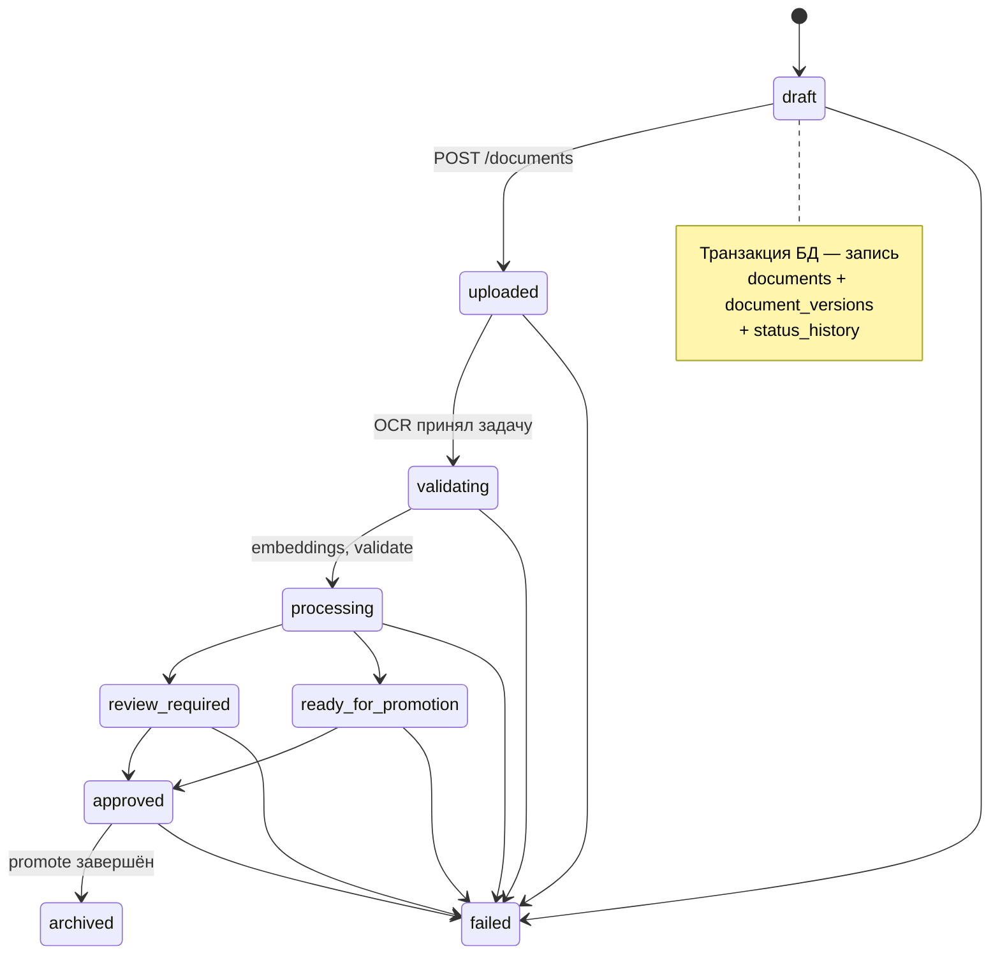
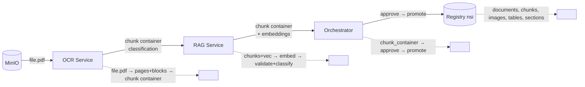

## Конвейер обработки документов Purgatory (v2.3)

Orchestrator координирует сквозной конвейер: от загрузки файла до атомарной записи в Registry (nsi). Каждый этап — вызов внутреннего сервиса (OCR, RAG, Validation).

```mermaid
graph TD
    A["Orchestrator: Этап 0<br/>&#9670; Запись в БД (status=uploaded)<br/>1. SHA-256, дубликаты<br/>2. Файл → MinIO<br/>3. Задача в очередь"]
    A -->|"после коммита<br/>транзакции"| B["1. OCR Service<br/>/ocr/process → container_id"]
    B --> C["2. RAG Service<br/>2a. /rag/embed — embeddings<br/>2b. /rag/validate-chunks<br/>2c. /rag/validate-classify"]
    C -->|"если valid"| D["Orchestrator<br/>POST /documents/{id}/approve<br/>POST /documents/{id}/promote"]
    D --> E["Registry (nsi)<br/>documents, chunks, images, tables"]

    style A fill:#e6f3ff,stroke:#333
    style D fill:#fff3e6,stroke:#333
    style E fill:#e6ffe6,stroke:#333
```



**Validation Service** — отдельно, для бизнес-сценариев:
  `POST /validate/compare` — норма vs проект
  `POST /validate/check` — проверка правил
  `POST /validate/calculate` — арифметика

---

### 1. Общая схема



---

### 1.1 Полный цикл (sequence)



---

### 2. Этапы конвейера (детально)

#### Этап 0: Загрузка и дедупликация

**Сервис:** Orchestrator

| Шаг | Действие | Результат |
|---|---|---|
| | **Транзакция БД (atomic):** | |
| 0.1 | Принять `multipart/form-data` с файлом и метаданными | — |
| 0.2 | Вычислить `SHA-256` содержимого файла | `content_hash_sha256` |
| 0.3 | Проверить `content_hash_sha256` на дубликат файла | `is_duplicate_file` |
| 0.4 | Нормализовать название, вычислить `title_hash_sha256` | бизнес-ключ: `SHA-256(era\|source_type\|mks\|okstu\|doc_code\|normalized_title)` |
| 0.5 | Проверить бизнес-ключ на дубликат документа | `is_duplicate_document` |
| 0.6 | Создать/найти `documents` (логическая карточка) | `document_id` (UUID) |
| 0.7 | Создать `document_versions` (физическая версия файла) | `version_id` (UUID) |
| 0.8 | ✦ **Записать первое состояние** — `status_history` | `draft → uploaded` |
| | ── **Фиксация транзакции (COMMIT)** ── | — |
| | **После коммита:** | |
| 0.9 | Сохранить файл в MinIO по CAS-пути | `{doc_id}/v{n}/{hash}.{ext}` |
| 0.10 | Поставить задачу в очередь Celery | `task_id` (UUID) |

**API:** `POST /documents`

**Ответ `202`:** `{ document_id, version_id, status: "uploaded", content_hash_sha256, title_hash_sha256, task_id }`

---

#### Этап 1: OCR + Layout Parsing + Чанкинг

**Сервис:** OCR Service

**Вход:** `version_id` (ссылка на файл в MinIO)

| Шаг | Действие | Детали |
|---|---|---|
| 1.1 | Скачать файл из MinIO по `file_id` | — |
| 1.2 | Определить формат через `format_registry` | pdf_digital → docling, pdf_scan → paddleocr, dwg → cad_parser |
| 1.3 | Выполнить OCR/распознавание | docling / paddleocr / tesseract |
| 1.4 | Извлечь структуру документа | Заголовки, разделы, подразделы |
| 1.5 | Построить ltree-иерархию | `root.section1.subsection1_1` |
| 1.6 | Разбить на чанки | По пунктам/разделам, не более 512 токенов |
| 1.7 | Извлечь таблицы (с сохранением структуры) | JSONB: headers + rows |
| 1.8 | Извлечь изображения | Подписи, bounding boxes |
| 1.9 | **Извлечь коды классификации** | МКС/ОКС, ОКСТУ, УДК, год издания |
| 1.10 | Собрать chunk container | JSON-манифест (chunks + images + classification) |
| 1.11 | Вернуть готовый chunk container Оркестратору | полный JSON |
| 1.12 | Оркестратор сохраняет контейнер в `purgatory.chunk_containers` | `container_id` |

**Поля chunk container:**

```json
{
  "container_id": "cnt-001",
  "document_id": "b3a8f1c2-...",
  "version_id": "c4b9f2d3-...",
  "version_hash": "sha256-of-payload",
  "chunks": [
    {
      "chunk_id": "chk-001",
      "sequence": 1,
      "ltree_path": "root.section1.subsection1_1",
      "heading": "1. Общие положения",
      "text": "Настоящий стандарт распространяется...",
      "page": 1,
      "chunk_type": "text",                    // text | table | image | formula
      "token_count": 256,
      "has_embedding": false,
      "bbox": { "x": 120, "y": 350, "width": 400, "height": 60 },
      "references": ["ГОСТ 12345-77"],
      "table_data": null,
      "image_data": null
    }
  ],
  "images": [
    {
      "image_id": "img-001",
      "chunk_id": "chk-020",
      "page": 8,
      "file_path": "b3a8f1c2/v1/img/fig1.png",
      "caption": "Рисунок 1 — Стойка установочная",
      "width": 800, "height": 600
    }
  ],
  "classification": {
    "mks_oks_code": "47.020",
    "mks_display_name": "Конструкция корпуса",
    "mks_status": "CONFIRMED",                // CONFIRMED | PENDING_REVIEW | NOT_FOUND
    "okstu_code": null,
    "okstu_status": "NOT_USED",
    "udk_code": "629.5.021",
    "year": "1981",
    "confidence": 0.89
  }
}
```

**API вызов (Orchestrator → OCR):** `POST /ocr/process` → асинхронно (`202`)  
**Polling:** `GET /ocr/process/{task_id}/status` → `completed`  
**Получение контейнера:** `GET /ocr/process/{task_id}/container` → полный JSON в теле ответа

**Результат:** Оркестратор сохраняет контейнер в `purgatory.chunk_containers` (JSONB). Статус документа → `processing`. Оркестратор — **единственный владелец** контейнера.

---

#### Этап 2: Embedding + Валидация данных (RAG Service)

**Сервис:** RAG Service

Три последовательных вызова:

##### 2a. Вычисление embeddings

**Оркестратор → RAG:** `POST /rag/embed`

```json
{
  "container": {
    "container_id": "cnt-001",
    "document_id": "b3a8f1c2-...",
    "chunks": [ { "chunk_id": "chk-001", "text": "...", "has_embedding": false } ],
    "images": [ ... ],
    "classification": { ... }
  },
  "model": "default"
}
```

RAG Service — **stateless-функция**:
- Получает контейнер в теле запроса
- Вычисляет embedding для каждого текстового чанка
- Возвращает **обновлённый контейнер** с векторами в ответе
- **Не ходит в БД** — только обрабатывает JSON

**Ответ `200`:**
```json
{
  "container": {
    "container_id": "cnt-001",
    "chunks": [
      { "chunk_id": "chk-001", "has_embedding": true,
        "embedding": [0.123, -0.456, ...] }
    ],
    ...
  },
  "embedded_chunks": 34,
  "failed_chunks": 0,
  "status": "completed"
}
```

**Результат:** Оркестратор сохраняет обновлённый контейнер (с векторами) в `purgatory.chunk_containers`.

##### 2b. Валидация chunk container

**Оркестратор → RAG:** `POST /rag/validate-chunks`

```json
{
  "container": {
    "container_id": "cnt-001",
    "chunks": [ { "chunk_id": "...", "text": "...", "ltree_path": "...",
                   "has_embedding": true, "embedding": [...] } ]
  },
  "schema_version": "purgatory-v2.3"
}
```

Проверки:

| Проверка | Описание | Severity |
|---|---|---|
| `CHUNK_HAS_TEXT` | Все чанки содержат текст | error |
| `CHUNK_HAS_LTREE` | Все чанки имеют `ltree_path` | error |
| `LTREE_STRUCTURE_VALID` | ltree-пути не содержат ошибок (двойные точки, циклы) | error |
| `CHUNK_HAS_EMBEDDING` | Все текстовые чанки имеют `embedding` | error |
| `NO_ORPHAN_CHUNKS` | Нет чанков с parent'ом, который не существует | warning |
| `CHUNK_TYPE_MATCHES` | `chunk_type` соответствует содержимому | warning |
| `TABLE_HAS_DATA` | Чанки-таблицы содержат `table_data` | warning |

**Ответ (успех):** `{ status: "valid", checks_passed: 14, checks_failed: 0 }`  
**Ответ (ошибки):** `{ status: "invalid", checks_failed: 2, errors: [{ chunk_id, code, severity, message }] }`

##### 2c. Валидация классификации

**Оркестратор → RAG:** `POST /rag/validate-classify`

```json
{
  "document_id": "b3a8f1c2-...",
  "classification": {
    "mks_oks_code": "47.020",
    "okstu_code": null,
    "udk_code": "629.5.021"
  }
}
```

RAG Service:
- Сверяет `mks_oks_code` со справочником `classifier_registry` (system='MKS')
- Сверяет `okstu_code` со справочником `classifier_registry` (system='OKSTU')
- **Возвращает статус по каждому коду** — больше ничего не делает
- **Не отправляет данные никуда** — чистая валидация

**Статусы:**

| Статус | Значение |
|---|---|
| `CONFIRMED` | Код найден в справочнике и верифицирован |
| `PENDING_REVIEW` | Код не найден в справочнике — требует ручного разбора |
| `NOT_FOUND` | Парсер не обнаружил код на первых страницах |
| `NOT_USED` | Не применяется для данной эры/типа документа |
| `UNASSIGNED` | Классификация не назначалась |

**Итог этапа 2:**

| Условие | Действие Orchestrator |
|---|---|
| validation = `valid`, classify = `confirmed` | Статус → `ready_for_promotion` |
| validation = `invalid` или classify = `pending_review` | Для каждого `PENDING_REVIEW`: вызвать `POST /registry/classifiers/pending`. Статус → `review_required` |

---

#### Этап 3: Approve (опционально)

**Сервис:** Orchestrator (ручное действие оператора)

Если документ в статусе `review_required`:

| Шаг | Действие |
|---|---|
| 3.1 | Оператор смотрит ошибки через `GET /documents/{doc_id}/chunks` |
| 3.2 | Оператор исправляет метаданные (PATCH) или перезапускает обработку (`POST /documents/{doc_id}/reprocess`) |
| 3.3 | Оператор вызывает `POST /documents/{doc_id}/approve` |

**API:** `POST /documents/{doc_id}/approve`

```json
{
  "force": false,
  "comment": "Все ошибки исправлены"
}
```

**Ответ `202`:** статус → `approved`, запускается промотирование.

Если документ уже в `ready_for_promotion` — аппрув может быть автоматическим (без участия оператора).

---

#### Этап 4: Промотирование в Registry

**Сервис:** Orchestrator

**API:** `POST /documents/{doc_id}/promote` (обычно вызывается автоматически после аппрува)

Orchestrator:
1. Читает готовый chunk container (container_id)
2. Разбивает на сущности
3. Атомарно записывает (транзакция) в Registry (схема nsi):

| Сущность | Таблица в Registry | Данные |
|---|---|---|
| Документ | `nsi.documents` | `title`, `doc_code`, `source_type`, `title_hash_sha256`, `era`, `validity_status`, `jurisdiction`, `issuing_body`, `mks_oks_code`, `okstu_code`, `classification_status`, `successor_doc_id`, `predecessor_doc_id`, `metadata` |
| Секции | `nsi.document_sections` | ltree-пути: `root`, `root.section1`, `root.section1.subsection1_1` |
| Чанки | `nsi.chunks` | `chunk_id`, `text`, `embedding`, `page`, `ltree_path`, `bbox`, `chunk_type`, `sequence` |
| Изображения | `nsi.images` | `image_id`, `chunk_id`, `file_path`, `caption`, `page`, `width`, `height` |
| Таблицы | `nsi.extracted_tables` | `chunk_id`, `table_data` (JSONB: headers + rows) |
| Связи | `nsi.chunk_relations` | `source_chunk_id`, `target_chunk_id`, `relation_type` |

4. Обновляет `documents.chunk_container_id` → ссылка на актуальный контейнер
5. Статус документа → `archived`

**Статус промотирования:** `GET /documents/{doc_id}/promotion-status`

```json
{
  "promotion_id": "promo-9a3f2b",
  "status": "completed",
  "registry_doc_id": "42",
  "steps": {
    "documents": { "status": "completed", "registry_doc_id": "42" },
    "document_sections": { "status": "completed", "sections_created": 5 },
    "chunks": { "status": "completed", "chunks_indexed": 34 },
    "images": { "status": "completed", "images_indexed": 7 },
    "tables": { "status": "completed", "tables_indexed": 3 },
    "chunk_relations": { "status": "completed", "relations_created": 12 }
  },
  "completed_at": "2026-05-15T12:00:18Z"
}
```

---

### 3. Статусная модель (FSM)



**Журнал переходов:** все изменения логируются в `status_history` автоматически.

---

### 4. Матрица ответственности сервисов

| Операция | Сервис | Синхр./Асинхр. | Внутренний API |
|---|---|---|---|
| Загрузка файла, дедупликация | **Orchestrator** | Sync → Async | `POST /documents` |
| Создание версии файла | **Orchestrator** | Sync → Async | `POST /documents/{id}/versions` |
| OCR + Layout + Чанкинг | **OCR Service** | Async | `POST /ocr/process` |
| Извлечение классификации | **OCR Service** | Async | (внутри `/ocr/process`) |
| Вычисление embeddings | **RAG Service** | Async | `POST /rag/embed` |
| Валидация chunk container | **RAG Service** | Sync | `POST /rag/validate-chunks` |
| Проверка классификации | **RAG Service** | Sync | `POST /rag/validate-classify` |
| Создание classifier_pending | **Orchestrator** (на основе статуса от RAG) | Sync | `POST /registry/classifiers/pending` |
| Просмотр чанков (review) | **Orchestrator** | Sync | `GET /documents/{id}/chunks` |
| Аппрув документа | **Orchestrator** | Sync | `POST /documents/{id}/approve` |
| Промотирование в Registry | **Orchestrator** | Async | `POST /documents/{id}/promote` |
| Статус промотирования | **Orchestrator** | Sync | `GET /documents/{id}/promotion-status` |
| История статусов | **Orchestrator** | Sync | `GET /documents/{id}/history` |
| Сопоставление норм и проекта | **Validation Service** | Async | `POST /validate/compare` |
| Проверка правил | **Validation Service** | Sync | `POST /validate/check` |
| Арифметические вычисления | **Validation Service** | Sync | `POST /validate/calculate` |

---

### 5. Эндпоинты внутренних сервисов

#### OCR Service

| Метод | Путь | Описание |
|---|---|---|
| `POST` | `/ocr/process` | Расширен: `version_id` + `file_id`. Асинхронный (`202`). Возвращает `container_id` + `classification` |
| `GET` | `/ocr/process/{task_id}/status` | 🆕 Статус асинхронной обработки |
| `GET` | `/ocr/container/{container_id}` | 🆕 Получение готового chunk container |
| `GET` | `/ocr/engines` | Получение списка доступных OCR-движков |
| `GET` | `/ocr/processes` | 🆕 Получение списка текущих процессов обработки |

#### RAG Service

| Метод | Путь | Описание |
|---|---|---|
| `POST` | `/rag/embed` | 🆕 Вычисление embeddings для чанков контейнера |
| `POST` | `/rag/validate-chunks` | 🆕 Валидация chunk container (JSON Schema, ltree, полнота) |
| `POST` | `/rag/validate-classify` | 🆕 Проверка классификационных кодов по справочнику |
| `GET` | `/rag/embed/{task_id}/status` | 🆕 Статус вычисления embeddings |
| `POST` | `/rag/index` | Индексация документов в production RAG |
| `POST` | `/rag/search` | Поиск по проиндексированным документам |
| `POST` | `/rag/generate` | Генерация ответа на основе найденных документов |

#### Validation Service

| Метод | Путь | Описание |
|---|---|---|
| `POST` | `/validate/extract/parameters` | Извлечение параметров из документа |
| `POST` | `/validate/check` | Проверка корректности документа |
| `POST` | `/validate/calculate` | Вычисление метаданных документа |
| `POST` | `/validate/compare` | Сравнение двух документов |
| `POST` | `/validate/compare/batch` | Пакетное сравнение документов |
| `POST` | `/validate/recommend` | Формирование рекомендаций на основе валидации |

---

### 6. Поток данных (Data Flow)



**Форматы передачи между сервисами:**

| Между | Формат | Протокол |
|---|---|---|
| Orchestrator → OCR | `version_id` + `file_id` | JSON via HTTP |
| OCR → Orchestrator | **полный `container` JSON** (через `GET /ocr/process/{task_id}/container`) | JSON via HTTP |
| Orchestrator → RAG | **полный `container` JSON** | JSON via HTTP |
| RAG → Orchestrator | **обновлённый `container` JSON** (embed) / статусы классификации (classify) / `{valid/invalid}` (validate) | JSON via HTTP |
| Orchestrator → Registry | `classifier_pending`, chunk container → сущности | атомарная транзакция (через API Registry) |


---

### 7. Ключевые архитектурные решения

| Решение | Обоснование |
|---|---|
| **Chunk container** как единый артефакт между этапами | Позволяет валидировать весь документ целиком, а не по частям. Упрощает отладку |
| **Валидация в RAG** (не в Validation) | RAG уже имеет доступ к embeddings и метаданным чанков. Validation занимается бизнес-логикой |
| **CAS-пути для файлов** | `{doc_id}/v{n}/{hash}.{ext}` — гарантирует целостность и исключает дубликаты |
| **Разделение logical doc и physical versions** | Один ГОСТ может иметь скан, цифру, чертёж — но это один документ |
| **Бизнес-ключ `title_hash_sha256`** | Учитывает `era`, `source_type`, коды классификации — исключает коллизии (ГОСТ СССР vs ГОСТ РФ с одинаковым номером) |
| **`classifier_pending` буфер** | Коды, не найденные в справочнике, не блокируют загрузку, а ставятся в очередь административного разбора |
| **Атомарное промотирование** | Транзакция БД гарантирует, что документ либо полностью записан в Registry, либо не записан вовсе |
| **Оркестратор — единственный владелец контейнера** | Сервисы (OCR, RAG) не имеют доступа к `purgatory.chunk_containers`. Обмениваются полным JSON через HTTP. Устраняет гонки, упрощает тестирование |