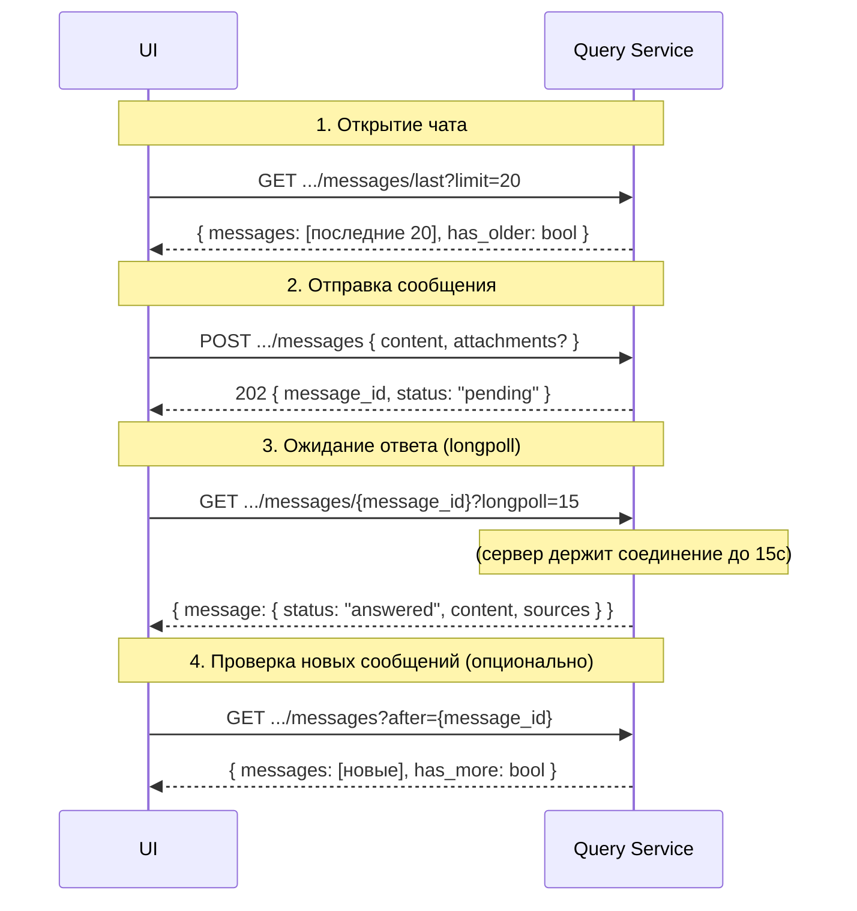

## API Query Service (query-service:8083)

Сервис диалоговых сессий, текстовой обработки, истории запросов и **точка входа для поиска**.

Query Service принимает запросы от UI, вызывает RAG Search для поиска чанков, формирует контекст и генерирует ответ через LLM, выполняет обогащение цитирований machine-readable идентификаторами и возвращает результат пользователю.

**Внутренний процесс поиска (асинхронный):**
1. UI отправляет сообщение в чат
2. Query Service сохраняет сообщение в истории чата, возвращает `202` со статусом `pending`
3. UI переходит в состояние ожидания, отображая индикатор обработки
4. Query Service обогащает запрос через словарь терминов (нормализация терминов)
5. Query Service вызывает `POST /rag/search` (RAG Search) — поиск чанков
6. RAG возвращает массив релевантных чанков с полным содержимым
7. Query Service формирует контекст из чанков и вызывает LLM для генерации ответа
8. Query Service обогащает цитирования — добавляет `%[document_id:…]%`, `%[section_id:…]%` в текст ответа
9. Результат сохраняется в истории чата (статус `answered`)
10. UI ожидает ответ через longpoll на конкретное сообщение: `GET /chat/sessions/{session_id}/messages/{message_id}?longpoll=15`

**Базовый URL (внутренний)**: `http://127.0.0.1:8083/api/v1`
**Базовый URL (через Gateway)**: `http://127.0.0.1:8080/api/v1`

### Группы

| Группа | Описание                                                       |
| ------ | -------------------------------------------------------------- |
| `chat` | Диалоговые сессии, сообщения, обратная связь, история запросов, проекты |
| `text` | Обработка произвольного текста (нормализация, поиск)           |

### Формат ответа

Формат ответа и ошибок — см. [common_api.md](../common_api.md#формат-ответа).

**Специфичные коды ошибок Query-сервиса:**
| HTTP | `error.code` | Описание |
|------|-------------|----------|
| 400 | `EMPTY_MESSAGE` | Пустое сообщение |
| 404 | `SESSION_NOT_FOUND` | Сессия чата не найдена |
| 404 | `MESSAGE_NOT_FOUND` | Сообщение не найдено |
| 502 | `LLM_GENERATION_FAILED` | Ошибка генерации LLM |

### Содержание

| Метод  | Путь                                   | Описание                                                                                 |
| ------ | -------------------------------------- | ---------------------------------------------------------------------------------------- |
| POST   | `/chat/projects`                      | Создать проект                                                                           |
| GET    | `/chat/projects`                      | Список проектов                                                                          |
| GET    | `/chat/projects/{project_id}`         | Получить проект по ID                                                                    |
| PUT    | `/chat/projects/{project_id}`         | Обновить проект                                                                          |
| DELETE | `/chat/projects/{project_id}`         | Удалить проект                                                                           |
| POST   | `/chat/sessions`                       | Создать новую диалоговую сессию                                                          |
| GET    | `/chat/sessions`                       | Список сессий пользователя                                                               |
| GET    | `/chat/sessions/{session_id}`          | История сообщений в сессии                                                               |
| PUT    | `/chat/sessions/{session_id}`          | Обновить параметры сессии                                                                |
| DELETE | `/chat/sessions/{session_id}`          | Удалить сессию                                                                           |
| POST   | `/chat/sessions/{session_id}/messages` | Отправить сообщение                                                                      |
| GET    | `/chat/sessions/{session_id}/messages` | Список сообщений сессии (пагинация `after`/`before`)                                     |
| GET    | `/chat/sessions/{session_id}/messages/last` | Последние N сообщений сессии                                                        |
| GET    | `/chat/sessions/{session_id}/messages/{message_id}` | Получить сообщение по ID (с longpoll)                                        |
| POST   | `/chat/sessions/{session_id}/context`  | Управление контекстом                                                                    |
| POST   | `/chat/sessions/{session_id}/export`   | Экспорт диалога                                                                          |
| POST   | `/chat/feedback`                       | Обратная связь по ответу                                                                 |
| GET    | `/chat/history`                        | Журнал запросов (плоский список)                                                         |
| GET    | `/chat/history/export`                 | Экспорт истории                                                                          |
| POST   | `/text/search`                         | Поиск по произвольному тексту                                                            |

### Иерархия маршрутов Q&A

| Сценарий                                              | Маршрут                                                                    | Рекомендация                  |
| ----------------------------------------------------- | -------------------------------------------------------------------------- | ----------------------------- |
| Многосообщений в существующей сессии                  | `POST /chat/sessions/{id}/messages`                                        | **Основной для UI** (чаты)    |
| Стартовая загрузка чата                               | `GET /chat/sessions/{id}/messages/last?limit=20`                           | Загрузка хвоста диалога       |
| Ожидание ответа на отправленное сообщение             | `GET /chat/sessions/{id}/messages/{message_id}?longpoll=15`                | **Longpoll**                  |
| Проверка новых сообщений (синхронно, без longpoll)    | `GET /chat/sessions/{id}/messages?after={message_id}`                      | Polling / синхронизация вкладок |
| Поиск по произвольному тексту                         | `POST /text/search`                                                        | Поисковый сценарий            |

> UI обращается к Query Service напрямую. Orchestrator не проксирует чат-функции.

### Сценарий работы UI с чатом

Типовой сценарий взаимодействия UI с Query Service от открытия чата до получения ответа:



**Пояснение шагов:**

**Шаг 1 — Открытие чата**
- Запрос: `GET /chat/sessions/{session_id}/messages/last?limit=20`
- UI получает последние 20 сообщений (хвост диалога).
- Если `has_older: true` — UI может подгрузить более старые сообщения через `GET .../messages?before=42000XXX`.

**Шаг 2 — Отправка сообщения**
- Запрос: `POST /chat/sessions/{session_id}/messages`
- UI отправляет текст сообщения и опциональные вложения (attachments).
- Сервер возвращает `202 Accepted` с `message_id` и статусом `pending`.
- UI запоминает `message_id` для следующего шага и отображает индикатор ожидания.

**Шаг 3 — Ожидание ответа (longpoll)**
- Запрос: `GET /chat/sessions/{session_id}/messages/{message_id}?longpoll=15`
- Сервер держит соединение до 15 секунд. Как только статус сообщения меняется на `answered` — возвращает ответ.
- Если за 15 секунд статус не стал финальным — сервер возвращает текущее состояние, UI повторяет запрос.
- При получении статуса `answered` UI отображает ответ пользователю.

**Шаг 4 — Проверка новых сообщений (опционально)**
- Запрос: `GET /chat/sessions/{session_id}/messages?after={последний_message_id}`
- Используется для синхронизации между вкладками или после перерыва в longpoll.
- Возвращает только новые сообщения — дельта, без повторной передачи всей истории.

### Именование полей источников

| Концепция            | Единое имя поля    | Примечание                                    |
| -------------------- | ------------------ | --------------------------------------------- |
| ID документа         | `document_id`      |                                               |
| Номер страницы       | `page`             |                                               |
| ID раздела           | `section_id`       | Тип int (bigint), соответствует `registry.document_sections.id` |
| Цитата из источника  | `excerpt`          | До 300 символов, API                          |
| Полное содержимое    | `content`          | Сырой чанк от RAG (внутренний)            |
| Раздел документа     | `clause`           |                                               |
| URL превью страницы  | `page_preview_url` |                                               |
| URL документа        | `document_url`     |                                               |
| Оценка релевантности | `score`            |                                               |

---

### Longpoll-механизм для сообщений

После отправки сообщения через `POST /chat/sessions/{session_id}/messages` клиент получает
`202 Accepted` с `message_id` и статусом `pending`. Далее клиент ожидает результат через
longpoll-запрос к конкретному сообщению: `GET /chat/sessions/{session_id}/messages/{message_id}?longpoll=15`.

**Параметры longpoll:**

| Параметр | Тип | По умолчанию | Описание |
|---|---|---|---|
| `longpoll` | int | `15` | Максимальное время ожидания в секундах. Сервер держит соединение, возвращая ответ при изменении статуса или по таймауту. |

**Логика сервера (на конкретное сообщение):**

1. Найти сообщение `{message_id}` в сессии `{session_id}`.
2. Если сообщение уже в финальном статусе (`answered`, `failed`) — немедленно вернуть его.
3. Если сообщение в промежуточном статусе — ожидать до `longpoll` секунд:
   - **Статус изменился на финальный** → вернуть объект сообщения.
   - **Таймаут истёк** → вернуть текущее состояние (нефинальный статус сообщения).
4. Клиент, получив нефинальный статус, повторяет longpoll-запрос.

> **Замечание:** Предыдущий longpoll на `GET /chat/sessions/{session_id}?longpoll=15` (на всю сессию)
> остаётся для обратной совместимости, но **рекомендуемый способ** — longpoll на конкретное сообщение.
> Это уменьшает объём передаваемых данных и упрощает логику клиента.

**Статусы сообщения:**

| Статус | Описание | Действие клиента |
|---|---|---|
| `pending` | Сообщение принято, отправлено на обогащение | Повторить longpoll |
| `enriching` | Выполняется обогащение запроса терминами (словарь Registry) | Повторить longpoll |
| `searching` | Выполняется гибридный поиск чанков в RAG Search | Повторить longpoll |
| `generating` | LLM генерирует ответ на основе найденных чанков | Повторить longpoll |
| `enriching_citations` | Выполняется обогащение цитирований (machine-readable сноски) | Повторить longpoll |
| `answered` | Ответ готов, полные данные в поле `message` | Отобразить результат |
| `failed` | Ошибка на одном из этапов | Показать ошибку |

**Форматы ответа `GET /chat/sessions/{session_id}/messages/{message_id}?longpoll=15`**

**Финальный статус (`answered`):**
```json
{
  "session_id": 1001,
  "document_ids": [1],
  "message": {
    "message_id": 420002,
    "role": "assistant",
    "status": "answered",
    "content": "Для ледового класса Arc4 толщина обшивки должна быть не менее 12 мм...",
    "sources": [
      {
        "document_id": 1,
        "document_title": "Правила РС",
        "page": 42,
        "section_id": 420042,
        "excerpt": "Для ледового класса Arc4 толщина обшивки должна быть не менее 12 мм.",
        "score": 0.92
      }
    ],
    "processing_time_ms": 3450,
    "timestamp": "2026-05-15T12:05:00Z"
  }
}
```

**Промежуточный статус (`pending` / `enriching` / `searching` / `generating` / `enriching_citations`):**
```json
{
  "session_id": 1001,
  "document_ids": [1],
  "message": {
    "message_id": 420002,
    "role": "assistant",
    "status": "searching",
    "content": null,
    "timestamp": "2026-05-15T12:00:01Z"
  }
}
```

**Статус `failed`:**
```json
{
  "session_id": 1001,
  "document_ids": [1],
  "message": {
    "message_id": 420002,
    "role": "assistant",
    "status": "failed",
    "content": null,
    "timestamp": "2026-05-15T12:00:01Z"
  }
}
```

Полное описание FSM сообщения — в [pipeline3-search.md](../pipelines/pipeline3-search.md#статусная-модель-fsm).

---

### Обогащение цитирований

Query Service выполняет постобработку ответов от RAG Search (`document_id`, `section_id`).

**Алгоритм:**

1. Получить текстовый ответ от LLM (без `section_id` и `document_id` в machine-readable формате).
2. Пройти по массиву `sources` (извлечённому из поиска) и для каждого источника сформировать строку-сноску с идентификаторами, например: `(источник: «Правила РС» %[document_id:doc-norm-001]%, §4.2 %[section_id:420042]%, стр. 42)`.
3. Добавить эти сноски в конец ответа или в то место, где уже стоит базовая ссылка. Если модель уже выдала `(источник: «Правила РС», раздел 4.2, стр. 42)`, заменить её на вариант с `section_id` через регулярное выражение или просто дописать идентификатор после пункта.

**Пример:**

Исходный ответ RAG:
> ... не менее **12 мм** (источник: «Правила РС», раздел 4.2, стр. 42).

После обработки Query Service:
> ... не менее **12 мм** (источник: «Правила РС» %[document_id:doc-norm-001]%, §4.2 %[section_id:420042]%, стр. 42).

---

## Группа chat

### Управление проектами

CRUD для судостроительных проектов (`chat.projects`). Проект группирует сессии чата по заказам.

#### POST /chat/projects

Создать новый проект.

**Запрос**:

```json
{
  "code": "21900M2",
  "name": "Ледокол проекта 21900М2",
  "description": "Строительство ледокола для Арктики",
  "status": "active"
}
```

| Поле          | Тип    | Обязательность | Описание                                              |
| ------------- | ------ | -------------- | ----------------------------------------------------- |
| `code`        | string | Да             | Уникальный код проекта (напр. `21900M2`, `Arc4`)     |
| `name`        | string | Да             | Человекочитаемое название                             |
| `description` | string | Нет            | Описание / примечания                                 |
| `status`      | string | Нет            | `active` (по умолчанию), `archived`, `draft`         |

**Ответ `201`**:

```json
{
  "project_id": 42,
  "code": "21900M2",
  "name": "Ледокол проекта 21900М2",
  "description": "Строительство ледокола для Арктики",
  "status": "active",
  "created_at": "2026-06-05T10:00:00Z",
  "updated_at": "2026-06-05T10:00:00Z"
}
```

#### GET /chat/projects

Список проектов.

**Параметры query**: `status` (фильтр: `active`, `archived`), `page`, `page_size`.

**Ответ `200`**:

```json
{
  "items": [
    {
      "project_id": 42,
      "code": "21900M2",
      "name": "Ледокол проекта 21900М2",
      "status": "active",
      "created_at": "2026-01-15T08:00:00Z"
    }
  ],
  "meta": { "total": 3, "page": 1, "page_size": 20 }
}
```

#### GET /chat/projects/{project_id}

Получить проект по ID.

**Ответ `200`**:

```json
{
  "project_id": 42,
  "code": "21900M2",
  "name": "Ледокол проекта 21900М2",
  "description": "Строительство ледокола для Арктики",
  "status": "active",
  "created_at": "2026-01-15T08:00:00Z",
  "updated_at": "2026-06-05T10:00:00Z"
}
```

#### PUT /chat/projects/{project_id}

Обновить проект.

**Запрос** (все поля опциональны):

```json
{
  "name": "Ледокол проекта 21900М2 (мод. 2)",
  "status": "archived"
}
```

**Ответ `200`**: обновлённый объект проекта.

#### DELETE /chat/projects/{project_id}

Удалить проект. Сессии, привязанные к проекту, **не удаляются** — их `project_id` становится `NULL`.

**Ответ `204`** (без тела).

---

### POST /chat/sessions

Создание новой диалоговой сессии.

**Запрос**:

```json
{
  "title": "Проверка требований Arc4 для проекта 21900M2",
  "project_id": 42,
  "document_ids": [1, 2, 3],
  "options": {}
}
```

| Поле           | Тип      | Обязательность | Описание                                 |
| -------------- | -------- | -------------- | ---------------------------------------- |
| `title`        | string   | Нет            | Человекочитаемое название сессии         |
| `project_id`   | bigint   | Нет            | ID проекта (судостроительный заказ)      |
| `document_ids` | bigint[] | Нет            | Документы, ограничивающие область поиска |
| `options`      | object   | Нет            | Дополнительные параметры сессии          |

**Ответ `201`**:

```json
{
  "session_id": 1001,
  "title": "Проверка требований Arc4 для проекта 21900M2",
  "user_id": "u-001",
  "project_id": 42,
  "document_ids": [1, 2, 3],
  "options": {},
  "message_count": 0,
  "created_at": "2026-04-27T14:00:00Z",
  "updated_at": "2026-04-27T14:00:00Z"
}
```

### GET /chat/sessions

Список сессий текущего пользователя.

**Параметры query**: `page`, `page_size`, `search` (по title), `project_id` (фильтр по проекту).

**Ответ `200`**:

```json
{
  "sessions": [
    {
      "session_id": 1001,
      "title": "Проверка требований Arc4",
      "project_id": 42,
      "document_ids": [1],
      "message_count": 12,
      "last_message_preview": "Согласно Правилам РС, толщина обшивки...",
      "created_at": "2026-04-27T14:00:00Z",
      "updated_at": "2026-04-27T14:30:00Z"
    }
  ],
  "meta": { "total": 5, "page": 1, "page_size": 20 }
}
```

### GET /chat/sessions/{session_id}

История сообщений в сессии с пагинацией. Endpoint поддерживает два режима работы:
- **Пагинация** (без `longpoll`) — получение порции истории сообщений.
- **Longpoll** (с `longpoll`) — ожидание нового сообщения. **Устаревший режим.**
  Рекомендуется использовать `GET /chat/sessions/{session_id}/messages/{message_id}?longpoll=15`.

**Параметры query**:

| Параметр | Тип | По умолчанию | Описание |
| -------- | --- | ------------ | -------- |
| `limit` | int | `50` | Максимальное количество сообщений |
| `before` | string | — | Cursor для пагинации назад (ID сообщения, до которого вернуть) |
| `longpoll` | int | — | Время ожидания в секундах. Только для обратной совместимости. |

> **Важно:** Для longpoll-ожидания ответа используйте
> `GET /chat/sessions/{session_id}/messages/{message_id}?longpoll=15` —
> это возвращает только одно сообщение, а не всю историю сессии.

**Ответ `200`**:

```json
{
  "session_id": 1001,
  "title": "Проверка требований Arc4",
  "project_id": 42,
  "document_ids": [1],
  "messages": [
    {
      "message_id": 420001,
      "role": "user",
      "content": "Какая толщина обшивки для Arc4?",
      "timestamp": "2026-04-27T14:01:00Z"
    },
    {
      "message_id": 420002,
      "role": "assistant",
      "status": "answered",
      "content": "Согласно Правилам РС (Часть I, стр. 42), толщина обшивки ледового пояса для класса Arc4 должна быть не менее 12 мм.",
            "sources": [
              {
                "document_id": 1,
                "document_title": "Правила РС, часть I",
                "page": 42,
                "section_id": 420042,
                "excerpt": "Для ледового класса Arc4 толщина обшивки...",
                "score": 0.94
              }
            ],
            "processing_time_ms": 3200,
            "feedback": null,
            "timestamp": "2026-04-27T14:01:04Z"
    }
  ],
  "has_more": false
}
```

### PUT /chat/sessions/{session_id}

Обновить параметры сессии.

**Запрос**:

```json
{
  "title": "Новое название",
  "project_id": 42,
  "document_ids": [1]
}
```

**Ответ `200`**: Обновлённый объект сессии.

### DELETE /chat/sessions/{session_id}

**Hard-delete:** сессия и все её сообщения удаляются из БД необратимо. Восстановление невозможно.

**Ответ `200`**:

```json
{
  "session_id": 1001,
  "deleted_at": "2026-04-27T14:30:00Z"
}
```

### POST /chat/sessions/{session_id}/messages

Отправка нового сообщения в сессию. Основной метод общения в чате.

**Запрос**:

```json
{
  "content": "Проверь, соответствует ли толщина обшивки 14 мм в чертеже 21900M2 этому требованию",
  "attachments": [
    {
      "type": "text_fragment",
      "text": "Обшивка ледового пояса t=14 мм",
      "source_document_id": 2,
      "source_page_number": 1
    }
  ],
  "options": {
    "search_in_session_docs": true,
    "use_full_context": true
  }
}
```

| Поле                               | Тип    | Обязательность | Описание                                                                |
| ---------------------------------- | ------ | -------------- | ----------------------------------------------------------------------- |
| `content`                          | string | Да             | Текст сообщения                                                         |
| `attachments[].type`               | string | —              | `text_fragment`, `document_reference`, `page_reference`, `external_url` |
| `attachments[].text`               | string | —              | Текст фрагмента                                                         |
| `attachments[].source_document_id` | string | —              | ID документа-источника                                                  |
| `attachments[].source_page_number` | int    | —              | Номер страницы                                                          |

**Ответ `202`** (сообщение принято в обработку):

```json
{
  "message_id": 420005,
  "session_id": 1001,
  "role": "user",
  "status": "pending",
  "content": "Проверь, соответствует ли толщина обшивки 14 мм в чертеже 21900M2 этому требованию",
  "timestamp": "2026-04-27T14:03:05Z"
}
```

Сообщение будет обработано асинхронно. UI переходит в состояние ожидания. Далее UI ожидает результат через longpoll на конкретное сообщение: `GET /chat/sessions/{session_id}/messages/{message_id}?longpoll=15`.

**Поле `status` в сообщениях чата:**

| Статус                | Описание                                     | Кто устанавливает      |
| --------------------- | -------------------------------------------- | ---------------------- |
| `pending`             | Сообщение принято, ожидает обработки         | Query Service (сразу)  |
| `processing`          | Идёт обработка (термины, RAG, обогащение)    | Query Service          |
| `answered`            | Успешный ответ с источниками                 | Query Service          |
| `needs_clarification` | Не хватает данных (см. `missing_fields`)     | Query Service          |
| `source_conflict`     | Противоречащие источники (см. `conflicts[]`) | Query Service          |

---

### GET /chat/sessions/{session_id}/messages/last

Получение последних N сообщений сессии. Используется для стартовой загрузки чата в UI.
Сообщения возвращаются от новых к старым (последнее — первым в массиве).

**Параметры query:**

| Параметр | Тип | По умолчанию | Описание |
| -------- | --- | ------------ | -------- |
| `limit` | int | `20` | Количество последних сообщений (max 100) |

> Этот endpoint не поддерживает longpoll. Для ожидания новых сообщений используйте
> `GET /chat/sessions/{session_id}/messages/{message_id}?longpoll=15`.

**Ответ `200`:**

```json
{
  "session_id": 1001,
  "document_ids": [1],
    "messages": [
      {
        "message_id": 420005,
        "role": "assistant",
        "status": "answered",
        "content": "Согласно Правилам РС, толщина обшивки...",
        "sources": [
          {
            "document_id": 1,
            "document_title": "Правила РС, часть I",
            "page": 42,
            "section_id": 420042,
            "excerpt": "Для ледового класса Arc4 толщина обшивки...",
            "score": 0.94
          }
        ],
        "timestamp": "2026-04-27T14:03:10Z"
      },
      {
        "message_id": 420004,
        "role": "user",
        "content": "Проверь, соответствует ли толщина обшивки 14 мм...",
      "timestamp": "2026-04-27T14:03:05Z"
    }
  ],
  "has_older": true
}
```

| Поле | Тип | Описание |
| --- | --- | --- |
| `session_id` | string | ID сессии |
| `document_ids` | string[] | Документы, ограничивающие область поиска |
| `messages` | array | Массив сообщений (последнее — первый элемент) |
| `has_older` | bool | Есть ли более старые сообщения (для пагинации через `before`) |

---

### GET /chat/sessions/{session_id}/messages

Получение сообщений сессии с пагинацией вперёд (`after`) или назад (`before`).
Используется для:
- **`after`** — проверка новых сообщений (синхронный polling, синхронизация вкладок)
- **`before`** — подгрузка более старых сообщений (пагинация "назад")

**Параметры query:**

| Параметр | Тип | По умолчанию | Описание |
| -------- | --- | ------------ | -------- |
| `after` | string | — | ID сообщения, **после** которого вернуть новые (пагинация вперёд) |
| `before` | string | — | ID сообщения, **до** которого вернуть старые (пагинация назад) |
| `limit` | int | `50` | Максимальное количество сообщений (max 100) |

> `after` и `before` взаимоисключающие. Если указаны оба — приоритет у `after`.

**Ответ `200` (с `after`):**

```json
{
  "session_id": 1001,
  "document_ids": [1],
  "messages": [
    {
      "message_id": 420006,
      "role": "user",
      "content": "А какова минимальная толщина для ледового пояса?",
      "timestamp": "2026-04-27T14:04:00Z"
    },
    {
      "message_id": 420007,
      "role": "assistant",
      "status": "answered",
      "content": "Минимальная толщина обшивки...",
      "sources": [...],
      "timestamp": "2026-04-27T14:04:05Z"
    }
  ],
  "has_more": false
}
```

**Ответ `200` (с `before`):**

```json
{
  "session_id": 1001,
  "document_ids": [1],
  "messages": [
    {
      "message_id": 420003,
      "role": "user",
      "content": "Старое сообщение...",
      "timestamp": "2026-04-27T14:02:00Z"
    }
  ],
  "has_more": true
}
```

| Поле | Тип | Описание |
| --- | --- | --- |
| `session_id` | string | ID сессии |
| `document_ids` | string[] | Документы, ограничивающие область поиска |
| `messages` | array | Массив сообщений |
| `has_more` | bool | Есть ли ещё сообщения для текущего направления пагинации |

---

### GET /chat/sessions/{session_id}/messages/{message_id}

Получение одного сообщения по ID. Поддерживает longpoll для ожидания завершения обработки.

**Параметры query:**

| Параметр | Тип | По умолчанию | Описание |
| -------- | --- | ------------ | -------- |
| `longpoll` | int | — | Время ожидания в секундах. Сервер держит соединение и возвращает ответ при изменении статуса сообщения или по таймауту. |

> Если `longpoll` не указан — возвращает сообщение немедленно (синхронно).
> Если указан — сервер ждёт, пока статус сообщения не станет финальным (`answered` / `failed`),
> после чего возвращает полное содержимое.

**Подробное описание longpoll-механизма** — в одноимённом разделе выше.

**Ответ `200` (синхронно или после longpoll):**

```json
{
  "session_id": 1001,
  "document_ids": [1],
  "message": {
    "message_id": 420005,
        "role": "assistant",
        "status": "answered",
        "content": "Согласно Правилам РС (Часть I, стр. 42), толщина обшивки ледового пояса для класса Arc4 должна быть не менее 12 мм.",
        "sources": [
          {
            "document_id": 1,
            "document_title": "Правила РС, часть I",
            "page": 42,
            "section_id": 420042,
            "excerpt": "Для ледового класса Arc4 толщина обшивки...",
            "score": 0.94
          }
        ],
        "processing_time_ms": 3200,
        "timestamp": "2026-04-27T14:03:10Z"
  }
}
```

**Ответ (сообщение не найдено, `404`):**

```json
{
  "error": {
    "code": "MESSAGE_NOT_FOUND",
    "message": "Сообщение не найдено в указанной сессии",
    "details": {}
  }
}
```

---

### Обогащение запроса через словарь терминов

Перед отправкой в RAG Search Query Service нормализует запрос через словарь терминологии (Registry Service):

- Поиск **raw_term** → замена на **standard_term**
- Приведение к **normalized_value** для единообразия
- Учёт **synonyms** для расширения поискового запроса

**Пример:**

Исходный запрос пользователя:
> "Проверь толщину обшивки ледового пояса"

После обогащения терминами:
> "Проверить толщина обшивки ледовый пояс" + синонимы: ["обшивка ледового пояса", "ледовый пояс корпуса"]

### Генерация ответа LLM

После получения чанков от RAG Search Query Service формирует контекст для LLM:

1. Отобрать top_k наиболее релевантных чанков
2. Сформировать промпт: вопрос пользователя + тексты чанков (с указанием document_id, page, clause)
3. Вызвать внутренний генеративный движок LLM для синтеза ответа
4. Получить сгенерированный текст с базовыми ссылками на источники

LLM возвращает ответ вида:
> ... не менее **12 мм** (источник: «Правила РС», раздел 4.2, стр. 42).

Далее этот ответ поступает на этап обогащения цитирований.

### POST /chat/sessions/{session_id}/context

Сервисные операции с контекстом сессии.

**Действия (`action`)**:

| action             | Описание                            | params                      |
| ------------------ | ----------------------------------- | --------------------------- |
| `clear`            | Очистить историю диалога            | `{}`                        |
| `summarize`        | Сгенерировать резюме диалога        | `{"max_length": 200}`       |
| `add_documents`    | Добавить документы в область поиска | `{"document_ids": ["..."]}` |
| `remove_documents` | Убрать документы                    | `{"document_ids": ["..."]}` |

**Пример запроса** (очистка контекста):

```json
{
  "action": "clear",
  "params": {}
}
```

**Ответ `200`**:

```json
{
  "session_id": 1001,
  "action": "clear",
  "status": "completed",
  "message": "История диалога очищена.",
  "timestamp": "2026-04-27T14:30:00Z"
}
```

### POST /chat/sessions/{session_id}/export

Экспорт диалога в различных форматах.

**Запрос**:

```json
{
  "format": "pdf",
  "options": {
    "include_sources": true,
    "include_timestamps": true
  }
}
```

| `format`   | Описание              |
| ---------- | --------------------- |
| `pdf`      | Структурированный PDF |
| `json`     | Полный JSON           |
| `markdown` | Markdown для отчётов  |
| `html`     | HTML-страница         |

**Ответ `200`**:

```json
{
  "export_id": "exp-001",
  "session_id": 1001,
  "format": "pdf",
  "status": "completed",
  "url": "/files/exports/exp-001/download",
  "expires_at": "2026-05-04T14:30:00Z",
  "created_at": "2026-04-27T14:35:00Z"
}
```

### POST /chat/feedback

Обратная связь по ответу ассистента. Поддерживает два формата запроса.

**Запрос (с привязкой к сессии)**:

```json
{
  "session_id": 1001,
  "message_id": 420004,
  "rating": "positive",
  "comment": "Точно указал страницу и марку стали, отлично",
  "aspects": [
    {"aspect": "accuracy", "rating": 5},
    {"aspect": "completeness", "rating": 4}
  ]
}
```

**Запрос** (UI-формат):

```json
{
  "answer_id": 1,
  "useful": true,
  "comment": "Ответ точный, источник подходит",
  "opened_citation_ids": ["cit-001"]
}
```

**Поля (формат с сессией)**:

| Поле         | Тип    | Обязательность | Описание                          |
| ------------ | ------ | -------------- | --------------------------------- |
| `session_id` | bigint | Да             | ID сессии                         |
| `message_id` | bigint | Да             | ID сообщения                      |
| `rating`     | string | Да             | `positive`, `negative`, `neutral` |
| `comment`    | string | Нет            | Комментарий                       |
| `aspects`    | array  | Нет            | Оценка по аспектам (0–5)          |

**Поля (формат с answer_id)**:

| Поле                  | Тип      | Обязательность | Описание                 |
| --------------------- | -------- | -------------- | ------------------------ |
| `answer_id`           | string   | Да             | ID ответа                |
| `useful`              | bool     | Да             | Полезен ли ответ         |
| `comment`             | string   | Нет            | Комментарий              |
| `opened_citation_ids` | string[] | Нет            | Какие источники открывал |

> `user_id` не передаётся в теле — извлекается из контекста аутентификации.

**Ответ `200`** (оба формата):

```json
{
  "feedback_id": "fb-001",
  "saved": true,
  "metrics_changed": {
    "rated_answers": 43,
    "useful_rate": 0.84,
    "flagged_for_review": 5
  }
}
```

### GET /chat/history

Журнал запросов и ответов по всем сессиям пользователя (плоский список, в отличие от `GET /chat/sessions`).

**Параметры query**:

| Параметр    | Тип    | Описание                                             |
| ----------- | ------ | ---------------------------------------------------- |
| `user_id`   | string | Фильтр по пользователю                               |
| `status`     | string | `answered`, `needs_clarification`, `source_conflict` |
| `project_id` | bigint | Фильтр по проекту                                    |
| `date_from`  | string | Дата начала (ISO 8601)                               |
| `date_to`    | string | Дата окончания                                       |
| `page`      | int    | Номер страницы                                       |
| `page_size` | int    | Записей на странице                                  |

**Ответ `200`**:

```json
{
  "items": [
    {
      "history_id": 1,
      "session_id": 1001,
      "created_at": "2026-04-27T14:01:04Z",
      "user_id": "u-001",
      "user_name": "Иванов Сергей Петрович",
      "question": "Какая минимальная толщина листа корпуса?",
      "answer_preview": "Минимальная толщина зависит от...",
      "status": "answered",
      "source_count": 2,
      "answer_id": 1
    }
  ],
  "meta": { "total": 42, "page": 1, "page_size": 20 }
}
```

### GET /chat/history/export

Экспорт истории запросов с учётом текущих фильтров.

**Параметры query**: Аналогично `GET /chat/history`.

**Ответ `200`**:

```json
{
  "export_id": 1,
  "format": "xlsx",
  "url": "/files/exports/exp-hist-001/download",
  "created_at": "2026-04-27T14:35:00Z"
}
```


---

## Группа text

### POST /text/search

Поиск документов по произвольному тексту — система сама выделяет суть, нормализует в запрос и выполняет поиск.

**Запрос**:

```json
{
  "text": "В письме заказчика просят подтвердить, что обшивка ледового пояса 14 мм соответствует Arc4.",
  "document_ids": null,
  "top_k": 10,
  "filters": {
    "document_type": ["normative", "drawing"]
  },
  "options": {
    "auto_decompose": true,
    "max_subqueries": 3
  }
}
```

| Поле                     | Тип      | Обязательность | Описание                      |
| ------------------------ | -------- | -------------- | ----------------------------- |
| `text`                   | string   | Да             | Произвольный текст для поиска |
| `document_ids`           | string[] | Нет            | Ограничить поиск документами  |
| `top_k`                  | int      | Нет            | Количество результатов. Диапазон: [1, 100] |    |
| `filters`                | object   | Нет            | Фильтры                       |
| `options.auto_decompose` | bool     | Нет            | Авто-декомпозиция             |
| `options.max_subqueries` | int      | Нет            | Макс. подзапросов             |

**Ответ `200`**:

```json
{
  "original_text": "В письме заказчика просят подтвердить...",
  "analysis": {
    "normalized_query": "толщина обшивки ледового пояса Arc4",
    "entities": [
      {"type": "ice_class", "value": "Arc4"},
      {"type": "parameter", "value": "толщина обшивки"}
    ],
    "subqueries": ["толщина обшивки ледового пояса Arc4"]
  },
  "results": [
    {
      "section_id": 420042,
      "document_id": 1,
      "document_title": "Правила РС, часть I",
      "page": 42,
      "content": "Для ледового класса Arc4 толщина обшивки...",
      "score": 0.94,
      "document_type": "normative",
      "matched_subquery": "толщина обшивки ледового пояса Arc4"
    }
  ],
  "total_found": 7,
  "processing_time_ms": 1850
}
```


