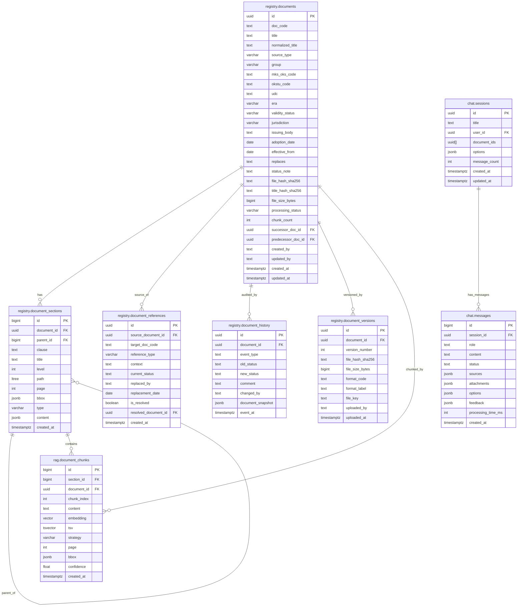

# Схема базы данных (объединённая)

> Сводная ER-диаграмма.

---

## ER-диаграмма

---

## Ключевые условия и ограничения

| Таблица | Поле | Условие |
|---------|------|---------|
| `registry.document_sections` | `type` | `CHECK (type IN ('section','table','image','formula'))` |
| `registry.documents` | `file_hash_sha256` | Для быстрого дубликат-детекта (`WHERE file_hash_sha256 = ? AND file_size_bytes = ?`) |
| `registry.documents` | `title_hash_sha256` | Индекс для поиска дубликатов по `doc_code + title + era` |
| `rag.document_chunks` | `embedding` | `VECTOR(1536)` — pgvector, `IVFFlat` индекс для `cosine_similarity` |
| `rag.document_chunks` | `tsv` | `tsvector` — GIN-индекс для полнотекстового поиска (`ts_rank`) |

---

## Примечания

### 1. Реестр документов (`registry.documents`)

| Поле | Примечание |
|------|------------|
| `source_type` | Тип документа: `GOST`, `OST`, `TU`, `ISO` и др. |
| `group` | Группа проекта (например, `ПО4`) |
| `era` | Эпоха: `USSR`, `CIS`, `RF`, `CURRENT` |
| `validity_status` | Статус действия: `active`, `superseded`, `expired` |
| `jurisdiction` | Юрисдикция: `RU`, `EU`, `US`, `NO`, `INTL` |
| `file_hash_sha256` | Хэш бинарного файла (вычисляется при загрузке) |
| `title_hash_sha256` | Хэш `doc_code + title + era` (вычисляется в Converter) |
| `processing_status` | FSM статус конвейера (не путать с `validity_status` — юридическим статусом документа). Возможные значения: `draft`, `uploaded`, `previewing`, `awaiting_decision`, `parsing`, `validation`, `ready_for_promotion`, `review_required`, `approved`, `registry`, `pending_index`, `indexed`, `duplicate`, `new_version`, `archived`, `failed` |
| `chunk_count` | Обновляется RAG Builder после индексации |

### 2. Разделы документов (`registry.document_sections`)

| Поле | Примечание |
|------|------------|
| `id` | Назначается Registry (sequence) |
| `parent_id` | Ссылка на родительскую секцию (`registry.document_sections.id`) |
| `clause` | Номер раздела (например, `1`, `6.1`, `6.1.table1`) |
| `level` | Уровень вложенности (`1`, `2`, `3`, ...) |
| `path` | Ltree-путь в иерархии |
| `bbox` | Координаты на странице: `[x1, y1, x2, y2]` |
| `type` | Тип секции: `section`, `table`, `image`, `formula` |
| `content` | JSONB с разнородной структурой, зависящей от `type`:
  - `section` → `{ text, amendments }`
  - `table` → `{ caption, columns, rows, footnotes, amendments, image_key }`
  - `image` → `{ caption, image_key, description }`
  - `formula` → `{ latex, meaning, image_key, parameters }` |

### 3. Ссылки между документами (`registry.document_references`)

| Поле | Примечание |
|------|------------|
| `source_document_id` | Документ-источник |
| `target_doc_code` | Целевой ГОСТ/ТУ |
| `reference_type` | Тип ссылки: `single`, `range` |
| `context` | Контекст ссылки |
| `current_status` | Статус целевого документа: `active`, `superseded` |

### 4. Версии документов (`registry.document_versions`)

| Поле | Примечание |
|------|------------|
| `format_code` | Формат файла: `pdf`, `doc`, `tiff`, ... |
| `file_key` | Ссылка на MinIO |

### 5. История обработки (`registry.document_history`)

| Поле | Примечание |
|------|------------|
| `event_type` | Тип события: `created`, `preview_failed`, `decided`, `parsed`, `validated`, `promoted`, `indexed`, `failed` |
| `document_snapshot` | Слепок enriched JSON на момент события |

### 6. Чанки документов (`rag.document_chunks`)

| Поле | Примечание |
|------|------------|
| `section_id` | `registry.document_sections.id` |
| `chunk_index` | Порядковый номер чанка в секции |
| `content` | Текст чанка: plain text для `section`, Markdown для `table` |
| `embedding` | `VECTOR(1536)` — pgvector, `IVFFlat` индекс для `cosine_similarity` |
| `tsv` | Полнотекстовый индекс (`to_tsvector('russian', content)`), GIN-индекс |
| `strategy` | Стратегия чанкинга: `semantic_512`, `fixed_256` |

Связь с секциями: чанк всегда привязан к конкретной секции документа. Одна секция может порождать несколько чанков (для `type=section` с разбивкой на ≤512 токенов) или один чанк (для `type=table/image/formula`).

### 7. Сообщения чата (`chat.messages`)

| Поле | Примечание |
|------|------------|
| `role` | Роль отправителя: `user`, `assistant` |
| `status` | FSM статус сообщения: `idle`, `pending`, `enriching`, `searching`, `generating`, `enriching_citations`, `answered`, `failed` |
| `sources` | Массив источников: `[{chunk_id, section_id, document_id, excerpt, score}]` |

Таблицы `chat.sessions` и `chat.messages` не относятся к реестру документов, выделены в отдельную схему `chat`.

### 8. Общее

- **`document_id` (UUID)** назначается только в Registry при создании документа. До этого — `task_id` (UUID), который используется всеми начальными сервисами (OCR/Parser, Converter-Validator).
- **`rag.document_chunks.content`** — унифицированное хранение. `content` — строка (plain text или Markdown). `tsv` строится через `to_tsvector('russian', content)` при вставке.
