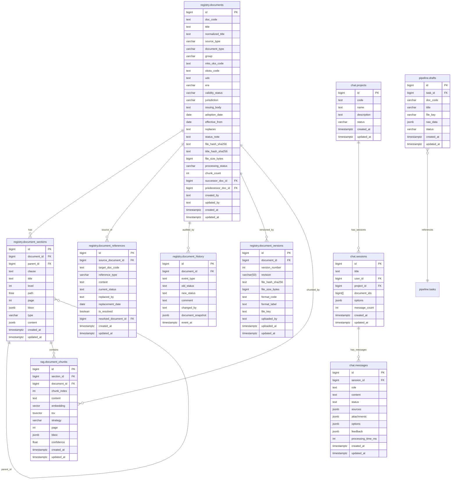

# Схема базы данных (объединённая)

> Сводная ER-диаграмма.

---

## ER-диаграмма

```mermaid
erDiagram
    registry.documents {
        bigint id PK
        text doc_code
        text title
        text normalized_title
        varchar source_type
        varchar document_type
        varchar group
        text mks_oks_code
        text okstu_code
        text udc
        varchar era
        varchar validity_status
        varchar jurisdiction
        text issuing_body
        date adoption_date
        date effective_from
        text replaces
        text status_note
        text file_hash_sha256
        text title_hash_sha256
        bigint file_size_bytes
        varchar processing_status
        int chunk_count
        bigint successor_doc_id FK
        bigint predecessor_doc_id FK
        text created_by
        text updated_by
        timestamptz created_at
        timestamptz updated_at
    }

    registry.document_sections {
        bigint id PK
        bigint document_id FK
        bigint parent_id FK
        text clause
        text title
        int level
        ltree path
        int page
        jsonb bbox
        varchar type
        jsonb content
        timestamptz created_at
        timestamptz updated_at
    }

    registry.document_references {
        bigint id PK
        bigint source_document_id FK
        text target_doc_code
        varchar reference_type
        text context
        text current_status
        text replaced_by
        date replacement_date
        boolean is_resolved
        bigint resolved_document_id FK
        timestamptz created_at
        timestamptz updated_at
    }

    registry.document_versions {
        bigint id PK
        bigint document_id FK
        int version_number
        varchar(50) revision
        text file_hash_sha256
        bigint file_size_bytes
        text format_code
        text format_label
        text file_key
        text uploaded_by
        timestamptz uploaded_at
        timestamptz updated_at
    }

    pipeline.drafts {
        bigint id PK
        bigint task_id FK
        varchar doc_code
        varchar title
        varchar file_key
        jsonb raw_data
        varchar status
        timestamptz created_at
        timestamptz updated_at
    }

    registry.document_history {
        bigint id PK
        bigint document_id FK
        text event_type
        text old_status
        text new_status
        text comment
        text changed_by
        jsonb document_snapshot
        timestamptz event_at
    }

    rag.document_chunks {
        bigint id PK
        bigint section_id FK
        bigint document_id FK
        int chunk_index
        text content
        vector embedding
        tsvector tsv
        varchar strategy
        int page
        jsonb bbox
        float confidence
        timestamptz created_at
        timestamptz updated_at
    }

    chat.projects {
        bigint id PK
        text code
        text name
        text description
        varchar status
        timestamptz created_at
        timestamptz updated_at
    }

    chat.sessions {
        bigint id PK
        text title
        bigint user_id FK
        bigint project_id FK
        bigint[] document_ids
        jsonb options
        int message_count
        timestamptz created_at
        timestamptz updated_at
    }
    %% FK user_id -> auth.users.id (будет создана после развёртывания Auth Service)

    chat.messages {
        bigint id PK
        bigint session_id FK
        text role
        text content
        text status
        jsonb sources
        jsonb attachments
        jsonb options
        jsonb feedback
        int processing_time_ms
        timestamptz created_at
        timestamptz updated_at
    }

    registry.documents ||--o{ registry.document_sections : has
    registry.document_sections ||--o{ registry.document_sections : parent_of
    registry.document_sections ||--o{ rag.document_chunks : contains
    registry.documents ||--o{ registry.document_references : source_of
    registry.documents ||--o{ registry.document_history : audited_by
    registry.documents ||--o{ registry.document_versions : versioned_by
    registry.documents ||--o{ rag.document_chunks : chunked_by
    chat.projects ||--o{ chat.sessions : has_sessions
    chat.sessions ||--o{ chat.messages : has_messages

    pipeline.drafts }o--|| pipeline.tasks : references
```

---

### Индексы

| Таблица | Поле | Тип индекса | Назначение |
|---------|------|------------|-----------|
| `chat.sessions` | `user_id` | B-tree | Фильтрация сессий по пользователю |
| `chat.sessions` | `created_at` | B-tree | Сортировка по дате |
| `chat.messages` | `session_id` | B-tree | Поиск сообщений сессии |
| `chat.messages` | `created_at` | B-tree | Сортировка по времени |
| `registry.documents` | `processing_status` | B-tree | Фильтрация по статусу |
| `registry.documents` | `created_at` | B-tree | Сортировка по дате загрузки |
| `registry.document_sections` | `content` | GIN | Поиск по JSONB-полям (например, `content.amendments[].type`) |

## Ключевые условия и ограничения

| Таблица | Поле | Условие |
|---------|------|---------|
| `registry.document_sections` | `type` | `CHECK (type IN ('text','textBlock','headerFooter','table','list','image','formula'))` |
| `registry.documents` | `file_hash_sha256` | Для быстрого дубликат-детекта (`WHERE file_hash_sha256 = ? AND file_size_bytes = ?`) |
| `registry.documents` | `title_hash_sha256` | Индекс для поиска дубликатов по `doc_code + title + era` |
| `rag.document_chunks` | `embedding` | `VECTOR(1536)` — pgvector, `IVFFlat` индекс для `cosine_similarity` |
| `rag.document_chunks` | `tsv` | `tsvector` — GIN-индекс для полнотекстового поиска (`ts_rank`) |

---

## Примечания

### 0. Черновики документов (`pipeline.drafts`)

| Поле | Примечание |
|------|------------|
| `task_id` | FK → `pipeline.tasks(id)`. Ссылка на задачу пайплайна, в рамках которой создан черновик. |
| `doc_code` | Код документа (ГОСТ/ТУ и т.д.), если определён на момент сохранения черновика. |
| `file_key` | Ключ в MinIO для исходного файла черновика. |
| `raw_data` | JSONB с сырыми данными от Parser (schema: `raw_ocr_v4`) или Converter (`validated_v3`). |
| `status` | Статус черновика: `uploaded`, `previewing`, `ready_for_approve`, `approved`, `discarded`. |
| `created_at` | Дата создания черновика. |
| `updated_at` | Дата последнего обновления черновика. |

### 1. Реестр документов (`registry.documents`)

| Поле | Примечание |
|------|------------|
| `source_type` | Тип нормативного документа-источника: `GOST`, `GOST_R`, `OST`, `RD`, `TU`, `ISO`, `DNV`, `ASTM`, `OTHER` |
| `document_type` | Категория контента: `normative`, `technical`, `drawing`, `specification`, `archival_scan`. Не путать с `source_type` |
| `group` | Группа проекта (например, `ПО4`) |
| `era` | Эпоха: `USSR`, `CIS`, `RF`, `CURRENT` |
| `validity_status` | Статус действия: `active`, `superseded`, `expired` |
| `jurisdiction` | Юрисдикция: `RU`, `EU`, `US`, `NO`, `INTL` |
| `file_hash_sha256` | Хэш бинарного файла (вычисляется при загрузке) |
| `title_hash_sha256` | Хэш `doc_code + title + era` (вычисляется в Converter) |
| `processing_status` | FSM статус конвейера (не путать с `validity_status` — юридическим статусом документа). Возможные значения: `created`, `pending_index`, `indexing`, `indexed`, `failed`. Статусы черновика (`uploaded`, `previewing`, `ready_for_approve`, `approved`, `discarded`) хранятся в `pipeline.drafts.status`, не в `registry.documents`. |
| `chunk_count` | Обновляется RAG Builder после индексации |

### 2. Разделы документов (`registry.document_sections`)

| Поле | Примечание |
|------|------------|
| `id` | Назначается Registry (sequence) |
| `parent_id` | Ссылка на родительскую секцию (`registry.document_sections.id`) |
| `clause` | Номер раздела (например, `1`, `6.1`, `6.1.table1`) |
| `level` | Уровень вложенности (`1`, `2`, `3`, ...) |
| `path` | Ltree-путь в иерархии |
| `bbox` | Координаты на странице: `[x1, y1, x2, y2]` |
| `type` | Тип секции: `section`, `table`, `image`, `formula` |
| `content` | JSONB с разнородной структурой, зависящей от `type`:
  - `section` → `{ text, amendments }`
  - `table` → `{ caption, columns, rows, footnotes, amendments, image_key }`
  - `image` → `{ caption, image_key, description }`
  - `formula` → `{ latex, meaning, image_key, parameters }` |

### 3. Ссылки между документами (`registry.document_references`)

| Поле | Примечание |
|------|------------|
| `source_document_id` | Документ-источник |
| `target_doc_code` | Целевой ГОСТ/ТУ |
| `reference_type` | Тип ссылки: `single`, `range` |
| `context` | Контекст ссылки |
| `current_status` | Статус целевого документа: `active`, `superseded` |

### 4. Версии документов (`registry.document_versions`)

| Поле | Примечание |
|------|------------|
| `revision` | Обозначение редакции (напр. «Изм. 1», «Изд. 2»), извлекается из preview-метаданных документа |
| `format_code` | Формат файла: `pdf`, `doc`, `tiff`, ... |
| `file_key` | Ссылка на MinIO |

> **Примечание**: `revision` (обозначение редакции, напр. «Изм. 1», «Изд. 2») извлекается из preview-метаданных документа.

### 5. История обработки (`registry.document_history`)

| Поле | Примечание |
|------|------------|
| `event_type` | Тип события: `created`, `preview_failed`, `decided`, `parsed`, `validated`, `approved`, `indexed`, `failed` |
| `document_snapshot` | Слепок enriched JSON на момент события |

### 6. Чанки документов (`rag.document_chunks`)

| Поле | Примечание |
|------|------------|
| `section_id` | `registry.document_sections.id` |
| `chunk_index` | Порядковый номер чанка в секции |
| `content` | Текст чанка: plain text для `section`, Markdown для `table` |
| `embedding` | `VECTOR(1536)` — pgvector, `IVFFlat` индекс для `cosine_similarity` |
| `tsv` | Полнотекстовый индекс (`to_tsvector('russian', content)`), GIN-индекс |
| `strategy` | Стратегия чанкинга: `semantic_512`, `fixed_256` |

Связь с секциями: чанк всегда привязан к конкретной секции документа. Одна секция может порождать несколько чанков (для `type=section` с разбивкой на ≤512 токенов) или один чанк (для `type=table/image/formula`).

> **Денормализация**: Поле `document_id` в `document_chunks` дублирует `document_sections.document_id` для ускорения запросов «все чанки документа». Синхронизация должна обеспечиваться на уровне приложения или триггера.

### 7. Проекты (`chat.projects`)

| Поле | Примечание |
|------|------------|
| `code` | Уникальный код проекта (например, `21900M2`, `Arc4`) |
| `name` | Человекочитаемое название проекта |
| `description` | Описание/примечания |
| `status` | Статус: `active`, `archived`, `draft` |

### 8. Сессии чата (`chat.sessions`)

| Поле | Примечание |
|------|------------|
| `project_id` | FK → `chat.projects.id`. Сессия привязана к судостроительному проекту. Может быть `NULL` для общих вопросов. |
| `user_id` | FK → пользователь (Auth Service) |
| `document_ids` | Массив ID документов (bigint), ограничивающих область поиска в сессии |
| `options` | JSONB с дополнительными параметрами сессии |

### 9. Сообщения чата (`chat.messages`)

| Поле | Примечание |
|------|------------|
| `role` | Роль отправителя: `user`, `assistant` |
| `status` | FSM статус сообщения: `idle`, `pending`, `enriching`, `searching`, `generating`, `enriching_citations`, `answered`, `failed` |
| `sources` | Массив источников: `[{chunk_id, section_id, document_id, excerpt, score}]` |

Таблицы `chat.sessions` и `chat.messages` не относятся к реестру документов, выделены в отдельную схему `chat`.

### 10. Общее

- **`document_id` (bigint)** назначается только в Registry при создании документа. До этого — `task_id` (bigint), который используется всеми начальными сервисами (OCR/Parser, Converter-Validator).
- **`rag.document_chunks.content`** — унифицированное хранение. `content` — строка (plain text или Markdown). `tsv` строится через `to_tsvector('russian', content)` при вставке.
