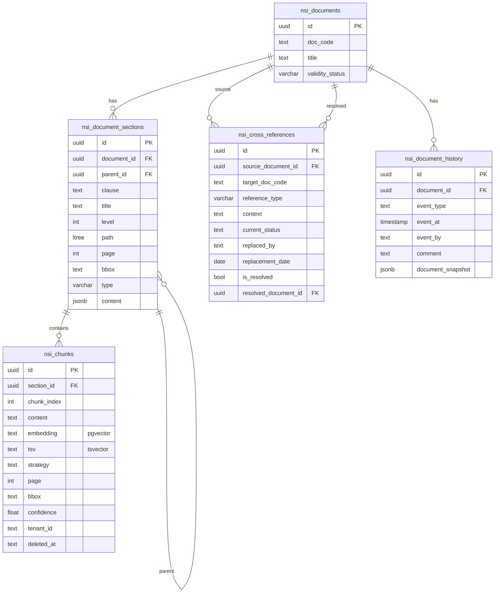
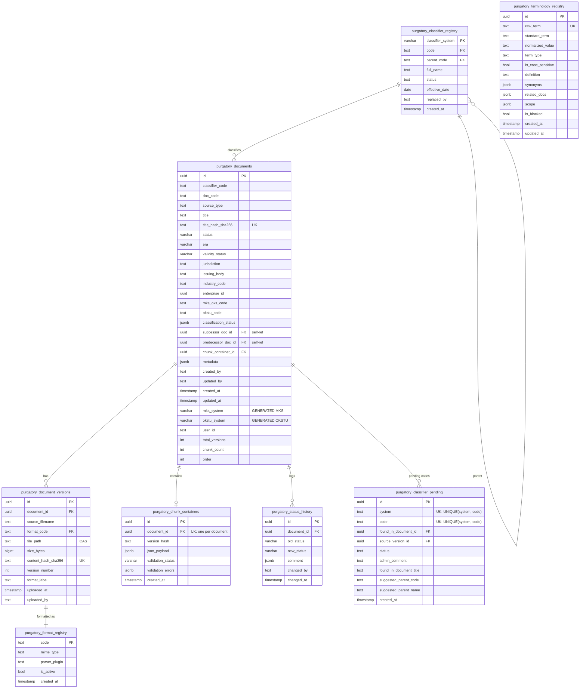
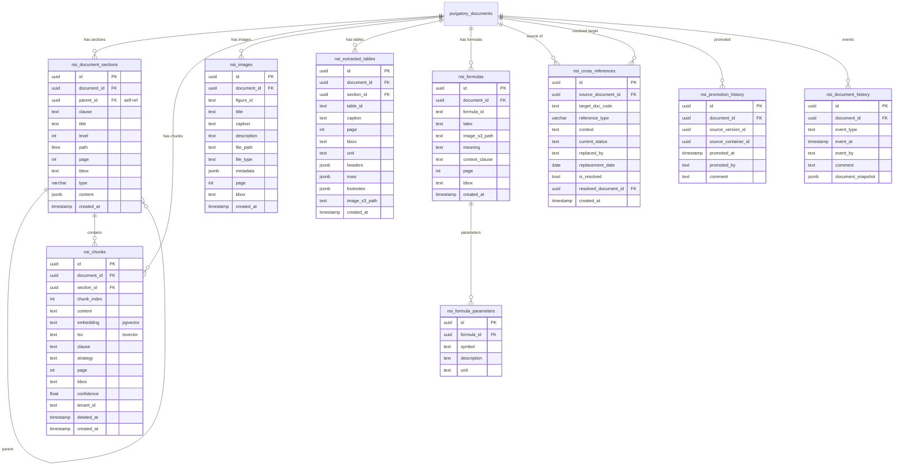

# Схема базы данных (объединённая)

> Сводная ER-диаграмма, объединяющая принятую схему `docs/` с дополнениями из проекта Purgatory (v2.3 + nsi).
> Исправленный синтаксис Mermaid ER без спецсимволов в типах.

---

## 0. Принятая схема `docs/` (core)

### UNIQUE-ограничения

- `nsi_documents.title` — бизнес-ключ документа (через title_hash_sha256)
- `nsi_cross_references (source_document_id, target_doc_code, reference_type)` — защита от дублей связей

---

## 1. Слой staging: `purgatory.*` (c дополнениями)

---

## 2. Слой Knowledge Base: `nsi.*` (c дополнениями)

---

## 3. Легенда

| Обозначение | Значение |
|---|---|
| `PK` | Primary Key |
| `FK` | Foreign Key |
| `UK` | Unique Constraint |
| `ENUM` | Перечисление (CREATE TYPE ... AS ENUM) |
| `ltree` | Тип ltree (расширение PostgreSQL) |
| `pgvector` | Тип vector (расширение pgvector) |
| `tsvector` | Полнотекстовый индекс PostgreSQL |
| `jsonb` | Двоичный JSON |
| `GENERATED` | Вычисляемая колонка (GENERATED ALWAYS AS) |
| `CAS` | Content-Addressable Storage (путь = хэш) |

---

## 4. Примечания по схеме

### 4.1. Два варианта history

Схема содержит **обе** таблицы истории:

- **`purgatory_status_history`** — журнал FSM-переходов (триггер на `purgatory_documents.status`)
- **`nsi_promotion_history`** / **`nsi_document_history`** — два альтернативных подхода к логированию промоушенов (специализированный vs event-based)

Требуется согласование: оставить обе, или выбрать одну.

### 4.2. Две связи chunks→document

В схеме показаны оба варианта:

- Прямая: `nsi_chunks.document_id → purgatory_documents.id` (Purgatory-подход)
- Через секцию: `nsi_chunks.section_id → nsi_document_sections.id → nsi_document_sections.document_id` (docs-подход)

Требуется согласование: можно оставить оба (прямой для скорости, через section_id для нормализации), или выбрать один.

### 4.3. Images и Tables

Показаны как отдельные таблицы (`nsi_images`, `nsi_extracted_tables`) по Purgatory-подходу. Альтернатива `docs/` — хранение через `nsi_document_sections` с `type='image'`/`'table'` и `content JSONB`.

### 4.4. ENUM vs TEXT

Все поля с пометкой `ENUM` в легенде — строгие перечисления. В разделах 1 и 2 используется `varchar` без уточнения ENUM. Выбор подхода требует согласования для каждого поля.

### 4.5. bbox: JSONB vs TEXT

Purgatory использует `JSONB` для bbox (гибкость); `docs/` использует `TEXT` (строка координат). В схеме указан `text bbox`, но может быть заменён на `jsonb`.

### 4.6. UNIQUE-ограничения

Отмечены в описаниях полей пометкой `UK`. Ключевые:
- `purgatory_documents.title_hash_sha256` — бизнес-ключ документа
- `purgatory_document_versions.content_hash_sha256` — CAS-ключ файла
- `purgatory_terminology_registry.raw_term` — уникальность термина
- `purgatory_chunk_containers.document_id` — 1 документ = 1 контейнер
- `purgatory_classifier_pending (system, code)` — защита от дублей в карантине
- `nsi_cross_references (source_document_id, target_doc_code, reference_type)` — защита от дублей связей
