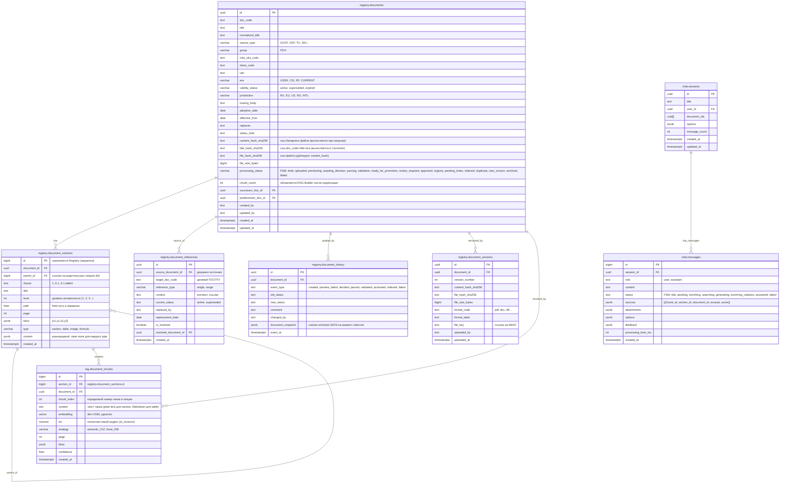

# Схема базы данных (объединённая)

> Сводная ER-диаграмма.

---

## ER-диаграмма

---

## Ключевые условия и ограничения

| Таблица | Поле | Условие |
|---------|------|---------|
| `registry.document_sections` | `type` | `CHECK (type IN ('section','table','image','formula'))` |
| `registry.documents` | `content_hash_sha256` | Для быстрого дубликат-детекта (`WHERE content_hash_sha256 = ? AND file_size_bytes = ?`) |
| `registry.documents` | `title_hash_sha256` | Индекс для полнотекстового поиска дубликатов по `doc_code + title + era` |
| `rag.document_chunks` | `embedding` | `VECTOR(1536)` — pgvector, `IVFFlat` индекс для `cosine_similarity` |
| `rag.document_chunks` | `tsv` | `tsvector` — GIN-индекс для полнотекстового поиска (`ts_rank`) |

---

## Примечания

1. **`document_id` (UUID)** назначается только в Registry при создании документа. До этого — `task_id` (UUID), который используется всеми начальными сервисами (OCR/Parser, Converter-Validator).

2. **`registry.document_sections.content`** — JSONB с разнородной структурой, зависящей от `type`:
   - `section` → `{ text, amendments }`
   - `table` → `{ caption, columns, rows, footnotes, amendments, image_key }`
   - `image` → `{ caption, image_key, description }`
   - `formula` → `{ latex, meaning, image_key, parameters }`

3. **`rag.document_chunks`** — унифицированное хранение. `content` — строка (plain text или Markdown). `tsv` строится через `to_tsvector('russian', content)` при вставке.

4. **`registry.documents.processing_status`** — FSM-статус конвейера (не путать с `validity_status` — юридическим статусом документа).

5. **Связь `rag.document_chunks → registry.document_sections`**: чанк всегда привязан к конкретной секции документа. Одна секция может порождать несколько чанков (для `type=section` с разбивкой на ≤512 токенов) или один чанк (для `type=table/image/formula`).

6. **Таблицы `chat.sessions` и `chat.messages`** не относятся к реестру документов, выделены в отдельную схему `chat`.
