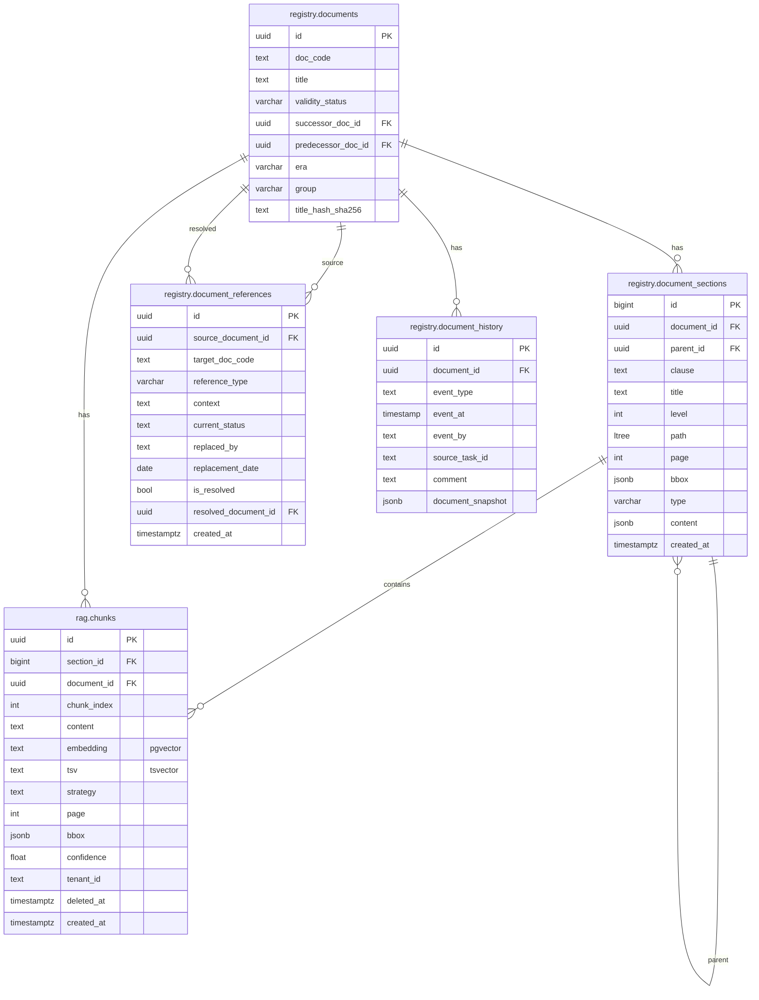

# Схема базы данных (объединённая)

> Сводная ER-диаграмма, объединяющая принятую схему `docs/` с дополнениями из проекта Purgatory (v2.3 + nsi).

---

## 0. Принятая схема `docs/` (core)

### UNIQUE-ограничения

- `registry.documents.title` — бизнес-ключ документа (через title_hash_sha256)
- `registry.document_references (source_document_id, target_doc_code, reference_type)` — защита от дублей связей

### CHECK-ограничения

- `registry.document_sections.type IN ('section', 'table', 'image', 'formula')`

---

### Примечания

1. **`chunk_container_id`** — staging-only, принадлежит схеме `purgatory`.

2. **Preview-данные** не хранятся в БД. Они живут исключительно в журнале пайплайна Orchestrator (временные артефакты фазы Preview).
3. **`registry.document_sections`** — это **секции** документа (разделы, подразделы, пункты), создаваемые сервисом Registry на этапе сегментации. Не путать с чанками!
4. **`rag.chunks`** — это **чанки**, формируемые сервисом RAG Builder на основе секций. Поле `section_id` ссылается на `registry.document_sections.id`. Одна секция может порождать несколько чанков.
