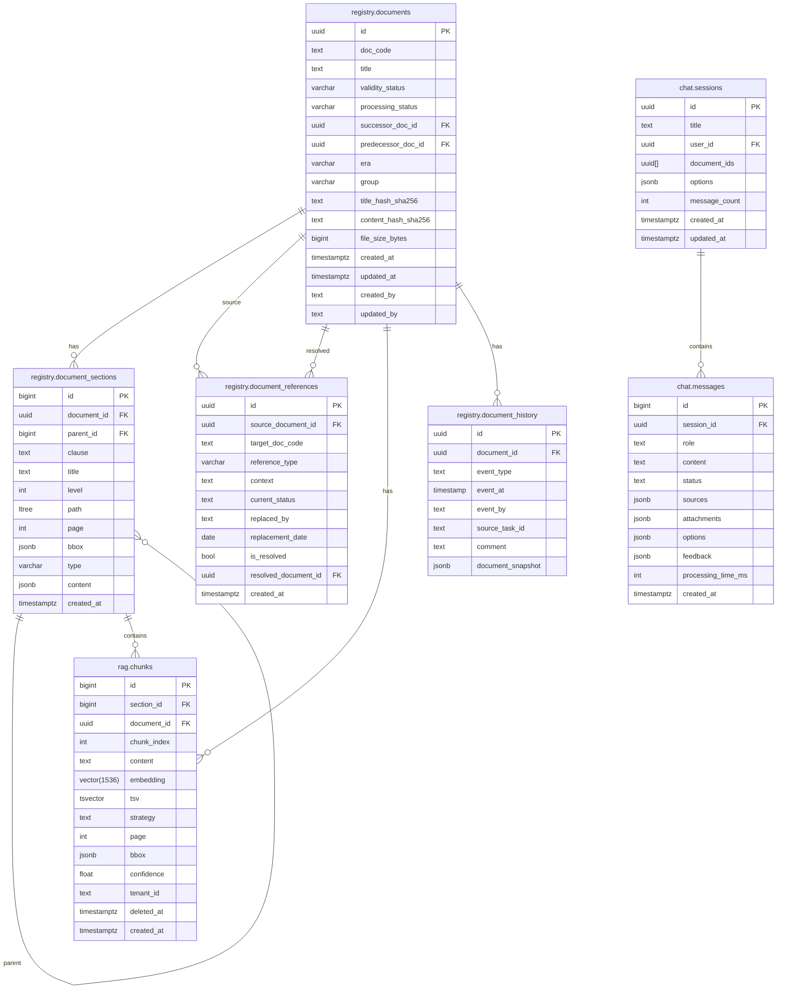

# Схема базы данных (объединённая)

> Сводная ER-диаграмма, объединяющая принятую схему `docs/` с дополнениями из проекта Purgatory (v2.3 + nsi).

---

## 0. Принятая схема `docs/` (core)

---

### Комментарии к полям

| Таблица | Поле | Тип | Комментарий |
|---------|------|-----|-------------|
| `registry.documents` | `processing_status` | varchar | FSM-статус обработки: `draft`, `uploaded`, `previewing`, `awaiting_decision`, `parsing`, `validation`, `ready_for_promotion`, `review_required`, `approved`, `registry`, `pending_index`, `indexed`, `duplicate`, `new_version`, `archived`, `failed` |
| `registry.document_sections` | `type` | varchar | Тип секции: `section`, `table`, `image`, `formula` |
| `registry.documents` | `file_size_bytes` | bigint | Размер исходного загруженного файла в байтах. Используется для pre-filtering при duplicate-детекции и для отображения в UI |
| `registry.documents` | `content_hash_sha256` | text | SHA-256 содержимого файла последней версии документа. Используется для быстрого поиска по хэшу (duplicate-детекция на уровне файла). Индексируется для ускорения `WHERE content_hash_sha256 = ...` |
| `rag.chunks` | `embedding` | vector(1536) | Векторное представление для семантического поиска (pgvector). Размерность зависит от модели эмбеддингов. |
| `rag.chunks` | `tsv` | tsvector | Полнотекстовый индекс для гибридного поиска (pg_trgm + ts_rank) |
| `rag.chunks` | `tenant_id` | text | Зарезервировано для будущей мультитенантности, в текущей версии не используется |
| `chat.messages` | `status` | text | Статус обработки сообщения: `idle`, `pending`, `enriching`, `searching`, `generating`, `enriching_citations`, `answered`, `failed` |

---

### UNIQUE-ограничения

- `registry.documents.title` — бизнес-ключ документа (через title_hash_sha256)
- `registry.document_references (source_document_id, target_doc_code, reference_type)` — защита от дублей связей

### INDEX

- `registry.documents.content_hash_sha256` — индекс для быстрого поиска по SHA-256 файла (`WHERE content_hash_sha256 = ?`). Not unique — разные версии документа могут иметь одинаковый хэш.

### CHECK-ограничения

- `registry.document_sections.type IN ('section', 'table', 'image', 'formula')`

---

### Примечания

1. **`chunk_container_id`** — staging-only, принадлежит схеме `purgatory`.

2. **Preview-данные** не хранятся в БД. Они живут исключительно в журнале пайплайна Orchestrator (временные артефакты фазы Preview).
3. **`registry.document_sections`** — это **секции** документа (разделы, подразделы, пункты), создаваемые сервисом Registry на этапе сегментации. Не путать с чанками!
4. **`rag.chunks`** — это **чанки**, формируемые сервисом RAG Builder на основе секций. Поле `section_id` ссылается на `registry.document_sections.id`. Одна секция может порождать несколько чанков.
5. **Поле `rag.chunks.tenant_id`** — зарезервировано для будущей мультитенантности, в текущей версии пайплайнов не используется.
6. **Таблицы `chat.sessions` и `chat.messages`** — хранят историю чат-сессий пользователей (Pipeline 3). Не относятся к реестру документов, выделены в отдельную схему `chat`.
7. **Поле `registry.documents.processing_status`** — хранит FSM-статус обработки документа (промежуточные состояния пайплайна). Не путать с `validity_status` (юридический статус действия документа).
