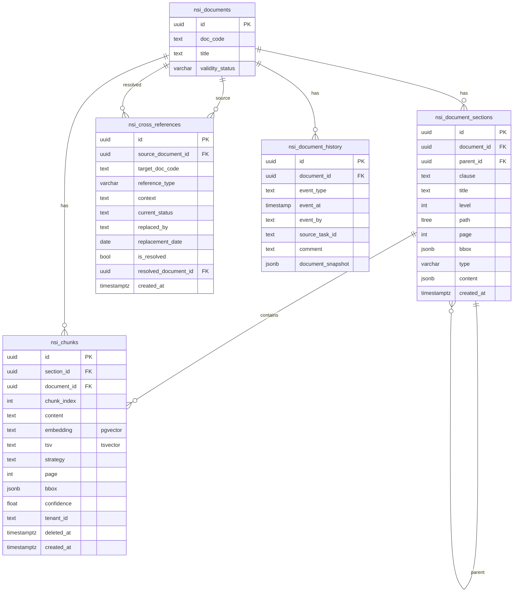

# Схема базы данных (объединённая)

> Сводная ER-диаграмма, объединяющая принятую схему `docs/` с дополнениями из проекта Purgatory (v2.3 + nsi).

---

## 0. Принятая схема `docs/` (core)

### UNIQUE-ограничения

- `nsi_documents.title` — бизнес-ключ документа (через title_hash_sha256)
- `nsi_cross_references (source_document_id, target_doc_code, reference_type)` — защита от дублей связей

### CHECK-ограничения

- `nsi_document_sections.type IN ('section', 'table', 'image', 'formula')`
