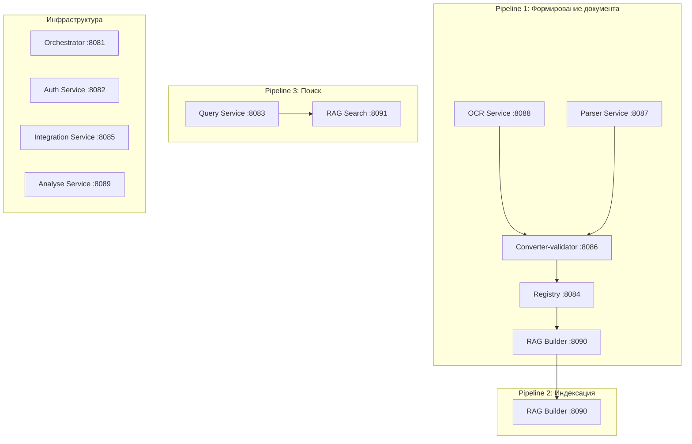

# Диаграммы JSON-файлов — документная модель PKB NeuroAssistant

---

## 1. `document_container_purgatory.json` — Исходный контейнер «чистилища»

```
╔══════════════════════════════════════════════════════════════════╗
║            document_container_purgatory.json  schema 2.3.0       ║
║                                                                  ║
║  ┌──────────────────────────────────────────────────────────┐    ║
║  │                      metadata                            │    ║
║  │  • schema_version: 2.3.0                                 │    ║
║  │  • created_at                                            │    ║
║  │  • parser: name, version, ocr_engine, ocr_fallback       │    ║
║  └──────────────────────────────────────────────────────────┘    ║
║                            │                                     ║
║                            ▼                                     ║
║  ┌──────────────────────────────────────────────────────────┐    ║
║  │                      document                            │    ║
║  │                                                          │    ║
║  │  ┌────────────────────────────────────────────────────┐  │    ║
║  │  │  source: document_version_id, file_name,           │  │    ║
║  │  │  file_hash_sha256, page_count                      │  │    ║
║  │  └────────────────────────────────────────────────────┘  │    ║
║  │                            │                             │    ║
║  │                            ▼                             │    ║
║  │  ┌────────────────────────────────────────────────────┐  │    ║
║  │  │                   metadata                         │  │    ║
║  │  • gost_code, full_title, normalized_title               │    ║
║  │  • group, mks, okstu, udc, era                           │    ║
║  │  • validity_status, issuing_body                         │    ║
║  │  • adoption: date, authority, document_number,           │    ║
║  │    effective_from                                        │    ║
║  │  • replaces, validity_restriction_removed                │    ║
║  │  • amendments — массив                                   │    ║
║  │  • status_note                                           │    ║
║  └──────────────────────────────────────────────────────────┘    ║
║                            │                                     ║
║                            ▼                                     ║
║  ┌──────────────────────────────────────────────────────────┐    ║
║  │                       content                            │    ║
║  │  ┌──────────────────────────────────────────────────┐    │    ║
║  │  │  text — массив                                   │    │    ║
║  │  │  clause, title, text, level, parent_clause,      │    │    ║
║  │  │  ltree_path, page, bbox, amendments              │    │    ║
║  │  └──────────────────────────────────────────────────┘    │    ║
║  │                       │                                  │    ║
║  │                       ▼                                  │    ║
║  │  ┌──────────────────────────────────────────────────┐    │    ║
║  │  tables — массив (объектный формат)              │    ║
║  │  table_id, caption, source_clause, page, bbox,   │    ║
║  │  columns (типизированные), rows (с cells),       │    ║
║  │  footnotes, image_key                            │    ║
║  │  └──────────────────────────────────────────────────┘    │    ║
║  │                       │                                  │    ║
║  │                       ▼                                  │    ║
║  │  ┌──────────────────────────────────────────────────┐    │    ║
║  │  figures — массив                                 │    ║
║  │  figure_id, caption, page, bbox, file_key,        │    ║
║  │  description                                      │    ║
║  │  └──────────────────────────────────────────────────┘    │    ║
║  │                       │                                  │    ║
║  │                       ▼                                  │    ║
║  │  ┌──────────────────────────────────────────────────┐    │    ║
║  │  formulas — массив                                │    ║
║  │  formula_id, latex, image_key, parameters,         │    ║
║  │  meaning, context_clause, page, bbox           │    ║
║  │  └──────────────────────────────────────────────────┘    │    ║
║  └──────────────────────────────────────────────────────────┘    ║
║                            │                                     ║
║                            ▼                                     ║
║  ┌──────────────────────────────────────────────────────────┐    ║
║  │              terminology — массив                        │    ║
║  │  • term, definition, source_clause, normalized_term      │    ║
║  └──────────────────────────────────────────────────────────┘    ║
║                            │                                     ║
║                            ▼                                     ║
║  ┌──────────────────────────────────────────────────────────┐    ║
║  │           document_references — массив                   │    ║
║  │  • target_doc, type, context, current_status             │    ║
║  │  • replaced_by, replacement_date, note                   │    ║
║  └──────────────────────────────────────────────────────────┘    ║
╚══════════════════════════════════════════════════════════════════╝
```

---

## 2. `document1_parser.json` — Сырой вывод OCR-парсера (docling)

```
╔══════════════════════════════════════════════════════════════════╗
║              document1_parser.json  raw_ocr_v1                   ║
║                                                                  ║
║  ┌──────────────────────────────────────────────────────────┐    ║
║  │                      metadata                            │    ║
║  │  • schema: raw_ocr_v1                                    │    ║
║  │  • created_at                                            │    ║
║  │  • parser: name docling, version, ocr_engine,            │    ║
║  │    ocr_fallback                                          │    ║
║  └──────────────────────────────────────────────────────────┘    ║
║                            │                                     ║
║                            ▼                                     ║
║  ┌──────────────────────────────────────────────────────────┐    ║
║  │                      document                            │    ║
║  │                                                          │    ║
║  │  ┌────────────────────────────────────────────────────┐  │    ║
║  │  │  source: file_name, file_hash_sha256, page_count    │  │    ║
║  │  └────────────────────────────────────────────────────┘  │    ║
║  │                            │                             │    ║
║  │                            ▼                             │    ║
║  │  ┌────────────────────────────────────────────────────┐  │    ║
║  │  │                   pages — массив                   │  │    ║
║  │                                                          │    ║
║  │  ┌────────────────────────────────────────────────────┐  │    ║
║  │  │  page 1: width, height                             │  │    ║
║  │  │                                                    │  │    ║
║  │  │  ┌────────────────────────────────────────────┐    │  │    ║
║  │  │  │  blocks — массив page 1                    │    │  │    ║
║  │  │  │  • text block: type, text, bbox, font      │    │  │    ║
║  │  │  │  • text block                              │    │  │    ║
║  │  │  │  • formula block: type, latex, bbox,       │    │  │    ║
║  │  │  │    image_key                               │    │  │    ║
║  │  │  └────────────────────────────────────────────┘    │  │    ║
║  │  └────────────────────────────────────────────────────┘  │    ║
║  │                            │                             │    ║
║  │                            ▼                             │    ║
║  │  ┌────────────────────────────────────────────────────┐  │    ║
║  │  │  page 2: width, height                             │  │    ║
║  │  │                                                    │  │    ║
║  │  │  ┌────────────────────────────────────────────┐    │  │    ║
║  │  │  │  blocks — массив page 2                    │    │  │    ║
║  │  │  │  • text blocks                             │    │  │    ║
║  │  │  │  • table block: type, caption, bbox,       │    │  │    ║
║  │  │  │    num_rows, num_cols, grid,               │    │  │    ║
║  │  │  │    raw_footnotes, image_key                │    │  │    ║
║  │  │  │  • figure blocks: type, caption, bbox,     │    │  │    ║
║  │  │  │    image_key                               │    │  │    ║
║  │  │  └────────────────────────────────────────────┘    │  │    ║
║  │  └────────────────────────────────────────────────────┘  │    ║
║  └──────────────────────────────────────────────────────────┘    ║
╚══════════════════════════════════════════════════════════════════╝
```

---

## 3. `document2_validate.json` — Валидированная/обогащённая структура

```
╔══════════════════════════════════════════════════════════════════╗
║              document2_validate.json  validated_v2               ║
║                                                                  ║
║  ┌──────────────────────────────────────────────────────────┐    ║
║  │                      metadata                            │    ║
║  │  • schema: validated_v2                                  │    ║
║  │  • created_at                                            │    ║
║  │  • parser: docling, version, paddleocr                   │    ║
║  └──────────────────────────────────────────────────────────┘    ║
║                            │                                     ║
║                            ▼                                     ║
║  ┌──────────────────────────────────────────────────────────┐    ║
║  │                      document                            │    ║
║  │                                                          │    ║
║  │  ┌────────────────────────────────────────────────────┐  │    ║
║  │  │  source: document_version_id, file_name,            │  │    ║
║  │  │  file_hash, page_count                             │  │    ║
║  │  └────────────────────────────────────────────────────┘  │    ║
║  │                            │                             │    ║
║  │                            ▼                             │    ║
║  │  ┌────────────────────────────────────────────────────┐  │    ║
║  │  │                   metadata                         │  │    ║
║  │  • gost_code, full_title, normalized_title               │    ║
║  │  • group, mks, okstu, udc, era                           │    ║
║  │  • validity_status, issuing_body                         │    ║
║  │  • adoption: date, authority, document_number,           │    ║
║  │    effective_from                                        │    ║
║  │  • replaces, validity_restriction_removed                │    ║
║  │  • amendments — массив                                   │    ║
║  │  • status_note                                           │    ║
║  └──────────────────────────────────────────────────────────┘    ║
║                            │                                      ║
║                            ▼                                      ║
║  ┌───────────────────────────────────────────────────────────┐    ║
║  │                       content                             │    ║
║  │                                                           │    ║
║  │  ┌────────────────────────────────────────────────────┐   │    ║
║  │  │  text — массив (аналогично purgatory)              │   │    ║
║  │  └────────────────────────────────────────────────────┘   │    ║
║  │                       │                                   │    ║
║  │                       ▼                                   │    ║
║  │  ┌────────────────────────────────────────────────────┐   │    ║
║  │  │  tables — массив                                   │   │    ║
║  │  │  • table_id, caption, source_clause, page, bbox,   │   │    ║
║  │  │    image_key                                       │   │    ║
║  │  │  • columns — массив: name, header, index, type,    │   │    ║
║  │  │    value_type, unit                                │   │    ║
║  │  │  • rows — массив: row_index, type, cells,          │   │    ║
║  │  │    range и value (типизированные)                  │   │    ║
║  │  │  • footnotes — массив: footnote_id, text,          │   │    ║
║  │  │    applies_to                                      │   │    ║
║  │  │  • amendments — массив: amendment_id, type,        │   │    ║
║  │  │    source, affected_columns, action, note          │   │    ║
║  │  └────────────────────────────────────────────────────┘   │    ║
║  │                       │                                   │    ║
║  │                       ▼                                   │    ║
║  │  ┌────────────────────────────────────────────────────┐   │    ║
║  │  │  figures — массив                                  │   │    ║
║  │  │  figure_id, caption, page, bbox, file_key,         │   │    ║
║  │  │  description                                       │   │    ║
║  │  └────────────────────────────────────────────────────┘   │    ║
║  │                       │                                   │    ║
║  │                       ▼                                   │    ║
║  │  ┌────────────────────────────────────────────────────┐   │    ║
║  │  │  formulas — массив                                 │   │    ║
║  │  │  formula_id, latex, image_key, parameters,         │   │    ║
║  │  │  meaning, context_clause, page, bbox           │   │    ║
║  │  └────────────────────────────────────────────────────┘   │    ║
║  └───────────────────────────────────────────────────────────┘    ║
║                            │                                      ║
║                            ▼                                      ║
║  ┌───────────────────────────────────────────────────────────┐    ║
║  │              terminology — массив                         │    ║
║  │  • term, definition, source_clause, normalized_term       │    ║
║  └───────────────────────────────────────────────────────────┘    ║
║                            │                                      ║
║                            ▼                                      ║
║  ┌───────────────────────────────────────────────────────────┐    ║
║  │           references — массив                             │    ║
║  │  • target_doc, type, context, current_status              │    ║
║  │  • replaced_by, replacement_date, note                    │    ║
║  └───────────────────────────────────────────────────────────┘    ║
║                                                                    ║
║  └──────────────────────────────────────────────────────────┐    ║
║  ─ ─ ─ ─ ─ ─ ─ ─ ─ ─ ─ ─ ─ ─ ─ ─ ─ ─ ─ ─ ─ ─ ─ ─ ─ ─ ─ ─ ┘    ║
╚═══════════════════════════════════════════════════════════════════╝
```

---

## 4. `document3_for_rag.json` — Структура для RAG-индексации

```
╔═══════════════════════════════════════════════════════════════════╗
║              document3_for_rag.json  for_rag_v1                   ║
║                                                                   ║
║  ┌───────────────────────────────────────────────────────────┐    ║
║  │                      metadata                             │    ║
║  │  • schema: for_rag_v1                                     │    ║
║  │  • created_at                                             │    ║
║  └───────────────────────────────────────────────────────────┘    ║
║                            │                                      ║
║                            ▼                                      ║
║  ┌───────────────────────────────────────────────────────────┐    ║
║  │                      document                             │    ║
║  │  • id, doc_code, title, full_title, normalized_title      │    ║
║  │  • group, mks, okstu, udc, era                            │    ║
║  │  • validity_status, issuing_body                          │    ║
║  │  • Плоские поля: adoption_date, adoption_authority,       │    ║
║  │    adoption_document_number, effective_from               │    ║
║  │  • replaces                                               │    ║
║  │  • Плоские поля: validity_restriction_removed_date,       │    ║
║  │    validity_restriction_removed_authority,                │    ║
║  │    validity_restriction_removed_document_number           │    ║
║  │  • page_count, file_hash_sha256                           │    ║
║  │  • amendments — массив, status_note                       │    ║
║  └───────────────────────────────────────────────────────────┘    ║
║                            │                                      ║
║                            ▼                                      ║
║  ┌──────────────────────────────────────────────────────────┐    ║
║  │           sections — массив                             │    ║
║  │                                                          │    ║
║  │  Общие поля: id, document_id, parent_id, clause,         │    ║
║  │  title, level, path, page, bbox, type, created_at        │    ║
║  │                            │                             │    ║
║  │                            ▼                             │    ║
║  │  ┌────────────────────────────────────────────────────┐  │    ║
║  │  │              type options                          │  │    ║
║  │  │  • section: content включает text, amendments      │  │    ║
║  │  │  • table: content включает columns, rows,          │  │    ║
║  │  │    footnotes, amendments, image_key                │  │    ║
║  │  │  • image: content включает caption, file_key,      │  │    ║
║  │  │    description                                     │  │    ║
║  │  │  • formula: content включает latex,              │  │    ║
║  │  │    meaning, parameters                        │  │    ║
║  │  └────────────────────────────────────────────────────┘  │    ║
║  └──────────────────────────────────────────────────────────┘    ║
║                            │                                     ║
║                            ▼                                     ║
║  ┌──────────────────────────────────────────────────────────┐    ║
║  │              terminology — массив                        │    ║
║  │  • term, definition, source_clause, normalized_term      │    ║
║  └──────────────────────────────────────────────────────────┘    ║
╚══════════════════════════════════════════════════════════════════╝
```

---

## 5. Сводная диаграмма — трансформация данных (pipeline)

### Двухфазный пайплайн формирования документа (Pipeline 1)

```
╔══════════════════════════════════════════════════════════════════════════════╗
║              Pipeline 1: Формирование документа (двухфазный)                ║
║                                                                              ║
║  ┌──────────────────────────────────── Фаза Preview ──────────────────────┐ ║
║  │                                                                         │ ║
║  │  ┌──────────────────────────────┐    ┌──────────────────────────────┐  │ ║
║  │  │  1. OCR/Parser (preview)     │───▶│  2. Converter-validator       │  │ ║
║  │  │  Частичное распознавание     │    │  (preview API)                │  │ ║
║  │  │  (первые N страниц)          │    │  Первичные метаданные         │  │ ║
║  │  │  → document1_parser.json     │    │  + проверка уникальности     │  │ ║
║  │  └──────────────────────────────┘    └──────────────────────────────┘  │ ║
║  │                                              │                          │ ║
║  │                                              ▼                          │ ║
║  │  ┌──────────────────────────────────────────────────────────────────┐  │ ║
║  │  │  3. Решение пользователя                                          │  │ ║
║  │  │  Продолжить / остановить (дубликат) / принудительная новая версия  │  │ ║
║  │  └──────────────────────────────────────────────────────────────────┘  │ ║
║  └───────────────────────────────────────────────────────────────────────┘ ║
║                                    │                                         ║
║                                    ▼                                         ║
║  ┌─────────────────────────────────── Фаза Full ──────────────────────────┐ ║
║  │                                                                         │ ║
║  │  ┌──────────────────────────────────────────────────────────────────┐  │ ║
║  │  │  4. OCR/Parser (full)                                            │  │ ║
║  │  │  Полное распознавание всех страниц, сохранение бинарных объектов  │  │ ║
║  │  │  → document1_parser.json (полный)                                │  │ ║
║  │  └──────────────────────────────────────────────────────────────────┘  │ ║
║  │                            │                                           │ ║
║  │                            ▼                                           │ ║
║  │  ┌──────────────────────────────────────────────────────────────────┐  │ ║
║  │  │  5. document_container_purgatory.json  schema 2.3.0              │  │ ║
║  │  │  Структурированный контейнер (промежуточный).                    │  │ ║
║  │  │  Метаданные документа, Разобранный контент,                      │  │ ║
║  │  │  Терминология, Кросс-ссылки                                      │  │ ║
║  │  └──────────────────────────────────────────────────────────────────┘  │ ║
║  │                            │                                           │ ║
║  │                            ▼                                           │ ║
║  │  ┌──────────────────────────────────────────────────────────────────┐  │ ║
║  │  │  6. Converter-validator (full)                                   │  │ ║
║  │  │  Построение иерархии, LLM, метаданные, валидация                │  │ ║
║  │  │  → document2_validate.json                                       │  │ ║
║  │  └──────────────────────────────────────────────────────────────────┘  │ ║
║  │                            │                                           │ ║
║  │                            ▼                                           │ ║
║  │  ┌──────────────────────────────────────────────────────────────────┐  │ ║
║  │  │  7. Registry                                                     │  │ ║
║  │  │  Сохранение карточки документа, сегментация на секции            │  │ ║
║  │  │  → registry.document_sections                                         │  │ ║
║  │  └──────────────────────────────────────────────────────────────────┘  │ ║
║  │                            │                                           │ ║
║  │                            ▼                                           │ ║
║  │  ┌──────────────────────────────────────────────────────────────────┐  │ ║
║  │  │  8. RAG Builder                                                  │  │ ║
║  │  │  Чанкование секций, эмбеддинги, векторный индекс                │  │ ║
║  │  │  → document3_for_rag.json  (нормализация для индексации)         │  │ ║
║  │  │  → rag.chunks (в БД)                                             │  │ ║
║  │  └──────────────────────────────────────────────────────────────────┘  │ ║
║  └───────────────────────────────────────────────────────────────────────┘ ║
║                                                                              ║
║  ┌ ─ ─ ─ ─ ─ ─ ─ ─ ─ ─ ─ ─ ─ ─ ─ ─ ─ ─ ─ ─ ─ ─ ─ ─ ─ ─ ─ ─ ─ ─ ─ ─ ┐ ║
║  ─  Потеряно (в for_rag_v1): Метаданные парсера (ocr_engine, version)  ─ ║
║  └ ─ ─ ─ ─ ─ ─ ─ ─ ─ ─ ─ ─ ─ ─ ─ ─ ─ ─ ─ ─ ─ ─ ─ ─ ─ ─ ─ ─ ─ ─ ─ ─ ┘ ║
║  ┌ ─ ─ ─ ─ ─ ─ ─ ─ ─ ─ ─ ─ ─ ─ ─ ─ ─ ─ ─ ─ ─ ─ ─ ─ ─ ─ ─ ─ ─ ─ ─ ─ ┐ ║
║  ─  Потеряно (в for_rag_v1): Терминология (раздел terminology)       ─ ║
║  └ ─ ─ ─ ─ ─ ─ ─ ─ ─ ─ ─ ─ ─ ─ ─ ─ ─ ─ ─ ─ ─ ─ ─ ─ ─ ─ ─ ─ ─ ─ ─ ─ ┘ ║
╚══════════════════════════════════════════════════════════════════════════════╝
```

### Состав микросервисов (всего 11)


