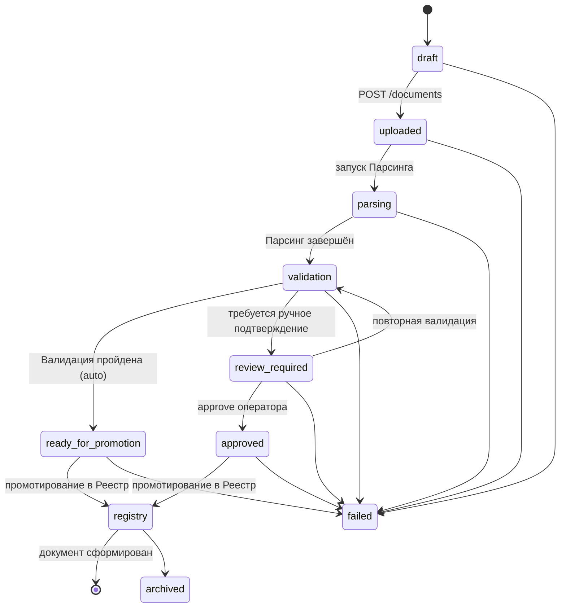
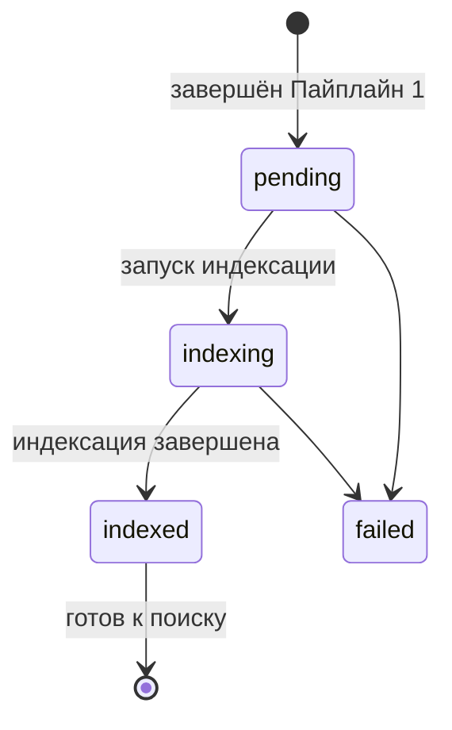

## Пайплайны обработки документов (v3.0)

Orchestrator координирует сквозную обработку документов через **три независимых пайплайна**, каждый из которых решает свою задачу и имеет строгую изоляцию по доступу к базе данных.

```
Пайплайн 1: Формирование документа
====================================
MinIO (ссылка) → [Парсинг] → JSON → [Валидация] → JSON → [Реестр] → JSON со ссылками в БД
                    (изоляция)      (читает БД)          (пишет БД)
                                                              ↓
Пайплайн 2: Индексация документа
====================================
       Обогащённый JSON от Registry → [RAG индексация] → Статус
                                               (пишет БД)

Пайплайн 3: Поиск документа
====================================
       вопрос → [Query Service] → LLM генерация + обогащение цитирований → ответ
                    ↓
              [RAG поиск] → чанки
                 (читает БД)
```

**Роль Оркестратора:** управляет последовательностью вызовов, передаёт JSON-контейнеры между этапами как **непрозрачные артефакты** (структура JSON известна только сервисам). Помимо координации, Оркестратор:
- Выполняет пре-стейдж загрузки: сохраняет файл в MinIO, вычисляет SHA-256, создаёт запись в БД
- Ведёт историю обработки документа (`GET /documents/{doc_id}/history`)
- Управляет статусной моделью FSM для каждого пайплайна независимо

Детальное описание пайплайнов:
- [Пайплайн 1: Формирование документа](pipeline1-formation.md)
- [Пайплайн 2: Индексация документа](pipeline2-indexation.md)
- [Пайплайн 3: Поиск документа](pipeline3-search.md)

---

### 3. Сводная таблица доступа к БД

| Пайплайн | Этап | Доступ к БД | Направление данных |
|----------|------|-------------|-------------------|
| Формирование | 1. Парсинг | **Нет** (изоляция) | Вход: ссылка MinIO → Выход: JSON |
| Формирование | 2. Валидация | **Читает** | Вход: JSON → Выход: JSON с решением |
| Формирование | 3. Реестр | **Пишет** | Вход: JSON → Выход: JSON со ссылками |
| Индексация | 1. RAG индексация | **Пишет** | Вход: обогащённый JSON → Выход: статус |
| Поиск | 1. Приём сообщения | **Пишет** (история чата) | Вход: content → Выход: 202 + message_id |
| Поиск | 2. Обогащение терминами | **Читает** (словарь терминов) | Вход: текст → Выход: обогащённый запрос |
| Поиск | 3. RAG поиск чанков | **Читает** | Вход: query + filters → Выход: массив чанков |
| Поиск | 3b. Генерация ответа LLM | **Нет** | Вход: чанки → Выход: текст ответа |
| Поиск | 4. Обогащение цитирований | **Нет** | Вход: текст LLM + чанки → Выход: answer с аннотированными сносками |

---

### 4. Статусная модель (FSM)

#### Пайплайн 1: Формирование документа



#### Пайплайн 2: Индексация документа



---

### 5. Матрица ответственности сервисов

| Операция | Пайплайн | Этап | Сервис | Доступ к БД |
|---|---|---|---|---|
| Загрузка файла, SHA-256, MinIO | 1 | Пре-стейдж | **Orchestrator** | Пишет |
| Распознавание, парсинг структуры | 1 | 1. Парсинг | **Парсинг / OCR Service** | Нет |
| Валидация JSON, классификация | 1 | 2. Валидация | **Validation Service** | Читает |
| Проверка кодов по справочнику | 1 | 2. Валидация | **Registry Service** | Читает |
| Запись карточки документа в БД | 1 | 3. Реестр | **Registry Service** | Пишет |
| Чанкинг + Embeddings + Индекс | 2 | 1. RAG индексация | **RAG Service** | Пишет |
| Приём сообщения | 3 | 1. Query Service | **Query Service** | Пишет |
| Обогащение терминами | 3 | 2. Query Service | **Query Service** | Читает |
| RAG поиск чанков | 3 | 3. RAG поиск | **RAG Service** | Читает |
| Генерация ответа LLM | 3 | 3b. Query Service | **Query Service** | Нет |
| Обогащение цитирований | 3 | 4. Query Service | **Query Service** | Нет |
| Управление файлами, экспорт во внешние системы | — | Вспомогательный | **Integration Service** | Читает/Пишет |
| Сопоставление норм и проектов, расчёты | — | Вспомогательный | **Analyse Service** | Читает |

---

### 6. Эндпоинты внутренних сервисов

#### Парсинг / OCR Service

| Метод | Путь | Описание | Доступ к БД |
|---|---|---|---|
| `POST` | `/ocr/process` | Асинхронный запуск распознавания и парсинга | Нет |
| `GET` | `/ocr/process/{task_id}/status` | Статус обработки | Нет |
| `GET` | `/ocr/process/{task_id}/result` | Получение JSON-контейнера с результатом парсинга | Нет |

#### Validation Service

| Метод | Путь | Описание | Доступ к БД |
|---|---|---|---|
| `POST` | `/validate/document` | Комплексная валидация документа (структура, классификация, уникальность) | Читает |
| `POST` | `/validate/classifiers` | Валидация классификационных кодов | Читает |
| `POST` | `/validate/check` | Проверка правил (внутренний, не путать с `POST /validate/checks` Orchestrator) | Нет |

> **Важно:** `POST /validate/check` (Validation Service) — **внутренний** эндпоинт сервиса валидации. Публичный `POST /validate/checks` (Orchestrator) — агрегирует результаты пакетного сравнения через Analyse Service. Разные назначения, несмотря на похожие названия.

#### Analyse Service

| Метод | Путь | Описание | Доступ к БД |
|---|---|---|---|
| `POST` | `/analyse/compare` | Сопоставление норм и проектов (асинхронно) | Читает |
| `POST` | `/analyse/compare/batch` | Пакетное сравнение фрагментов | Читает |
| `GET` | `/analyse/compare/{comparison_id}` | Результат сравнения | Читает |
| `POST` | `/analyse/calculate` | Арифметический движок для вычислений | Нет |
| `POST` | `/analyse/recommend` | Рекомендации по исправлению ошибок | Читает |

#### Integration Service

| Метод | Путь | Описание | Доступ к БД |
|---|---|---|---|
| `POST` | `/files/upload` | Загрузка файла в общее хранилище | Пишет |
| `GET` | `/files/{file_key}` | Получение бинарного потока файла | Читает |
| `DELETE` | `/files/{file_key}` | Удаление файла | Пишет |
| `GET` | `/files/{file_key}/info` | Метаданные файла | Читает |
| `POST` | `/meridian/export` | Экспорт структурированных данных в ИС «Меридиан» | Читает |
| `GET` | `/external/status` | Проверка доступности внешних систем | Нет |

#### Registry Service

| Метод | Путь | Описание | Доступ к БД |
|---|---|---|---|
| `POST` | `/registry/documents` | Создание карточки документа (Реестр) | Пишет |
| `GET` | `/registry/documents` | Список документов в реестре | Читает |
| `GET` | `/registry/documents/{id}` | Детали документа | Читает |
| `POST` | `/registry/classifiers/validate` | Валидация классификационных кодов по справочнику | Читает |
| `GET` | `/registry/classifiers` | Справочники классификаторов | Читает |

#### RAG Service

| Метод | Путь | Пайплайн | Описание | Доступ к БД |
|---|---|---|---|---|
| `POST` | `/rag/index` | 2 (Индексация) | Чанкинг + Embeddings + построение индекса | Пишет |
| `DELETE` | `/rag/index/{document_id}` | 2 (Индексация) | Удаление чанков документа из индекса | Пишет |
| `GET` | `/rag/index/{document_id}/status` | 2 (Индексация) | Статус индексации | Читает |
| `POST` | `/rag/search` | 3 (Поиск) | Поиск чанков (без генерации LLM) | Читает |

---

### 7. Поток данных (Data Flow)

```mermaid
graph LR
    subgraph "Пайплайн 1: Формирование документа"
        MinIO[(MinIO)] -->|file_ref| P[Парсинг]
        P -->|JSON (opaque)| V[Валидация]
        V -->|JSON (opaque)| R[Реестр]
        R -->|JSON со ссылками| DB[(PostgreSQL\nRegistry)]
    end

    subgraph "Пайплайн 2: Индексация документа"
        R -->|Обогащённый JSON| RI[RAG Индексация]
        RI -->|status| DB
        RI --> VI[(Векторный индекс\npgvector)]
    end

    subgraph "Пайплайн 3: Поиск документа"
        UI -->|question| QS[Query Service]
        QS -->|query + filters| RS[RAG Поиск]
        VI --> RS
        RS -->|чанки| QS
        QS -->|LLM генерация + обогащение| QS
        QS -->|answer + аннотированные сноски| UI
    end

    style P fill:#e6f3ff,stroke:#333
    style V fill:#fff3e6,stroke:#333
    style R fill:#e6ffe6,stroke:#333
    style RI fill:#ffe6f3,stroke:#333
    style RS fill:#f3e6ff,stroke:#333
    style QS fill:#fffacd,stroke:#333
```

**Форматы передачи между этапами:**

| Между | Формат | Протокол | Примечание |
|---|---|---|---|
| Orchestrator → Парсинг | `file_ref` (ссылка MinIO) | JSON via HTTP | — |
| Парсинг → Orchestrator | **JSON-контейнер** (структура документа) | JSON via HTTP | Непрозрачен для Orchestrator |
| Orchestrator → Валидация | **JSON-контейнер** (от Парсинга) | JSON via HTTP | Непрозрачен для Orchestrator |
| Валидация → Orchestrator | **JSON с решением** (auto / review) | JSON via HTTP | Непрозрачен для Orchestrator |
| Orchestrator → Реестр | **JSON с решением** (от Валидации) | JSON via HTTP | Непрозрачен для Orchestrator |
| Реестр → Orchestrator | **Обогащённый JSON (структура + ссылки в БД)** | JSON via HTTP | — |
| Orchestrator → RAG индексация | **Обогащённый JSON от Registry** | JSON via HTTP | — |
| RAG индексация → Orchestrator | Статус завершения | JSON via HTTP | — |
| UI → Query Service | Вопрос / поисковый запрос | JSON via HTTP | — |
| Query Service → RAG поиск | **query + filters** | JSON via HTTP | Поиск чанков (без генерации) |
| RAG поиск → Query Service | **Массив чанков с полным содержимым** | JSON via HTTP | Query Service формирует контекст и вызывает LLM |
| Query Service → UI | **answer + аннотированные сноски** | JSON via HTTP | Обогащение цитирований идентификаторами |

---

### 8. Ключевые архитектурные решения

| Решение | Обоснование |
|---|---|
| **Три независимых пайплайна** | Разделяют concerns: формирование документа (бизнес-логика), индексация для поиска (RAG) и поиск/генерация ответа. Каждый пайплайн имеет изоляцию по доступу к БД и свою FSM. Позволяет индексировать повторно без повторного распознавания |
| **Чанкинг в RAG индексации, а не в Парсинге** | Парсинг отвечает только за распознавание и структурирование. Чанкинг — задача RAG для оптимизации поиска. Разные стратегии чанкинга не влияют на карточку документа |
| **Изоляция доступа к БД по этапам** | Парсинг не зависит от БД — может масштабироваться горизонтально. Валидация читает, Реестр пишет — исключены гонки и каскадные锁. RAG индексация пишет, RAG поиск читает — консистентность данных |
| **Оркестратор оперирует JSON как контейнером** | Структура JSON известна только сервисам. Orchestrator не имеет доступа к БД (кроме пре-стейджа загрузки). Снижает связанность, упрощает тестирование и замену сервисов |
| **CAS-пути для файлов** | `{doc_id}/v{n}/{hash}.{ext}` — гарантирует целостность и исключает дубликаты |
| **Бизнес-ключ `title_hash_sha256`** | Учитывает `era`, `source_type`, коды классификации — исключает коллизии (ГОСТ СССР vs ГОСТ РФ с одинаковым номером) |
| **Единый `document_id`** | Orchestrator генерирует UUID документа при загрузке. Этот же `document_id` используется как первичный ключ во всех сервисах — Парсинг, Валидация, Реестр и RAG. Registry не создаёт свой numeric ID, а пишет `document_id` как есть. Это исключает маппинг идентификаторов на стыке пайплайнов и упрощает трассировку документа от загрузки до поиска. |
