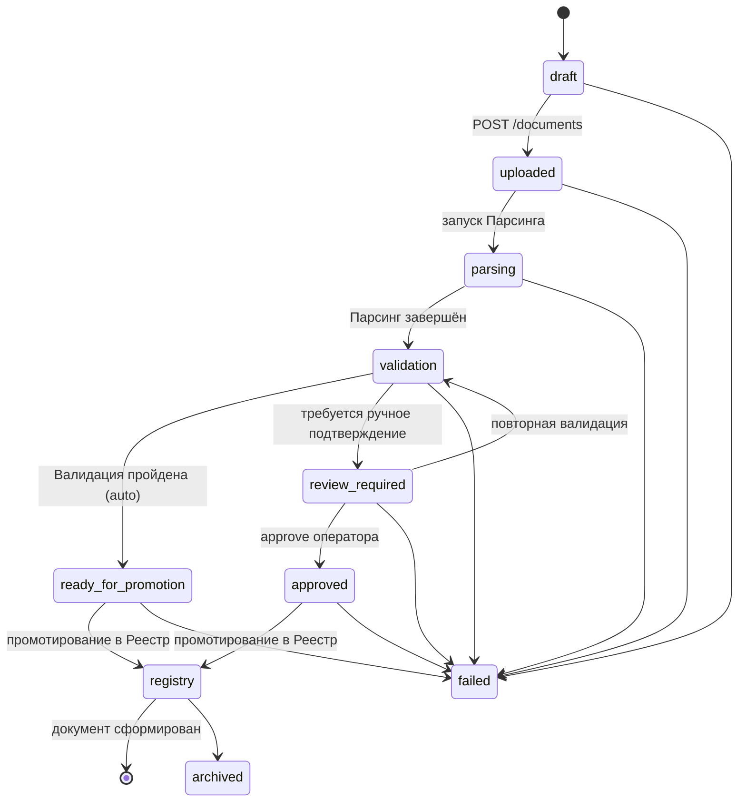
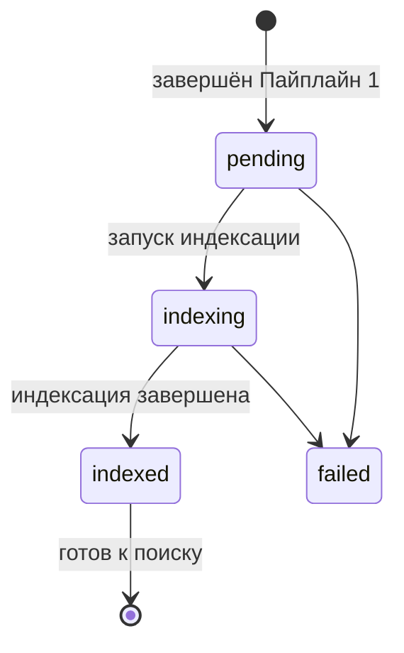

## Пайплайны обработки документов (v3.0)

Orchestrator координирует сквозную обработку документов через **два независимых пайплайна**, каждый из которых решает свою задачу и имеет строгую изоляцию по доступу к базе данных.

```
Пайплайн 1: Формирование документа
====================================
MinIO (ссылка) → [Парсинг] → JSON → [Валидация] → JSON → [Реестр] → JSON со ссылками в БД
                    (изоляция)      (читает БД)          (пишет БД)
                                                              ↓
Пайплайн 2: Индексация документа
====================================
                    JSON со ссылками в БД → [RAG индексация] → Статус
                                               (пишет БД)
                                                    ↓
                               JSON-запрос → [RAG поиск] → JSON-ответ
                                               (читает БД)
```

**Роль Оркестратора:** управляет последовательностью вызовов, передаёт JSON-контейнеры между этапами как **непрозрачные артефакты** (структура JSON известна только сервисам).

Детальное описание пайплайнов:
- [Пайплайн 1: Формирование документа](pipeline1-formation.md)
- [Пайплайн 2: Индексация документа](pipeline2-indexation.md)

---

### 3. Сводная таблица доступа к БД

| Пайплайн | Этап | Доступ к БД | Направление данных |
|----------|------|-------------|-------------------|
| Формирование | 1. Парсинг | **Нет** (изоляция) | Вход: ссылка MinIO → Выход: JSON |
| Формирование | 2. Валидация | **Читает** | Вход: JSON → Выход: JSON с решением |
| Формирование | 3. Реестр | **Пишет** | Вход: JSON → Выход: JSON со ссылками |
| Индексация | 1. RAG индексация | **Пишет** | Вход: JSON со ссылками → Выход: статус |
| Индексация | 2. RAG поиск | **Читает** | Вход: JSON-запрос → Выход: JSON-ответ |

---

### 4. Статусная модель (FSM)

#### Пайплайн 1: Формирование документа



#### Пайплайн 2: Индексация документа



---

### 5. Матрица ответственности сервисов

| Операция | Пайплайн | Этап | Сервис | Доступ к БД |
|---|---|---|---|---|
| Загрузка файла, SHA-256, MinIO | 1 | Пре-стейдж | **Orchestrator** | Пишет |
| Распознавание, парсинг структуры | 1 | 1. Парсинг | **Парсинг / OCR Service** | Нет |
| Валидация JSON, классификация | 1 | 2. Валидация | **Validation Service** | Читает |
| Проверка кодов по справочнику | 1 | 2. Валидация | **Registry Service** | Читает |
| Запись карточки документа в БД | 1 | 3. Реестр | **Registry Service** | Пишет |
| Чанкинг + Embeddings + Индекс | 2 | 1. RAG индексация | **RAG Service** | Пишет |
| Поиск + генерация ответа | 2 | 2. RAG поиск | **RAG Service** | Читает |

---

### 6. Эндпоинты внутренних сервисов

#### Парсинг / OCR Service

| Метод | Путь | Описание | Доступ к БД |
|---|---|---|---|
| `POST` | `/ocr/process` | Асинхронный запуск распознавания и парсинга | Нет |
| `GET` | `/ocr/process/{task_id}/status` | Статус обработки | Нет |
| `GET` | `/ocr/process/{task_id}/result` | Получение JSON-контейнера с результатом парсинга | Нет |

#### Validation Service

| Метод | Путь | Описание | Доступ к БД |
|---|---|---|---|
| `POST` | `/validate/document` | Комплексная валидация документа (структура, классификация, уникальность) | Читает |
| `POST` | `/validate/classifiers` | Валидация классификационных кодов | Читает |
| `POST` | `/validate/check` | Проверка правил | Нет |

#### Analyse Service

| Метод | Путь | Описание | Доступ к БД |
|---|---|---|---|
| `POST` | `/analyse/compare` | Сопоставление норм и проектов (асинхронно) | Читает |
| `POST` | `/analyse/compare/batch` | Пакетное сравнение фрагментов | Читает |
| `GET` | `/analyse/compare/{comparison_id}` | Результат сравнения | Читает |
| `POST` | `/analyse/calculate` | Арифметический движок для вычислений | Нет |
| `POST` | `/analyse/recommend` | Рекомендации по исправлению ошибок | Читает |

#### Registry Service

| Метод | Путь | Описание | Доступ к БД |
|---|---|---|---|
| `POST` | `/registry/documents` | Создание карточки документа (Реестр) | Пишет |
| `GET` | `/registry/documents` | Список документов в реестре | Читает |
| `GET` | `/registry/documents/{id}` | Детали документа | Читает |
| `POST` | `/registry/classifiers/validate` | Валидация классификационных кодов по справочнику | Читает |
| `GET` | `/registry/classifiers` | Справочники классификаторов | Читает |

#### RAG Service

| Метод | Путь | Пайплайн | Описание | Доступ к БД |
|---|---|---|---|---|
| `POST` | `/rag/index` | 2 (Индексация) | Чанкинг + Embeddings + построение индекса | Пишет |
| `DELETE` | `/rag/index/{document_id}` | 2 (Индексация) | Удаление чанков документа из индекса | Пишет |
| `GET` | `/rag/index/{document_id}/status` | 2 (Индексация) | Статус индексации | Читает |
| `POST` | `/rag/search` | 2 (Поиск) | Гибридный поиск (dense + sparse + pg_trgm) | Читает |
| `POST` | `/rag/generate` | 2 (Поиск) | Генерация ответа с опорой на контекст | Читает |

---

### 7. Поток данных (Data Flow)

```mermaid
graph LR
    subgraph "Пайплайн 1: Формирование документа"
        MinIO[(MinIO)] -->|file_ref| P[Парсинг]
        P -->|JSON (opaque)| V[Валидация]
        V -->|JSON (opaque)| R[Реестр]
        R -->|JSON со ссылками| DB[(PostgreSQL\nRegistry nsi)]
    end

    subgraph "Пайплайн 2: Индексация документа"
        DB -->|JSON со ссылками| RI[RAG Индексация]
        RI -->|status| DB
        RI --> VI[(Векторный индекс\npgvector)]
        UI -->|поисковый запрос| RS[RAG Поиск]
        VI --> RS
        RS -->|JSON-ответ| UI
    end

    style P fill:#e6f3ff,stroke:#333
    style V fill:#fff3e6,stroke:#333
    style R fill:#e6ffe6,stroke:#333
    style RI fill:#ffe6f3,stroke:#333
    style RS fill:#f3e6ff,stroke:#333
```

**Форматы передачи между этапами:**

| Между | Формат | Протокол | Примечание |
|---|---|---|---|
| Orchestrator → Парсинг | `file_ref` (ссылка MinIO) | JSON via HTTP | — |
| Парсинг → Orchestrator | **JSON-контейнер** (структура документа) | JSON via HTTP | Непрозрачен для Orchestrator |
| Orchestrator → Валидация | **JSON-контейнер** (от Парсинга) | JSON via HTTP | Непрозрачен для Orchestrator |
| Валидация → Orchestrator | **JSON с решением** (auto / review) | JSON via HTTP | Непрозрачен для Orchestrator |
| Orchestrator → Реестр | **JSON с решением** (от Валидации) | JSON via HTTP | Непрозрачен для Orchestrator |
| Реестр → Orchestrator | **JSON со ссылками в БД** | JSON via HTTP | — |
| Orchestrator → RAG индексация | **JSON со ссылками в БД** | JSON via HTTP | — |
| RAG индексация → Orchestrator | Статус завершения | JSON via HTTP | — |
| UI → Orchestrator | Поисковый запрос | JSON via HTTP | — |
| Orchestrator → RAG поиск | Поисковый запрос | JSON via HTTP | — |
| RAG поиск → Orchestrator | **JSON-ответ с цитированием** | JSON via HTTP | — |

---

### 8. Ключевые архитектурные решения

| Решение | Обоснование |
|---|---|
| **Два пайплайна вместо одного** | Разделяет concerns: формирование документа (бизнес-логика) и индексация для поиска (RAG). Позволяет индексировать повторно без повторного распознавания |
| **Чанкинг в RAG индексации, а не в Парсинге** | Парсинг отвечает только за распознавание и структурирование. Чанкинг — задача RAG для оптимизации поиска. Разные стратегии чанкинга не влияют на карточку документа |
| **Изоляция доступа к БД по этапам** | Парсинг не зависит от БД — может масштабироваться горизонтально. Валидация читает, Реестр пишет — исключены гонки и каскадные锁. RAG индексация пишет, RAG поиск читает — консистентность данных |
| **Оркестратор оперирует JSON как контейнером** | Структура JSON известна только сервисам. Orchestrator не имеет доступа к БД (кроме пре-стейджа загрузки). Снижает связанность, упрощает тестирование и замену сервисов |
| **CAS-пути для файлов** | `{doc_id}/v{n}/{hash}.{ext}` — гарантирует целостность и исключает дубликаты |
| **Бизнес-ключ `title_hash_sha256`** | Учитывает `era`, `source_type`, коды классификации — исключает коллизии (ГОСТ СССР vs ГОСТ РФ с одинаковым номером) |
