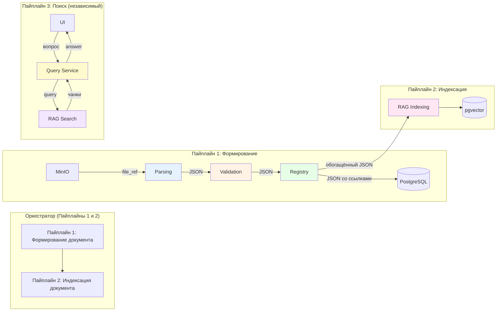
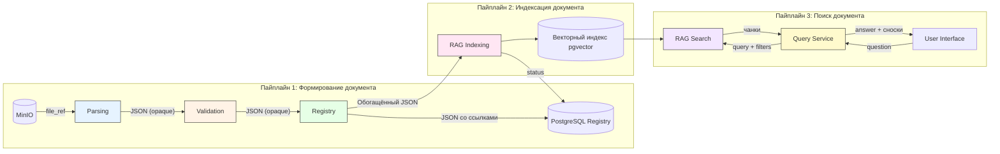
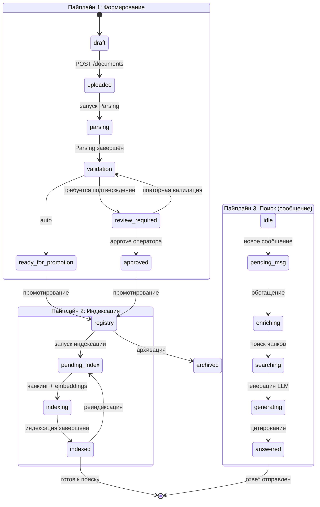
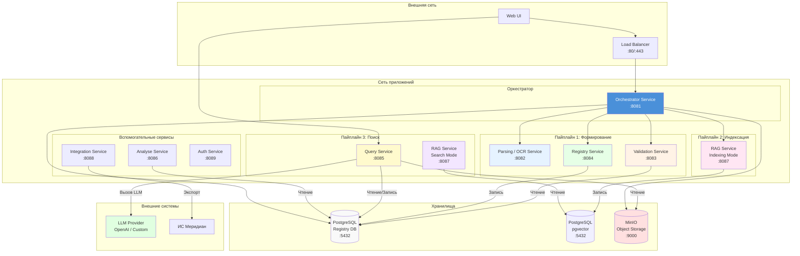

## Пайплайны обработки документов (v3.0)

Оркестратор координирует сквозную обработку документов через **два пайплайна** (Формирование и Индексация). Пайплайн 3 (Поиск) работает **независимо** — пользователь обращается напрямую к Query Service.

**Роль Оркестратора:** управляет последовательностью вызовов **Пайплайнов 1 и 2**, передаёт JSON-контейнеры между этапами как **непрозрачные артефакты** (структура JSON известна только сервисам). Помимо координации, Оркестратор:

- Выполняет пре-стейдж загрузки: сохраняет файл в MinIO, вычисляет SHA-256, создаёт запись в БД
- Ведёт историю обработки документа (`GET /documents/{doc_id}/history`)
- Управляет статусной моделью FSM для каждого пайплайна независимо

Пайплайн 3 (Поиск) работает **независимо** — пользователь обращается напрямую к Query Service, минуя Оркестратор.

Детальное описание пайплайнов:

- [Пайплайн 1: Формирование документа](pipeline1-formation.md)
- [Пайплайн 2: Индексация документа](pipeline2-indexation.md)
- [Пайплайн 3: Поиск документа](pipeline3-search.md)

---

### 3. Сводная таблица доступа к БД

| Пайплайн     | Этап                      | Доступ к БД                   | Направление данных                                                 |
| ------------ | ------------------------- | ----------------------------- | ------------------------------------------------------------------ |
| Формирование | 1. Parsing                | **Нет** (изоляция)            | Вход: ссылка MinIO → Выход: JSON                                   |
| Формирование | 2. Validation             | **Читает**                    | Вход: JSON → Выход: JSON с решением                                |
| Формирование | 3. Registry               | **Пишет**                     | Вход: JSON → Выход: JSON со ссылками                               |
| Индексация   | 1. RAG Indexing           | **Пишет**                     | Вход: обогащённый JSON → Выход: статус                             |
| Поиск        | 1. Приём сообщения        | **Пишет** (история чата)      | Вход: content → Выход: 202 + message_id                            |
| Поиск        | 2. Обогащение терминами   | **Читает** (словарь терминов) | Вход: текст → Выход: обогащённый запрос                            |
| Поиск        | 3. RAG Search             | **Читает**                    | Вход: query + filters → Выход: массив чанков                       |
| Поиск        | 3b. Генерация ответа LLM  | **Нет**                       | Вход: чанки → Выход: текст ответа                                  |
| Поиск        | 4. Обогащение цитирований | **Нет**                       | Вход: текст LLM + чанки → Выход: answer с аннотированными сносками |

---

### 4. Статусная модель (FSM)

Детальные FSM-диаграммы и описание состояний — в соответствующих документах:

- **Пайплайн 1 (Формирование):** `draft → uploaded → parsing → validation → ready_for_promotion / review_required → approved → registry → archived` — [FSM и таблица состояний](pipeline1-formation.md#статусная-модель-fsm)
- **Пайплайн 2 (Индексация):** `pending → indexing → indexed` — [FSM и таблица состояний](pipeline2-indexation.md#статусная-модель-fsm)
- **Пайплайн 3 (Поиск):** `idle → pending → enriching → searching → generating → enriching_citations → answered` — [FSM и таблица состояний](pipeline3-search.md#статусная-модель-fsm)

---

### 5. Матрица ответственности сервисов

| Операция                                       | Пайплайн | Этап              | Сервис                    | Доступ к БД  |
| ---------------------------------------------- | -------- | ----------------- | ------------------------- | ------------ |
| Загрузка файла, SHA-256, MinIO                 | 1        | Пре-стейдж        | **Orchestrator**          | Пишет        |
| Распознавание, парсинг структуры               | 1        | 1. Parsing        | **Parsing / OCR Service** | Нет          |
| Валидация JSON, классификация                  | 1        | 2. Validation     | **Validation Service**    | Читает       |
| Проверка кодов по справочнику                  | 1        | 2. Validation     | **Registry Service**      | Читает       |
| Запись карточки документа в БД                 | 1        | 3. Registry       | **Registry Service**      | Пишет        |
| Чанкинг + Embeddings + Индекс                  | 2        | 1. RAG Indexing   | **RAG Service**           | Пишет        |
| Приём сообщения                                | 3        | 1. Query Service  | **Query Service**         | Пишет        |
| Обогащение терминами                           | 3        | 2. Query Service  | **Query Service**         | Читает       |
| RAG поиск чанков                               | 3        | 3. RAG Search     | **RAG Service**           | Читает       |
| Генерация ответа LLM                           | 3        | 3b. Query Service | **Query Service**         | Нет          |
| Обогащение цитирований                         | 3        | 4. Query Service  | **Query Service**         | Нет          |
| Управление файлами, экспорт во внешние системы | —        | Вспомогательный   | **Integration Service**   | Читает/Пишет |
| Сопоставление норм и проектов, расчёты         | —        | Вспомогательный   | **Analyse Service**       | Читает       |

---

### 6. Эндпоинты внутренних сервисов

Детальное описание API каждого сервиса — в соответствующих документах:

| Сервис        | Документация                                                      | Базовый URL (внутренний) |
| ------------- | ----------------------------------------------------------------- | ------------------------ |
| Orchestrator  | [orchestrator_service_api.md](../api/orchestrator_service_api.md) | `http://127.0.0.1:8081`  |
| Parsing / OCR | [ocr_service_api.md](../api/ocr_service_api.md)                   | `http://127.0.0.1:8082`  |
| Validation    | [validate_service_api.md](../api/validate_service_api.md)         | `http://127.0.0.1:8083`  |
| Registry      | [registry_service_api.md](../api/registry_service_api.md)         | `http://127.0.0.1:8084`  |
| Query Service | [query_service_api.md](../api/query_service_api.md)               | `http://127.0.0.1:8085`  |
| Analyse       | [analyse_service_api.md](../api/analyse_service_api.md)           | `http://127.0.0.1:8086`  |
| RAG           | [rag_service_api.md](../api/rag_service_api.md)                   | `http://127.0.0.1:8087`  |
| Integration   | [integration_service_api.md](../api/integration_service_api.md)   | `http://127.0.0.1:8088`  |
| Auth          | [auth_service_api.md](../api/auth_service_api.md)                 | `http://127.0.0.1:8089`  |

---

### 7. Поток данных (Data Flow)

**Форматы передачи между этапами:**

| Между                       | Формат                                         | Протокол      | Примечание                                      |
| --------------------------- | ---------------------------------------------- | ------------- | ----------------------------------------------- |
| Orchestrator → Parsing      | `file_ref` (ссылка MinIO)                      | JSON via HTTP | —                                               |
| Parsing → Orchestrator      | **JSON-контейнер** (структура документа)       | JSON via HTTP | Непрозрачен для Orchestrator                    |
| Orchestrator → Validation   | **JSON-контейнер** (от Parsing)                | JSON via HTTP | Непрозрачен для Orchestrator                    |
| Validation → Orchestrator   | **JSON с решением** (auto / review)            | JSON via HTTP | Непрозрачен для Orchestrator                    |
| Orchestrator → Registry     | **JSON с решением** (от Validation)            | JSON via HTTP | Непрозрачен для Orchestrator                    |
| Registry → Orchestrator     | **Обогащённый JSON (структура + ссылки в БД)** | JSON via HTTP | —                                               |
| Orchestrator → RAG Indexing | **Обогащённый JSON от Registry**               | JSON via HTTP | —                                               |
| RAG Indexing → Orchestrator | Статус завершения                              | JSON via HTTP | —                                               |
| UI → Query Service          | Вопрос / поисковый запрос                      | JSON via HTTP | —                                               |
| Query Service → RAG Search  | **query + filters**                            | JSON via HTTP | Поиск чанков (без генерации)                    |
| RAG Search → Query Service  | **Массив чанков с полным содержимым**          | JSON via HTTP | Query Service формирует контекст и вызывает LLM |
| Query Service → UI          | **answer + аннотированные сноски**             | JSON via HTTP | Обогащение цитирований идентификаторами         |

#### Асинхронное ожидание (Longpoll)

Все внутренние вызовы между сервисами, помеченные как асинхронные (`202`), используют **longpoll-механизм** для ожидания результата:

1. Orchestrator отправляет запрос на запуск операции → получает `202 {task_id}`
2. Orchestrator вызывает `GET .../{task_id}/status?longpoll=15`
3. Сервис держит соединение до 15 секунд:
   - **Операция завершилась** → немедленный ответ с результатом
   - **Статус изменился** → ответ с текущим прогрессом
   - **Таймаут 15c** → ответ с текущим прогрессом
4. При нефинальном статусе — повторный longpoll

Это справедливо для всех этапов: OCR, Validation (проверка уникальности), Registry, RAG Indexing, Analyse.

Подробнее — [Модель выполнения](../api/common.md#модель-выполнения-sync--async).

---

### 8. Ключевые архитектурные решения

| Решение                                        | Обоснование                                                                                                                                                                                                                                                                                                                                               |
| ---------------------------------------------- | --------------------------------------------------------------------------------------------------------------------------------------------------------------------------------------------------------------------------------------------------------------------------------------------------------------------------------------------------------- |
| **Два независимых пайплайна + поиск**          | Оркестратор координирует формирование документа (бизнес-логика) и индексацию для поиска (RAG). Пайплайн 3 (Поиск/генерация ответа) работает независимо — пользователь обращается напрямую к Query Service. Каждый пайплайн имеет изоляцию по доступу к БД и свою FSM. Позволяет индексировать повторно без повторного распознавания                       |
| **Чанкинг в RAG Indexing, а не в Parsing**     | Parsing отвечает только за распознавание и структурирование. Чанкинг — задача RAG для оптимизации поиска. Разные стратегии чанкинга не влияют на карточку документа                                                                                                                                                                                       |
| **Изоляция доступа к БД по этапам**            | Parsing не зависит от БД — может масштабироваться горизонтально. Validation читает, Registry пишет — исключены гонки и каскадные锁. RAG Indexing пишет, RAG Search читает — консистентность данных                                                                                                                                                         |
| **Оркестратор оперирует JSON как контейнером** | Структура JSON известна только сервисам. Orchestrator не имеет доступа к БД (кроме пре-стейджа загрузки). Снижает связанность, упрощает тестирование и замену сервисов                                                                                                                                                                                    |
| **CAS-пути для файлов**                        | `{doc_id}/v{n}/{hash}.{ext}` — гарантирует целостность и исключает дубликаты                                                                                                                                                                                                                                                                              |
| **Бизнес-ключ `title_hash_sha256`**            | Учитывает `era`, `source_type`, коды классификации — исключает коллизии (ГОСТ СССР vs ГОСТ РФ с одинаковым номером)                                                                                                                                                                                                                                       |
| **Единый `document_id`**                       | Orchestrator генерирует UUID документа при загрузке. Этот же `document_id` используется как первичный ключ во всех сервисах — Parsing, Validation, Registry и RAG. Registry не создаёт свой numeric ID, а пишет `document_id` как есть. Это исключает маппинг идентификаторов на стыке пайплайнов и упрощает трассировку документа от загрузки до поиска. |

---

### 9. End-to-end (сквозной поток)

Детальные sequence-диаграммы для каждого пайплайна — в соответствующих документах:

- **Пайплайн 1 (Формирование):** загрузка файла → Parsing → Validation → Registry — [sequence-диаграмма](pipeline1-formation.md)
- **Пайплайн 2 (Индексация):** запуск RAG Indexing → чанкинг → embeddings → векторный индекс — [sequence-диаграмма](pipeline2-indexation.md)
- **Пайплайн 3 (Поиск):** сообщение → обогащение → RAG Search → LLM → цитирование — [sequence-диаграмма](pipeline3-search.md)

**Ключевые наблюдения:**

- Оркестратор координирует только Пайплайны 1 и 2
- Пайплайн 3 работает независимо, напрямую между UI, Query Service и RAG Search
- Все асинхронные вызовы используют longpoll-механизм (таймаут 15с)
- Единый `document_id` проходит через Пайплайны 1 и 2 без трансформации
- JSON-контейнер передаётся между этапами Пайплайнов 1 и 2 как непрозрачный артефакт

---

### 10. Сводная статусная модель жизненного цикла документа

Объединённая FSM, показывающая полный жизненный цикл документа от загрузки до готовности к поиску.

**Карта соответствия состояний:**

| Состояние             | Пайплайн | Описание                                                 |
| --------------------- | -------- | -------------------------------------------------------- |
| `draft`               | 1        | Черновик после загрузки файла                            |
| `uploaded`            | 1        | Файл загружен в MinIO, ожидание парсинга                 |
| `parsing`             | 1        | Выполняется OCR и распознавание структуры                |
| `validation`          | 1        | Валидация структуры, классификация, уникальность         |
| `review_required`     | 1        | Ожидание ручного подтверждения оператором                |
| `ready_for_promotion` | 1        | Автоматическое подтверждение, ожидание записи в Registry |
| `approved`            | 1        | Оператор подтвердил, ожидание записи в Registry          |
| `registry`            | 1        | Документ записан в реестр (nsi_documents)                |
| `pending_index`       | 2        | Ожидание начала индексации                               |
| `indexing`            | 2        | Выполняется чанкинг и построение векторного индекса      |
| `indexed`             | 2        | Документ проиндексирован, готов к поиску                 |
| `failed`              | 1/2/3    | Ошибка на одном из этапов                                |
| `archived`            | 1        | Документ архивирован (неактивен)                         |

---

### 11. Обработка ошибок и компенсационные потоки (Saga)

Каждый пайплайн реализует паттерн Saga для обеспечения консистентности данных при сбоях. Детальные таблицы компенсаций и диаграммы — в соответствующих документах:

- **Пайплайн 1 (Формирование):** компенсации для этапов загрузки, Parsing, Validation, Registry — [подробнее](pipeline1-formation.md#обработка-ошибок-и-компенсационные-потоки)
- **Пайплайн 2 (Индексация):** компенсации для этапов JSON Parsing, Chunking, Embeddings, Vector Index — [подробнее](pipeline2-indexation.md#обработка-ошибок-и-компенсационные-потоки)
- **Пайплайн 3 (Поиск):** компенсации для этапов приёма сообщения, обогащения, RAG Search, LLM, цитирования — [подробнее](pipeline3-search.md#обработка-ошибок-и-компенсационные-потоки)

---

### 12. Топология развёртывания (Deployment Topology)

**Сводная таблица сервисов и портов:**

| Сервис        | Порт | Пайплайн | Доступ к БД        | Зависимости                        |
| ------------- | ---- | -------- | ------------------ | ---------------------------------- |
| Orchestrator  | 8081 | 1, 2     | Пишет (пре-стейдж) | Parsing, Validation, Registry, RAG |
| Parsing / OCR | 8082 | 1        | Нет                | MinIO                              |
| Validation    | 8083 | 1        | Читает             | Registry (справочники)             |
| Registry      | 8084 | 1        | Пишет              | PostgreSQL                         |
| Query Service | 8085 | 3        | Читает/Пишет       | RAG Search, LLM, PostgreSQL        |
| Analyse       | 8086 | —        | Читает             | PostgreSQL                         |
| RAG           | 8087 | 2, 3     | Пишет/Читает       | PostgreSQL (pgvector)              |
| Integration   | 8088 | —        | Читает/Пишет       | MinIO, Меридиан                    |
| Auth          | 8089 | —        | Читает             | PostgreSQL                         |

**Требования к окружению:**

| Компонент           | Технология          | Версия | Примечание                          |
| ------------------- | ------------------- | ------ | ----------------------------------- |
| База данных         | PostgreSQL          | 15+    | С расширением pgvector              |
| Векторный индекс    | pgvector            | 0.7+   | Для хранения эмбеддингов            |
| Объектное хранилище | MinIO               | LATEST | Для файлов документов               |
| Кэш и очереди       | Redis               | 7+     | Для кэширования и асинхронных задач |
| LLM                 | OpenAI API / Custom | —      | Для генерации ответов               |

---

### 13. Политики повторных попыток и таймаутов (Retry / Timeout)

Детальные таблицы таймаутов и retry для каждого этапа — в соответствующих документах:

- **Пайплайн 1 (Формирование):** [политики retry](pipeline1-formation.md#политики-повторных-попыток-и-таймаутов)
- **Пайплайн 2 (Индексация):** [политики retry](pipeline2-indexation.md#политики-повторных-попыток-и-таймаутов)
- **Пайплайн 3 (Поиск):** [политики retry](pipeline3-search.md#политики-повторных-попыток-и-таймаутов)

#### Глобальные настройки longpoll

| Параметр                    | Значение                  | Описание                                                  |
| --------------------------- | ------------------------- | --------------------------------------------------------- |
| `longpoll_timeout`          | 15 секунд                 | Максимальное время ожидания на один longpoll-запрос       |
| `poll_interval`             | 1 секунда (серверная)     | Минимальный интервал между проверками статуса             |
| `max_retries_per_stage`     | 3                         | Максимальное количество retry на этап (по умолчанию)      |
| `jitter`                    | ±10%                      | Случайное отклонение для предотвращения "Thundering Herd" |
| `circuit_breaker_threshold` | 5 последовательных ошибок | Порог для Circuit Breaker (отключение этапа на 30с)       |

**Принципы:**

1. **Exponential backoff с jitter** — каждый повтор увеличивает задержку с добавлением случайности
2. **Immediate retry** — только для быстрых операций (< 100мс) с гарантированным идемпотентным эффектом
3. **Circuit Breaker** — при 5 последовательных ошибках этап отключается на 30 секунд
4. **Truncation on LLM error** — при ошибке генерации контекст усекается на 20% перед повтором
5. **No retry for idempotent writes** — запись в Registry и RAG Indexing не повторяется при успешном HTTP-статусе, только при таймауте или сетевой ошибке
6. **Все retry логируются** — каждое повторение фиксируется в истории ошибок документа (`GET /documents/{doc_id}/errors`)
