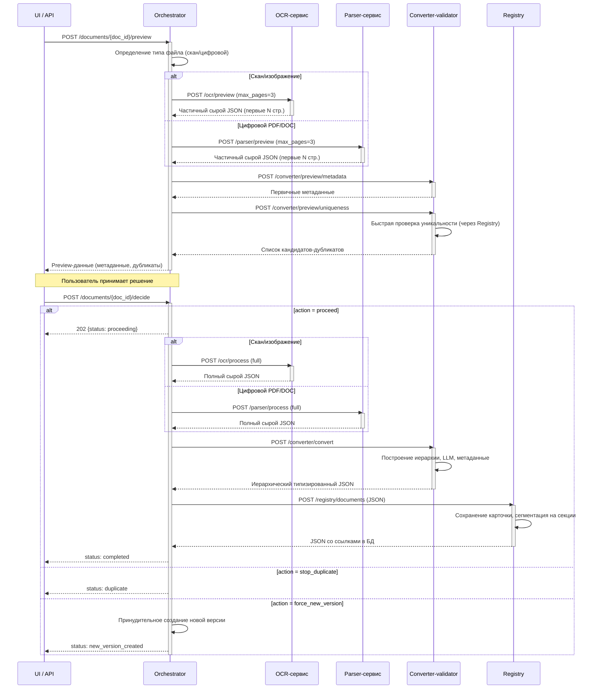
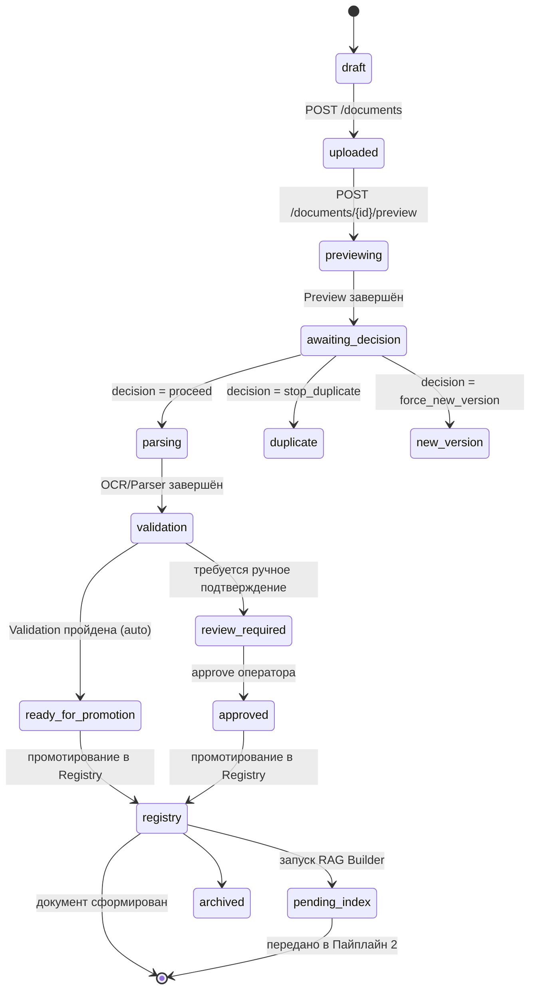
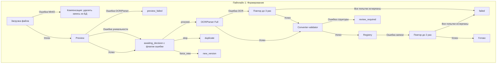

## 1. Пайплайн 1: Формирование документа (двухфазный: preview → решение → full)

Назначение: преобразовать исходный файл в структурированную карточку документа в БД.  
Пайплайн состоит из двух фаз: **Preview** (быстрая проверка, метаданные, решение пользователя) и **Full** (полная обработка).



---

### Фаза Preview

**Цель:** быстро получить первичные метаданные и проверить уникальность документа до полной обработки.

| Шаг | Действие | Сервис | Результат |
|-----|----------|--------|-----------|
| P.1 | Определение типа файла (скан/цифровой) | Оркестратор | Выбор OCR или Parser |
| P.2 | Preview-распознавание (первые N страниц) | OCR-сервис или Parser-сервис | Частичный сырой JSON |
| P.3 | Извлечение первичных метаданных | Converter-validator (preview API) | Обозначение, наименование, тип, даты |
| P.4 | Быстрая проверка уникальности | Converter-validator (preview API) → Registry | Список кандидатов-дубликатов |
| P.5 | Отображение preview пользователю | UI | Метаданные + дубликаты |
| P.6 | Решение пользователя | UI → Оркестратор | proceed / stop_duplicate / force_new_version |

**Параметры preview:**

| Параметр | Значение по умолчанию | Описание |
|----------|----------------------|----------|
| `max_pages` | 3 | Количество страниц для preview-обработки |
| `preview_timeout` | 60с (OCR) / 30с (Parser) | Таймаут на preview-этап |
| `preview_llm_timeout` | 15с | Таймаут на LLM-вызов при извлечении метаданных |

---

### Фаза Full (полная обработка)

Запускается после решения пользователя `proceed`. Состоит из трёх этапов.

#### Этап 1: OCR-сервис и Parser-сервис (распознавание и извлечение сырых данных)

**Сервисы:** OCR-сервис (скан/изображения), Parser-сервис (цифровые PDF/DOC)

Два независимых сервиса с **единым контрактом выходных данных**.

**Вход:** ссылка на файл в MinIO.

**Процесс (единый для обоих сервисов):**

| Шаг | Действие | Результат |
|-----|----------|-----------|
| 1.1 | Скачать файл из MinIO | — |
| 1.2 | Очистка, нормализация изображения | Улучшение качества, ориентация |
| 1.3 | Распознавание документа (OCR/docling) | Текст, таблицы, изображения |
| 1.4 | Извлечение сырых блоков | Плоский массив блоков (текст, таблица, фигура, формула) |
| 1.5 | Сохранение бинарных объектов в MinIO | fileKey для изображений |
| 1.6 | Оценка качества распознавания | confidence, статусы |

**Особенность:** полная изоляция от базы данных — сервис не имеет доступа к БД.  
**LLM не используется.**  
**Выход:** плоский сырой JSON (без иерархии, без заголовков).

> **Примечание:** JSON-формат известен только сервисам и downstream-сервисам. Оркестратор оперирует им как непрозрачным контейнером.

#### Этап 2: Converter-validator (конвертация и валидация)

**Сервис:** Converter-validator

**Вход:** полный сырой JSON от OCR или Parser.

**Процесс:**

| Шаг | Действие | Результат |
|-----|----------|-----------|
| 2.1 | Построение иерархии | Плоские блоки → разделы, подразделы, заголовки |
| 2.2 | Объединение таблиц, разорванных на страницах | Целостные таблицы |
| 2.3 | Извлечение метаданных (LLM, эвристики) | Обозначение, наименование, тип, даты, редакция |
| 2.4 | Распознавание перекрёстных ссылок | Нормализованные ссылки на ГОСТ/ТУ |
| 2.5 | Валидация структуры и полноты | Проверка соответствия схеме |
| 2.6 | Проверка уникальности (по точным метаданным) | Поиск дубликатов через Registry |

**Особенность:** использует LLM для иерархии, классификации и метаданных.  
**Выход:** иерархический типизированный JSON, близкий к итоговому документу.

#### Этап 3: Registry (сервис реестра документов)

**Сервис:** Registry Service

**Вход:** иерархический JSON от Converter-validator.

**Процесс:**

| Шаг | Действие | Результат |
|-----|----------|-----------|
| 3.1 | Сохранение карточки документа в `registry.documents` | `document_id`, ссылки на ресурсы |
| 3.2 | **Сегментирование:** разбиение на секции (`registry.document_sections`) | Каждая секция получает DB-идентификатор |
| 3.3 | Сохранение перекрёстных ссылок в `registry.document_references` | Связи между элементами документа |
| 3.4 | Запись в `registry.document_history` | Фиксация факта публикации документа |

**Выход:** плоский JSON со списком **секций** (не чанков) с метаданными и ссылками в БД.
**Далее:** статус `pending_index` → **передано в Пайплайн 2 (Индексация)**.

---

#### Примеры трансформации данных

##### Preview-фаза: сырой JSON → preview-метаданные + кандидаты в дубликаты

**Вход Converter-validator (preview):** частичный сырой JSON (первые N страниц).

**Выход preview/metadata:**
```json
{
  "designation": "ГОСТ 20868-81",
  "doc_code": "ГОСТ 20868-81",
  "title": "СТОЙКИ УСТАНОВОЧНЫЕ КРЕПЕЖНЫЕ. Технические требования",
  "document_type": "normative",
  "year": "1981",
  "revision": null
}
```

> **Примечание:** `designation` = исходное извлечённое значение из OCR/Parser;
> `doc_code` = нормализованное поле API/БД. На этапе Converter-validator
> эти значения совпадают, но в общем случае `doc_code` может отличаться
> после нормализации (удаление префиксов, приведение регистра и т.д.).

##### Этап 1 → 2

**Выход preview/uniqueness:**
```json
{
  "is_duplicate": false,
  "candidates": [],
  "decision_required": false
}
```

##### Этап 1 → 2: OCR/Parser → Converter-validator (обогащение)

**Вход:** плоский сырой JSON (блоки страниц).  
**Выход:** иерархический JSON с разделами, метаданными, ссылками.

##### Этап 2 → 3: Converter-validator → Registry (простановка DB-ссылок)

**Вход:** иерархический JSON.  
**Выход:** JSON с проставленными `section_id`, `file_key`, блоком `registry`.

---

#### Статусная модель (FSM)



**Описание состояний:**

| Состояние | Описание |
|---|---|
| `draft` | Черновик после загрузки файла в MinIO |
| `uploaded` | Файл загружен, ожидание запуска preview |
| `previewing` | Выполняется preview-фаза (OCR/Parser preview + Converter preview) |
| `awaiting_decision` | Preview завершён, ожидание решения пользователя |
| `parsing` | Выполняется полный OCR/Parser |
| `validation` | Конвертация и валидация (Converter-validator) |
| `ready_for_promotion` | Авто-валидация пройдена, ожидание записи в Registry |
| `review_required` | Требуется ручное подтверждение оператором |
| `approved` | Оператор подтвердил, ожидание записи в Registry |
| `registry` | Документ записан в реестр (registry.documents) |
| `pending_index` | Ожидание запуска RAG Builder (Пайплайн 2) |
| `duplicate` | Документ-дубликат, обработка завершена |
| `new_version` | Создана новая версия существующего документа |
| `archived` | Документ архивирован |

---

#### Обработка ошибок и компенсационные потоки

| Этап | Действие | При ошибке | Компенсация |
|---|---|---|---|
| Пре-стейдж (загрузка) | Сохранение в MinIO, создание записи в БД | Ошибка MinIO | Удалить запись из БД, вернуть ошибку UI |
| Preview OCR/Parser | Распознавание первых N страниц | Ошибка распознавания | Статус `preview_failed` |
| Preview Converter-validator | Извлечение метаданных, проверка уникальности | Ошибка уникальности | `awaiting_decision` с флагом ошибки |
| Full OCR/Parser | Распознавание и парсинг | Ошибка OCR/таймаут | Повтор (до 3 раз), при превышении — статус `failed` |
| Full Converter-validator | Конвертация, валидация | Ошибка структуры JSON | Вернуть `validation.errors`, статус `review_required` |
| Registry | Запись карточки в БД | Ошибка записи | Откат транзакции, повтор (до 2 раз) |



---

#### Политики повторных попыток и таймаутов

| Этап | Таймаут (max) | Retry | Стратегия | Backoff |
|---|---|---|---|---|
| Загрузка файла в MinIO | 60с | 0 | — | — |
| OCR preview | 60с | 1 | Immediate | — |
| Parser preview | 30с | 1 | Immediate | — |
| Converter preview (metadata) | 15с | 0 | — | — |
| Converter preview (uniqueness) | 15с | 0 | — | — |
| OCR Full | 300с (5 мин) | 3 | Exponential | 1с → 2с → 4с |
| Parser Full | 300с (5 мин) | 3 | Exponential | 1с → 2с → 4с |
| Converter-validator (full) | 120с (2 мин) | 2 | Exponential | 1с → 2с |
| Registry (запись) | 30с | 2 | Exponential | 500мс → 1с |
