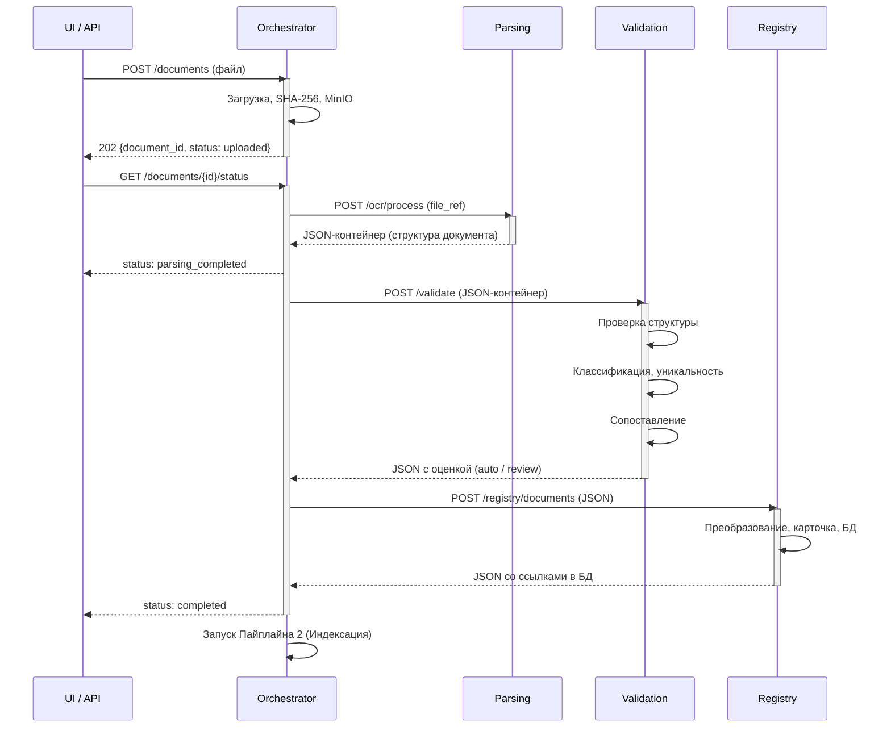

## 1. Пайплайн 1: Формирование документа

Назначение: преобразовать исходный файл в структурированную карточку документа в БД.



---

#### Этап 1: Parsing (полная изоляция от БД)

**Сервис:** Parsing / OCR Service

**Вход:** ссылка на файл в MinIO (изображение или PDF).

**Процесс:**

| Шаг | Действие | Результат |
|---|---|---|
| 1.1 | Скачать файл из MinIO | — |
| 1.2 | Очистка, нормализация изображения | Улучшение качества, ориентация |
| 1.3 | Распознавание документа (OCR / docling) | Текст, таблицы, изображения |
| 1.4 | Парсинг данных документа | Заголовки, разделы, метаданные |
| 1.5 | Построение структуры документа по оригиналу в виде JSON | Типизированная структура согласно типу документа |
| 1.6 | Оценка качества распознавания | confidence, статусы |

**Особенность:** полная изоляция от базы данных — сервис не имеет доступа к БД.

**Выход:** JSON-контейнер со структурой документа (`structure`), классификационными кодами (`classification`) и оценкой качества распознавания (`quality`). Детальный формат — в спецификации сервиса OCR.

> **Примечание:** JSON-формат известен только сервису Parsing и downstream-сервисам. Оркестратор оперирует им как непрозрачным контейнером.

---

#### Этап 2: Validation (читает БД)

**Сервис:** Validation Service

**Вход:** структурированный JSON от этапа Parsing.

**Процесс:**

| Шаг | Действие | Результат |
|---|---|---|
| 2.1 | Валидация структуры JSON | Проверка корректности и полноты |
| 2.2 | Классификация документа | Определение типа, эры, юрисдикции |
| 2.3 | Проверка уникальности в БД | Поиск дубликатов (SHA-256, title_hash) |
| 2.4 | Сопоставление с существующими документами | Связи преемственности (predecessor/successor) |
| 2.5 | Валидация классификационных кодов | По справочнику Registry (MKS, OKSTU, UDK) |

**Особенность:** единственный этап, который **читает** из базы данных.

**Выход:** JSON от Parsing, обогащённый результатами валидации — флаг `structure_valid`, статусы классификационных кодов (`classifiers`), результаты проверки уникальности (`uniqueness`) и сопоставления (`matching`), а также итоговое решение (`decision`: `auto` / `review_required`). Структура документа передаётся сквозным потоком.

---

#### Этап 3: Registry (пишет БД)

**Сервис:** Registry Service

**Вход:** JSON от этапа Validation (содержит структуру документа + результаты валидации).

**Процесс:**

| Шаг | Действие | Результат |
|---|---|---|
| 3.1 | Сохранение карточки документа в `nsi_documents` (doc_code, title, order, validity_status) | `document_id`, ссылки на ресурсы |
| 3.2 | Сохранение секций в `nsi.document_sections` (type, content JSONB), простановка `id` | Каждая секция получает DB-идентификатор |
| 3.3 | Сохранение табличных секций в `nsi_document_sections` (type='table') | Таблицы сохраняются как секции |
| 3.4 | Сохранение секций-изображений в `nsi_document_sections` (type='image') | Изображения получают прямые ссылки |
| 3.5 | Сохранение перекрёстных ссылок в `nsi_document_references` | Связи между элементами документа |
| 3.6 | Запись в `nsi_document_history` (event_type='promoted') | Фиксация факта публикации документа |

**Особенность:** единственный этап, который **пишет** в базу данных. Структура документа не меняется — только проставляются DB-ссылки.

**Выход:** тот же JSON, что и на входе, но с проставленными `id` для секций, `file_key` для изображений и блоком `registry` со ссылками на ресурсы в БД. Эти данные используются RAG для построения чанков и цитирования.

---

#### Примеры трансформации данных

Ниже показано, какие изменения вносятся в JSON-контейнер на каждом этапе Пайплайна 1. Оркестратор передаёт контейнер как непрозрачный артефакт — структура JSON известна только сервисам.

##### Этап 1 → 2: Parsing → Validation (обогащение результатами валидации)

**Вход Validation (выход Parsing):**

```json
{
  "document_id": "b3a8f1c2-...",
  "document": { ... },
  "structure": { ... },
  "classification": { ... },
  "quality": { ... }
}
```

**Выход Validation (добавляется блок `validation`):**

```json
{
  "document_id": "b3a8f1c2-...",
  "document": { ... },          // без изменений
  "structure": { ... },         // без изменений
  "classification": { ... },    // без изменений
  "quality": { ... },           // без изменений
  "validation": {               // ← ДОБАВЛЕНО
    "structure_valid": true,
    "decision": "auto",
    "classifiers": { ... },
    "uniqueness": { ... },
    "matching": { ... }
  }
}
```

**Что изменилось:** добавлен блок `validation` с решением (`auto` / `review_required`), статусами классификаторов, результатами проверки уникальности и сопоставления.

##### Этап 2 → 3: Validation → Registry (простановка DB-ссылок)

**Вход Registry (выход Validation):** JSON с блоками `structure`, `classification`, `quality`, `validation`.

**Выход Registry (добавляются `id` секций, `file_key`, блок `registry`):**

```json
{
  "document_id": "b3a8f1c2-...",
  "document": { ... },          // без изменений
  "structure": {
    "sections": [
      {
        "section_id": "sec-intro",  // ← ДОБАВЛЕНО (DB-идентификатор)
        "type": "text",
        "title": "Общие положения",
        "content": "...",
        "level": 1,
        "path": "/1"
      },
      {
        "section_id": "sec-table-1",  // ← ДОБАВЛЕНО
        "type": "table",
        "title": "Таблица 1 — Минимальные толщины",
        "content": { ... },
        "level": 2,
        "path": "/1/4.2/t1",
        "file_key": "b3a8f1c2/v1/table-1003.png"  // ← ДОБАВЛЕНО
      },
      ...
    ]
  },
  "classification": { ... },    // без изменений
  "quality": { ... },           // без изменений
  "validation": { ... },        // без изменений
  "registry": {                 // ← ДОБАВЛЕНО
    "document_id": "b3a8f1c2-...",
    "version_id": "ver-001",
    "created_at": "2026-05-15T12:00:18Z",
    "sections_count": 3,
    "references_count": 0
  }
}
```

**Что изменилось:**
- У каждой секции появился `section_id` (DB-идентификатор в `nsi_document_sections`)
- Для таблиц добавлен `file_key` (ссылка на изображение в MinIO)
- Добавлен блок `registry` с метаданными записи в БД
- Этот обогащённый JSON передаётся в **Пайплайн 2 (Индексация)** как входной контейнер
