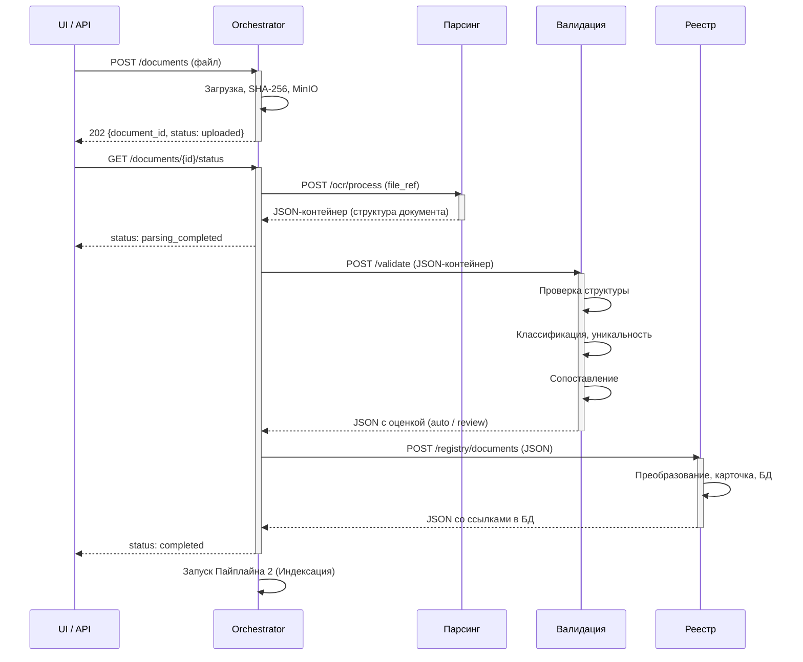

## 1. Пайплайн 1: Формирование документа

Назначение: преобразовать исходный файл в структурированную карточку документа в БД.

---

#### Этап 1: Парсинг (полная изоляция от БД)

**Сервис:** Парсинг / OCR Service

**Вход:** ссылка на файл в MinIO (изображение или PDF).

**Процесс:**

| Шаг | Действие | Результат |
|---|---|---|
| 1.1 | Скачать файл из MinIO | — |
| 1.2 | Очистка, нормализация изображения | Улучшение качества, ориентация |
| 1.3 | Распознавание документа (OCR / docling) | Текст, таблицы, изображения |
| 1.4 | Парсинг данных документа | Заголовки, разделы, метаданные |
| 1.5 | Построение структуры документа по оригиналу в виде JSON | Типизированная структура согласно типу документа |
| 1.6 | Оценка качества распознавания | confidence, статусы |

**Особенность:** полная изоляция от базы данных — сервис не имеет доступа к БД.

**Выход:** JSON-контейнер со структурой документа (`structure`), классификационными кодами (`classification`) и оценкой качества распознавания (`quality`). Детальный формат — в спецификации сервиса OCR.

> **Примечание:** JSON-формат известен только сервису Парсинга и downstream-сервисам. Оркестратор оперирует им как непрозрачным контейнером.

---

#### Этап 2: Валидация (читает БД)

**Сервис:** Validation Service

**Вход:** структурированный JSON от этапа Парсинга.

**Процесс:**

| Шаг | Действие | Результат |
|---|---|---|
| 2.1 | Валидация структуры JSON | Проверка корректности и полноты |
| 2.2 | Классификация документа | Определение типа, эры, юрисдикции |
| 2.3 | Проверка уникальности в БД | Поиск дубликатов (SHA-256, title_hash) |
| 2.4 | Сопоставление с существующими документами | Связи преемственности (predecessor/successor) |
| 2.5 | Валидация классификационных кодов | По справочнику Registry (MKS, OKSTU, UDK) |

**Особенность:** единственный этап, который **читает** из базы данных.

**Выход:** JSON от Парсинга, обогащённый результатами валидации — флаг `structure_valid`, статусы классификационных кодов (`classifiers`), результаты проверки уникальности (`uniqueness`) и сопоставления (`matching`), а также итоговое решение (`decision`: `auto` / `review_required`). Структура документа передаётся сквозным потоком.

---

#### Этап 3: Реестр документов (пишет БД)

**Сервис:** Registry Service

**Вход:** JSON от этапа Валидации (содержит структуру документа + результаты валидации).

**Процесс:**

| Шаг | Действие | Результат |
|---|---|---|
| 3.1 | Сохранение карточки документа в `nsi.documents` | `registry_doc_id`, ссылки на ресурсы |
| 3.2 | Сохранение секций в `nsi.document_sections`, простановка `id` | Каждая секция получает DB-идентификатор |
| 3.3 | Сохранение таблиц в `nsi.extracted_tables`, простановка `id` | Каждая таблица получает DB-идентификатор |
| 3.4 | Сохранение связей изображений, простановка `file_url` | Изображения получают прямые ссылки |

**Особенность:** единственный этап, который **пишет** в базу данных. Структура документа не меняется — только проставляются DB-ссылки.

**Выход:** тот же JSON, что и на входе, но с проставленными `id` для секций/таблиц, `file_url` для изображений и блоком `registry` с `doc_id` и ссылками на ресурсы в БД. Эти данные используются RAG для построения чанков и цитирования.
