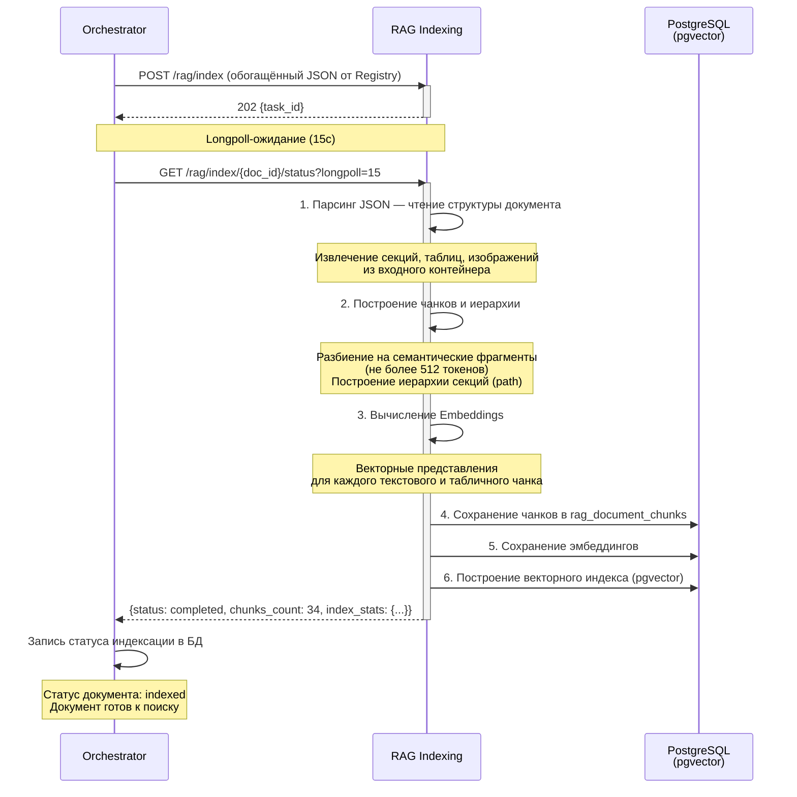

### 2. Пайплайн 2: Индексация документа

Назначение: построить векторный индекс для семантического поиска и обеспечить RAG-функциональность.

**Вход (триггер):** успешное завершение Пайплайна 1 (получен обогащённый JSON от Registry со структурой документа и ссылками на ресурсы).

#### Этап 1: RAG Indexing (пишет БД)

**Сервис:** RAG Service

**Вход:** полный JSON со структурой документа и ссылками на ресурсы в БД (результат Пайплайна 1).

JSON уже содержит все необходимые данные: метаданные документа, классификацию, секции с заголовками и содержимым, таблицы, ссылки на изображения. Дополнительного обращения к БД за содержимым не требуется.

**Процесс:**

| Шаг | Действие | Результат |
|---|---|---|
| 1.1 | Парсинг JSON — чтение структуры документа из входного контейнера | Документ, секции, таблицы, изображения |
| 1.2 | Построение чанков и иерархии | Разбиение на семантические фрагменты (по разделам/подразделам), построение иерархии секций (path) |
| 1.3 | Вычисление Embeddings | Векторные представления для каждого текстового и табличного чанка |
| 1.4 | Построение векторного индекса | Сохранение чанков в `rag_document_chunks`, эмбеддингов и индексов |

**Особенность:** единственный этап, который **пишет** в базу данных — сохраняет чанки, эмбеддинги и индексы.

**Выход:** статус индексации (`completed`/`failed`), количество созданных чанков и статистика по типам (`sections`, `chunks`, `embeddings`).

---

#### Longpoll-механизм для Pipeline 2

Вызов RAG Indexing является асинхронным. Оркестратор использует longpoll-механизм для ожидания результата (аналогично Pipeline 1):

1. **Запуск**: Оркестратор отправляет `POST /rag/index` с обогащённым JSON от Registry
   → Получает `202 Accepted { "task_id": "..." }`
2. **Ожидание**: Оркестратор вызывает `GET /rag/index/{document_id}/status?longpoll=15`
3. **Сервис RAG** держит соединение до 15 секунд:
   - **Индексация завершена** → немедленный ответ с результатом и статусом `completed`
   - **Индексация в процессе** → ответ с текущим прогрессом (`chunks_generated`, `embeddings_count`)
   - **Таймаут 15с** → ответ с текущим прогрессом (нефинальный статус)
4. **Повтор**: при нефинальном статусе — повторный longpoll-запрос
5. **Завершение**: при получении `status: completed` Оркестратор фиксирует завершение индексации и обновляет статус документа на `indexed`

**Параметры longpoll:**

| Параметр | Значение по умолчанию | Описание |
|---|---|---|
| `longpoll` | `15` секунд | Время ожидания завершения индексации |
| `poll_interval` | `1` секунда (серверная) | Минимальный интервал между проверками статуса |

**Форматы ответов на статус:**

| Статус | Описание | Действие Оркестратора |
|---|---|---|
| `pending` | Индексация ещё не началась | Повторный longpoll через 1с |
| `indexing` | Идёт построение чанков и эмбеддингов | Повторный longpoll |
| `indexed` | Индексация завершена успешно | Завершить, запустить Pipeline 3 готов |
| `failed` | Ошибка индексации | Зафиксировать ошибку, перейти в `failed` |

---

