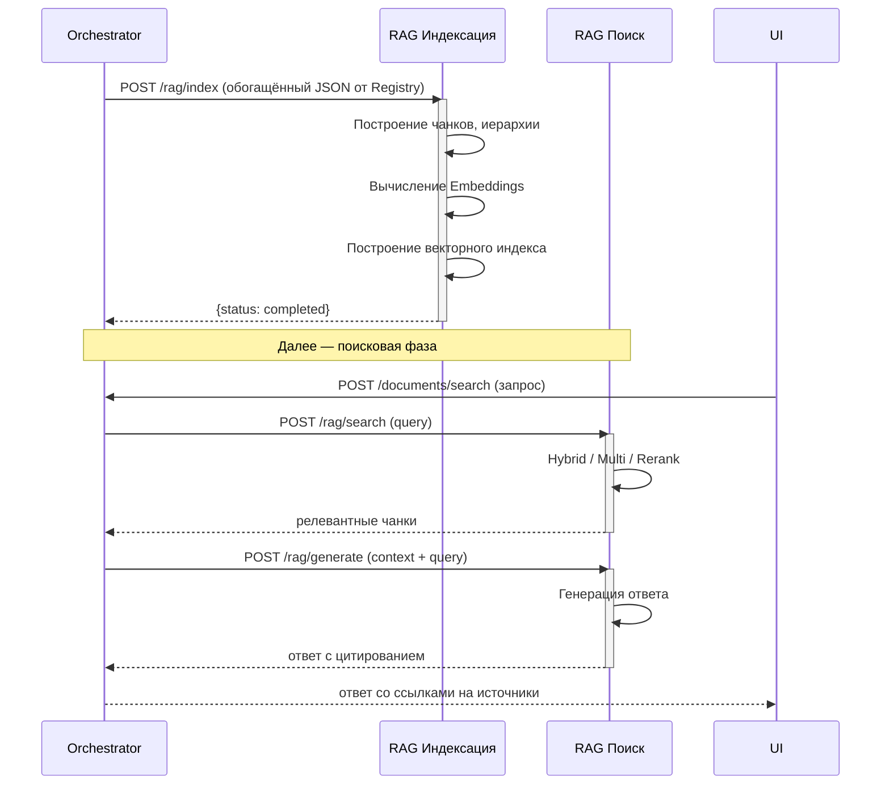

### 2. Пайплайн 2: Индексация документа

Назначение: построить векторный индекс для семантического поиска и обеспечить RAG-функциональность.

**Вход (триггер):** успешное завершение Пайплайна 1 (получен обогащённый JSON от Registry со структурой документа и ссылками на ресурсы).

#### Этап 1: RAG индексация (пишет БД)

**Сервис:** RAG Service

**Вход:** полный JSON со структурой документа и ссылками на ресурсы в БД (результат Пайплайна 1).

JSON уже содержит все необходимые данные: метаданные документа, классификацию, секции с заголовками и содержимым, таблицы, ссылки на изображения. Дополнительного обращения к БД за содержимым не требуется.

**Процесс:**

| Шаг | Действие | Результат |
|---|---|---|
| 1.1 | Парсинг JSON — чтение структуры документа из входного контейнера | Документ, секции, таблицы, изображения |
| 1.2 | Построение чанков и иерархии | Разбиение на семантические фрагменты (по разделам/подразделам), построение иерархии секций (path) |
| 1.3 | Вычисление Embeddings | Векторные представления для каждого текстового и табличного чанка |
| 1.4 | Построение векторного индекса | Сохранение чанков в `rag_document_chunks`, эмбеддингов и индексов |

**Особенность:** единственный этап, который **пишет** в базу данных — сохраняет чанки, эмбеддинги и индексы.

**Выход:** статус индексации (`completed`/`failed`), количество созданных чанков и статистика по типам (`sections`, `chunks`, `embeddings`).

---

#### Этап 2: RAG поиск (читает БД)

**Сервис:** RAG Service

**Вход:** JSON (поисковый запрос).

**Процесс:**

| Шаг | Действие | Результат |
|---|---|---|
| 2.1 | Поиск (Hybrid, Multi, Rerank) | Гибридный поиск (RRF): векторный (`rag_document_chunks.embedding`) + полнотекстовый (`rag_document_chunks.tsv`) |
| 2.2 | Генерация ответа | Отправка релевантных чанков во внутренний генеративный движок для синтеза ответа |
| 2.3 | Сопоставление с источником в БД | Привязка ответа к секциям документов (`nsi_document_sections`) |

**Особенность:** единственный этап, который **читает** из базы данных — выполняет поиск по построенному индексу.

**Выход:** JSON с массивом релевантных секций (`results`), сгенерированным ответом с цитированием (`answer.sources`) и временем обработки (`processing_time_ms`).
