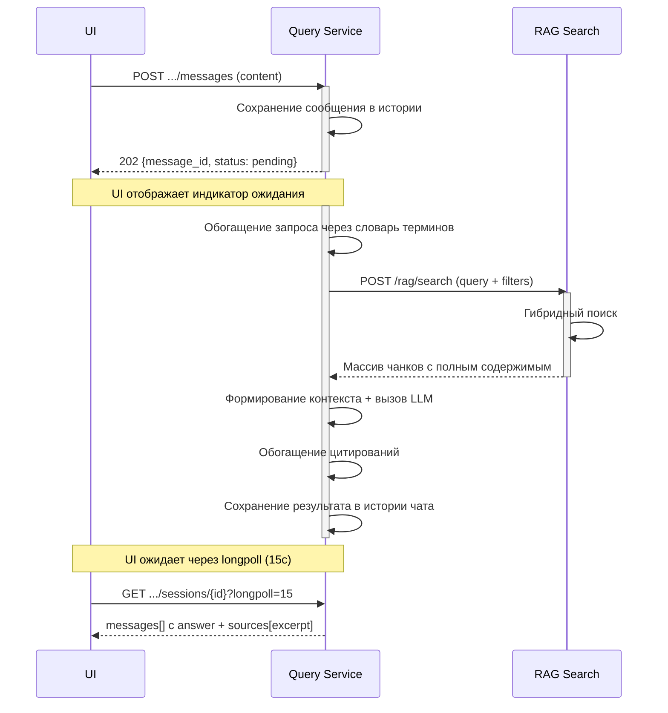
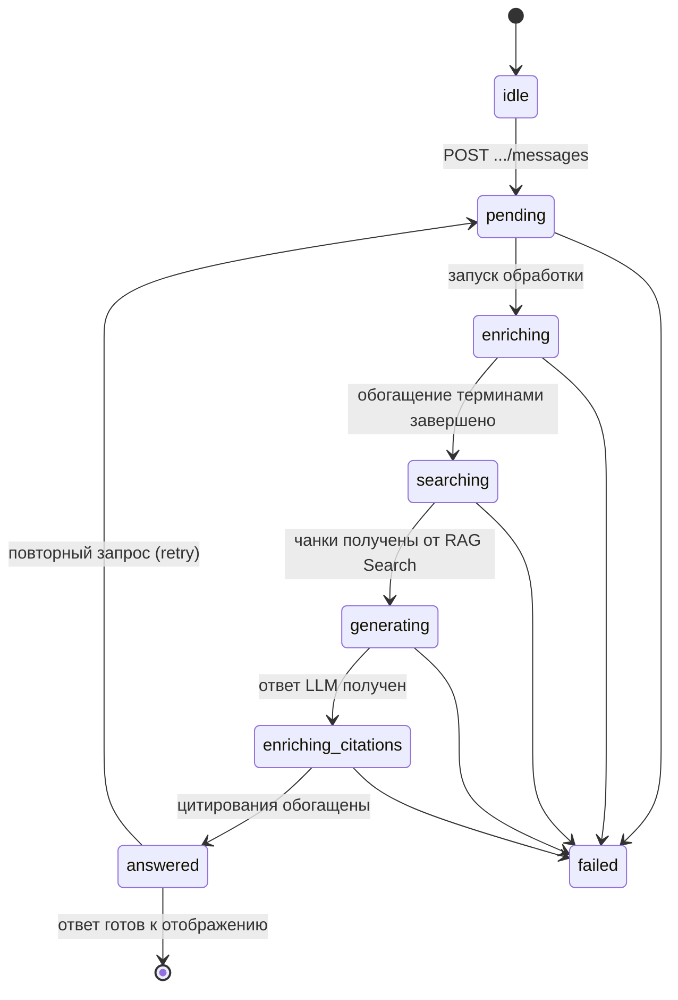
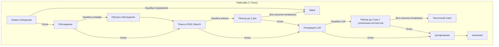

### 3. Пайплайн 3: Поиск документа

Назначение: обеспечить семантический поиск и генерацию ответа на естественном языке по проиндексированным документам.

**Вход (триггер):** сообщение пользователя в чате (UI → Query Service).

**Процесс асинхронный** — UI сначала получает подтверждение, затем ожидает результат через longpoll-запрос к истории чата. По умолчанию таймаут longpoll — 15 секунд.

#### Этап 1: Приём и сохранение сообщения (Query Service)

**Сервис:** Query Service

**Вход:** сообщение пользователя (content + опциональные attachments).

**Процесс:**

| Шаг | Действие | Результат |
|---|---|---|
| 1.1 | Сохранение сообщения пользователя в истории чата | Статус `pending` |
| 1.2 | Возврат `202` с message_id | UI отображает индикатор ожидания |

**Выход:** `202 Accepted` с `message_id` и статусом `pending`.

---

#### Этап 2: Обогащение запроса терминами (Query Service)

**Сервис:** Query Service

**Вход:** текст запроса пользователя.

**Процесс:**

| Шаг | Действие | Результат |
|---|---|---|
| 2.1 | Поиск raw_term → standard_term через словарь Registry | Нормализованный запрос |
| 2.2 | Приведение к normalized_value, добавление synonyms | Расширенный поисковый запрос |

**Пример:**

Исходный запрос: "Проверь толщину обшивки ледового пояса"

После обогащения: "Проверить толщина обшивки ледовый пояс" + синонимы: ["обшивка ледового пояса", "ледовый пояс корпуса"]

**Выход:** обогащённый запрос для RAG.

---

### Этап 3: Поиск чанков (RAG Search)

**Сервис:** RAG Search

**Вход:** обогащённый запрос с вопросом и фильтрами.

**Процесс:**

| Шаг | Действие | Результат |
|---|---|---|
| 3.1 | Гибридный поиск (Hybrid, Multi, Rerank) | Релевантные чанки с полным содержимым |

**Выход:** массив чанков с полным содержимым (`content`), метаданными (`document_id`, `section_id`, `page`, `clause`) и оценками релевантности (`score`).

---

#### Этап 3b: Генерация ответа LLM (Query Service)

**Сервис:** Query Service

**Вход:** массив чанков от RAG Search.

**Процесс:**

| Шаг | Действие | Результат |
|---|---|---|
| 3b.1 | Отбор top_k релевантных чанков | Контекст для LLM |
| 3b.2 | Формирование промпта (вопрос + тексты чанков с метаданными) | Промпт для генеративного движка |
| 3b.3 | Вызов LLM для синтеза ответа | Сгенерированный текст с базовыми ссылками |

**Выход:** текст ответа LLM с базовыми ссылками на источники (без machine-readable идентификаторов).

---

#### Этап 4: Обогащение цитирований и сохранение (Query Service)

**Сервис:** Query Service

**Вход:** текст ответа LLM + массив чанков от RAG Search.

**Процесс:**

| Шаг | Действие | Результат |
|---|---|---|
| 4.1 | Формирование строк-сносок с идентификаторами для каждого источника | `(источник: «Правила РС» %[document_id:doc-001]%, §4.2 %[section_id:sec-42]%, стр. 42)` |
| 4.2 | Замена/добавление сносок в текст ответа | Финальный ответ с аннотированными сносками |
| 4.3 | Сохранение ответа в истории чата (статус `answered`) | Результат доступен для UI |

**Алгоритм постобработки:**

1. Получить текстовый ответ от LLM (без `section_id` и `document_id` в machine-readable формате).
2. Пройти по массиву `sources` (извлечённому из поиска) и для каждого источника сформировать строку-сноску с идентификаторами, например: `(источник: «Правила РС» %[document_id:doc-norm-001]%, §4.2 %[section_id:sec-4.2]%, стр. 42)`.
3. Добавить эти сноски в конец ответа или в то место, где уже стоит базовая ссылка. Если модель уже выдала `(источник: «Правила РС», раздел 4.2, стр. 42)`, заменить её на вариант с `section_id` через регулярное выражение или просто дописать идентификатор после пункта.

**Пример:**

Исходный ответ модели:
> ... не менее **12 мм** (источник: «Правила РС», раздел 4.2, стр. 42).

После обработки Query Service:
> ... не менее **12 мм** (источник: «Правила РС» %[document_id:doc-norm-001]%, §4.2 %[section_id:sec-4.2]%, стр. 42).

**Выход:** JSON с ответом (`answer`), обогащёнными сносками и массивом источников с цитатами (`sources[].excerpt`). Ответ сохранён в истории чата.

---

### Сводная таблица доступа к БД

| Пайплайн | Этап | Доступ к БД | Направление данных |
|---|---|---|---|
| Поиск | 1. Приём сообщения | **Пишет** (история чата) | Вход: content → Выход: 202 + message_id |
| Поиск | 2. Обогащение терминами | **Читает** (словарь терминов) | Вход: текст → Выход: обогащённый запрос |
| Поиск | 3. RAG Search | **Читает** | Вход: query + filters → Выход: массив чанков |
| Поиск | 3b. Генерация ответа LLM | **Нет** | Вход: чанки → Выход: текст ответа |
| Поиск | 4. Обогащение цитирований | **Нет** | Вход: текст LLM + чанки → Выход: answer с аннотированными сносками |

---

### Статусная модель (FSM)

Пайплайн 3 (Поиск) управляет состояниями сообщения в чате, а не документа. У каждого сообщения есть свой статус обработки.

**Описание состояний:**

| Состояние | Описание | Действие |
|---|---|---|
| `idle` | Ожидание нового сообщения от пользователя | — |
| `pending` | Сообщение получено, сохранено в истории чата | UI отображает индикатор ожидания |
| `enriching` | Обогащение запроса терминами через словарь Registry | Поиск `raw_term → standard_term` |
| `searching` | Поиск релевантных чанков в RAG Search | Гибридный поиск (dense + sparse + pg_trgm) |
| `generating` | Генерация ответа LLM на основе найденных чанков | Формирование промпта, вызов LLM |
| `enriching_citations` | Обогащение цитирований machine-readable идентификаторами | Замена/добавление сносок с `document_id`, `section_id` |
| `answered` | Финальный ответ готов, сохранён в истории чата | UI получает ответ через longpoll |
| `failed` | Ошибка на одном из этапов | UI отображает ошибку, возможен повтор |

**Примечание:** FSM Пайплайна 3 является локальной для каждого сообщения в сессии чата. Разные сообщения могут находиться в разных состояниях одновременно.

---

#### Обработка ошибок и компенсационные потоки

| Этап | Действие | При ошибке | Компенсация |
|---|---|---|---|
| 1. Приём сообщения | Сохранение в истории чата | Ошибка БД | Вернуть 500, UI повторяет запрос |
| 2. Обогащение терминами | Поиск терминов в словаре | Ошибка словаря | Пропустить обогащение, искать как есть |
| 3. RAG Search | Гибридный поиск чанков | Ошибка векторного поиска | Повтор (до 2 раз), fallback на полнотекстовый поиск |
| 3b. Генерация LLM | Синтез ответа | Ошибка LLM (таймаут/500) | Повтор (до 2 раз) с усечённым контекстом |
| 4. Обогащение цитирований | Простановка идентификаторов | Ошибка постобработки | Вернуть ответ без machine-readable сносок |

---

#### Политики повторных попыток и таймаутов

| Этап | Таймаут (max) | Retry | Стратегия | Backoff |
|---|---|---|---|---|
| Сохранение сообщения | 10с | 1 | Immediate | — |
| Обогащение терминами | 15с | 0 | — | — |
| RAG Search | 30с | 2 | Exponential | 500мс → 1с |
| LLM генерация | 120с (2 мин) | 2 | Exponential + truncation | 2с → 4с |
| Обогащение цитирований | 10с | 1 | Immediate | — |
