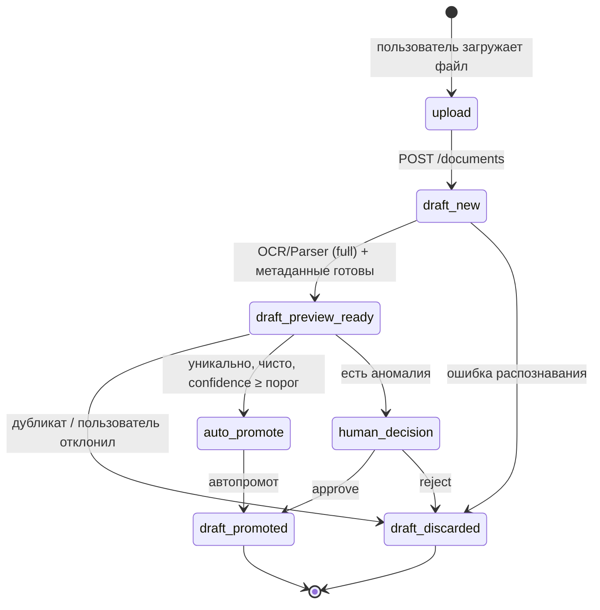

# Хранилище черновиков (Drafts Storage) — план

> **Статус**: проект плана
> **Связь**: `СВОДНЫЙ_ПЛАН_РЕАЛИЗАЦИИ.md` (разделы 2.2, 4.9), встреча 02.06, уточнение 04.06

---

## 1. Проблема

Сейчас документация описывает единый пайплайн:
```
preview → решение пользователя → full → Registry
```

Но не разделяет две принципиально разные фазы:
1. **Черновик-пайплайн** (preview) — идентификация документа, распознавание, проверка уникальности
2. **Промотирование** — загрузка готового черновика в Registry

При этом:
- Один документ может проходить черновик-пайплайн несколько раз (разные попытки распознавания, разные OCR/Parser)
- Человек (или автомат) выбирает лучший черновик для публикации
- Нет чёткого места для хранения промежуточных состояний и истории попыток

---

## 2. Концепция

### 2.1. Схема данных

```
Оркестратор (БД, схема pipeline)
┌──────────────────────────────────────────────────────────┐
│                   tasks                                   │
│ ┌──────┬──────────┬──────────┬──────────────────────┐     │
│ │pk:id │ status   │ created  │ data (JSONB)         │     │
│ ├──────┼──────────┼──────────┼──────────────────────┤     │
│ │100   │ completed│ 04.06    │ {"raw_data_key":"..."} │     │
│ │101   │ failed   │ 04.06    │ {"error":"timeout"}   │     │
│ └──────┴──────────┴──────────┴──────────────────────┘     │
│                                                           │
│                   drafts                                   │
│ ┌──────┬─────────┬──────────┬──────────┬───────────┐      │
│ │pk:id │task_id  │file_key  │doc_key   │ status    │      │
│ ├──────┼─────────┼──────────┼──────────┼───────────┤      │
│ │1     │100      │f-abc     │ X        │ promoted  │      │
│ │2     │101      │f-abc     │ X        │ discarded │      │
│ └──────┴─────────┴──────────┴──────────┴───────────┘      │
│                                                           │
│ Связь: task 1:N draft (один task → один draft)            │
│         draft 1:1 task                                   │
└──────────────────────────────────────────────────────────┘
```

### 2.2. Поток

```
1. Загрузка файла → MinIO → file_key
     │
     ▼
2. POST /documents → task.created (status=new)
     │                 draft.created (status=new, file_key=key)
     ▼
3. Черновик-пайплайн
     ├─ OCR/Parser (ПОЛНЫЙ — см. п.2.4)
     │   результат → raw_ocr_v4 → draft.raw_data (JSONB)
     └─ Converter-validator (метаданные)
         preview_metadata → draft.preview_metadata
         document_key, confidence → draft
     ▼
4. Черновик сохранён (status=preview_ready)

     ├─ Если аномалии → ЧЕЛОВЕК решает (UI: approve/reject)
     └─ Если уникально и чисто → АВТОПРОМОТ
     
     ▼
5. Промотирование
     ├─ Converter-validator (ПОЛНЫЙ) → validated_v3
     │   (берёт draft.raw_data)
     └─ Registry: создание карточки → document_id
     
     ▼
   draft.status = promoted
```

### 2.3. Ключевые решения

| Решение | Обоснование |
|---------|-------------|
| **Черновики — часть Оркестратора** (схема `pipeline`) | Не отдельный сервис. task + draft — связанные сущности одного пайплайна |
| **`pipeline.drafts` — новая таблица** | Рядом с `pipeline.tasks`. Содержит результат черновик-пайплайна |
| **`file_key` — у черновика** | Файл привязан к конкретной попытке распознавания |
| **`pipeline.tasks.data` — JSONB** | Для хранения промежуточных результатов (raw_data_key и т.д.) |
| **Черновик-пайплайн = preview-фаза** | Включает полный OCR/Parser + извлечение метаданных |
| **Человек выбирает только при аномалиях** | Если уникально и чисто — автопромот |
| **История хранится** | Все черновики остаются в таблице, даже discarded |
| **Лимита нет** | Человек может удалить черновик вручную |

### 2.4. Глубина обработки — решение

**Рекомендация: OCR/Parser (full) в черновике, Converter-validator при промотировании.**

```
Черновик:
  OCR/Parser (full) → raw_ocr_v4 → draft.raw_data (JSONB)
  Converter-validator (metadata only, шаг 2.3):
    → preview_metadata (doc_code, title, source_type, era, ...)
    → document_key (SHA-256 бизнес-ключа)
    → confidence
    Сохраняется в draft.preview_metadata

Промотирование:
  Converter-validator (full, шаги 2.1–2.6):
    берёт raw_ocr_v4 из draft.raw_data
    → validated_v3
    → Registry
```

Обоснование:
- **OCR/Parser** — самая дорогая операция. Её результат нужен и для идентификации (метаданные, confidence), и для Registry. Нет смысла делать дважды
- **Converter-validator** — быстрее, можно запустить только при промотировании
- Если черновик отклонён — Converter не запускался, вычислительные потери минимальны
- Черновик содержит достаточно данных для информированного решения: метаданные + confidence + бизнес-ключ

---

## 3. Структура таблиц

### 3.1. `pipeline.tasks`

```sql
CREATE SCHEMA pipeline;

CREATE TABLE pipeline.tasks (
    id              BIGINT PRIMARY KEY GENERATED ALWAYS AS IDENTITY,
    status          TEXT NOT NULL DEFAULT 'new',
    data            JSONB NOT NULL DEFAULT '{}',   -- промежуточные данные (ошибки, опции)
    created_by      TEXT,
    created_at      TIMESTAMPTZ NOT NULL DEFAULT now(),
    updated_at      TIMESTAMPTZ NOT NULL DEFAULT now()
);
```

### 3.2. `pipeline.drafts` (новая)

```sql
CREATE TABLE pipeline.drafts (
    id                BIGINT PRIMARY KEY GENERATED ALWAYS AS IDENTITY,
    task_id           BIGINT NOT NULL REFERENCES pipeline.tasks(id),
    file_key          TEXT NOT NULL,                -- ссылка на файл в MinIO
    document_key      TEXT,                         -- бизнес-ключ (hash)
    status            TEXT NOT NULL DEFAULT 'new',
                                                     -- new | preview_ready | promoted | discarded
    raw_data          JSONB,                        -- raw_ocr_v4 (результат Parser или OCR)
    preview_metadata  JSONB,                        -- doc_code, title, source_type, ...
    confidence        REAL,                         -- оценка качества распознавания
    error_code        TEXT,                         -- код ошибки при discard
    error_message     TEXT,                         -- описание ошибки
    promoted_document_id BIGINT,                    -- document_id после промотирования (FK → registry.documents)
    created_by        TEXT,
    created_at        TIMESTAMPTZ NOT NULL DEFAULT now(),
    updated_at        TIMESTAMPTZ NOT NULL DEFAULT now()
);

CREATE INDEX idx_drafts_document_key ON pipeline.drafts(document_key);
CREATE INDEX idx_drafts_task_id ON pipeline.drafts(task_id);
CREATE INDEX idx_drafts_status ON pipeline.drafts(status);
```

### 3.3. Связь Registry

При промотировании:
- `draft.status = promoted`
- `draft.promoted_document_id = {new document_id}`
- В `draft.raw_data` уже лежит raw_ocr_v4, конвертер берёт его

---

## 4. Жизненный цикл



### Статусы

| Статус | Описание |
|--------|----------|
| `new` | Черновик создан, ожидание OCR/Parser |
| `preview_ready` | OCR/Parser (full) выполнен, метаданные извлечены, бизнес-ключ вычислен |
| `promoted` | Черновик выбран, карточка создана в Registry |
| `discarded` | Черновик отклонён (ошибка, дубликат, пользователь выбрал другой) |

---

## 5. Сценарии

### 5.1. Чистый документ — автопромот

```
1. POST /documents → file_key=f-abc, task_id=100, draft#1 (new, f-abc)
2. OCR/Parser (full) → raw_ocr_v4 → draft.raw_data (JSONB)
3. Converter-validator (metadata) → confidence=0.95, doc_key=X
   draft#1 (preview_ready, doc_key=X, confidence=0.95)
4. Registry check-uniqueness: не дубликат, уникален
5. auto_promote
   Converter-validator (full, берёт draft.raw_data) → validated_v3 → Registry → document_id=500
   draft#1 (promoted, promoted_document_id=500)
```

### 5.2. Аномалия — человек решает

```
1. POST /documents → file_key=f-def, task_id=101, draft#1
2. OCR/Parser (full) → raw_ocr_v4
3. Converter-validator (metadata) → confidence=0.55 (низкий), doc_key=X
4. human_decision
5. UI: "Confidence 0.55 — подтвердить?"
6. Человек: approve → Converter (full) → Registry → document_id=501
                 reject → draft#1 (discarded)
```

### 5.3. Повторная попытка после ошибки

```
1. POST /documents → file_key=f-ghi, task_id=102, draft#1
2. OCR/Parser → ошибка → draft#1 (discarded, error=RECOGNITION_FAILED)
3. Пользователь исправляет файл и загружает снова
4. POST /documents → file_key=f-ghi-2, task_id=103, draft#2
5. OCR/Parser (full) → raw_ocr_v4 → draft.raw_data → draft#2 (preview_ready, doc_key=X)
6. auto_promote → Registry: document_id=502, draft#2 (promoted)
```

### 5.4. Несколько вариантов распознавания (OCR vs Parser)

```
1. POST /documents → file_key=f-jkl, task_id=104 (OCR), draft#1
   OCR/Parser → raw_ocr_v4 → preview_ready (confidence=0.82, doc_key=X)
2. POST /documents → file_key=f-jkl, task_id=105 (Parser), draft#2
   OCR/Parser → raw_ocr_v4 → preview_ready (confidence=0.94, doc_key=X)
3. Аномалия: расхождение confidence, разные метаданные
4. UI: показывает оба черновика для сравнения
5. Человек выбирает Draft#2 → promoted → Registry: document_id=503
```

---

## 6. API (в составе Оркестратора)

Новые публичные эндпоинты:

| Метод | Эндпоинт | Описание |
|---|---|---|
| `GET` | `/api/v1/drafts?document_key={key}` | Список черновиков по бизнес-ключу (история попыток) |
| `GET` | `/api/v1/drafts/{draft_id}` | Получить черновик |
| `GET` | `/api/v1/drafts/{draft_id}/preview` | Получить preview-метаданные черновика |
| `PATCH` | `/api/v1/drafts/{draft_id}/decide` | Решение: `approve` / `reject` (только при human_decision) |
| `DELETE` | `/api/v1/drafts/{draft_id}` | Удалить черновик вручную |

Изменения в существующих эндпоинтах:

| Эндпоинт | Изменение |
|---|---|
| `POST /documents` | При создании задачи создаётся draft (status=new) с file_key |
| (внутренняя операция) | Запись `draft.raw_data` после OCR/Parser (через Оркестратор) |
| `POST /tasks/{task_id}/decide` | При `proceed` — черновик переходит в auto_promote или human_decision |

---

## 7. Границы и ограничения

| Входит | Не входит |
|--------|-----------|
| Таблица `pipeline.drafts` рядом с `pipeline.tasks` | UI сравнения черновиков (будет позже) |
| Автопромот при уникальном + чистом | Автоматический выбор лучшего черновика (LLM) |
| Решение человека при аномалиях | Пакетные операции |
| Хранение истории (discarded не удаляются) | TTL/сроки жизни (удаление — вручную) |
| DELETE для ручного удаления | RAG Search по черновикам (не участвуют) |

---

## 8. Открытые вопросы

| # | Вопрос | Приоритет |
|---|--------|-----------|
| 1 | Какие аномалии требуют решения человека? (низкий confidence, дубликат, расхождение метаданных, ...) | 🟡 Средний |
| 2 | Поле `document_key` — вычислять в Оркестраторе или в Converter-validator? | 🟡 Средний |
| 3 | Нужен ли эндпоинт для повторного запуска черновик-пайплайна по существующему draft? | 🟢 Низкий |

---

## 9. План действий

| Шаг | Что сделать | Кто |
|-----|-------------|-----|
| 1 | Создать таблицы `pipeline.tasks`, `pipeline.drafts` | Разработчик Оркестратора |
| 2 | Добавить `POST /documents` → создание task + draft | Разработчик Оркестратора |
| 3 | После OCR/Parser записать `draft.raw_data` (внутренняя операция Оркестратора) | Разработчик Оркестратора |
| 4 | Добавить запись `preview_metadata` в черновик после метаданных | Разработчик Оркестратора |
| 5 | Реализовать автопромот / human_decision logic | Разработчик Оркестратора |
| 6 | Добавить API `GET /drafts`, `PATCH /drafts/{id}/decide`, `DELETE` | Разработчик Оркестратора |
| 7 | Актуализировать FSM и pipeline1-formation.md | Игорь Жулин |
