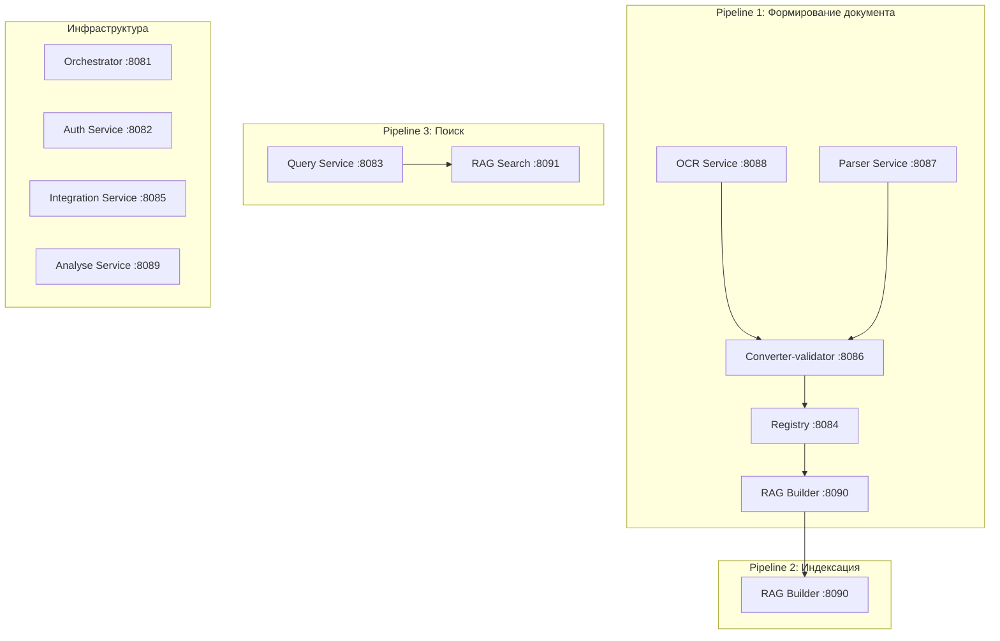

# Диаграммы JSON-файлов — документная модель PKB NeuroAssistant

---

## 1. `document_container_purgatory.json` — Исходный контейнер «чистилища»

```
╔══════════════════════════════════════════════════════════════════╗
║            document_container_purgatory.json  schema 2.3.0       ║
║                                                                  ║
║  ┌──────────────────────────────────────────────────────────┐    ║
║  │                      metadata                            │    ║
║  │  • schema_version: 2.3.0                                 │    ║
║  │  • created_at                                            │    ║
║  │  • parser: name, version, ocr_engine, ocr_fallback       │    ║
║  └──────────────────────────────────────────────────────────┘    ║
║                            │                                     ║
║                            ▼                                     ║
║  ┌──────────────────────────────────────────────────────────┐    ║
║  │                      document                            │    ║
║  │                                                          │    ║
║  │  ┌────────────────────────────────────────────────────┐  │    ║
║  │  │  source: document_version_id, file_name,           │  │    ║
║  │  │  file_hash_sha256, page_count                      │  │    ║
║  │  └────────────────────────────────────────────────────┘  │    ║
║  │                            │                             │    ║
║  │                            ▼                             │    ║
║  │  ┌────────────────────────────────────────────────────┐  │    ║
║  │  │                   metadata                         │  │    ║
║  │  • doc_code, full_title, normalized_title               │    ║
║  │  • group, mks_oks_code, okstu, udc, era                           │    ║
║  │  • validity_status, issuing_body                         │    ║
║  │  • adoption: date, authority, document_number,           │    ║
║  │    effective_from                                        │    ║
║  │  • replaces, validity_restriction_removed                │    ║
║  │  • amendments — массив                                   │    ║
║  │  • status_note                                           │    ║
║  └──────────────────────────────────────────────────────────┘    ║
║                            │                                     ║
║                            ▼                                     ║
║  ┌──────────────────────────────────────────────────────────┐    ║
║  │                       content                            │    ║
║  │  ┌──────────────────────────────────────────────────┐    │    ║
║  │  │  text — массив                                   │    │    ║
║  │  │  clause, title, text, level, parent_clause,      │    │    ║
║  │  │  path, page, bbox, amendments              │    │    ║
║  │  └──────────────────────────────────────────────────┘    │    ║
║  │                       │                                  │    ║
║  │                       ▼                                  │    ║
║  │  ┌──────────────────────────────────────────────────┐    │    ║
║  │  tables — массив (объектный формат)              │    ║
║  │  table_id, caption, source_clause, page, bbox,   │    ║
║  │  columns (типизированные), rows (с cells),       │    ║
║  │  footnotes, image_key                            │    ║
║  │  └──────────────────────────────────────────────────┘    │    ║
║  │                       │                                  │    ║
║  │                       ▼                                  │    ║
║  │  ┌──────────────────────────────────────────────────┐    │    ║
║  │  figures — массив                                 │    ║
║  │  figure_id, caption, page, bbox, file_key,        │    ║
║  │  description                                      │    ║
║  │  └──────────────────────────────────────────────────┘    │    ║
║  │                       │                                  │    ║
║  │                       ▼                                  │    ║
║  │  ┌──────────────────────────────────────────────────┐    │    ║
║  │  formulas — массив                                │    ║
║  │  formula_id, latex, image_key, parameters,         │    ║
║  │  meaning, context_clause, page, bbox           │    ║
║  │  └──────────────────────────────────────────────────┘    │    ║
║  └──────────────────────────────────────────────────────────┘    ║
║                            │                                     ║
║                            ▼                                     ║
║  ┌──────────────────────────────────────────────────────────┐    ║
║  │              terminology — массив                        │    ║
║  │  • term, definition, source_clause, normalized_term      │    ║
║  └──────────────────────────────────────────────────────────┘    ║
║                            │                                     ║
║                            ▼                                     ║
║  ┌──────────────────────────────────────────────────────────┐    ║
║  │           references — массив                   │    ║
║  │  • target_doc, type, context, current_status             │    ║
║  │  • replaced_by, replacement_date, note                   │    ║
║  └──────────────────────────────────────────────────────────┘    ║
╚══════════════════════════════════════════════════════════════════╝
```

---

## 2. `document1_parser.json` — Сырой вывод OCR-парсера (OpenDataLoader-совместимый)

```
╔══════════════════════════════════════════════════════════════════════════╗
║              document1_parser.json  raw_ocr_v4                           ║
║                                                                          ║
║  ┌──────────────────────────────────────────────────────────────────┐    ║
║  │                      metadata                                    │    ║
║  │  • schema: raw_ocr_v4                                            │    ║
║  │  • task_id, created_at                                           │    ║
║  │  • parser: name docling, version, ocr_engine, ocr_fallback       │    ║
║  └──────────────────────────────────────────────────────────────────┘    ║
║                            │                                             ║
║                            ▼                                             ║
║  ┌──────────────────────────────────────────────────────────────────┐    ║
║  │                      document                                    │    ║
║  │                                                                  │    ║
║  │  ┌────────────────────────────────────────────────────────────┐  │    ║
║  │  │  source: file_name, file_hash_sha256, page_count,           │  │    ║
║  │  │  author, title, creation_date, modification_date            │  │    ║
║  │  └────────────────────────────────────────────────────────────┘  │    ║
║  │                            │                                     │    ║
║  │             ┌──────────────┴──────────────┐                      │    ║
║  │             ▼                              ▼                      │    ║
║  │  ┌─────────────────────────┐  ┌──────────────────────────────┐   │    ║
║  │  │  pages — массив (геом.) │  │  block — массив (reading order)│   │    ║
║  │  │  • page: { page,       │  │  • Единый сквозной порядок    │   │    ║
║  │  │    width, height }     │  │    с полем number (int)       │   │    ║
║  │  └─────────────────────────┘  │  • Каждый элемент имеет       │   │    ║
║  │                               │    type, page,                │   │    ║
║  │                               │    bbox, font (object)        │   │    ║
║  │                               │                                │   │    ║
║  │                               │  ┌──────────────────────────┐ │   │    ║
║  │                               │  │  ТИПЫ ЭЛЕМЕНТОВ (8+1):  │ │   │    ║
║  │                               │  │                          │ │   │    ║
║  │                               │  │  1. headerFooter         │ │   │    ║
║  │                               │  │     • content (строка)   │ │   │    ║
║  │                               │  │                          │ │   │    ║
║  │                               │  │  2. heading              │ │   │    ║
║  │                               │  │     • heading_level (1-6)│ │   │    ║
║  │                               │  │     • content            │ │   │    ║
║  │                               │  │                          │ │   │    ║
║  │                               │  │  3. paragraph            │ │   │    ║
║  │                               │  │     • content            │ │   │    ║
║  │                               │  │                          │ │   │    ║
║  │                               │  │  4. text_block           │ │   │    ║
║  │                               │  │     • block[] — вложенные│ │   │    ║
║  │                               │  │       блоки с разными    │ │   │    ║
║  │                               │  │       font (объект)      │ │   │    ║
║  │                               │  │                          │ │   │    ║
║  │                               │  │  5. list                 │ │   │    ║
║  │                               │  │     • numbering_style    │ │   │    ║
║  │                               │  │       (bullet/arabic/    │ │   │    ║
║  │                               │  │        alpha/roman)      │ │   │    ║
║  │                               │  │     • block[] — элементы │ │   │    ║
║  │                               │  │       списка            │ │   │    ║
║  │                               │  │       (paragraph)        │ │   │    ║
║  │                               │  │                          │ │   │    ║
║  │                               │  │  6. table                │ │   │    ║
║  │                               │  │     • number_of_rows     │ │   │    ║
║  │                               │  │     • number_of_columns  │ │   │    ║
║  │                               │  │     • caption (объект)   │ │   │    ║
║  │                               │  │     • rows[]             │ │   │    ║
║  │                               │  │       └─ cells[]         │ │   │    ║
║  │                               │  │          • number        │ │   │    ║
║  │                               │  │          • type:          │ │   │    ║
║  │                               │  │            "table cell"  │ │   │    ║
║  │                               │  │          • row_number     │ │   │    ║
║  │                               │  │          • column_number  │ │   │    ║
║  │                               │  │          • row_span       │ │   │    ║
║  │                               │  │          • column_span    │ │   │    ║
║  │                               │  │          • block[] —      │ │   │    ║
║  │                               │  │            текстовые      │ │   │    ║
║  │                               │  │            блоки ячейки   │ │   │    ║
║  │                               │  │     • footnotes[]         │ │   │    ║
║  │                               │  │     • next_table_number   │ │   │    ║
║  │                               │  │     • previous_table_number│ │   │    ║
║  │                               │  │     • image_key           │ │   │    ║
║  │                               │  │                          │ │   │    ║
║  │                               │  │  7. image                │ │   │    ║
║  │                               │  │     • image_key          │ │   │    ║
║  │                               │  │     • width, height      │ │   │    ║
║  │                               │  │                          │ │   │    ║
║  │                               │  │  8. caption              │ │   │    ║
║  │                               │  │     • linked_content_    │ │   │    ║
║  │                               │  │       number (ссылка на  │ │   │    ║
║  │                               │  │       image/table по     │ │   │    ║
║  │                               │  │       number)            │ │   │    ║
║  │                               │  │     • content            │ │   │    ║
║  │                               │  │                          │ │   │    ║
║  │                               │  │  9. formula (расширение) │ │   │    ║
║  │                               │  │     • latex              │ │   │    ║
║  │                               │  │     • meaning            │ │   │    ║
║  │                               │  │     • image_key          │ │   │    ║
║  │                               │  └──────────────────────────┘ │   │    ║
║  │                               └────────────────────────────────┘   │    ║
║  └──────────────────────────────────────────────────────────────────┘    ║
╚══════════════════════════════════════════════════════════════════════════╝

> **Ключевые изменения относительно raw_ocr_v2:**
> - ❌ `id` → ✅ `number` (сквозной порядок чтения, присваивается парсером)
> - ❌ `blocks[]` внутри каждой страницы → ✅ единый `block[]` в reading order через все страницы
> - ❌ `grid[]` (плоская сетка) → ✅ `rows[]` → `cells[]` → `block[]` (иерархия)
> - ❌ `figure` (объединённый блок) → ✅ `image` + `caption` с `linked_content_number`
> - ❌ `text` → ✅ `heading`/`paragraph`/`text_block` с семантическими типами
> - ❌ `bounding_box` → ✅ `bbox`
> - ❌ `page_number` → ✅ `page`
> - ✅ `heading_level` (1-6) — типографический уровень заголовка
> - ✅ Добавлены типы: `headerFooter`, `list`, `image`, `caption`, `text_block`
> - ✅ Добавлены поля: `heading_level`, `numbering_style`, `font` (объект: size, color, bold, italic, underline), `image_key`, `next_table_number`, `previous_table_number`
> - ✅ Вложенность: `list.block[]`, `text_block.block[]`, `table.rows[].cells[].block[]`
> - ✅ `pages[]` сохранён для геометрии страниц (width, height)

---

## 3. `document2_validate.json` — Валидированная/обогащённая структура

```
╔══════════════════════════════════════════════════════════════════╗
║              document2_validate.json  validated_v3               ║
║                                                                  ║
║  ┌──────────────────────────────────────────────────────────┐    ║
║  │                      metadata                            │    ║
║  │  • schema: validated_v3                                  │    ║
║  │  • created_at                                            │    ║
║  │  • parser: docling, version, paddleocr                   │    ║
║  └──────────────────────────────────────────────────────────┘    ║
║                            │                                     ║
║                            ▼                                     ║
║  ┌──────────────────────────────────────────────────────────┐    ║
║  │                      document                            │    ║
║  │                                                          │    ║
║  │  ┌────────────────────────────────────────────────────┐  │    ║
║  │  │  source: file_name, file_hash, page_count        │  │    ║
║  │  └────────────────────────────────────────────────────┘  │    ║
║  │                            │                             │    ║
║  │                            ▼                             │    ║
║  │  ┌────────────────────────────────────────────────────┐  │    ║
║  │  │                   metadata                         │  │    ║
║  │  • doc_code, title, normalized_title, title_hash_sha256   │    ║
║  │  • group, mks_oks_code, okstu_code, udc, era              │    ║
║  │  • validity_status, issuing_body                          │    ║
║  │  • adoption: date, authority, document_number,            │    ║
║  │    effective_from                                         │    ║
║  │  • replaces, validity_restriction_removed                 │    ║
║  │  • amendments — массив                                    │    ║
║  │  • status_note                                            │    ║
║  └──────────────────────────────────────────────────────────┘    ║
║                            │                                      ║
║                            ▼                                      ║
║  ┌───────────────────────────────────────────────────────────┐    ║
║  │              content — единый плоский массив              │    ║
║  │  Общие поля секции: clause, title, level, parent_clause,  │    ║
║  │  path, page, bbox, type (text/table/image/formula/       │    ║
║  │       list/headerFooter/textBlock)                          │    ║
║  │                                                           │    ║
║  │  ┌────────────────────────────────────────────────────┐   │    ║
║  │  │  type: text                                        │   │    ║
║  │  │  content: { text, amendments }                     │   │    ║
║  │  └────────────────────────────────────────────────────┘   │    ║
║  │                       │                                   │    ║
║  │                       ▼                                   │    ║
║  │  ┌────────────────────────────────────────────────────┐   │    ║
║  │  │  type: table                                       │   │    ║
║  │  │  content: { caption, columns[], rows[],            │   │    ║
║  │  │  footnotes[], amendments[], image_key }            │   │    ║
║  │  │                                                     │   │    ║
║  │  │  columns[] — объекты: name, header, index,         │   │    ║
║  │  │  type, value_type, unit                            │   │    ║
║  │  │  rows[] — объекты: row_index, type, cells          │   │    ║
║  │  │  cells — объект: column_name → { value }           │   │    ║
║  │  │  или { range: { min, max, min_inclusive,           │   │    ║
║  │  │  max_inclusive } }                                 │   │    ║
║  │  │  footnotes[] — объекты: text, applies_to,         │   │    ║
║  │  │  bbox                                              │   │    ║
║  │  │  amendments[] — объекты: amendment_id, type,       │   │    ║
║  │  │  source, affected_columns, action, note            │   │    ║
║  │  └────────────────────────────────────────────────────┘   │    ║
║  │                       │                                   │    ║
║  │                       ▼                                   │    ║
║  │  ┌────────────────────────────────────────────────────┐   │    ║
║  │  │  type: image                                       │   │    ║
║  │  │  content: { caption, image_key, description }      │   │    ║
║  │  └────────────────────────────────────────────────────┘   │    ║
║  │                       │                                   │    ║
║  │                       ▼                                   │    ║
║  │  ┌────────────────────────────────────────────────────┐   │    ║
║  │  │  type: formula                                     │   │    ║
║  │  │  content: { latex, meaning, image_key,             │   │    ║
║  │  │  parameters[] }                                    │   │    ║
║  │  └────────────────────────────────────────────────────┘   │    ║
║  │                       │                                   │    ║
║  │                       ▼                                   │    ║
║  │  ┌────────────────────────────────────────────────────┐   │    ║
║  │  │  type: list                                        │   │    ║
║  │  │  content: { numbering_style, items[] }             │   │    ║
║  │  └────────────────────────────────────────────────────┘   │    ║
║  │                       │                                   │    ║
║  │                       ▼                                   │    ║
║  │  ┌────────────────────────────────────────────────────┐   │    ║
║  │  │  type: headerFooter                                │   │    ║
║  │  │  content: { text }                                 │   │    ║
║  │  └────────────────────────────────────────────────────┘   │    ║
║  │                       │                                   │    ║
║  │                       ▼                                   │    ║
║  │  ┌────────────────────────────────────────────────────┐   │    ║
║  │  │  type: textBlock                                   │   │    ║
║  │  │  content: { block[] } — массив объектов с font     │   │    ║
║  │  │  и content (rich-форматирование)                   │   │    ║
║  │  └────────────────────────────────────────────────────┘   │    ║
║  └───────────────────────────────────────────────────────────┘    ║
║                            │                                      ║
║                            ▼                                      ║
║  ┌───────────────────────────────────────────────────────────┐    ║
║  │              terminology — массив                         │    ║
║  │  • term, definition, source_clause, normalized_term       │    ║
║  └───────────────────────────────────────────────────────────┘    ║
║                            │                                      ║
║                            ▼                                      ║
║  ┌───────────────────────────────────────────────────────────┐    ║
║  │           references — массив                             │    ║
║  │  • target_doc_code, type, context, current_status         │    ║
║  │  • replaced_by, replacement_date, note                    │    ║
║  └───────────────────────────────────────────────────────────┘    ║
║                                                                    ║
║  └──────────────────────────────────────────────────────────┐    ║
║  ─ ─ ─ ─ ─ ─ ─ ─ ─ ─ ─ ─ ─ ─ ─ ─ ─ ─ ─ ─ ─ ─ ─ ─ ─ ─ ─ ─ ┘    ║
╚═══════════════════════════════════════════════════════════════════╝
```

---

## 4. `document3_for_rag.json` — Структура для RAG-индексации

```
╔═══════════════════════════════════════════════════════════════════╗
║              document3_for_rag.json  for_rag_v1                   ║
║                                                                   ║
║  ┌───────────────────────────────────────────────────────────┐    ║
║  │                      metadata                             │    ║
║  │  • schema: for_rag_v1                                     │    ║
║  │  • created_at                                             │    ║
║  └───────────────────────────────────────────────────────────┘    ║
║                            │                                      ║
║                            ▼                                      ║
║  ┌───────────────────────────────────────────────────────────┐    ║
║  │                      document                             │    ║
║  │  • id, doc_code, title, full_title, normalized_title      │    ║
║  │  • group, mks_oks_code, okstu, udc, era                            │    ║
║  │  • validity_status, issuing_body                          │    ║
║  │  • Плоские поля: adoption_date, adoption_authority,       │    ║
║  │    adoption_document_number, effective_from               │    ║
║  │  • replaces                                               │    ║
║  │  • Плоские поля: validity_restriction_removed_date,       │    ║
║  │    validity_restriction_removed_authority,                │    ║
║  │    validity_restriction_removed_document_number           │    ║
║  │  • page_count, file_hash_sha256                           │    ║
║  │  • amendments — массив, status_note                       │    ║
║  └───────────────────────────────────────────────────────────┘    ║
║                            │                                      ║
║                            ▼                                      ║
║  ┌──────────────────────────────────────────────────────────┐    ║
║  │           sections — массив                             │    ║
║  │                                                          │    ║
║  │  Общие поля: id, document_id, parent_id, clause,         │    ║
║  │  title, level, path, page, bbox, type, created_at        │    ║
║  │                            │                             │    ║
║  │                            ▼                             │    ║
║  │  ┌────────────────────────────────────────────────────┐  │    ║
║  │  │              type options                          │  │    ║
║  │  │  • text: content включает text, amendments          │  │    ║
║  │  │  • table: content включает columns, rows,          │  │    ║
║  │  │    footnotes (text, bbox), amendments, image_key   │  │    ║
║  │  │  • list: content включает numbering_style, items[] │  │    ║
║  │  │  • headerFooter: content включает text            │  │    ║
║  │  │  • textBlock: content включает block[] (font +     │  │    ║
║  │  │    content) — rich-форматирование                   │  │    ║
║  │  │  • image: content включает caption, image_key,     │  │    ║
║  │  │    description                                     │  │    ║
║  │  │  • formula: content включает latex,              │  │    ║
║  │  │    meaning, parameters                        │  │    ║
║  │  └────────────────────────────────────────────────────┘  │    ║
║  └──────────────────────────────────────────────────────────┘    ║
║                            │                                     ║
║                            ▼                                     ║
║  ┌──────────────────────────────────────────────────────────┐    ║
║  │              terminology — массив                        │    ║
║  │  • term, definition, source_clause, normalized_term      │    ║
║  └──────────────────────────────────────────────────────────┘    ║
╚══════════════════════════════════════════════════════════════════╝
```

---

## 5. Сводная диаграмма — трансформация данных (pipeline)

### Двухфазный пайплайн формирования документа (Pipeline 1)

```
╔══════════════════════════════════════════════════════════════════════════════╗
║              Pipeline 1: Формирование документа (двухфазный)                ║
║                                                                              ║
║  ┌──────────────────────────────────── Фаза Preview ──────────────────────┐ ║
║  │                                                                         │ ║
║  │  ┌──────────────────────────────┐    ┌──────────────────────────────┐  │ ║
║  │  │  1. OCR/Parser (preview)     │───▶│  2. Converter-validator       │  │ ║
║  │  │  Частичное распознавание     │    │  (preview API)                │  │ ║
║  │  │  (первые N страниц)          │    │  Первичные метаданные         │  │ ║
║  │  │  → document1_parser.json     │    │  + проверка уникальности     │  │ ║
║  │  └──────────────────────────────┘    └──────────────────────────────┘  │ ║
║  │                                              │                          │ ║
║  │                                              ▼                          │ ║
║  │  ┌──────────────────────────────────────────────────────────────────┐  │ ║
║  │  │  3. Решение пользователя                                          │  │ ║
║  │  │  Продолжить / остановить (дубликат) / принудительная новая версия  │  │ ║
║  │  └──────────────────────────────────────────────────────────────────┘  │ ║
║  └───────────────────────────────────────────────────────────────────────┘ ║
║                                    │                                         ║
║                                    ▼                                         ║
║  ┌─────────────────────────────────── Фаза Full ──────────────────────────┐ ║
║  │                                                                         │ ║
║  │  ┌──────────────────────────────────────────────────────────────────┐  │ ║
║  │  │  4. OCR/Parser (full)                                            │  │ ║
║  │  │  Полное распознавание всех страниц, сохранение бинарных объектов  │  │ ║
║  │  │  → document1_parser.json (полный)                                │  │ ║
║  │  └──────────────────────────────────────────────────────────────────┘  │ ║
║  │                            │                                           │ ║
║  │                            ▼                                           │ ║
║  │  ┌──────────────────────────────────────────────────────────────────┐  │ ║
║  │  │  5. document_container_purgatory.json  schema 2.3.0              │  │ ║
║  │  │  Структурированный контейнер (промежуточный).                    │  │ ║
║  │  │  Метаданные документа, Разобранный контент,                      │  │ ║
║  │  │  Терминология, Кросс-ссылки                                      │  │ ║
║  │  └──────────────────────────────────────────────────────────────────┘  │ ║
║  │                            │                                           │ ║
║  │                            ▼                                           │ ║
║  │  ┌──────────────────────────────────────────────────────────────────┐  │ ║
║  │  │  6. Converter-validator (full)                                   │  │ ║
║  │  │  Построение иерархии, LLM, метаданные, валидация                │  │ ║
║  │  │  → document2_validate.json                                       │  │ ║
║  │  └──────────────────────────────────────────────────────────────────┘  │ ║
║  │                            │                                           │ ║
║  │                            ▼                                           │ ║
║  │  ┌──────────────────────────────────────────────────────────────────┐  │ ║
║  │  │  7. Registry                                                     │  │ ║
║  │  │  Сохранение карточки документа, сегментация на секции            │  │ ║
║  │  │  → registry.document_sections                                         │  │ ║
║  │  └──────────────────────────────────────────────────────────────────┘  │ ║
║  │                            │                                           │ ║
║  │                            ▼                                           │ ║
║  │  ┌──────────────────────────────────────────────────────────────────┐  │ ║
║  │  │  8. RAG Builder                                                  │  │ ║
║  │  │  Чанкование секций, эмбеддинги, векторный индекс                │  │ ║
║  │  │  → document3_for_rag.json  (нормализация для индексации)         │  │ ║
║  │  │  → rag.chunks (в БД)                                             │  │ ║
║  │  └──────────────────────────────────────────────────────────────────┘  │ ║
║  └───────────────────────────────────────────────────────────────────────┘ ║
║                                                                              ║
║  ┌ ─ ─ ─ ─ ─ ─ ─ ─ ─ ─ ─ ─ ─ ─ ─ ─ ─ ─ ─ ─ ─ ─ ─ ─ ─ ─ ─ ─ ─ ─ ─ ─ ┐ ║
║  ─  Потеряно (в for_rag_v1): Метаданные парсера (ocr_engine, version)  ─ ║
║  └ ─ ─ ─ ─ ─ ─ ─ ─ ─ ─ ─ ─ ─ ─ ─ ─ ─ ─ ─ ─ ─ ─ ─ ─ ─ ─ ─ ─ ─ ─ ─ ─ ┘ ║
║  ┌ ─ ─ ─ ─ ─ ─ ─ ─ ─ ─ ─ ─ ─ ─ ─ ─ ─ ─ ─ ─ ─ ─ ─ ─ ─ ─ ─ ─ ─ ─ ─ ─ ┐ ║
║  ─  Потеряно (в for_rag_v1): Терминология (раздел terminology)       ─ ║
║  └ ─ ─ ─ ─ ─ ─ ─ ─ ─ ─ ─ ─ ─ ─ ─ ─ ─ ─ ─ ─ ─ ─ ─ ─ ─ ─ ─ ─ ─ ─ ─ ─ ┘ ║
╚══════════════════════════════════════════════════════════════════════════════╝
```

### Состав микросервисов (всего 11)


